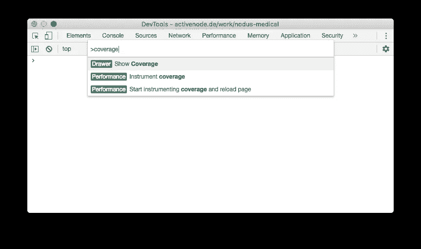
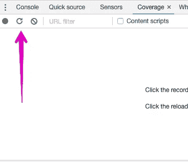
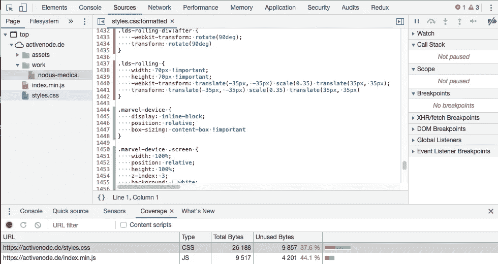
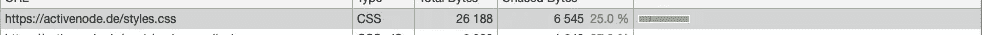
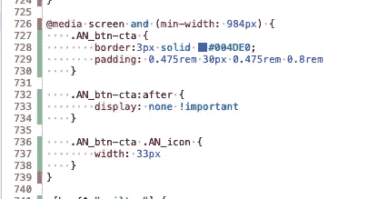
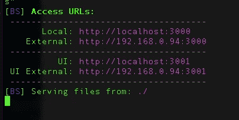
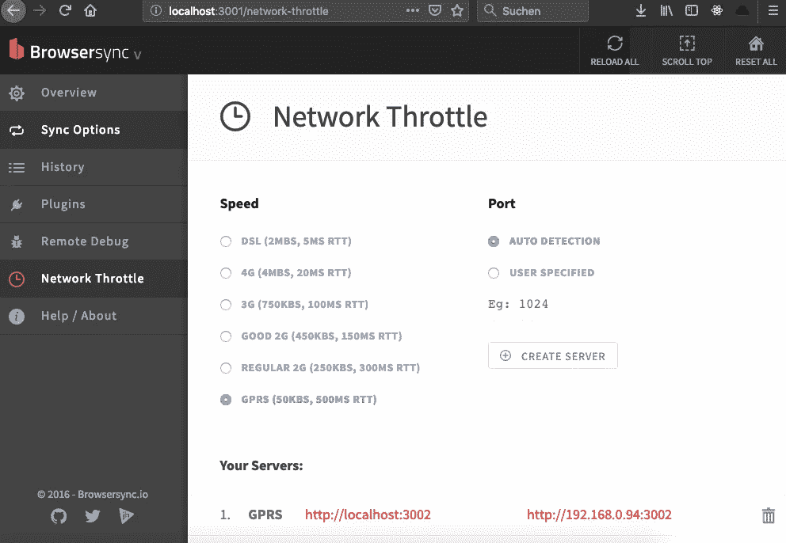

# 性能优化的 JS 架构

> 原文：<https://itnext.io/performance-optimized-js-architecture-e95241d061f?source=collection_archive---------2----------------------->

> TL；大卫:我最近更新了我的[投资组合](https://activenode.de)，应用了许多与绩效相关的技术。这是关于我用来实现更好的加载和压缩行为的技术。使用的工具:TS，Shell，terserJS，ImageOptim，SQIP，filewatcher，SASS，网络节流，DevTools。我的页面在 Google Pagespeed 上的平均表现被评为 **99/100** 。我还在计算最后的位数，以得到 100/100 的总数。


首先，我想指出，在过去 16 年的编码生涯中，我只对一件事感兴趣:**不要成为一个狂热分子，也不要贬低任何技术。**没有所谓的*适合所有情况。*这两篇文章隐喻了我所说的:[这个](https://medium.com/chingu/using-the-chrome-devtools-audit-feature-to-measure-and-optimize-performance-part-1-868a20bbfde8)和[这个](https://medium.com/javascript-scene/the-typescript-tax-132ff4cb175b)。

**好的**，既然我们已经讨论过了这个问题，我们可能可以跳过技术狂热者的讨论以及像*“你为什么不[把你想要的东西放在这里]…”这样的辩解。*

我的要求很简单:

> 我的作品集应该准备好在预期的等待时间内在一部有 GPRS 连接的手机上被浏览——EWT。

## WTF 是*预期等待时间*？

如果你周六下午 1 点去宜家，你可能会对等 30 分钟才到收银台感到恼火，但与此同时，这正是你可以期待和计划的——我把这个时间跨度称为 EWT。

拿如今的*任何一个*网站来说。我想说——除了 Google start page——你可能不会在合理的时间内去任何地方。你希望它加载，但它甚至没有出现，所以 EWT 没有实现(你可能希望它需要 30 秒，但没有等待一分钟，只看到一个空白的屏幕——是啊，谢谢什么也没有)。

我并不期望 ***的任何东西*** 都能与 GPRS 和 2G 兼容。然而，我希望至少能告诉我“连接不良”。请稍后再试”。完全没问题。

我的投资组合的 GPRS EWT 总计为 20 秒，因为我觉得这是一个时间跨度，当我意识到我目前处于最差的连接状态，并且我可以看到事情仍然开始加载时，我实际上会等待。

现在这是关于建立基础。

# 让我们深入了解这些技术:

## 1.package.json:

> 如果你只关心性能部分，你可以跳过第一和第二部分。

我安装了 2 个`[@types](https://github.com/DefinitelyTyped/DefinitelyTyped)`包，这样我的编辑器和编译器可以帮助我进行正确的类型提示。

`[browser-sync](https://www.browsersync.io/)`用于运行具有节流功能的即时实时重载服务器(详见下文)。

有了`filewatcher`,我可以在文件改变时重新编译。使用`html-minifier`和`[terser](https://www.npmjs.com/package/terser)`，我创建了最小的`--production`版本，并使用`[include-tag](https://www.npmjs.com/package/include-tag)`在没有成熟模板系统的情况下，用简单变量将 html 包含在 html 中。

```
{
 "devDependencies": {
   "@types/es6-promise": "^3.3.0",
   "@types/node": "^10.0.3", 
   "browser-sync": "^2.24.4",
   "browser-sync-spa": "^1.0.3",
   "filewatcher": "^3.0.1",
   "html-minifier": "^3.5.21",
   "include-tag": "^1.1.0",
   "node-sass": "^4.9.0",
   "sass": "^1.3.1",
   "terser": "^3.14.1",
   "typescript": "^2.8.3"
 }, "scripts": {
   "build": "./_dev/watch.sh --build-only --prod",
   "watch": "./_dev/watch.sh --watch"
 }
}
```

## 2.watch.sh:

Shellscript 并不令人惊讶。它运行`filewatcher`、`typescript`等。根据旗帜来看。例如:

```
echo 'Starting TS watcher'
./node_modules/.bin/tsc $WATCH_PARAM -p ./tsconfig.json
```

## 3.JS 架构和构建:

这是一个小的投资组合，所以我想要一个 JS 包，我不想用魔法使事情过于复杂。这是我使用 TypeScript 的两个原因之一。TS 编译器允许你构建捆绑包，而`tsconfig.json`让我选择构建目标，所以我甚至不用考虑捆绑系统，同时仍然能够构建我的文件——滥用 TypeScript 作为构建系统是很棒的❤️.

```
/// <reference path='history.ts' />
/// <reference path='work.controller.ts' />
/// <reference path='routes.ts' />
/// <reference path='breakpointSetups.ts' />
/// <reference path='scrollwatcher.ts' />/**
here goes code from my index.ts file
*/
```

在每个文件中，我都定义了全局函数和全局变量。为什么？它省去了额外的限定变量范围的闭包函数。如果你害怕这样做，那么只需在编译后将结果代码封装在一个函数中。TypeScript 帮助我没有失去概述。

示例:

```
//source version index.ts:
const query = (selector: string, rootElem?: HTMLElement) => {
  return Array.prototype.map.call(
    (rootElem || document).querySelectorAll(selector),
    (d: Element) => d
  );
};
```

为了获得最佳的整体缩小，有必要在多次使用时将所有内容抽象为函数调用(参见上面的`query`示例)。不要手动调用`.querySelector`，因为它是不可缩小的对象属性)。

## 4.关键和非阻塞 JS:

JS 的一个关键部分被内联到页面的底部(bottom =确保 DOM 首先可用)，其余部分像这样加载:

```
var s = document.createElement('script');
s.async = true;
s.defer = true;
s.src = '/index.min.js';
s.onload = function() {
  init_resolve();
};
document.head.appendChild(s);
```

## 5.即时图像；延迟加载和 LQIP/SQIP:

[LQIP](https://github.com/zouhir/lqip-loader) (低质量图像占位符)是一种预加载质量极低的图像作为实际图像的占位符并提供基本图像信息(如平均颜色)的方法。 [SQIP](https://www.npmjs.com/package/sqip) 是其仅使用 SVG 的继任者。

`sqip inputImage`将输出一个具有`data:image/svg+base64`清晰度的``，其大小约为 1-2kb，与 100kb 以上的原始图像相比，可以很容易地内联。

然后，您只延迟加载实际的可见区域。例如，当用户浏览我的预览时，很有可能用户将首先看到低质量图像，同时在 JS 中请求原始图像，然后淡入。🔥

## 6.内联 CSS 与 HTTP2:

最近我经常听到这样的话:HTTP2 解决了这个问题。在您同时请求多个资源的情况下，这是真的。但是浏览器不能请求它自己都不知道的东西。我的意思是，如果你从来没有谈论过，你的伴侣怎么会做你最喜欢的菜。

长话短说:首先加载 HTML，然后才是 CSS。如果你想改善初始渲染行为，这是不好的。如果可能，内联关键 CSS。

> 对于较大的页面，不要内联所有的 CSS。认为它一定会提高性能，这是一种误解。我试过了，但实际性能下降了。我的灯塔得分也下降了。HTML 上额外的解析工作降低了渲染速度。此外，您还需要在每个页面上进行额外的解析工作。因此，重要的是适当地平衡，真正只提供必要的内联 CSS。

## 7.通过 Chrome 覆盖工具优化 CSS 的使用:

在你的页面有所进展之后，你肯定不会记得哪个 CSS 被实际使用了，哪个没有。

使用 Chromium 的覆盖工具:



在 Chrome DevTools 中按下⌘ + Shift + P，输入“Coverage”然后回车

1.  在 Chrome 中打开封面抽屉
2.  按下抽屉内的重新加载图标(确保在重新加载之前您的缓存已被删除！)



覆盖率工具中的重新加载图标

3.单击您想要检查覆盖率的 CSS 文件。绿线表示使用情况——到目前为止。其他都是红色的。**不过:红色的还没有确认没用过**！



只有在重新加载后才第一次瞥见覆盖范围

4.您现在需要调整页面的大小，并点击所有的路线，以便覆盖检测器能够完成它的工作。你会看到许多红色的东西突然变成了绿色(**当 HTML 被渲染时它们变成了绿色，因此相应的 CSS 被使用**。渲染！=在 DOM 中。如果它位于 DOM 中，但是被隐藏了，那么它就不会被渲染。)

5.彻底完成第 4 步后，你可能需要检查剩下的红色部分。



Chrome 可能会告诉你还有很多未使用的字节，但你必须明白，当前的实现将所有未被主动解析的内容显示为红色，并且是绘画的一部分。因此，例如，`@media`查询的内部可以显示绿色，但是查询本身`@media`显示红色。**这并不意味着它没用过！**如果你有厂商前缀，也会发生同样的情况。显然，Chrome 不会解析 Firefox 厂商前缀，但这可能仍然是必要的。所以要小心🤓



已解析媒体查询，但查询本身显示为红色。这是覆盖工具的当前行为。

6.继续从你的 CSS 中删除那些被证明是没有被使用的红色的。

## 8.移动优先？先慢连接！

很酷，所以我们首先使用移动设备，但初始加载需要 10 秒的最佳连接速度，因为我们正在加载像指环王编年史一样大的资产。

因此，称之为移动优先的方法有时会被误解。称之为*慢移动优先*我们就没事了。

事实上，你应该首先关心的是感觉到的性能。如果这没问题，那么你甚至可以从统计的角度着眼于提高性能，美化数字。

Chrome DevTools 允许你调节网络速度。这是有帮助的，但它只在 Chromium 浏览器中工作，而且非常有限。BrowserSync 不仅为你的页面建立了一个静态服务器，还为你提供了一个 UI 来降低速度——服务器级的。所以你可以在每一个浏览器上测试它，特别是你可以慢到 GPRS 的速度。



启动 BrowserSync 服务器后的终端响应

你唯一需要做的就是运行`browser-sync start --server`，它会告诉你静态服务器的 URL 以及管理服务器设置的 UI 的 URL。



在浏览器同步用户界面中以不同的速度启动多台服务器

BrowserSync 还可以做更多的事情，但是就性能而言，您现在已经准备好测试非常差的连接以及连接之间的感知性能。

## 9.。htaccess 与 express:

我倾向于把服务器的责任交给提供商，因为解决问题只需要一个电话。也就是说:我有一个合适的服务器运行着多个采用可配置技术的项目——包括 nodejs。所以我本来可以创建一个 nodeJS 服务器，但是我选择通过`.htaccess`硬编码路由:

```
RewriteEngine on
RewriteBase /
RewriteRule ^.*$ index.html
```

这就是应用程序运行所需的所有服务器代码。(我通过对实际路由进行硬编码，将其增强为只响应有效路由)。

## 10.增强最后的比特

运行 Lighthouse(或简单地运行 Pagespeed Insights)，检查建议并跟进。例如，我发现我在页面中包含了一种字体，我在最开始的时候尝试过，但后来它只是停留在代码中而没有被使用。通过删除这些代码，我在移动性能上得到了 2 分(从 97 分到 99 分)。

# 结论:

我没有纳入所有可能的提高性能的解决方案，仍然得到了梦想的速度性能排名。你可能会提出这样的论点:页面本身很小，因此更容易获得好的性能排名。我承认这一点，但请考虑以下两点:

1.  如果你不专注于提高性能，也很容易让一个小页面变得非常慢，在 [Lighthouse](https://developers.google.com/web/tools/lighthouse/) 上得到不好的结果
2.  在所有可用于提高性能的工具中，我只加入了很少但有效的一部分

在此基础上可以做很多事情，例如:

*   ServiceWorker 缓存
*   通过 JS 创建重复的结构来最小化初始 HTML
*   自动混淆/最小化类名(强烈建议使用捆绑系统来整合文件的整个上下文),这样可以再次减小 HTML 的整体大小
*   增强服务器端头缓存设置
*   通过`<picture>`元素提供多种分辨率和文件类型