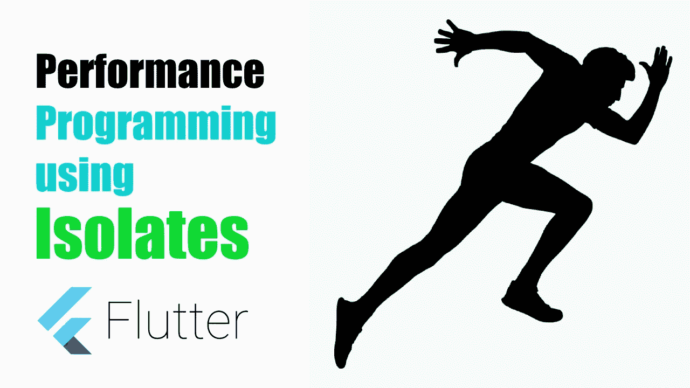

# 使用隔离物的颤振性能规划第一部分

> 原文：<https://itnext.io/performance-programming-in-flutter-using-isolates-part-1-997a29011e88?source=collection_archive---------2----------------------->



**性能**应用在颤振中使用**隔离**

众所周知，Flutter 是一个单线程应用平台。那么

*   多线程怎么做？
*   如何在一个线程中执行繁重的操作？
*   如何在不影响 UI 的情况下运行大操作？

但是是的，所有这些都可以在分离株的帮助下实现。

# 看视频

# 什么是隔离？

隔离类似于 UNIX 中的线程，但有一点不同。
像线程一样，隔离不共享内存。隔离借助消息进行通信。

一个 Flutter 应用程序正在单个隔离区中运行。因此，如果我们在这个线程中运行繁重的操作，肯定会阻塞 UI
并破坏用户体验。在这种情况下，隔离物会有所帮助。

**使用隔离的两种方式**

1.  使用隔离包中的“计算”功能(高级便捷功能)。
2.  使用发送端口和接收端口进行消息传递(低级 API)。

**那么让我们开始…**

对于这个例子，我将创建一个动画小部件，当我们在隔离中运行繁重的操作时，它在 UI 中运行。

创建一个名为“ **AnimationWidget** ”的类。

我们将只制作这个小部件的边框动画。

下面是完整的**动画小部件**代码

```
class AnimationWidget extends StatefulWidget {
  [@override](http://twitter.com/override)
  AnimationWidgetState createState() {
    return AnimationWidgetState();
  }
}

class AnimationWidgetState extends State<AnimationWidget>
    with TickerProviderStateMixin {

  AnimationController _animationController;
  Animation<BorderRadius> _borderRadius;

  [@override](http://twitter.com/override)
  void initState() {
    super.initState();
    _animationController =
        AnimationController(duration: const Duration(seconds: 1), vsync: this)
          ..addStatusListener((status) {
            if (status == AnimationStatus.completed) {
              _animationController.reverse();
            } else if (status == AnimationStatus.dismissed) {
              _animationController.forward();
            }
          });

    _borderRadius = BorderRadiusTween(
      begin: BorderRadius.circular(100.0),
      end: BorderRadius.circular(0.0),
    ).animate(CurvedAnimation(
      parent: _animationController,
      curve: Curves.linear,
    ));

    _animationController.forward();
  }

  [@override](http://twitter.com/override)
  Widget build(BuildContext context) {
    return AnimatedBuilder(
      animation: _borderRadius,
      builder: (context, child) {
        return Center(
          child: Container(
            child: FlutterLogo(
              size: 200,
            ),
            alignment: Alignment.bottomCenter,
            width: 350,
            height: 200,
            decoration: BoxDecoration(
              gradient: LinearGradient(
                begin: Alignment.topLeft,
                colors: [Colors.blueAccent, Colors.redAccent],
              ),
              borderRadius: _borderRadius.value,
            ),
          ),
        );
      },
    );
  }

  [@override](http://twitter.com/override)
  void dispose() {
    _animationController.dispose();
    super.dispose();
  }
}
```

*BorderRadiusTween* 用于动画显示小工具的边框。在这里，我们在动画完成时反转它，使它无限运行。

# 使用隔离物

宣告一个属于孤立者的未来。

`Future<**void**> computeFuture = Future.value();`

我们将添加两个按钮，一个在主隔离线程上执行长时间运行的操作，另一个在单独的隔离线程中。

```
addButton1() {
    return FutureBuilder<void>(
      future: computeFuture,
      builder: (context, snapshot) {
        return OutlineButton(
          child: const Text('Main Isolate'),
          onPressed: createMainIsolateCallback(context, snapshot),
        );
      },
    );
}
addButton2() {
    return FutureBuilder<void>(
      future: computeFuture,
      builder: (context, snapshot) {
        return OutlineButton(
          child: const Text('Secondary Isolate'),
          onPressed: createSecondaryIsolateCallback(context, snapshot),
        );
      },
    );
}
```

**下面是回调函数。**

```
VoidCallback createMainIsolateCallback(
    BuildContext context, AsyncSnapshot snapshot) {
  if (snapshot.connectionState == ConnectionState.done) {
    return () {
      setState(() {
        computeFuture = computeOnMainIsolate().then((val) {
          showSnackBar(context, 'Main Isolate Done $val');
        });
      });
    };
  } else {
    return null;
  }
}

VoidCallback createSecondaryIsolateCallback(
    BuildContext context, AsyncSnapshot snapshot) {
  if (snapshot.connectionState == ConnectionState.done) {
    return () {
      setState(() {
        computeFuture = computeOnSecondaryIsolate().then((val) {
          showSnackBar(context, 'Secondary Isolate Done $val');
        });
      });
    };
  } else {
    return null;
  }
}

Future<int> computeOnMainIsolate() async {
  return await Future.delayed(Duration(milliseconds: 100), () => fib(40));
}

Future<int> computeOnSecondaryIsolate() async {
  return await compute(fib, 40);
}

showSnackBar(context, message) {
  Scaffold.of(context).showSnackBar(SnackBar(
    content: Text(message),
  ));
}
```

我们使用一个**斐波那契**函数来做一个长时间运行的操作。

```
int fib(int n) {
  int number1 = n - 1;
  int number2 = n - 2;
  if (0 == n) {
    return 0;
  } else if (0 == n) {
    return 1;
  } else {
    return (fib(number1) + fib(number2));
  }
}
```

'***computeOnMainIsolate***'函数将创建一个在主隔离线程上运行的延迟未来。
‘***computeonsaryisolate***’使用‘compute’函数创建一个新的隔离。新的隔离将接受函数和参数。

我们传入 Fibonacci 函数和参数。

最后，我们在 SnackBar 中显示结果。

如果您运行应用程序并运行 MainIsolate，您将看到它冻结动画和 UI，直到它完成。但是如果我们运行二级隔离，我们会看到动画在运行的所有时间都运行得很流畅。这意味着，‘*compute*’正在生成一个新的隔离并在那里运行代码。因此，它不会影响主隔离的运行，用户界面将是平滑和响应。

*观看完整的* ***Youtube 教程*** *以上来看看它的行动。*

这里是完整的例子。

```
import 'package:flutter/foundation.dart';
import 'package:flutter/material.dart';

class PerformancePage extends StatefulWidget {
  [@override](http://twitter.com/override)
  _PerformancePageState createState() => _PerformancePageState();
}

class _PerformancePageState extends State<PerformancePage> {

  Future<void> computeFuture = Future.value();

  [@override](http://twitter.com/override)
  Widget build(BuildContext context) {
    return Scaffold(
      appBar: AppBar(
        title: Text('Performance using Isolate'),
      ),
      body: Container(
        color: Colors.white,
        child: Center(
          child: Column(
            mainAxisSize: MainAxisSize.min,
            children: <Widget>[
              AnimationWidget(),
              addButton1(),
              addButton2(),
            ],
          ),
        ),
      ),
    );
  }

  addButton1() {
    return FutureBuilder<void>(
      future: computeFuture,
      builder: (context, snapshot) {
        return OutlineButton(
          child: const Text('Main Isolate'),
          onPressed: createMainIsolateCallback(context, snapshot),
        );
      },
    );
  }

  addButton2() {
    return FutureBuilder<void>(
      future: computeFuture,
      builder: (context, snapshot) {
        return OutlineButton(
          child: const Text('Secondary Isolate'),
          onPressed: createSecondaryIsolateCallback(context, snapshot),
        );
      },
    );
  }

  VoidCallback createMainIsolateCallback(
      BuildContext context, AsyncSnapshot snapshot) {
    if (snapshot.connectionState == ConnectionState.done) {
      return () {
        setState(() {
          computeFuture = computeOnMainIsolate().then((val) {
            showSnackBar(context, 'Main Isolate Done $val');
          });
        });
      };
    } else {
      return null;
    }
  }

  VoidCallback createSecondaryIsolateCallback(
      BuildContext context, AsyncSnapshot snapshot) {
    if (snapshot.connectionState == ConnectionState.done) {
      return () {
        setState(() {
          computeFuture = computeOnSecondaryIsolate().then((val) {
            showSnackBar(context, 'Secondary Isolate Done $val');
          });
        });
      };
    } else {
      return null;
    }
  }

  Future<int> computeOnMainIsolate() async {
    return await Future.delayed(Duration(milliseconds: 100), () => fib(40));
  }

  Future<int> computeOnSecondaryIsolate() async {
    return await compute(fib, 40);
  }

  showSnackBar(context, message) {
    Scaffold.of(context).showSnackBar(SnackBar(
      content: Text(message),
    ));
  }
}

int fib(int n) {
  int number1 = n - 1;
  int number2 = n - 2;
  if (0 == n) {
    return 0;
  } else if (1 == n) {
    return 1;
  } else {
    return (fib(number1) + fib(number2));
  }
}

class AnimationWidget extends StatefulWidget {
  [@override](http://twitter.com/override)
  AnimationWidgetState createState() {
    return AnimationWidgetState();
  }
}

class AnimationWidgetState extends State<AnimationWidget>
    with TickerProviderStateMixin {
  //
  AnimationController _animationController;
  Animation<BorderRadius> _borderRadius;

  [@override](http://twitter.com/override)
  void initState() {
    super.initState();
    _animationController =
        AnimationController(duration: const Duration(seconds: 1), vsync: this)
          ..addStatusListener((status) {
            if (status == AnimationStatus.completed) {
              _animationController.reverse();
            } else if (status == AnimationStatus.dismissed) {
              _animationController.forward();
            }
          });

    _borderRadius = BorderRadiusTween(
      begin: BorderRadius.circular(100.0),
      end: BorderRadius.circular(0.0),
    ).animate(CurvedAnimation(
      parent: _animationController,
      curve: Curves.linear,
    ));

    _animationController.forward();
  }

  [@override](http://twitter.com/override)
  Widget build(BuildContext context) {
    return AnimatedBuilder(
      animation: _borderRadius,
      builder: (context, child) {
        return Center(
          child: Container(
            child: FlutterLogo(
              size: 200,
            ),
            alignment: Alignment.bottomCenter,
            width: 350,
            height: 200,
            decoration: BoxDecoration(
              gradient: LinearGradient(
                begin: Alignment.topLeft,
                colors: [Colors.blueAccent, Colors.redAccent],
              ),
              borderRadius: _borderRadius.value,
            ),
          ),
        );
      },
    );
  }

  [@override](http://twitter.com/override)
  void dispose() {
    _animationController.dispose();
    super.dispose();
  }
}
```

注意:隔离只接受静态函数或者方法不应该是类实例的一部分。

***下一部即将到来…敬请期待…***

*感谢阅读，如果你觉得我的帖子有用，请在下面留下你的宝贵意见，订阅我的* [*youtube 频道*](https://www.youtube.com/channel/UC5lbdURzjB0irr-FTbjWN1A) *获取更多视频。*