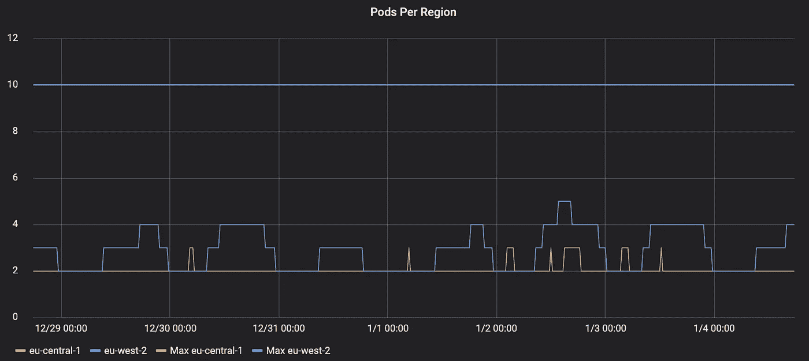

# Kubernetes 自动缩放的性能测试

> 原文：<https://itnext.io/performance-testing-for-kubernetes-autoscaling-ed6418cf6f70?source=collection_archive---------2----------------------->

我们在 K8s 上运行应用程序已经有一年左右的时间了，但直到最近才真正利用自动伸缩。以前我们在 CPU 上自动伸缩(75%)，但是我们的应用从来没有接近这个限制，我们运行了太多的实例。

CPU 通常被认为是一个不好的自动伸缩指标，但是为什么会这样呢？只有当人们意识到自动缩放时，我们才注意到我们每次发布时都完全扩展了应用程序。这是因为应用程序在启动时使用了超过 75%的 CPU。在运行了一些性能测试之后，我们还注意到，在 CPU 达到 75%之前，我们的应用程序的性能就会下降。

我们得出的结论是，我们希望使用每秒请求数(RPS)作为我们的自动伸缩指标。该指标由我们的应用程序通过 Prometheus 公开，我们使用 k8s 运算符，因此这些指标可用于自动缩放。我们确实遇到了一个问题，因为 Spring requests metrics name 以 sum 而不是 count 结尾。普罗米修斯自动标度假设所有不以计数结尾的事物都是一个量规。

## 性能试验

我很想说性能测试并不是我们想要的那个词，因为它意味着我们知道它在给定场景中应该如何表现。我们实际上想知道的是服务的断点，或者它何时停止按照我们想要的方式执行。在传统部署中，您的应用程序可以使用固定数量的资源。现在，我们实际上拥有了 infinite，目标是只使用当前流量所需的容量。

我们想知道应用程序的单个实例的断点，所以在我们运行测试时，应该将它缩减为一个实例。这应该在非生产环境中进行，以免影响客户。然后，我们希望向我们的应用程序发送请求。要求尽可能与生产相似。尝试重现客户可能提出的不同类型的请求，包括错误情景。慢慢地增加服务中发送的 RPS，大多数性能工具都有一个斜坡特性来实现这一点。当你看到你的应用程序停止执行你想要的，那就是停止的时候了。

## 配置自动缩放

现在您知道每秒钟有多少请求会破坏您的应用程序。我们将我们的服务设置为该值的 75%,因为这为突发流量提供了一些喘息空间。如果您有许多实例，您可能希望根据突发流量配置文件以更高的容量运行。

我们运行独立扩展的主动主动集群。在故障转移场景中，活动集群将以 125%的容量运行。这种部署依赖于故障切换不是即时的，k8s/服务有时间纵向扩展，但有一些扩展空间。

我认为真正意义上的性能测试现在可以完成了，因为我们有了一个应用程序应该能够处理的值。我建议在您的管道中进行一次性能测试，就好像您的应用程序的性能发生了变化，您需要更新您的自动伸缩配置。您的测试应该有一个断言，因为它是一个检查响应时间的**测试**，或者是一个您认为重要的指标。

## 技巧

在发现 Spring 和 Node/Express 应用程序的限制时，我注意到一件事，性能下降是突然发生的。这是我认为你不应该使用其他指标的原因之一。当这些指标显示出迹象时，为时已晚，您的应用程序已经失败了。

我想喊出[cannon . io](https://artillery.io/)，因为它是一个非常简单的性能测试工具，使用 YAML 进行配置。cannon 的一个缺点是它是用 Node 编写的，所以是单线程的。我们的一些应用程序需要启动多个进程。另一个让炮兵获得更多 RPS 的方法是利用连接池。