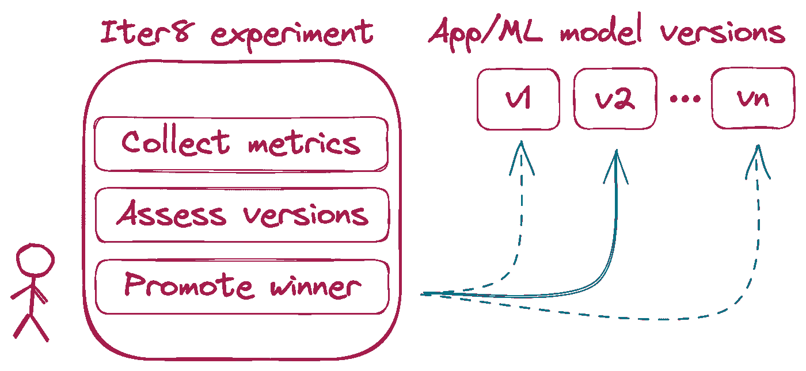
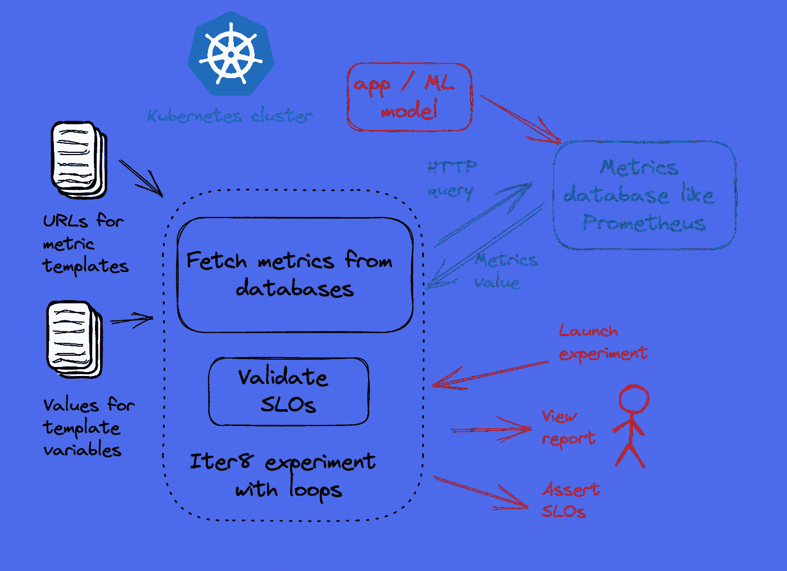

# 使用 Iter8 进行性能测试，现在使用自定义指标！

> 原文：<https://itnext.io/performance-testing-with-iter8-now-with-custom-metrics-8c97bb7449c8?source=collection_archive---------2----------------------->



**SLO 验证**和其他形式的**性能测试**是确保你的服务**按预期执行**和**最大化商业价值**的关键。使用 [Iter8](https://iter8.tools) ，您可以在几秒钟内开始 SLO 验证和性能测试。

Iter8 是一个开源的度量驱动的发布优化器，用于使用 Kubernetes 部署的应用和 ML 模型。您可以使用 Iter8 来进行各种各样的**实验**，这些实验可以完成**各种各样的任务，**比如从您的服务的不同版本中收集指标，根据 SLO 来验证这些指标，确定哪个版本的性能最好，等等。

Iter8 具有内置的指标，这意味着它将为您的 [HTTP](https://iter8.tools/0.10/tutorials/load-test-http/basicusage/#specify-metrics-and-slos) 和 [gRPC](https://iter8.tools/0.10/tutorials/load-test-grpc/basicusage/#specify-metrics-and-slos) 服务生成负载并收集延迟和错误相关的指标。然而，如果您想要使用来自外部来源的其他类型的指标，您可以使用 Iter8 的**定制指标特性**，它实际上告诉 Iter8 如何查询这些来源以及查询什么指标。例如，如果您的服务使用 Istio，那么 Istio 也会收集您的服务的性能指标，并将它们存储在 Prometheus 数据库中，如果您希望在 Iter8 实验中使用这些指标，那么您可以使用自定义指标来完成。

自定义度量允许 Iter8 不仅可以与其他服务网格(如 OpenShift 和 Linkerd)一起工作，还可以与 Knative(一种用于构建无服务器应用程序的工具)、KServe 和 Seldon、ML 应用程序工具等一起工作。Iter8 的定制指标特性是一个通用的解决方案，它允许 Iter8 与任何服务网格、应用资源和任何提供指标的数据库一起工作。

在本教程中，我们将以 Istio 和 Prometheus 为例，向您展示如何定义定制指标。Iter8 确实为一些工具提供了一些定制指标模板，但是知道如何定义自己的定制指标可以让你最大限度地发挥 Iter8 的潜力。

# 关于自定义指标文件的所有信息

## 度量文件中有什么？

自定义指标文件描述了如何通过 HTTP 查询您的指标提供者，并包含一组针对每个指标的查询。除了这组查询之外，它还包含一组 jq 表达式，用于从每个查询的 JSON 响应中提取度量值。

自定义指标模板用于以 Iter8 可消费的方式定义所需的指标。它是模板化的，因此您可以轻松地提供特定于服务的参数，以便 Iter8 可以查询正确的服务。

我们现在将描述 Iter8 提供的 [Istio 定制指标模板](https://github.com/iter8-tools/iter8/blob/master/custommetrics/istio-prom.tpl)中的内容。

以下是摘录:

```
url: {{ default .istioPromURL "[http://prometheus.istio-system:9090/api/v1/query](http://prometheus.istio-system:9090/api/v1/query)" }}
method: GET
metrics:
- name: request-count
  type: counter
  description: |
    Number of requests
  params:
  - name: query
    value: |
      sum(last_over_time(istio_requests_total{
        {{ template "istio-prom-dest" . }}
      }[{{ .elapsedTimeSeconds }}s])) or on() vector(0)
  jqExpression: .data.result[0].value[1] | tonumber
```

`url`是我们希望 Iter8 向其发送查询的指标提供者的 **HTTP 端点**。在这种情况下，这应该是 Prometheus 数据库端点。在默认安装了 [Prometheus 附加软件](https://istio.io/latest/docs/ops/integrations/prometheus/)的情况下，Prometheus 服务将位于`istio-system`名称空间下，并可通过端口`9090`访问。因此，我们还配置了一个默认值。

`method`是应该用于查询的 **HTTP 方法**。Prometheus 允许用户同时使用`GET`和`POST` ( [源](https://prometheus.io/docs/prometheus/latest/querying/api/))进行查询，所以我们选择使用`GET`。

`metrics`是针对每个指标的一组单独的**查询**和 **jq 表达式**。在本教程中，我们将只描述一个指标，`request-count`，但是您可以根据需要添加任意多个指标。

对于每个指标，我们看到以下内容:

`name`是公制的**名称**。这种情况下就是`request-count`。

`type`是公制的[类型](https://prometheus.io/docs/concepts/metric_types/)。类型应该是`counter`或`gauge`。

`description`是指标的**描述**。`request-count`应该是发送到目标服务的请求数。

`params`是应该与查询一起发送的一组 **HTTP 参数**。Prometheus 需要一个查询参数`query`，我们已经定义了这个参数( [source](https://prometheus.io/docs/prometheus/latest/querying/api/#expression-queries) )。Prometheus 也可以使用`time`和`timeout`查询参数，但是它们是可选的，所以我们没有定义它们。

对于每个 HTTP 参数，我们看到以下内容:

`name`是 HTTP 参数的名称，在本例中是`query`。

`value`是应该发送给`request-count`的 [PromQL 查询](https://prometheus.io/docs/prometheus/latest/querying/basics/)。请注意，这里有额外的模板，其目的是为特定的目的地服务选择指标。

最后，`jqExpression`是应该应用于查询响应的 [jq 表达式](https://stedolan.github.io/jq/manual/)，以便提取度量值。

## 使用自定义指标文件



要在您的实验中使用定制指标，请使用 [custommetrics](https://iter8.tools/0.11/user-guide/tasks/custommetrics/) 任务。

考虑下面的实验。

```
iter8 k launch \
--set "tasks={custommetrics,assess}" \
--set custommetrics.templates.istio-prom="https://raw.githubusercontent.com/iter8-tools/iter8/master/custommetrics/istio-prom.tpl" \
--set custommetrics.values.destinationWorkload=httpbin \
--set custommetrics.values.destinationWorkloadNamespace=default \
--set assess.SLOs.upper.istio-prom/error-rate=0 \
--set assess.SLOs.upper.istio-prom/latency-mean=100 \
--set runner=cronjob \
--set cronjobSchedule="*/1 * * * *"
```

`tasks={custommetrics,assess}`告诉 Iter8 使用[自定义指标](https://iter8.tools/0.11/user-guide/tasks/custommetrics/)和[评估](https://iter8.tools/0.11/user-guide/tasks/assess/)任务。`custommetrics`任务使用您的定制指标文件来查询指标，而`assess`任务将使用这些指标来评估您的服务，方法是根据指定的 SLO 来验证它们。

`custommetrics.templates.istio-prom=...`告诉 Iter8 它可以在哪里访问定制指标文件。

`custommetrics.values....=...`这些与`metrics[0].params[0].value`一节中提到的附加模板相关。这允许选择特定的目的地服务，在这种情况下，使用`destinationWorkload=httpbin`和`destinationWorkloadNamespace=default`的服务。

`assess.SLOs....=...`与选择要在`assess`任务中验证的 SLO 相关。在这种情况下，Iter8 将检查从`custommetrics`任务收集的错误率和平均延迟分别为 0 和 100 毫秒以下。

最后，`runner=cronjob`告诉 Iter8 在这个实验中使用一个 cronjob。这就是所谓的循环实验，实验的任务是按计划运行的。这对于需要长时间运行的实验非常有用，比如实时流量。`cronjobSchedule="*/1 * * * *"`定义 cronjob 运行的频率。

如果你想尝试之前的实验，你可以按照下面的步骤来做。在下面的步骤中，您将设置 Istio 和 Prometheus 附加组件，部署一个示例 HTTP 服务，生成一些负载，启动实验，并查看结果。

1.  创建一个新的 Kubernetes 集群。
2.  [安装 Istio](https://istio.io/latest/docs/setup/install/) 。
3.  [安装 Istio 的普罗米修斯插件](https://istio.io/latest/docs/ops/integrations/prometheus/)。
4.  [为`default`命名空间启用自动 Istio 边车注入](https://istio.io/latest/docs/setup/additional-setup/sidecar-injection/)。这确保了在步骤 5 和 6 中创建的单元将具有 Istio 边车。

```
kubectl label namespace default istio-injection=enabled --overwrite
```

1.  在 Kubernetes 集群中部署示例 HTTP 服务。

```
kubectl create deploy httpbin --image=kennethreitz/httpbin --port=80
kubectl expose deploy httpbin --port=80
```

1.  产生负载。

```
kubectl run fortio --image=fortio/fortio --command -- fortio load -t 6000s [http://httpbin.default/get](http://httpbin.default/get)
```

1.  启动 Iter8 实验

```
iter8 k launch \
--set runner=cronjob \
--set cronjobSchedule="*/1 * * * *"
--set "tasks={custommetrics,assess}" \
--set custommetrics.templates.istio-prom="https://raw.githubusercontent.com/iter8-tools/iter8/master/custommetrics/istio-prom.tpl" \
--set custommetrics.values.destinationWorkload=httpbin \
--set custommetrics.values.destinationWorkloadNamespace=default \
--set assess.SLOs.upper.istio-prom/error-rate=0 \
--set assess.SLOs.upper.istio-prom/latency-mean=100 \
```

为了查看实验的状态，运行以下命令…

```
iter8 k report
```

…然后您应该会看到类似下面的内容！

```
Experiment summary:
******************* Experiment completed: false
  No task failures: true
  Total number of tasks: 2
  Number of completed tasks: 6Whether or not service level objectives (SLOs) are satisfied:
************************************************************* SLO Conditions        |Satisfied
  --------------        |---------
  istio/error-rate <= 0 |true
  istio/latency-mean <= 100 |true Latest observed values for metrics:
*********************************** Metric                           |value
  -------                          |-----
  istio/error-count                |0.00
  istio/error-rate                 |0.00
  istio/latency-mean               |6.31
  istio/le500ms-latency-percentile |1.00
  istio/request-count              |2110.00
```

这是对实验过程中发生的事情的总结。如您所见，错误率和平均延迟低于我们设定的最大值。这些指标`error-count`、`error-rate`、`latency-mean`、`le500ms-latency-percentile`和`request-count`都是使用定制指标从 Istio 收集的。注意，这是一个循环实验，因此实验将在指定的`cronjobSchedule`重新运行任务。在这种情况下，实验将每分钟循环一次，您应该会看到一些指标的变化。

## 后续步骤

要了解更多关于 Iter8 以及如何在您的应用和 ML 模型上运行性能测试的信息，请访问我们的网站 [iter8.tools](https://iter8.tools) 。我们有许多[教程](https://iter8.tools/0.10/tutorials/load-test-http/basicusage/)可以试用。

为了了解更多关于定制指标的信息，我们有更多的文档[这里](https://iter8.tools/0.11/user-guide/tasks/custommetrics/)和[这里](https://iter8.tools/0.11/metrics/custom-metrics/)。同样，定义您自己的定制指标可以帮助您充分发挥 Iter8 的潜力。

如果您需要任何帮助，无论是关于设置您自己的定制指标还是关于 Iter8，您都可以在 [Slack](https://join.slack.com/t/iter8-tools/shared_invite/zt-awl2se8i-L0pZCpuHntpPejxzLicbmw) 上找到我们，我们将很乐意回答您的任何问题。