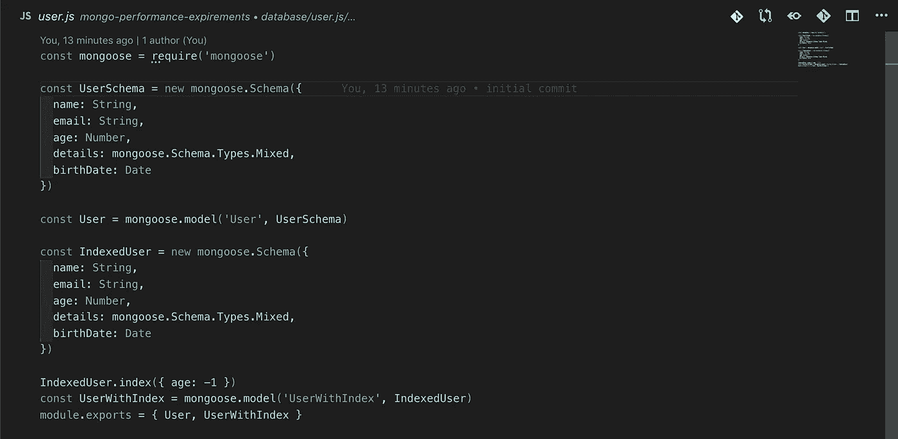
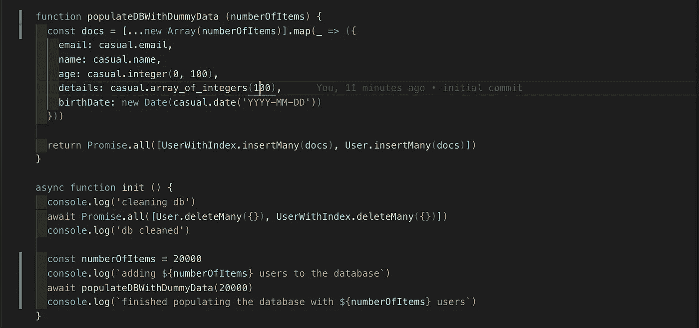
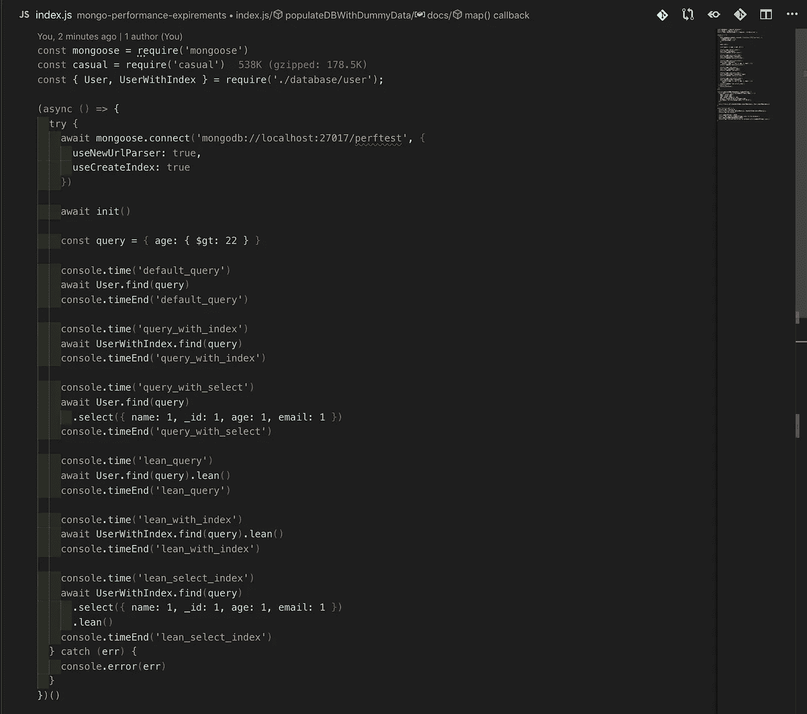

# 如何优化 MongoDB & Mongoose 的性能

> 原文：<https://itnext.io/performance-tips-for-mongodb-mongoose-190732a5d382?source=collection_archive---------0----------------------->

## 如何让您的 MongoDB/mongose 查询更快？


表演是避免不必要工作的艺术。这些是我关于优化 MongoDB 查询的发现，你可以滚动下面的性能测试和结果。

## **1。对 GET 操作使用精益查询**

这可能是提高查询性能的最佳方法。mongose 允许您在查询末尾添加`.lean()`,通过返回普通的 JSON 对象而不是 mongose 文档，极大地提高了查询的性能。

来自[猫鼬医生靠](https://mongoosejs.com/docs/tutorials/lean.html)

> 默认情况下，mongose 查询返回一个[mongose](https://mongoosejs.com/docs/api.html#Document)`[Document](https://mongoosejs.com/docs/api.html#Document)`[类](https://mongoosejs.com/docs/api.html#Document)的实例。文档比普通的 JavaScript 对象要重得多，因为它们有许多内部状态用于变更跟踪。启用`lean`选项告诉 mongose 跳过实例化一个完整的 mongose 文档，只给你 POJO。
> 
> [精益选项](https://mongoosejs.com/docs/api.html#query_Query-lean)告诉 Mongoose 跳过[补水](https://mongoosejs.com/docs/api.html#model_Model.hydrate)结果文档。这使得查询更快，占用的内存更少，但是结果文档是普通的旧 JavaScript 对象(POJOs)，**而不是**[mongose 文档](https://mongoosejs.com/docs/documents.html)。"

然而，这是有代价的，这意味着精益医生没有:

*   更改跟踪
*   铸造和验证
*   Getters 和 setters
*   虚拟(包括“id”)
*   `save()`功能

因此，对于不使用`.save()`或 virtuals 的 GET 端点和`.find()`操作来说，它通常是最佳的。

## 2.为您的查询创建自定义索引

MongoDB 允许您在模式中的其他属性上创建索引，而不是默认的“_id”索引。这样，您的文档就可以根据数据库中定义的属性进行索引，以便更快地访问。

您还可以创建多个属性的复合索引。如果您通过多个字段进行查询，这将非常有用。假设你有一些数据库，你想找到所有灭绝的动物，你可能会写这样的查询`Model.find({type: “Animal”, status: “extinct"})`

MongoDB 将不得不查看所有文档以找到符合这个标准的文档，为了优化这个查询，您可以通过添加`ModelSchema.index({type: 1, status: 1})`为“type”和“status”创建一个复合索引。现在 MongoDB 将在哪里查看找到相关文档。

“1”或“-1”表示属性的排序顺序。字段添加到索引中的顺序很重要。关于指数的更详细的解释，见[https://mongoosejs.com/docs/guide.html#indexes](https://mongoosejs.com/docs/guide.html#indexes)和[https://docs.mongodb.com/manual/indexes/](https://docs.mongodb.com/manual/indexes/)

## 3.最小化数据库请求(避免。如果可能，填充()

你做的请求越多，你的应用程序响应时间就越慢。尽可能减少数据库查询，将它们组合在一起，或者通过消除重复或不必要的数据库操作来完全避免它们。您还可以在 redis 中缓存您的数据库结果。

尝试以一种方式定义你的模式，这样你就不必太依赖于`.populate()`和模型之间的双向关系。因为这是 NoSQL 数据库不太理想的地方。您在模型中添加的每个属性都将从查询中返回，因此，如果您在这些字段中有一个数组或嵌套对象，您的文档将很容易变大，从而降低查询的性能。

如果您的文档包含一组对其他模型的引用，并且您使用。populate()来连接集合之间的数据，使用`.populate()`将需要运行额外的查询来获取数组中的实际文档，这类似于为每个文档的每个 id 运行额外的查询。如果真的有必要，最好选择使用`.aggregate()`而不是`.populate()`。

## 4.使用。选择()以选择要返回的特定属性

当在数据库中查询文档时，查询将返回整个文档，但有时您的大型文档包含许多字段，并且字段是如上所述的数组/对象，您实际上不需要使用所有返回的属性。

为了防止数据库做额外的工作来返回这些字段，增加返回文档的大小，您可以使用 mongose`.select()`来包含/排除您希望查询返回的字段，具体如下:

```
Model.find({type: "Animal"}).select({name: 1})
```

Protip:如果您使用的是 GraphQL，这种方法会非常有效，因此您可以确切地知道客户端请求了哪些字段，并可以从数据库中选择这些字段。我在这里写了另一篇关于这个的文章

[](https://medium.com/faun/graphql-performance-tip-database-projection-82795e434b44) [## Apollo GraphQL 性能提示:从数据库中选择所有请求的字段

### 当您知道客户的需求时，为什么要从数据库中取出一整行呢？

medium.com](https://medium.com/faun/graphql-performance-tip-database-projection-82795e434b44) 

## 5.并行运行数据库操作

每当人们使用 async/await 时，我在 NodeJS 代码中看到的一个常见错误是，人们在不需要的时候一个接一个地运行操作。例如:

```
const user = new User({name: "bob"})
const post = new Post({title: "hello"})await user.save()
await post.save()
```

没有理由要等到用户被保存后才保存帖子。相反，可以使用`Promise.all`并行运行数据库操作，如下所示:

```
const [user, post] = await Promise.all([user.save(), post.save()])
```

虽然这可能会提高 api 级别的性能，但我们仍然对数据库执行两个请求，所以如果您想批量执行多个操作，使用`insertMany()`或`bulkWrite()`会更好。

## 6.缓存/重用 mongoose 连接

确保不要在每次想要从数据库中插入/查询某些内容时或者每次触发端点时都连接和断开数据库。相反，你应该在应用程序开始时连接一次，然后重复使用这个连接。

这是因为建立一个新的 TCP 连接在时间、网络请求和内存方面都很昂贵，而且一个新的连接意味着 MongoDB 要使用数据库上的内存创建一个新的线程。

# 让我们编写一些性能测试来看看结果

这些技巧能在多大程度上提高您的查询性能？让我们通过编写一些脚本来测试这些差异。

我运行了 MongoDB 的本地安装，并编写了一个 NodeJS 脚本，该脚本使用由 [casual](https://github.com/boo1ean/casual) 随机生成的用户列表填充数据库。目标是找到年龄超过 22 岁的用户。

我用不同的方式编写了这个查询，结合了上面提到的方法，并在两个不同的数据库集合上使用相同的数据集进行了测试。一个集合有“年龄”属性的索引，而另一个没有。使用`console.time()` API 测量结果，使用 NodeJS (v12.7.0)和 mongose(v 5 . 6 . 7)的最新版本运行测试。

首先让我们从我们的模式开始，这里我定义了用户集合/模式，其中一个在 age 属性上有一个索引，而其他的没有。



现在让我们编写一些代码，用随机数据填充数据库。我使用了 [casual](https://github.com/boo1ean/casual) 库，它非常方便地生成语义模拟数据



现在数据库已经准备好了，让我们编写查询



# 绩效结果和观察

***拥有 1k 用户***
default _ query:135.646 ms
query _ With _ index:168.763 ms
query _ With _ select:27.781 ms
query _ With _ select _ index:55.686 ms
lean _ query:7.191 ms
lean _ With _ index:7.341 ms
lean _ With _ select:

***数据库中有 10k 用户***

default _ query:323.278 ms
query _ with _ index:355.693 ms
query _ with _ select:212.403 ms
query _ with _ select _ index:183.736 ms
lean _ query:92.935 ms
lean _ with _ index:92.755 ms
lean _ with _ select:36.175 ms
lean _ select _ index

***拥有 100K 用户的数据库***
default _ query:2425.857 ms
query _ With _ index:2371.716 ms
query _ With _ select:1580.393 ms
query _ With _ select _ index:1583.015 ms
lean _ query:858.839 ms
lean _ With _ index:944

正如您所看到的，使用`.lean()` `.select()`和`Schema.index({})`的优化版查询比默认查询快了大约 10 倍，这是一个巨大的胜利！

`.lean()`似乎对性能的影响最大，其次是`.select()`，我的自定义索引在这种情况下没有帮助的原因是因为我的索引[不够有选择性](https://docs.mongodb.com/manual/tutorial/create-queries-that-ensure-selectivity)，因为它只减少了 50%的扫描文档数量。

你可以找到用于这些测试的脚本，你甚至可以在这里自己尝试一下[https://github . com/Khaled Osman/mongo-performance-exp rements](https://github.com/khaledosman/mongo-performance-expirements)