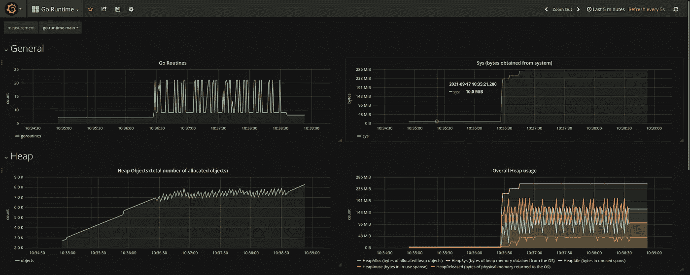
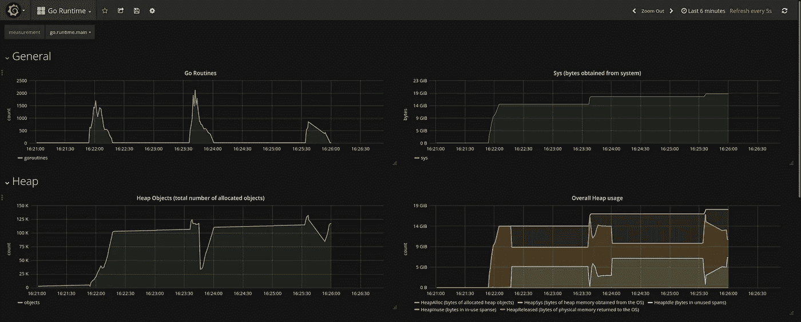
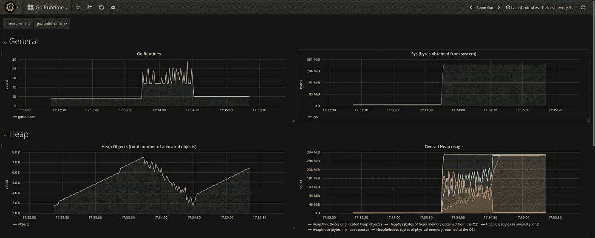
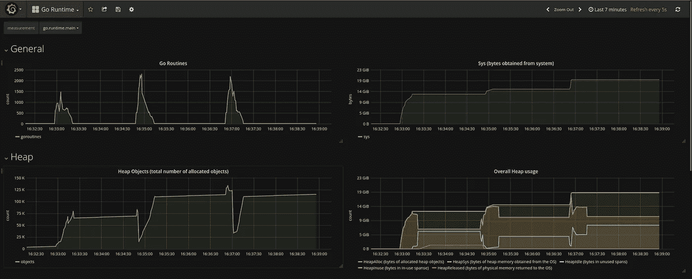
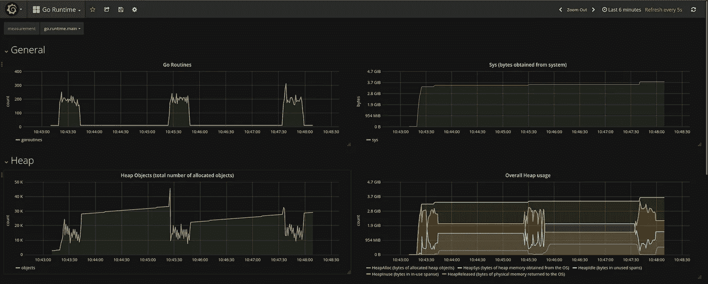
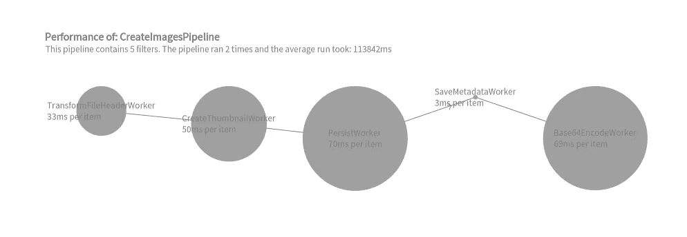

# 具有 Go 流水线和有限并发性的高性能图像处理

> 原文：<https://itnext.io/performant-image-processing-with-go-pipelines-and-bounded-concurrency-3f721ec5dde8?source=collection_archive---------4----------------------->

在本文中，我将尝试设计一个尽可能高效的图像管理服务器。将介绍几种处理数据的方法:顺序、并发和利用流水线处理的方法。将收集、可视化和分析性能统计数据。你甚至可以从 results up 上阅读这篇文章！

**这里服务器的源代码是**[](https://github.com/ele7ija/go-pipelines)****，管道包是** [**这里**](https://github.com/ele7ija/pipeline) **。****

# **介绍**

**自从我偶然发现了关于管道的官方博客后，我就对管道产生了兴趣。起初，我不知道这些例子对并发 Go 提供的高级语言支持有多好。它使用单向通道(*-<-chan*， *chan < -* )， *range* over 通道中的元素， *close* s 通道，使用 *select* 语句等。然而，我无法想象管道在现实世界中有任何应用，因为这些例子非常简单，并且是作为概念验证而编写的。**

**管道或[“管道和过滤器”设计模式](https://syedhasan010.medium.com/pipe-and-filter-architecture-bd7babdb908)只是您肯定会遇到的一种设计模式，UNIX shell 就是一个很好的例子:**

```
# find all students named 'Alice', save their results and count them
$ cat results.txt | grep "Alice" | tee alices_results.txt | wc -l
```

**现在，在我在 Go 中实现管道模式的[中，我主要关注项目的批处理。项目经过过滤器，我提供了几种类型，主要是*串行*、*并行*和*有界并行*。它们的区别在于它们是逐个处理接收到的项目，还是同时处理它们，或者最多同时处理 N 个项目。](https://github.com/ele7ija/pipeline)**

> **管道模式只是使组合和独立更改数据处理阶段变得更加容易。让它快速高效运行的是对每个阶段进行基准测试，并对它创建的并发流数量进行限制。**

**我将介绍不同类型的处理方法如下:对于每一种处理方法，我将首先解释该处理方法的特点，然后我将提到它所达到的结果；之后，我将展示源代码和资源使用情况。最后，所有结果将被汇总并显示在一个表格中。**

**对于每种处理类型，运行一个测试:**每种处理类型处理 3 个 POST 请求，包含 500 个图像，平均大小为 116KB** 。我测量了*处理请求的平均时间*(结果差异很小)*的资源使用*(内存使用和 goroutines 的数量，在[这个包](https://github.com/tevjef/go-runtime-metrics)的帮助下)。**

# **顺序加工**

**顺序图像处理应该类似于传统的图像处理方式:它们被一个接一个地处理。下面的代码设法在平均时间 **129942ms** (超过 2 分钟)内处理了所有 500 张图像。**

***免责声明*:这里显示的所有代码都被缩短了，以关注大图，因此没有任何错误检查、清理功能等。**

**顺序图像处理的实现**

****

**顺序图像处理的资源使用(1 个请求)**

# **并行处理**

**并发处理类似于加速图像处理的最简单的方法:每个图像都在它自己的 *goroutine* 中处理。并发处理设法在平均时间**24405 毫秒内处理图像。****

**并行图像处理的实现**

****

**并行图像处理的资源使用(3 个请求)**

# **使用串行过滤器的流水线处理**

**这种管道处理使用过滤器来逐个处理每个项目。串行过滤器流水线处理的平均时间为**46293 毫秒**。我将首先展示对于所有类型的管道处理都相同的处理程序:**

**利用管道处理的处理程序**

**接下来，我们实例化管道本身。我们需要使 *Worker* 对象基本上包围 *ImageService* 以便它的方法符合接口。**

**创建带有串行过滤器的管道**

****

**具有串行过滤器的流水线图像处理的资源使用(1 个请求)**

# **使用并行过滤器的流水线处理**

**使用并行过滤器的管道处理具有在项目到来时处理项目的过滤器，但是是并发的。您将会看到所有滤波器串联和并联之间的细微差别。用并行滤波器**流水线处理平均 24387ms** 处理所有图像。**

**创建具有并行过滤器的管道**

****

**具有并行滤波器的管线图像处理的资源使用(3 个请求)**

# **具有有界并行过滤器的流水线处理**

**这个处理与前面的非常相似，唯一的区别是一个有界并行过滤器一次最多处理 N 个项目。**

**创建具有有界并行过滤器的流水线**

****

**具有有界并行滤波器的管线图像处理的资源使用(3 个请求)**

# **结果**

**不同管道处理的汇总结果**

**第一个有趣的发现是，**不仅使用有界过滤器的流水线处理速度最快，而且与其他类似放置的处理**相比，它使用的内存量最少，创建的 goroutines 数量最少。对此唯一的解释是 Go 运行时无法同时处理这么多并发流。更准确地说[ *根据 reddit* 的 [*建议编辑:*](https://www.reddit.com/r/golang/comments/pxaxay/performant_image_processing_with_go_pipelines_and/hemlqx3/?utm_source=reddit&utm_medium=web2x&context=3)**

> **这种情况下的无限并行处理**使 CPU** 过饱和，浪费时间在上下文切换上，而不是做工作。**

**另一个伟大的发现是**使用串行过滤器的流水线处理不使用太多的内存**，这对于流水线处理的实际应用来说是非常理想的。对此的解释非常简单:这种管道处理不会同时处理许多项——同时处理的最大项数等于过滤器的数量(过滤器之间的通道不会被缓冲)。**

# **结论**

**在本文中，我介绍了我构建高效图像管理服务器的经验。引入了一些处理数据的方法，但是最快和最有效的方法是使用有限并发的流水线处理。**

# **额外部分:为并发性绑定**

**关于具有有限并发性的管道处理，或者通常对 Go 程序创建的 goroutines 的数量进行限制，最有问题的是*如何计算限制*。我是这样做的，非常简单:**

****

**具有独立串行过滤器的流水线处理的统计**

**我用*独立串行滤波器*替换了所有滤波器，并观察了结果。独立串行滤波器的作用是，在当前阶段完全完成之前，它们不会将数据转发到下一阶段。通过这种方式，您可以观察过滤器自身的表现(项目不进行管道处理)。**

> **接下来，公式非常简单:如果一个过滤器处理一个项目需要 1 秒，下一个需要 3 秒，为了实现最高效的管道，这些过滤器的界限应该是 1:3 的比率，这样就不会有过滤器等待下一个能够处理。**

**最后，根据上图计算出的并发界限的比率大约为 *10:15:20:1:20，*这就是具有有界并行过滤器的流水线处理的 *30/35/40/10/40* 界限。我做了一些额外的基准测试，看看什么实际上效果最好。**

**并发边界也可以类似于一些外部 API 的限制。**