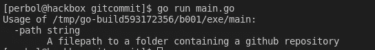

# 执行代码审查

> 原文：<https://itnext.io/performing-a-code-review-1297967683f6?source=collection_archive---------2----------------------->


卢卡·布拉沃在 [Unsplash](https://unsplash.com/s/photos/code-review?utm_source=unsplash&utm_medium=referral&utm_content=creditCopyText) 上的照片

今天早些时候，一个名为 ***/aliezsid*** 的用户在 Reddit 上发布了一个[](https://www.reddit.com/r/golang/comments/kmziuv/would_like_to_request_a_code_review/?utm_medium=android_app&utm_source=share)*帖子，要求进行代码审查。我需要在咖啡时间做些事情，所以我想为什么不呢。*

*Aliezsid 要求对他的新项目 [commitlog](https://github.com/barelyhuman/commitlog) 进行代码审查。我访问了他的 GitHub 来看看这个项目是关于什么的，看起来它是一个基于 GitHub 上的提交历史来生成变更日志的工具。我很喜欢他的想法，所以我决定做一个小回顾。你可以在这里阅读他的项目。*

## *侦察*

*当执行代码评审时，我做的第一件事总是检查文档。我需要了解这个库以及它背后的想法。*

*README.md 指定这个库正在进行大量的开发，并声明没有被认为不稳定的测试。在代码评审期间，我通常做的第二件事是检查测试以查看使用示例。测试不仅是确保事情不被破坏的重要手段，而且我发现在理解一个库的用法时，测试也很有用。*

*但是正如 Aliezsid 自己所写的，他知道目前没有测试，所以让它去吧。*

## ***代码分析***

*接下来我要做的就是抓取代码。*

```
*mkdir codereview-gitcommit
cd codereview-gitcommit
git init
git pull [https://github.com/barelyhuman/commitlog](https://github.com/barelyhuman/commitlog)*
```

*让我们打开 **main.go.** 我要去看看程序中发生了什么，然后一步一步地走过去。*

*gitcommit 主函数的第一行。*

*我们首先看到的是，他希望程序有一个输入参数。然后，他将使用 [go-git](https://github.com/go-git/go-git) 打开 GitHub 存储库。如果我们检查 PlainOpen 做了什么，我们将看到以下内容。*

*来自 go-git 的 PlainOpen*

*因此，该程序需要 GitHub 存储库的路径，而不是 URL。知道这一点很好，所以让我们稍微修改一下，使它更清楚。让我们使用 golang [国旗](https://golang.org/pkg/flag/)包来帮助我们。我想使用标志的原因是，它将帮助我们生成用户错误，它也更具可伸缩性。*

*阅读论据的更新版本*

*现在，在执行我们将要看到的程序时，用户更容易掌握如何使用它*

**

*使用 gitcommit 错误时输出错误。*

*让我们继续。代码中接下来发生的是，他打开 git 存储库，获取 git 头引用并提取提交历史。这是非常不清楚的，因为没有评论。*

*gitcommit 打开 repo 并提取头引用和提交的代码*

*现在这段代码被隔离在主包之外，不清楚到底发生了什么。我想要把这个拆开一些。我将创建一个名为 Repository 的新结构来保存这些函数。这将使测试变得更加容易，代码更加干净，可伸缩性更强。*

*一个新的存储库结构保存了我们的功能，测试将会容易得多*

*他做的下一件事是从存储库中提取最新的标签。这是通过用 utils 包提取 latestTag 来完成的。实际上，我们现在可以删除 utils 包，并将其插入到存储库结构的函数中。由于 utils 只支持这一个函数，我觉得将逻辑插入到我们的存储库结构中更合适。*

*这是旧的 gitcommit 代码，他从中提取最新的标签。*

*接下来，他检查 latestTag 是否与存储库头相同。*

*来自 main 函数的代码，用于检查第一次提交是否与存储库头相同。*

*我也想删除 **tillLatest** 检查，取而代之的是它自己的功能。这使得测试变得更容易，并且在包增长的情况下*重用*也变得更容易。在第 116 行的后面，他还重用了**is Committee arest**函数中完全相同的代码，每次我们不止一次使用代码时，*将其分解到自己的函数中，以避免重复代码*。我们需要了解两种用例中需要什么，并确保我们可以在两种情况下使用我们的新函数。*

*isCommitToNearestTag 还包含一个小错误，它会重复检查一个错误并使用 log.Fatal。第二个错误检查实际上永远无法访问，因为第一个错误检查会因为使用 log.Fatal 而取消。似乎 tillLatest 布尔标志用于强制检查 latestTag。哈希()。所以代码实际上会执行一次这种检查，只是为了强制以后再执行一次。这是我们可以删除的东西，所以它只执行一次，不是说我们有优化问题，而是没有理由重新运行代码。*

*旧的 isCommittoNearestTag 代码。*

*我将彻底删除执行第一次 tillLatest 检查的代码，它实际上没有任何用途(第 58–79 行)。当移除它时，我们会注意到我们可以完全移除对最新标签的获取。我们留着以后再说吧。*

*我们的新函数将被称为 IsCommitLatest，它将接受一个指向 object.Commit 的指针。*

*isCommitNearest 现在可以在交换机内部使用，而无需运行两次。*

*之后是最后一次迭代，遍历所有提交，并将它们附加到一个日志中。日志是由 logcategory 包处理的，所以让我们对它进行消化以了解它做了什么。*

*和 utils 一样，它也是一个非常小的包。实际上，它是一个附加了一个函数的结构。*

*gitcommits logcategory 包。*

*所以让我们从结构开始。在结构中很少看到大写的名字，我最后一次看到这种用法是在 Java 中。也许我们的作者是一个老爪哇鲨鱼？这没什么不好，我有点喜欢它，但我知道不是每个人都喜欢。让我们按照作者的想法去做吧。*

*GenerateMarkDown 函数检查所有切片的长度，并基于它们创建字符串和一个小标题。它使用常规字符串串联(old string+=“hello”+“world”)。它在这种情况下工作，因为字符串非常简单，但我实际上建议使用 String.Builder。*

*它还对每个切片重复同样的事情。并且结构中的每个切片都是[]字符串。所以让我们创建一个函数来做我们需要的事情。*

*接受指向字符串生成器的指针、标题和要打印的日志*

*现在 GenerateMarkdown 会变成这样*

*此外，我宁愿把它放在主包中，去掉 logcategory 的额外包。所以我将所有与 logcategory 相关的逻辑放入主包中一个名为 **logcategories.go.** 的新文件中*

*我还建议保持主函数的整洁和易于查看，所以我们也创建一个名为 **repository.go.** 的文件，所有与存储库结构相关的代码都放在那里。*

*所以对于代码审查的最后一部分，之前提到的提交迭代。它检查所有提交，并将这些消息附加到 logcategory 中适当的片上。你知道，因为我建议保持主街道的清洁。这实际上是我将移到 logcategories 文件中的内容。此外，我想把它从主要的，所以它可以更容易地测试。*

*我发现很难测试驻留在 main 中的东西。我建议总是把东西分开，这样在测试中更容易接近。*

*我为 LogsByCategory struct 创建了一个新函数，它将为我们处理逻辑。*

*逻辑是从 main 中分离出来的，所以它是可测试的*

*这就是我们最后的主线。*

*最后，他提到他目前在 git actions 中创建了自己的 changelog。所以让我们修改。github/workflows/create-binaries . yml 因为我们改变了程序的执行方式。还记得我们添加了-path 标志吗？*

```
*Line 30: ./commitlog . > CHANGELOG.txt
// Replaced with
.commitlog -path=. > CHANGELOG.txt*
```

*所以！我现在不干了。*

*希望你喜欢我的小代码回顾和我的制作过程。*

*已提交 PR 请求。*