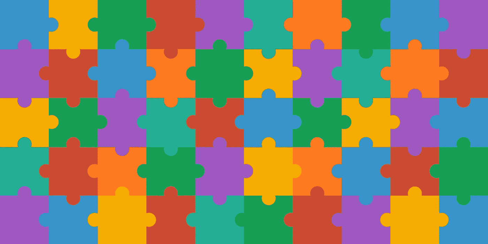
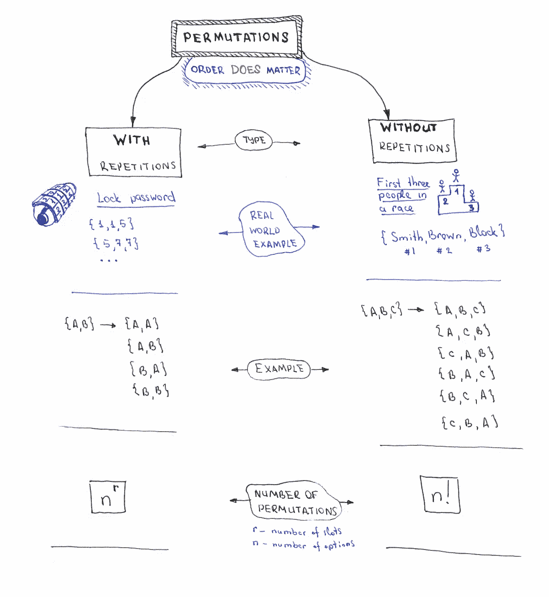
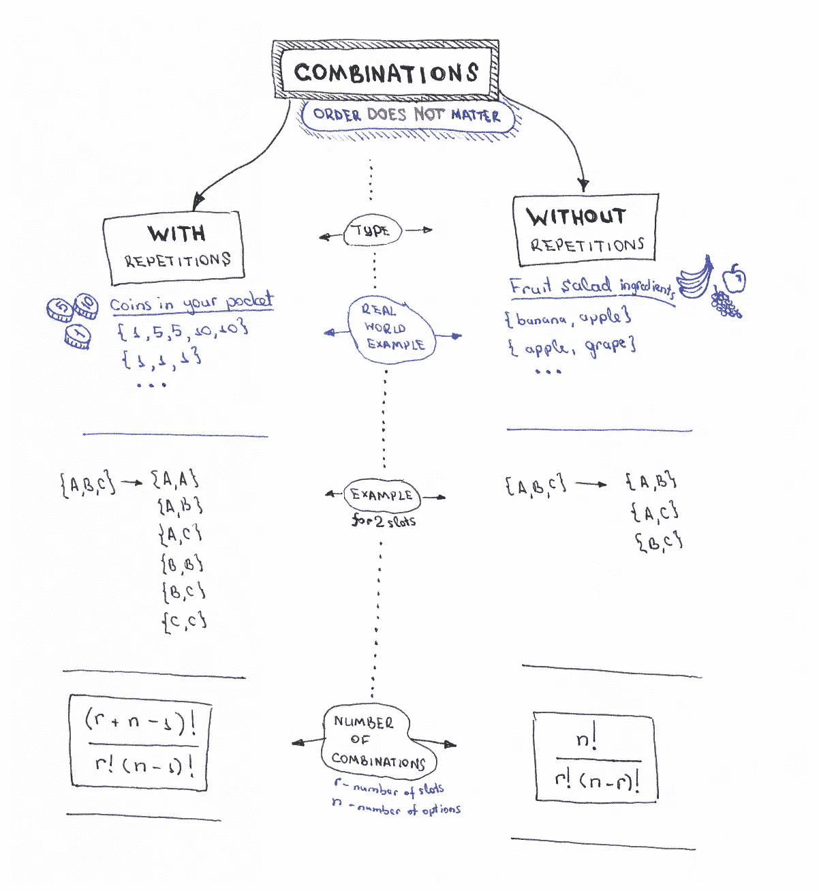
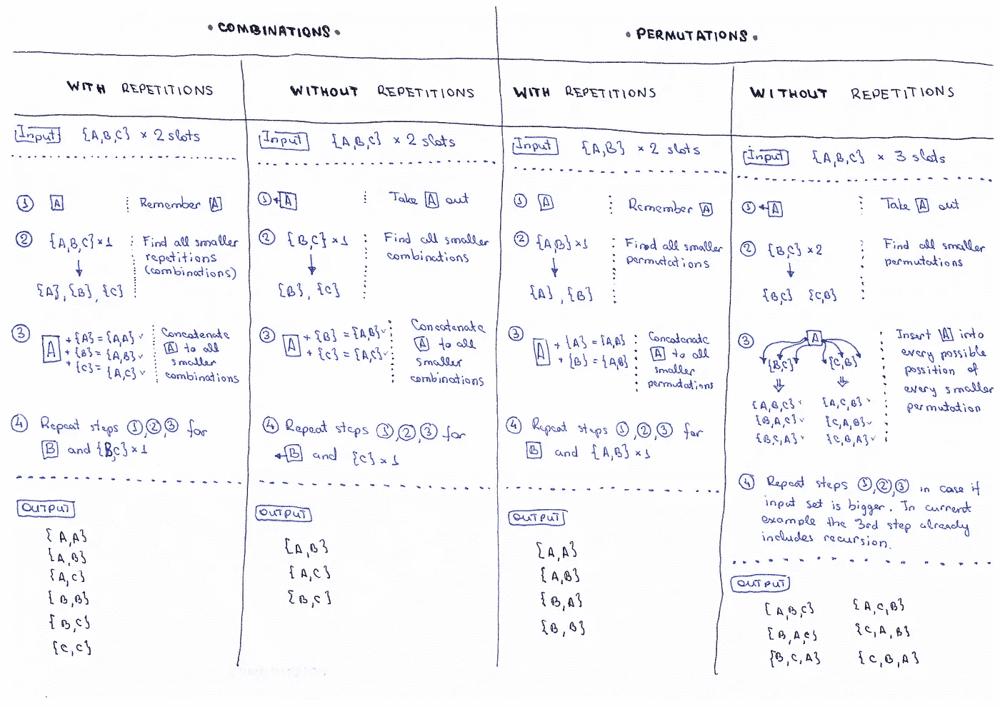

# 排列/组合算法备忘单

> 原文：<https://itnext.io/permutations-combinations-algorithms-cheat-sheet-68c14879aba5?source=collection_archive---------0----------------------->

## TL；速度三角形定位法(dead reckoning)

本文简要描述了数学上的*排列*和*组合之间的区别，*解释了排列和组合算法背后的主要思想，并包含 JavaScript 中算法实现的链接。

> JavaScript 代码示例可以在 [JavaScript 算法和数据结构](https://github.com/trekhleb/javascript-algorithms)库中找到。更多详情请阅读。

## 什么是组合和排列

假设我们有一个**集合**或**集合**的东西(数字、字母、水果、硬币等的集合。)并且我们需要**从一个集合中挑选项目**来形成另一个集合。例如，假设您正在从可用号码集合中挑选彩票号码({0，1，2，3，4，5，6，7，8，9} → {4，5，9})。或者你从一堆可用的水果中挑选水果来做水果沙拉({橘子、苹果、香蕉、葡萄}→{苹果、香蕉})。或者您正在尝试猜测锁定密码，并且您正在从{0，1，2，3，4，5，6，7，8，9}组中选择 3 个数字来猜测正确的密码({1，1，2}、{1，1，3}、{1，1，4}、…)。在所有这些情况下，您都是通过遵循一些规则从另一个集合中创建一个集合。这些规则定义了你的新收藏是一个**排列**还是一个**组合**。

如果你的新集合**中元素的**顺序**关系到**，那么你就要处理**排列**(例如，在锁定密码的情况下，{1，1，2}的集合与{2，1，1}的集合不同)。否则，如果**顺序无关紧要**，那么你就是在做一个**组合**(水果组合{苹果、香蕉}来做沙拉——不管你先挑苹果还是香蕉)。

你的新收藏**可能包含也可能不包含重复的东西**。例如，在“锁定密码”中，你可以使用重复的数字，但当你处理一组中奖者({Black，Smith，Brown})时，你不允许使用重复的数字，因为同一个人出现在两个中奖位置上是没有意义的。

为了说明所有这些差异，我制作了一些小备忘单，以便更容易记住它们。

## 排列概念备忘单

排列概念备忘单

## 组合概念备忘单

组合概念备忘单

## 排列/组合算法备忘单

如果你想实现排列和组合算法，你可能会发现下面的排列/组合算法备忘单很有用。

排列/组合算法备忘单

## JavaScript 中的组合和排列

如果您想查看这些算法在 JavaScript 中的具体实现，可以点击以下链接:

*   [JavaScript 中的组合](https://github.com/trekhleb/javascript-algorithms/tree/master/src/algorithms/sets/combinations)
*   [JavaScript 中的排列](https://github.com/trekhleb/javascript-algorithms/tree/master/src/algorithms/sets/permutations)

我希望你会发现这些备忘单很有帮助，它们会帮助你顺利地编写组合/排列算法。

编码快乐！

 [## Oleksii Trekhleb (@Trekhleb) |推特

### Oleksii Trekhleb 的最新推文(@Trekhleb)。@EPAMSYSTEMS 的首席软件工程师。正在创建全堆栈…

twitter.com](https://twitter.com/Trekhleb)