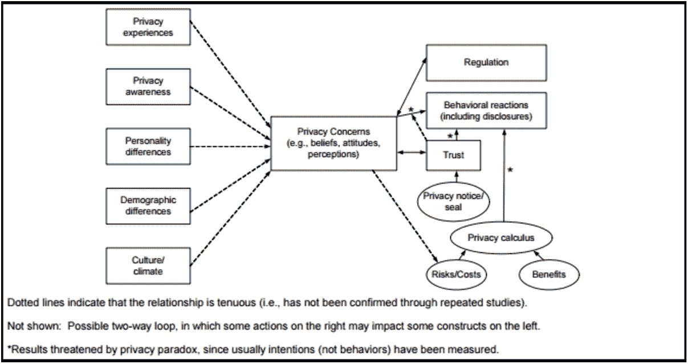

# 个性化和隐私，一个悖论？

> 原文：<https://itnext.io/personalization-and-privacy-a-paradox-8e06a5701fb3?source=collection_archive---------3----------------------->

物联网，虽然看起来是一个时髦的词，但已经产生了巨大的影响。这项技术正在从根本上改变我们的生活和做生意的方式。进步和多样化，加上社交媒体、移动设备和无线连接使用的增加，通过生成、存储和分析数据的能力，为我们的日常生活提供了访问和洞察。我们已经看到脸书、网上商店、谷歌和其他公司通过提供个性化广告、互动学习[聊天机器人](https://www.linkit.nl/knowledge-base/225/Chatbots_A_bright_future_in_IoT)或基于我们的消费者行为的产品推荐来赶时髦。

在物联网世界中，无数[设备连接到网络并相互连接，而且数量还在稳步增长。通过各种网络传感器技术，如 RFID，许多设备连接到更广泛的互联网。随着苹果手表、谷歌眼镜或 Pebble 智能手表或智能家居等可穿戴设备的出现，物联网正在悄悄潜入我们的生活。](http://www.forbes.com/sites/michaelkanellos/2016/03/03/152000-smart-devices-every-minute-in-2025-idc-outlines-the-future-of-smart-things/#5338245869a7)

## **个性化和隐私的概念**

然而，这种个性化，一种竞争的需要，已经侵犯了我们宝贵的隐私观念。能够收集大量数据的设备、信息和技术的增加，使公司能够将客户视为个人，而不是大客户群体。个性化被视为提供良好客户体验的重要组成部分，但是，提供这种个性化可能会造成干扰并影响隐私。我们可以认为个性化是收集和使用个人信息来提供最适合的服务的能力。

隐私或在这种情况下的[信息或数据隐私](https://en.wikipedia.org/wiki/Information_privacy)与这种个性化信息的传播相关。根据各种论文( [1](https://www.google.nl/url?sa=t&rct=j&q=&esrc=s&source=web&cd=2&cad=rja&uact=8&ved=0ahUKEwjIzbfXms7QAhWHIcAKHdujDJQQFggeMAE&url=https%3A%2F%2Fwww.jbisa.nl%2Fdownload%2F%3Fid%3D17708493%26download%3D1&usg=AFQjCNEJzzWyvF-AVS_HtgunDVdC9L5r2g&sig2=54A9Fo1-dkfTcYybuRsUWQ&bvm=bv.139782543,d.bGs) 、 [2](https://www.researchgate.net/profile/Heng_Xu6/publication/220260183_Information_Privacy_Research_An_Interdisciplinary_Review/links/543157530cf29bbc12789742.pdf) )和其他来源，[信息隐私](https://en.wikipedia.org/wiki/Information_privacy)问题随着个人信息的收集、处理和最终删除而出现。从形式上来说，这种[数据隐私](https://www.linkit.nl/knowledge-base/245/GDPR_zijn_bedrijven_voorbereid_op_de_nieuwe_Europese_privacy_verordening)与收集和处理数据时对个人数据的适当保护有关。来自 customerthink 的[新闻文章](http://customerthink.com/the-most-effective-personalization-is-invisible/)认为它更灵活，他们认为隐私或“令人毛骨悚然”的元素很重要。“最有效的个性化通常是无形的”。

## **个性化隐私悖论**

个性化隐私悖论；它是什么，为什么重要？这个悖论涉及到:“消费者在分享信息以使用个性化服务方面的声音和行为的敏感领域”以及“商业机构处理信息的能力”。而是我们(消费者)说一套做一套。通过各种研究( [1](https://www.google.nl/url?sa=t&rct=j&q=&esrc=s&source=web&cd=2&cad=rja&uact=8&ved=0ahUKEwjIzbfXms7QAhWHIcAKHdujDJQQFggeMAE&url=https%3A%2F%2Fwww.jbisa.nl%2Fdownload%2F%3Fid%3D17708493%26download%3D1&usg=AFQjCNEJzzWyvF-AVS_HtgunDVdC9L5r2g&sig2=54A9Fo1-dkfTcYybuRsUWQ&bvm=bv.139782543,d.bGs) ， [2](https://www.researchgate.net/profile/Heng_Xu6/publication/220260183_Information_Privacy_Research_An_Interdisciplinary_Review/links/543157530cf29bbc12789742.pdf) )表明，那些表现出严重隐私担忧的人会透露他们生活中被认为非常隐私的细节。这是为什么呢？

*图 1 监管下的隐私问题和收益/成本* [*Smith 等人，2011 年信息隐私研究:跨学科综述。MIS 季刊*](https://www.researchgate.net/profile/Heng_Xu6/publication/220260183_Information_Privacy_Research_An_Interdisciplinary_Review/links/543157530cf29bbc12789742.pdf)

这些综合因素( [1](https://www.google.nl/url?sa=t&rct=j&q=&esrc=s&source=web&cd=2&cad=rja&uact=8&ved=0ahUKEwjIzbfXms7QAhWHIcAKHdujDJQQFggeMAE&url=https%3A%2F%2Fwww.jbisa.nl%2Fdownload%2F%3Fid%3D17708493%26download%3D1&usg=AFQjCNEJzzWyvF-AVS_HtgunDVdC9L5r2g&sig2=54A9Fo1-dkfTcYybuRsUWQ&bvm=bv.139782543,d.bGs) 、 [2](https://www.researchgate.net/profile/Heng_Xu6/publication/220260183_Information_Privacy_Research_An_Interdisciplinary_Review/links/543157530cf29bbc12789742.pdf) 、 [3](https://hbr.org/2015/10/we-say-we-want-privacy-online-but-our-actions-say-otherwise) )影响人们对隐私的考虑，最显著的是:

*   隐私意识；
*   以前的隐私经验；
*   性格差异；
*   文化和行为差异；
*   人口统计学差异。

在上图中，你可以看到隐私、监管、收益和成本等不同因素之间的关系。在后续文章中，我们将讨论收益和成本之间的权衡，并找出哪些具体因素对放弃隐私关注、选择个性化的决定有更大的影响。