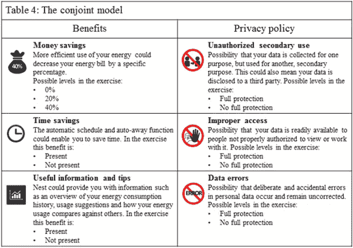

# 个性化和隐私，一个悖论？(第二部分)

> 原文：<https://itnext.io/personalization-and-privacy-a-paradox-part-ii-b7ad2f3cc2f0?source=collection_archive---------4----------------------->

在本系列的第一篇文章中，我们讨论了[物联网对隐私的影响以及它对个性化的意义](/knowledge-base/247/Personalization_and_Privacy_a_paradox)。其中解释了隐私和个性化的概念，并介绍了悖论。此外，还介绍了最终决定是选择个性化还是隐私时的权衡。通过这篇文章，我们旨在告诉你更多的细节，当处理隐私与个性化悖论时，影响个人决策的因素。

## **宣传和预防**

我们之前讨论了人们如何考虑隐私和个性化。从众多关于隐私/个性化悖论的来源( [1](https://www.google.nl/url?sa=t&rct=j&q=&esrc=s&source=web&cd=2&cad=rja&uact=8&ved=0ahUKEwjIzbfXms7QAhWHIcAKHdujDJQQFggeMAE&url=https%3A%2F%2Fwww.jbisa.nl%2Fdownload%2F%3Fid%3D17708493%26download%3D1&usg=AFQjCNEJzzWyvF-AVS_HtgunDVdC9L5r2g&sig2=54A9Fo1-dkfTcYybuRsUWQ&bvm=bv.139782543,d.bGs) 、 [2](https://www.researchgate.net/profile/Heng_Xu6/publication/220260183_Information_Privacy_Research_An_Interdisciplinary_Review/links/543157530cf29bbc12789742.pdf) 、 [3](https://hbr.org/2015/10/we-say-we-want-privacy-online-but-our-actions-say-otherwise) )、论文和报告中，我们收集了以下影响人们考虑隐私的因素:

*   隐私意识；
*   以前的隐私经验；
*   性格差异；
*   文化和行为差异；
*   人口统计学差异。

因此，这些因素决定了一个人是以预防为重点还是以提升为重点。这种预防或促进基本上归结为这个人是厌恶风险还是寻求风险。当考虑预防或促进时，他/她如何处理成功和失败是很重要的。如果一个人在做出隐私/个性化决策时是风险厌恶的，那么这个人比一个寻求风险的人更不愿意承担失败的风险。寻求冒险的人会发现成功的效果比失败的风险更重要。上述五个因素对决定寻求促进预防有最大的影响。

有趣的是，上述研究发现，人们坦率地表示，他们同样希望同时保护隐私和个性化。然而，当面临一个决定时，结果可能完全不同。注重预防的人更重视服务的隐私问题，而注重促销的人更重视个性化的好处。正如所料，这一决策高度依赖于情况、产品或服务。

## **此消彼长**

使用在[研究](https://www.google.nl/url?sa=t&rct=j&q=&esrc=s&source=web&cd=2&cad=rja&uact=8&ved=0ahUKEwjIzbfXms7QAhWHIcAKHdujDJQQFggeMAE&url=https%3A%2F%2Fwww.jbisa.nl%2Fdownload%2F%3Fid%3D17708493%26download%3D1&usg=AFQjCNEJzzWyvF-AVS_HtgunDVdC9L5r2g&sig2=54A9Fo1-dkfTcYybuRsUWQ&bvm=bv.139782543,d.bGs)中建立的联合模型进行权衡。个性化和隐私都是消费者面临的三个因素。他们还通过一项练习在整个测试样本中测试了这六个因素..除了这些因素之外，他们还要求受试者在练习中权衡他们的决定时，将这些因素的重要性从 1 到 7 进行排序。

以下因素的重要性等级为 1-7:

***杨林登*** 作出阻止或促进的取舍决定

## **最终参与决策的是什么？**

这项研究旨在证明两件事:

1.  人们在做决定的时候是先有偏好还是先有取舍？
2.  当有一个焦点时，权衡是否有显著差异？

第一个问题得到了解决，证明了虽然人们有预先偏好，但更多的是一种观点，而不是事实。当被迫做出决定时，他们最终妥协了。这个决定最终是由你在上面看到的 6 个因素推动的。虽然这项研究显示了一些差异，但这并不重要。不当接触是唯一的显著因素，对预防组更为重要。两组都同意省钱和二次利用是他们决策的重要因素。

这最终意味着，尽管人们对个性化和隐私有着预先的看法，但他们最终会基于权衡做出决定。