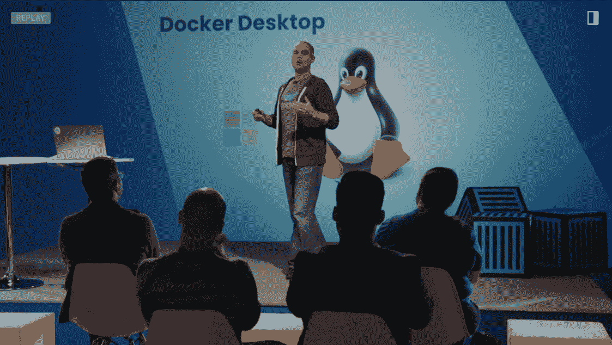
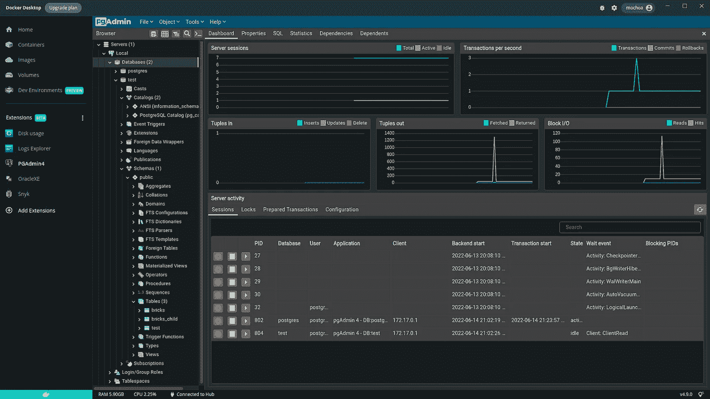
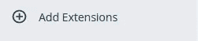
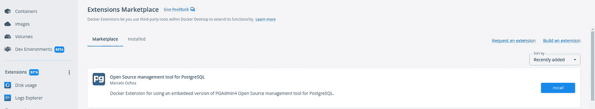
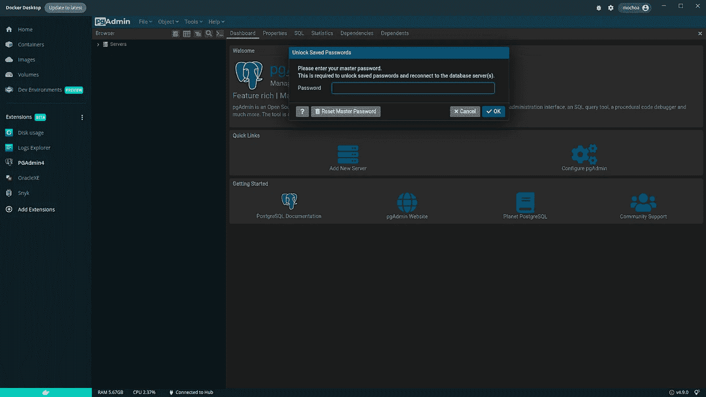
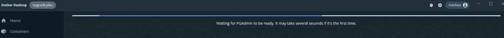
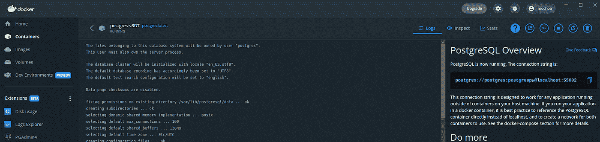
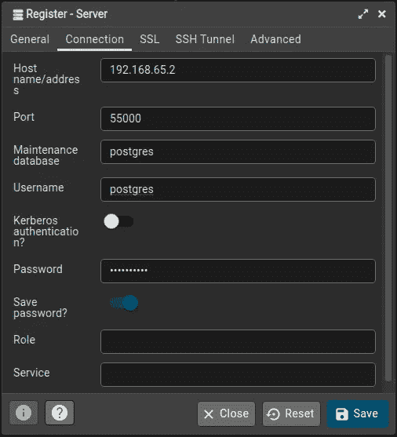

# PGAdmin4 Docker 桌面扩展

> 原文：<https://itnext.io/pgadmin4-docker-desktop-extension-f12f55245377?source=collection_archive---------1----------------------->

我是 Linux 命令行的忠实粉丝，所以我多年来一直从命令行使用 Docker，但随着 Docker Desktop for Linux 的正式发布，我决定改用这种使用 Docker 的方式，即 Windows 或 Mac 用户的方式；)



Docker 桌面 Linux 版在 DockerCon 2022 上发布

[https://docker . events . cube 365 . net/docker con/2022/content/Videos/ozwavw 7 auwozyfshf](https://docker.events.cube365.net/dockercon/2022/content/Videos/oZwAvW7auwoZYFSHF)
https://docs.docker.com/desktop/linux/install/
[https://docs.docker.com/desktop/linux/](https://docs.docker.com/desktop/linux/)

重要的是要考虑为什么 Docker Desktop for Linux 会运行 VM ，在我迁移到 Docker Desktop 的传统 Linux 方式中，有一个令人惊叹的环境。！！。

另一个重要的考虑是 Docker 桌面扩展和这些扩展为开发者创造的生态系统。

通过对我的环境进行升级，我决定构建我的第一个 Docker 扩展，这个扩展用于在 Docker 桌面中使用 [PGAdmin4](https://www.pgadmin.org/) 。这个扩展看起来像:



PGAdmin4 Docker 扩展的实际应用

# 为什么我需要 PGAdmin4 Docker 桌面扩展

因为许多开发栈使用 PostgreSQL 作为后端数据库，这些栈可能是 PHP/Laravel、Java Spring Boot 和许多其他栈，所以通常开发人员需要一个工具来连接到这些运行的数据库，以检查数据并进行更改。

有了以上假设，为什么不把一个 [PGAdmin4](https://www.pgadmin.org/) 流行工具集成到 Docker 桌面上呢？

如果您认为是，请继续下面的部分。

# 从市场安装

由于 Docker Desktop[v 4 . 11 . 0](https://docs.docker.com/desktop/release-notes/#docker-desktop-4110)pgadmin 4 扩展在市场页面中可用，只需点击+添加扩展即可



找到 PGAdmin4 扩展并单击安装



Docker 桌面市场上的 PGAdmin4

这就是全部，PGAdmin4 图标显示在左侧菜单(扩展测试版)。

# 手动安装

如果您使用的是 Docker Desktop [v4.10.1](https://docs.docker.com/desktop/release-notes/#docker-desktop-4101) 或更低版本，只需执行以下命令即可安装:

```
$ **docker extension install** [**mochoa/pgadmin4-docker-extension**](https://hub.docker.com/repository/docker/mochoa/pgadmin4-docker-extension)**:**[**6.10.0**](https://hub.docker.com/layers/230465206/mochoa/pgadmin4-docker-extension/6.10.0/images/sha256-736a8c56c57d9cb56eae2f3e6c26dd2d1f028000d76a605d31747bd88900c59f?context=repo)
Extensions can install binaries, invoke commands and access files on your machine.
Are you sure you want to continue? [y/N] y
Image not available locally, pulling [mochoa/pgadmin4-docker-extension](https://hub.docker.com/repository/docker/mochoa/pgadmin4-docker-extension):[6.10.0](https://hub.docker.com/layers/230465206/mochoa/pgadmin4-docker-extension/6.10.0/images/sha256-736a8c56c57d9cb56eae2f3e6c26dd2d1f028000d76a605d31747bd88900c59f?context=repo)…
Installing new extension “mochoa/pgadmin4-docker-extension:6.10.0”
Installing service in Desktop VM…
Setting additional compose attributes
VM service started
Installing Desktop extension UI for tab “PGAdmin4”…
Extension UI tab “PGAdmin4” added.
Extension “PGAdmin” installed successfully
```

## 注意:需要 Docker 扩展 CLI 来执行上述命令，请按照[扩展 SDK (Beta) - >先决条件](https://docs.docker.com/desktop/extensions-sdk/#prerequisites)页面上的说明添加它。

# 使用 PGAdmin4 Docker 扩展

一旦扩展被安装，一个新的扩展被列在 Docker 桌面的面板扩展(Beta)中。

点击 ***PGAdmin4*** 图标，扩展主窗口将显示运行中的扩展



PGAdmin4 欢迎屏幕

当扩展启动时，可能需要几秒钟，一个进度指示器将等待它



进度指示器栏

首次登录时会要求您输入 pgAdmin4 的主密码，填入您的主密码，然后单击 OK。

通过点击添加新服务器，您可以添加在 Docker 桌面或外部运行的 PostgreSQL 服务器，在 Docker 桌面中运行的 PostgreSQL 的 IP 可在菜单中找到，设置->资源->网络-> Docker 子网，在我的例子中是 192.168.65.0/24，因此用于扩展在 Docker 桌面中运行的 PostgreSQL 容器的内部 IP 将是 ***192.168.65.2*** ，还有一个解析上述内容的 DNS 名称


如何找到内部网桥 IP

让我们看一个 PostgreSQL 开始使用 Docker 桌面特色图片的例子:



PostgreSQL Docker 实例作为功能图像启动

PostgreSQL 概述显示了以下示例 URL:

> **postgres**://**postgres**:**postgrespw**@ localhost:**55000**

对于 PGAdmin，这意味着添加新服务器:

*   名称:测试
*   主机名/地址:**host . docker . internal**
*   端口:**55002**
*   维护数据库:**postgres**
*   用户名:**postgres**
*   密码:***postgrespw***

通过选择保存密码，上述密码将存储在 PGAdmin4 内部存储中，并将一直保留到您卸载此扩展。让我们看看实际情况:



添加新服务器对话框

您可以添加尽可能多的 PostgreSQL 数据库作为单独的 Docker 容器或服务运行，但请记住 5432 PostgreSQL 端口必须是公开的。首先使用容器窗格进行检查，例如:


检查暴露的端口

# 来源

像往常一样，这个扩展的代码在 [GitHub](https://github.com/marcelo-ochoa/pgadmin4-docker-extension) 上，请随意提出修改建议并做出贡献，请注意，我是 React 和 TypeScript 的初级开发人员，因此欢迎为改进这个 UI 做出贡献。