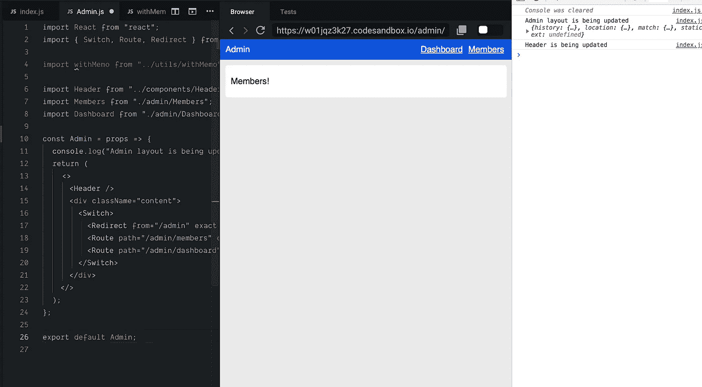

# 幻影道具，不必要的渲染和没人告诉我的 memo()

> 原文：<https://itnext.io/phantom-props-unnecessary-renders-and-what-no-one-told-me-about-memo-b34ebbd48c65?source=collection_archive---------0----------------------->



在读了几篇关于提高你的应用程序性能(或者更确切地说，停止浪费你的资源)的文章后——这是对其他媒体作者的赞扬——我决定在我目前领导的一个工作项目中实施一些最佳实践。我想和你分享一些我一路走来的感悟。

## 首先——应用程序是什么样的

这是一个包装了更多小应用程序的应用程序，以便重用组件、主题、上下文、实用工具和用于管理不同界面的相同数据的东西——用不同的版本制作不同的应用程序没有意义。因此，它有各种包装布局的嵌套路由。

## 我做了什么？

*   我为子应用程序实现了延迟加载。大多数时候你只会使用其中的一个，所以不延迟加载它是没有意义的。我只在根应用路由器级别这样做。随着应用程序的增长，我可能会将它添加到更多的级别，但目前它还很小。
*   我在各种组件和包装器中实现了`memo()`。我在这个过程中发现了一些问题，我将告诉你所有的问题，这样当它们发生在你身上时，你就知道如何解决它们。

## 问题是什么？

因为有亲身体验来理解一些事情总是更好，所以我在 codesandbox 中创建了这个虚拟应用程序。

如果你打开你的控制台，在**成员**和**仪表板**之间切换，你可以看到一个控制台日志，上面写着`Header is being updated`，它说每次你切换路线。

为什么呢？

我们的头球根本不用任何道具。我不想重新渲染它，在这种情况下永远不会。

# React.memo(组件)

我猜你们大多数人都听说过 memo 高阶组件。你把你的*组件*包装在里面，它只在组件的道具改变时触发渲染，一切都很好。


[https://imgur.com/gallery/EuorOOj](https://imgur.com/gallery/EuorOOj)

*React.memo()* 做一个粗浅的比较。假设你有一些`MemberList`组件，它基于你在远处商店某处的`members`阵列进行更新。`MemberList`为每个成员对象渲染`MemberRow`，并得到它作为道具。

你有 10 个成员。你加一个新的。你创建了一个新的数组。每个`MemberRow`重新渲染，尽管你把它包装在一个`memo()`中。浅层比较认为对象是新的——它不关心数据保持不变。它将触发另一个渲染，尽管你只需要为你刚刚添加的成员添加新的`MemberRow`，而不需要刷新其他 10 个`MemberRow`

# React.memo(Component，propsAreEqual)

## 但是等等，你可以提供第二个参数来 React.memo()！

这是我在一直阅读的文章中找不到的。所有人都在说`memo()`有多棒，但是从来没有展示过任何真实的例子，肤浅的比较有时是不够的。我不得不读了大约 4 遍文件才真正找到这个，还不算我一直狂吃的文章。

[](https://reactjs.org/docs/react-api.html#reactmemo) [## 反应顶级 API -反应

### React 是 React 库的入口点。如果从一个标签加载 React，这些顶级 API 可以在…

reactjs.org](https://reactjs.org/docs/react-api.html#reactmemo) 

```
function MyComponent(props) {
  /* render using props */
}
function areEqual(prevProps, nextProps) {
  /*
  return true if passing nextProps to render would return
  the same result as passing prevProps to render,
  otherwise return false
  */
}
export default React.memo(MyComponent, areEqual);
```

所以你也可以传递一个检查`previousProps`和`nextProps`的函数。这允许你做另一种比较——例如，如果你想确保你的数据确实匹配，并且不想触发重新渲染，就使用`JSON.stringify()`。

*我还为此创建了一个高阶组件，我将在文章结尾展示/链接它。*

现在让我们从代码沙箱回到我的不断更新的`<Header />`组件。

## 把它包在备忘录里一点用都没有

没错，因为我说过，它没有道具。然而，它正在更新。这是为什么呢？

因为整个布局都在更新。

我把小提琴更新了一点，让我们看看

观看布局也刷新控制台

再次打开您的控制台，然后单击各种路线。我添加了另一个 console.log，上面写着`Admin layout is being updated`。可以在`views/Admin.js`文件中查看。因此，如果整个管理布局在更新，我们的`<Header />`当然也在更新！但是为什么会发生这种情况——我们没有使用任何道具，我们没有改变组件状态，为什么我们要重新渲染？

# 幻影道具

仅仅因为你没有使用它们，并不意味着它们不存在。在我看来，这是一个设计错误，但我不是在这里给出不想要的意见，我是在这里让应用程序更快地与我得到的东西一起工作。哈🤷🏻

如果你检查`index.js`文件，你可以看到我们已经嵌套了路线和它们的布局——很像我正在使用的应用程序。

```
**function** App() {
  **return** (
    <**div**>
      <**Router**>
        <**Switch**>
          <**Redirect from="/" to="/admin" exact** />
          <**Route path="/admin" component=**{Admin} />
          <**Route path="/blog" component=**{Blog} />
        </**Switch**>
      </**Router**>
    </**div**>
  );
}}
```

我们正在渲染`<Admin />`组件——就是那个对我们大喊`Admin layout is being updated`的家伙。因为它是来自 *react-router-dom* 包的`<Route />`组件，所以它会自动获得`history`道具。如果我们在`<Admin />`组件中登录*道具*，你就可以自己看到了。

您可以在管理组件中看到这些属性

所以基本上——它们在那里，我们没有使用它们，但它们仍然在那里，它们触发渲染。在我的真实项目中，每当我在子应用中点击一条路线时，我的整个布局都会更新。过渡甚至是动画。那是完全没有必要的矫枉过正。

## memo()它！

我想用`memo()`。但是也许你们中的一些人已经猜到了——简单的`memo()`是行不通的，因为我们的道具当然在变。我们必须利用传递第二个参数的选项来让强大的`memo()`屈服于我们的意志。

*(Danaerys 在远处喊:“屈膝！”)*

这是将`<Admin />`组件包装在一个`withMemo()` hoc 中的最后一把小提琴，我创建它是为了避免重复渲染。

如你所见，`<Admin />`组件和`<Header />`组件都没有被重新渲染。

没有必要为此创建高阶组件，您可以在组件中编写`memo()`的函数。然而，我发现这更容易，因为我在工作中编写的应用程序中重用了它。

# 带备忘录(组件，检查过的 Props)

这是特设的，它只在某个属性改变时才更新组件。当然可以通过多个道具。它是这样使用的

```
import React from 'react';
import withMemo from './withMemo';

const MemberRow = ({ member, handleDeleteMember }) => (
  <div>Hi, this is {member.name} {member.surname}</div>
);

export default withMemo(MemberRow, ['member']);
```

在本例中，`<MemberRow />`组件仅在您更改`member`属性时更新。它根本不在乎它的另一个道具——`handleDeleteMember`——在变。提供一个空的参数数组意味着重新渲染不是基于 props，如果你的父组件没有更新，那么使用`[]`作为变化参数的`withMemo()`中的组件也不应该更新。

如果你想在小提琴中找到它，它位于`utils/`文件夹中。

# 给每个兴奋的开发者一个小小的警告

一个我不知道的功能—我想使用它！

好吧，随你便，但要小心行事。道具的存在是有原因的——在理想世界中，组件应该只获得它所关心的数据，如果它们发生变化，它们肯定应该触发重新渲染。不要在你的应用程序中到处都做这个检查——你可能会破坏你的渲染，并发现自己处于一个艰难的调试点。

大多数情况下，你可以改变一个组件的属性。在我的`<Route />`案例中，我不能，但是我可以一直使用嵌套组件，为路由逻辑保留`Route`,并在其中为`Layout`逻辑创建一个新组件——这样它就不会有`history`属性，也不会被重新渲染(但是`<Route />`组件会)。

不要对不需要的组件进行昂贵的检查。先考虑建筑。

## redditors 给我的有用笔记

*   来自`react-router-dom`的`<Route />`组件有其他使用`component={}`属性的渲染选项。如果你想自定义渲染逻辑(比如省略道具)，你可以使用`<Route />`组件的`render={}`属性。
*   使用`useCallback()`也能让你的生活更轻松(我希望我能给你这方面的指导，但是我没有实践经验。不过，我会确保很快获得一些！)

TL；速度三角形定位法(dead reckoning)

*   使用`React.memo()`不会解决你所有的问题。确保你使用第二个参数`React.memo(Component, propsAreEqual)`来比较前一个和下一个道具——如果你需要调整你的渲染。小心过度使用——试着想想是否有另一种更干净的方法来解决这个问题。最后，你的组件应该只接收它所关心的道具。
*   小心幽灵道具——仅仅因为你不用它们，并不意味着它们不在那里。如果它们在那里，你可以确定它们会触发渲染。
*   智能结构——保持组件较小，且仅用于单一、清晰的目的。如果结构清晰，调试代码就容易多了。你可以注意到，记忆小提琴中的`<Admin />`组件解决了我们所有的问题，我们不需要对`<Header />`组件做任何事情。如果结构不同并且`<Header />`组件位于`<Admin />`组件之外，则必须再次使用`memo()`。
*   做代码——自己尝试，拨弄，阅读文章，调试应用程序中发生的事情。最终，这是对你最好的教育。
*   [与 GitHub 上的 Memo()一起](https://github.com/DJanoskova/React-withMemo-)
*   一如既往，祝你好运，编码快乐！