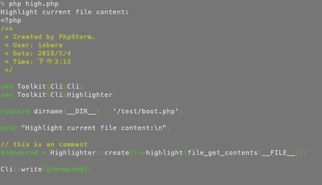
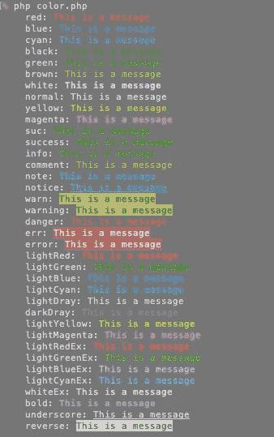

# PHP cli-utils: CLI 颜色渲染和代码荧光笔

> 原文：<https://itnext.io/php-cli-utils-cli-color-render-and-code-highlighter-f93944ee3cc9?source=collection_archive---------7----------------------->


为 php CLI 提供一些有用的工具。支持解析 CLI 参数和选项，控制台颜色渲染，CLI 环境，CLI 代码荧光笔，它非常小。

*   解析 CLI 参数和选项
*   控制台颜色渲染
*   CLI 环境信息帮助程序
*   CLI 代码高亮显示
*   构建简单的 cli 应用程序

# 安装

```
composer require toolkit/cli-utils
```

# 解析 CLI 参数和选项

```
use Toolkit\Cli\Flags;$argv = $_SERVER['argv'];
// notice: must shift first element.
$script = \array_shift($argv);
// do parse
list($args, $shortOpts, $longOpts) = Flags::parseArgv($argv);
```

# PHP 文件突出显示

> 这是灵感 jakub-on derka/PHP-控制台-荧光笔

```
use Toolkit\Cli\Highlighter;// this is an comment
$rendered = Highlighter::create()->highlight(file_get_contents(__FILE__));\Toolkit\Cli\Cli::write($rendered);
```



# 控制台颜色渲染

```
Color::printf('<info>%s</info> world', 'hello');
Color::println('hello world', 'info');
Color::println('hello world', 'error');
Color::println('hello world', 'warning');
Color::println('hello world', 'success');echo Color::render('hello world', 'success');
```

运行演示: *php 示例/color.php*



# Cli 下载器

```
use Toolkit\Cli\Download;$url  = 'http://no2.php.net/distributions/php-7.2.5.tar.bz2';
$down = Download::file($url, '');// $down->setShowType('bar');
$down->start();
```

## 进度条输出:

```
Connected...
Mime-type: text/html; charset=utf-8
Being redirected to: http://no2.php.net/distributions/php-7.2.5.tar.bz2
Connected...
FileSize: 14280 kb
Mime-type: application/octet-stream
[========================================>                                                           ] 40% (3076/7590 kb)
```

## 进度文本输出:

```
Download: http://no2.php.net/distributions/php-7.2.5.tar.bz2
Save As: /path/to/php-7.2.5.tar.bz2Connected ...
Got the file size: 14280 kb
Found the mime-type: application/octet-stream
Made some progress, downloaded 641 kb so far
```

# 开源代码库

[](https://github.com/php-toolkit/cli-utils) [## php-toolkit/cli-utils

### php 命令行界面的一些有用的工具。控制台颜色，CLI 环境，CLI 代码荧光笔。- php-toolkit/cli-utils

github.com](https://github.com/php-toolkit/cli-utils)