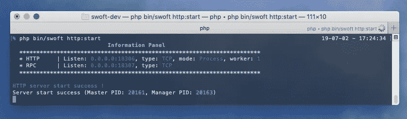
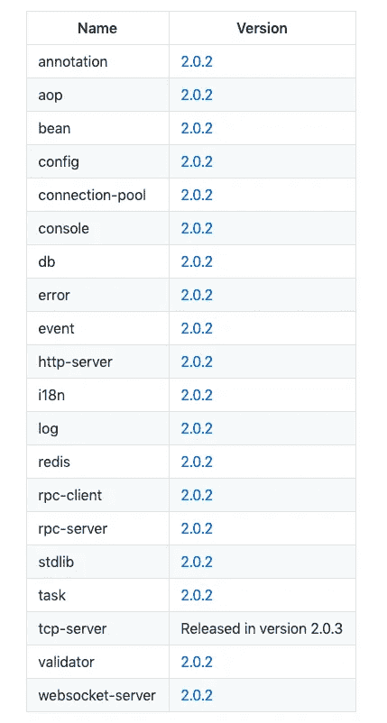
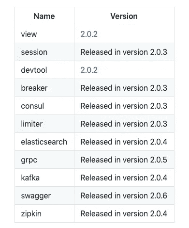

# PHP 协同程序框架— Swoft 2.0

> 原文：<https://itnext.io/php-coroutine-framework-swoft-2-0-d41825750d68?source=collection_archive---------4----------------------->



Swoft 2.0 —现代高性能 AOP 和协同程序 PHP 框架。

Swoft 是基于 Swoole 和 PHP 7.1+的新时代 PHP 框架，它是:

*   全驻留内存运行
*   全协程处理请求逻辑
*   基于注释减少应用程序配置
*   内置数据库连接池
*   也支持 Http、WebSocket、RPC 服务器

# 开源代码库

*   [T3【https://github.com/swoft-cloud/swoft】T5](https://github.com/swoft-cloud/swoft)

# 常驻内存

常驻内存让应用不必每次请求都加载解析文件，直接进入逻辑处理和调度过程，提高应用的性能。

# 全协同操作

与传统的 PHP-FPM 框架不同，在 Swoft 中，请求逻辑在一个完整的协程环境(如 Golang)中处理，调度 IO 操作，您的应用程序可以轻松地将处理能力提高 10 倍以上。

# 基于注释

Swoft 提供注释来快速配置对象实例(我们称之为 Beans)，注册路由，监听事件等。您可以运行 Swoft 应用程序，而不必配置太多东西。

一切都是自动的，swoft 会自动扫描和收集注释信息，自动配置相应的类，并提前将它们的实例创建到 IOC 容器中。您可以很容易地从容器中获得您需要的对象并使用它们。

```
<?php declare(strict_types=1);namespace App\Http\Controller;Use Swoft\Http\Server\Annotation\Mapping\Controller;
Use Swoft\Http\Server\Annotation\Mapping\RequestMapping;/**
 * @Controller()
 */
Class SiteController
{
    /**
     * @RequestMapping(route="index")
     */
    public function index(): string
    {
        return 'hello, welcome!';
    }
}
```

好的，不需要做任何事情，重启服务器。访问`http://127.0.0.1:18306/site/index`将会看到:`hello, welcome!`

# 内置连接池

Swoft 有内置的连接池特性，这使得你使用数据库 redis 非常方便。并且使用了高度兼容的社区著名框架 Laravel。你不用担心连接使用情况，Swoft 会自动连接 db，并在使用后回收连接。

# 使用 PHP

基于 PHP 的协同程序扩展 Swoole，你可以享受 PHP 社区的巨大资源，你不需要学习新的语言来提高应用程序的性能。只需稍加学习，您就可以将您的应用程序迁移到 swoft，并轻松获得比原始程序高 10 倍的性能提升。

# Http & WebSocket & RPC

Swoft 不仅仅是一个 HTTP 应用程序框架，它还非常好地支持您开发 WebSocket 应用程序。由于内置了对 RPC 服务器的支持，您可以使用 Swoft 轻松构建大型应用程序。

# 更多功能

*   内置高性能网络服务器(Http/WebSocket/RPC/TCP)
*   灵活的组件化
*   灵活的注释功能
*   多样化指挥终端(控制台)
*   强大的面向方面编程(AOP)
*   完善的容器管理，基于 PSR 协议 11 的依赖注入(DI)
*   灵活的事件机制
*   基于 PSR 7 的 HTTP 消息的实现
*   基于 PSR-14 的事件管理器
*   基于 PSR-15 的中间件
*   国际化(i18n)支持
*   简单高效的参数验证器
*   高性能连接池(Mysql/Redis/RPC)，自动重新连接
*   数据库高度兼容
*   高速缓存 Redis 高度兼容的 Laravel
*   高效的任务处理
*   灵活的异常处理
*   强大的日志系统

> *请明星 swoft by*[*Github*](https://github.com/swoft-cloud/swoft)

# 核心组件



# 扩展组件



# 资源

*   github:[swoft-cloud/swoft](https://github.com/swoft-cloud/swoft)
*   网址:[en.swoft.org](https://en.swoft.org/)
*   文件:[en.swoft.org/docs](https://en.swoft.org/docs)
*   gitter . im:[swoft-cloud/community](https://gitter.im/swoft-cloud/community)

[](https://github.com/swoft-cloud/swoft) [## 软件云/软件

### 🚀PHP 微服务协程框架。在 GitHub 上创建一个帐户，为 swoft-cloud/swoft 开发做出贡献。

github.com](https://github.com/swoft-cloud/swoft)