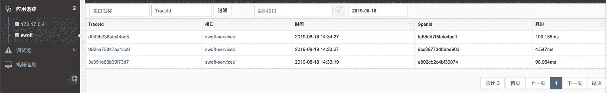
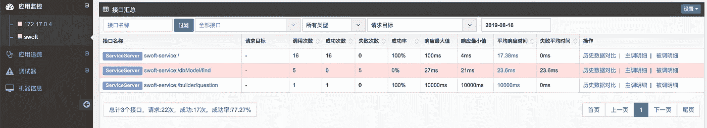
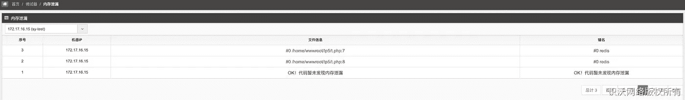
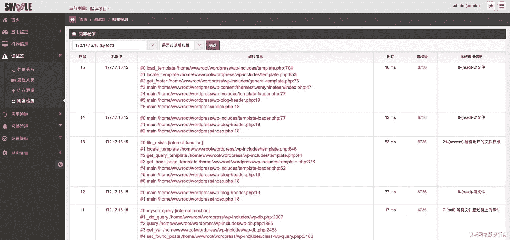
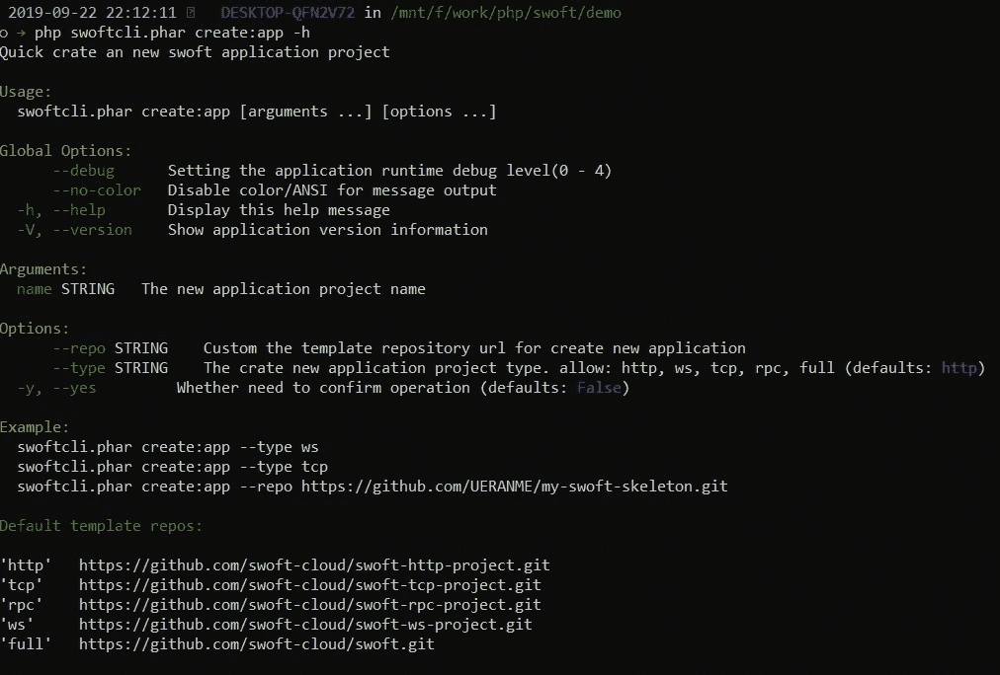
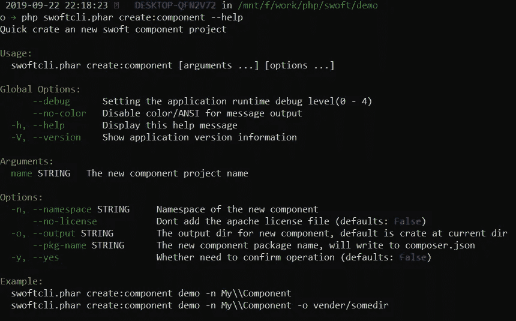

# PHP 微服务框架 Swoft — 2.0.6 正式发布

> 原文：<https://itnext.io/php-microservice-framework-swoft-2-0-6-officially-released-602d0ace092c?source=collection_archive---------4----------------------->


# 什么是 Swoft？

Swoft 是一个基于 Swoole 扩展的 PHP 微服务协程框架。像 Go 一样，Swoft 有一个内置的协程 web 服务器和一个公共的协程客户端，驻留在内存中，独立于传统的 PHP-FPM。还有类似 Go 的语言操作，类似 Spring 的云框架灵活的注解，强大的全局依赖注入容器，全面的服务治理，灵活强大的 AOP，标准的 PSR 规范实现等等。

Swoft 通过三年的积累和方向探索，将 Swoft 打造成 PHP 界的春天云，是 PHP 高性能框架和微服务管理的不二之选。

## 开源代码库

[](https://github.com/swoft-cloud/swoft) [## 软件云/软件

### PHP 微服务协程框架 Swoft 是一个基于 Swoole 扩展的 PHP 微服务协程框架…

github.com](https://github.com/swoft-cloud/swoft) 

# Swoft v2.0.6

Swoft 从此版本进入了正式的 2.0 版本。

这个版本我们做了很多改进和优化，http 服务器性能更好。它还修复了以前遗留下来的错误。

添加并改进了两个新的开发工具，供开发人员使用:

*   `swoft/swoole-tracker`可以帮助开发人员解决链接跟踪、内存泄漏、阻塞检查和性能分析等问题
*   `swoft-cli`现在支持基本的应用程序框架和组件结构创建，以及类文件生成

# 调试工具(swoft-swoole-tracker)

Swoft 调试工具帮助开发人员解决链接跟踪、内存泄漏、阻塞检查和性能分析等问题。

安装组件:

```
composer require swoft/swoole-tracker
```

配置中间件:

```
return [
   // ...
   'httpDispatcher' => [
       // Add global http middleware
       'middlewares' => [
            // ...
            \Swoft\Swoole\Tracker\Middleware\SwooleTrackerMiddleware::class,
       ],
   ],
   // ...
];
```

# 链接跟踪



# 服务监控



# 服务状态


# 内存泄漏



# 阻塞检测



# 开发工具(swoft-cli)

[swoft-cli](https://github.com/swoft-cloud/swoft-cli) 新增场景功能类生成(控制器、中间件、任务等。);提供用于创建项目框架和组件框架脚手架的工具..

**安装**:

你可以从 https://github.com/swoft-cloud/swoft-cli/releases[下载](https://github.com/swoft-cloud/swoft-cli/releases/download/{VERSION}/swoftcli.phar)

```
wget [https://github.com/swoft-cloud/swoft-cli/releases/download/{VERSION}/swoftcli.phar](https://github.com/swoft-cloud/swoft-cli/releases/download/{VERSION}/swoftcli.phar)
```

# 类生成

查看帮助:

```
php swoftcli.phar gen --help
```


例如，生成一个 http 控制器:

```
php swoftcli.phar gen:http-ctrl user --prefix /users
```

# 创建新项目

现在可以使用 swoft-cli 快速创建新项目。默认提供 5 套模板库，方便用户初始化不同的项目骨架。

```
php swoftcli.phar create:application --help
```



# 创建新组件

您还可以使用 swoft-cli 创建新组件，并帮助您快速完成初始配置:

```
php swoftcli.phar create:component --help
```



# 开源代码库

[](https://github.com/swoft-cloud/swoft) [## 软件云/软件

### PHP 微服务协程框架 Swoft 是一个基于 Swoole 扩展的 PHP 微服务协程框架…

github.com](https://github.com/swoft-cloud/swoft) 

# 更新日志

**固定:**

*   当 ws 服务器收到消息 [3a8890cf](https://github.com/swoft-cloud/swoft-component/pull/504/commits/3a8890cfd5a4641042eb7714c6afe65e15b0b461) 时，修复默认使用当前 fd 作为响应消息的客户端
*   修复了 ws 服务器通过 swoole 服务器获得的所有连接。fd 的类型可能不是整数，从而导致错误。 [0fa79d7](https://github.com/swoft-cloud/swoft-component/pull/504/commits/0fa79d7e5747d47883a104e2d6ab24c90b745453)
*   修复 stdlib SystemHelper 在 Windows 10 中会被 Defender 删除 [71c2893](https://github.com/swoft-cloud/swoft-component/pull/505/commits/71c2893c8514e5535b77a3b8bb8b2c225c771c8a)
*   修复`increment/decrement`并获得更多连接 [94c7171](https://github.com/swoft-cloud/swoft-component/pull/502/commits/94c7171f57c4d8952fdb0214da27e6e12231fe2d)
*   修复模型属性`$modelTimestamps`关闭无效 [94c7171](https://github.com/swoft-cloud/swoft-component/pull/502/commits/94c7171f57c4d8952fdb0214da27e6e12231fe2d)
*   修复在初始化之前调用日志，这可能导致启动阶段的上下文丢失错误 [5a27704f](https://github.com/swoft-cloud/swoft-component/pull/504/commits/5a27704f1bd3a056b144e2ecbb4accf1c59680df)
*   修复 ws 服务器握手并打开使用相同的顶级协程 ID。如果先执行一个，可能会导致后续会话丢失 [c2cd17a](https://github.com/swoft-cloud/swoft-component/pull/509/commits/c2cd17aaf0989ef9f4a2feaac714e152c1795d8c)
*   修正了`after`定时器传递参数的 bug [8ed609a](https://github.com/swoft-cloud/swoft-component/pull/508/files)
*   修复了定时任务内存泄漏和日志打印数据丢失问题 [aa6bc32](https://github.com/swoft-cloud/swoft-ext/pull/40/commits/aa6bc3223a4fc7b3cb97ec1f324c257eaa2356bf)
*   优化的 Http 服务器`sgo`处理流程 [e60d92e](https://github.com/swoft-cloud/swoft-component/pull/507/commits/e60d92e78853a9f0b2e9f823c941bc214c6c409f)
*   修正了在事情 [c2e87f2](https://github.com/swoft-cloud/swoft-component/pull/507/commits/c2e87f278815fd14dbccb71d5f6a63d4f974d38b) 的情况下重新连接导致的数据库不一致
*   修复了 Aop 极端情况返回`0`问题 [85bc1b1](https://github.com/swoft-cloud/swoft-component/pull/511/commits/85bc1b186f125773d55c582ecc40cde9f30c87cf)
*   修复了`BeanFactory::createBean()`方法创建问题 [c2e2c89](https://github.com/swoft-cloud/swoft-component/pull/474/commits/c2e2c894ea17dcb3a0e97cccaff42355b72066f7)
*   修复 RPC 错误数据是一个字符串问题 [3a34658](https://github.com/swoft-cloud/swoft-component/pull/474/commits/3a346589a81e35a0dd1b2ffc43dcd430153d86c7)
*   修正了`redisCluster`初始化问题 [3a60c06](https://github.com/swoft-cloud/swoft-component/pull/515/commits/3a60c063189224a360400f9fcfd9d5cb55bd3587)
*   固定`DbException`无投掷`Database`异常`Code`3a 60 c 06
*   修正了`ModelAttribute` [2e2f0f1](https://github.com/swoft-cloud/swoft-component/pull/502/commits/2e2f0f197c64fecfdee82ade45a40ed509ed6108) 的`getter`和`setter`驼峰判断错误
*   修复`Aggregate`聚合，返回字符串强制转换`int`错误 [7aa98a6](https://github.com/swoft-cloud/swoft-component/pull/502/commits/7aa98a6a565236639c9803facf2a4b01bc2adacb)
*   更新 [967d6f8](https://github.com/swoft-cloud/swoft-component/pull/502/commits/967d6f84e3e1eae4c495e46c5a5edbfa79b5a7fe) 后，修复模型`updateCounters`方法不同步实体数据

**更新:**

*   调整 ws 服务器在工作人员退出时自动关闭连接，添加开关配置，可以选择是否打开。 [3a8890c](https://github.com/swoft-cloud/swoft-component/pull/504/commits/3a8890cfd5a4641042eb7714c6afe65e15b0b461)
*   ws 服务器新事件:`MESSAGE_PUSH` `OPEN_BEFORE` `MESSAGE_RECEIVE` [e1b0583](https://github.com/swoft-cloud/swoft-component/pull/504/commits/e1b058340e27e6773a3fbac0daafaffbabea5571)

**增强功能:**

*   添加按时间切割的新原木 [f649df2](https://github.com/swoft-cloud/swoft-component/pull/503/commits/f649df2cf6bb7635ae2f0bff8ae8250e4bdecbf3)
*   添加了日志支持以传递附加参数[55d 533](https://github.com/swoft-cloud/swoft-component/pull/503/commits/55d55335f77572611ae0a469f5c848454838fc1f)
*   调整并添加了一些 ws 服务器相关事件供用户使用 [e1b0583](https://github.com/swoft-cloud/swoft-component/pull/504/commits/e1b058340e27e6773a3fbac0daafaffbabea5571)
*   型号对`Prop`支架 [630aad8](https://github.com/swoft-cloud/swoft-component/pull/502/commits/630aad8315894a993ef9021c23c70eed14e3fa47)
*   添加了连接池(mysql/redis/rpc)来启动初始连接 [a367173](https://github.com/swoft-cloud/swoft-component/pull/507/commits/a3671739863bacf1ba514fbe637e981b19b22b94)
*   使用长度打包 [a6fbe932](https://github.com/swoft-cloud/swoft-component/pull/509/commits/a6fbe93261b2facadd0c9d3384c3abd86e8779dc) 时，tcp 服务器支持自定义头数据打包和解包格式
*   RPC 调用错误消息调整 [d9226b1](https://github.com/swoft-cloud/swoft-component/pull/515/commits/d9226b13e7bf1b3154922439dc4990c8f55de040)
*   追加操作`Database`异常，打印控制台错误`SQL` [3a60c06](https://github.com/swoft-cloud/swoft-component/pull/515/commits/3a60c063189224a360400f9fcfd9d5cb55bd3587)
*   新的操作数据迁移`int`系列长度支持 [967d6f8](https://github.com/swoft-cloud/swoft-component/pull/502/commits/967d6f84e3e1eae4c495e46c5a5edbfa79b5a7fe)
*   增加了原来的 sql 方法`getRawSql` [967d6f8](https://github.com/swoft-cloud/swoft-component/pull/502/commits/967d6f84e3e1eae4c495e46c5a5edbfa79b5a7fe)
*   扩展`updateOrInsert`和`updateOrCreate`以支持自增量参数 [967d6f8](https://github.com/swoft-cloud/swoft-component/pull/502/commits/967d6f84e3e1eae4c495e46c5a5edbfa79b5a7fe)

**额外:**

*   `Swoftcli`已经支持基本的应用框架和组件结构创建，以及类文件生成功能。
*   `SwoftTracker`支持开发者轻松调试