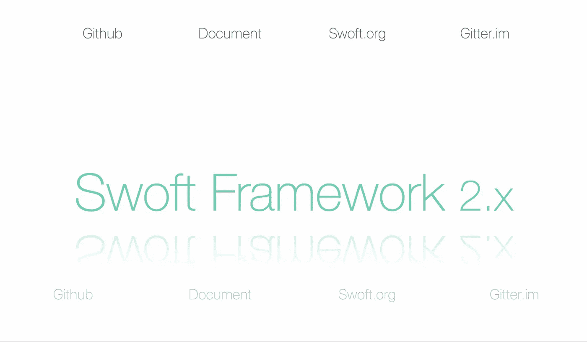

# 为 Swoft 框架设置开发环境

> 原文：<https://itnext.io/php-microservice-framework-swoft-development-environment-for-swoft-d989da580c6c?source=collection_archive---------5----------------------->


# 介绍

# 什么是 Swoft？

Swoft 是一个 PHP 高性能微服务协程框架。已经出版多年，已经成为 php 的不二之选。它可以像 Go 一样，内置协同 web 服务器和通用协同客户端，驻留在内存中，独立于传统的 PHP-FPM。还有类似的 Go 语言操作，类似于 Spring Cloud 框架的灵活注解。

Swoft 通过三年的积累和方向探索，将 Swoft 打造成 PHP 界的春天云，是 PHP 高性能框架和微服务管理的不二之选。

# 关于教程

我通过学习 swoft 来写文章，它可以帮助人们轻松地学习 Swoft。

今天我们将学习如何设置 swoft 开发环境并成功运行官方示例。促进我们快速体验和理解 Swoft。

## 开源代码库

如果你有一些问题，你可以通过 github 提交问题。

[微软云/微软](https://github.com/swoft-cloud/swoft)

## 讨论

你可以在这里讨论问题。

[讨论社区](https://gitter.im/swoft-cloud/community)

# 辅导的

# 要求

*   Centos7+
*   PHP 编写器
*   码头工程
*   docker-撰写

# 安装要求

> 如果您已经安装了 docker，您可以跳过步骤 1 和 2

## 1.centos 码头

```
udo yum install -y yum-utils \device-mapper-persistent-data \lvm2
sudo yum-config-manager \--add-repo \https://mirrors.ustc.edu.cn/docker-ce/linux/centos/docker-ce.repo
sudo yum makecache fast
sudo yum install docker-ce
sudo systemctl enable docker
sudo systemctl start docker
sudo usermod -aG docker $USER
newgrp - docker
sudo systemctl restart docker
```

## 2.docker-撰写

```
su root
curl -L [https://get.daocloud.io/docker/compose/releases/download/1.22.0/docker-compose-`uname](https://get.daocloud.io/docker/compose/releases/download/1.22.0/docker-compose-`uname) -s`-`uname -m` > /usr/local/bin/docker-compose
chmod +x /usr/local/bin/docker-compose
```

## 3.服务器端编程语言（Professional Hypertext Preprocessor 的缩写）

```
su root
rpm -Uvh [https://dl.fedoraproject.org/pub/epel/epel-release-latest-7.noarch.rpm](https://dl.fedoraproject.org/pub/epel/epel-release-latest-7.noarch.rpm)
rpm -Uvh [https://mirror.webtatic.com/yum/el7/webtatic-release.rpm](https://mirror.webtatic.com/yum/el7/webtatic-release.rpm)
yum -y install php71w-fpm
```

## 4.设计者

```
su root
curl -sS [https://getcomposer.org/installer](https://getcomposer.org/installer) | php
mv composer.phar /usr/local/bin/composer
```

# 安装 Swoft

现在，我们使用 composer 来快速创建新项目

创建项目:

```
composer create-project swoft/swoft Swoft
```

成功安装后，您可以看到以下目录结构:

```
├── app/    ----- root directory
│   ├── Annotation/        ----- annotation
│   ├── Aspect/            ----- aop
│   ├── Common/            ----- common util
│   ├── Console/           ----- command
│   ├── Exception/         ----- exception
│   │   └── Handler/           ----- exception handler
│   ├── Http/              ----- HTTP Demo
│   │   ├── Controller/
│   │   └── Middleware/
│   ├── Helper/            ----- helper
│   ├── Listener/          ----- listener
│   ├── Model/             
│   │   ├── Dao/
│   │   ├── Data/
│   │   ├── Logic/
│   │   └── Entity/
│   ├── Rpc/               ----- RPC Demo
│   │   └── Service/
│   │   └── Middleware/
│   ├── WebSocket/         ----- WebSocket Demo
│   │   ├── Chat/
│   │   ├── Middleware/
│   │   └── ChatModule.php
│   ├── Tcp/               ----- TCP Demo
│   │   └── Controller/        
│   ├── Application.php    ----- Application
│   ├── AutoLoader.php     ----- Autoloader
│   └── bean.php
├── bin/
│   ├── bootstrap.php
│   └── swoft              ----- entry file
├── config/                ----- config directory
│   ├── base.php               
│   └── db.php                
├── public/                ----- public directory
├── resource/              ----- resource directory
│   ├── language/              
│   └── view/                 
├── runtime/               ----- runtime directory
├── test/                  ----- unit directory
│   └── bootstrap.php
├── composer.json
├── phar.build.inc
├── phpunit.xml.dist
├── .env                    ----- env config
├── docker-compose.yml  
└── phpunit.xml.dist
```

# 启动 Swoft

更新 docker-compose.yaml:

```
version: "3"
services:
  redis:
    image: redis:alpine
    container_name: redis
    ports:
     - 6379:6379
    volumes:
     - redisdb:/data
     - /usr/share/zoneinfo/Asia/Shanghai:/etc/localtime
  swoft:
    image: swoft/swoft
#    for local develop
#    command: php -S 127.0.0.1:13300
    container_name: swoft-test
    environment:
      - APP_ENV=dev
      - TIMEZONE=Asia/Shanghai
    ports:
      - "18306:18306"
      - "18307:18307"
      - "18308:18308"
    volumes:
      - ./:/var/www/swoft
  mysql:
    image: mysql
    container_name: mysql-srv
    environment:
      - MYSQL_ROOT_PASSWORD=123456
    ports:
      - "3306:3306"
    volumes:
    - mysqldb:/var/lib/mysql
volumes:
  redisdb:
  mysqldb:
```

通过 Docker 撰写启动 swoft:

```
docker-compose up -d
```

你点击 [http://127.0.0.1:18306](http://127.0.0.1:18306/) ，会看到如下页面。



## 开源代码库

如果你有一些问题，你可以通过 github 提交问题。

[微软云/微软](https://github.com/swoft-cloud/swoft)

## 讨论

你可以在这里讨论问题。

[讨论社区](https://gitter.im/swoft-cloud/community)