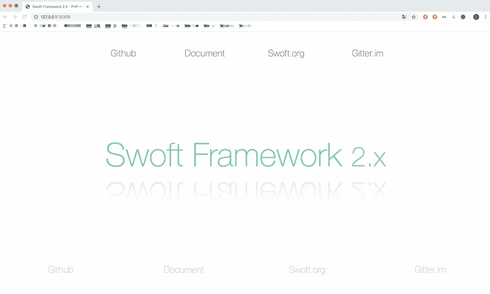

# PHP 微服务框架 Swoft: HTTP 服务器第 1 部分

> 原文：<https://itnext.io/php-microservice-framework-swoft-say-hello-world-ff78d55582d0?source=collection_archive---------3----------------------->


# 什么是 Swoft？

Swoft 是一个 PHP 高性能微服务协程框架。已经出版多年，已经成为 php 的不二之选。它可以像 Go 一样，内置协同 web 服务器和通用协同客户端，驻留在内存中，独立于传统的 PHP-FPM。还有类似的 Go 语言操作，类似于 Spring Cloud 框架的灵活注解。

Swoft 通过三年的积累和方向探索，将 Swoft 打造成 PHP 界的春天云，是 PHP 高性能框架和微服务管理的不二之选。

# 开源代码库

[](https://github.com/swoft-cloud/swoft) [## 软件云/软件

### PHP 微服务协程框架 Swoft 是一个基于 Swoole 扩展的 PHP 微服务协程框架…

github.com](https://github.com/swoft-cloud/swoft) 

# 辅导的

# 安装

使用 composer 安装 Swoft

```
swoft:/www# composer create-project swoft/swoft swoft
Installing swoft/swoft (v2.0.5)
  - Installing swoft/swoft (v2.0.5): Loading from cache
Created project in swoft
> @php -r "file_exists('.env') || copy('.env.example', '.env');"
Loading composer repositories with package information
Updating dependencies (including require-dev)
Package operations: 84 installs, 0 updates, 0 removals
  - Installing swoft/stdlib (v2.0.5): Loading from cache
  - Installing swoft/server (v2.0.5): Loading from cache
  - Installing nikic/php-parser (v4.2.4): Downloading (100%)         
  ......
toolkit/cli-utils suggests installing inhere/php-validate (Very lightweight data validate tool)
toolkit/cli-utils suggests installing inhere/console (a lightweight php console application library.)
......
Writing lock file
Generating autoload files
```

# 开始

安装后，转到 Swoft 项目根目录并启动 Swoft，如下所示。

```
root@MyServer:/tmp/swoft# php bin/swoft http:start
2019/09/14-10:29:34 [INFO] Swoft\SwoftApplication:setSystemAlias(485) Set alias @base=/tmp/swoft
2019/09/14-10:29:34 [INFO] Swoft\SwoftApplication:setSystemAlias(486) Set alias @app=@base/app
......
2019/09/14-10:29:35 [INFO] Swoft\Processor\ConsoleProcessor:handle(39) Console command route registered (group 14, command 42)
                            Information Panel
  ********************************************************************
  * HTTP     | Listen: 0.0.0.0:18306, type: TCP, mode: Process, worker: 3
  * RPC      | Listen: 0.0.0.0:18307, type: TCP
********************************************************************HTTP server start success !
2019/09/14-10:29:35 [INFO] Swoft\Server\Server:startSwoole(492) Swoole\Runtime::enableCoroutine
2019/09/14-10:29:35 [INFO] 
......
```

启动成功，可以看到端口关闭 Http 和 Rpc。

然后在浏览器中访问 [http://127.0.0.1:18306](http://127.0.0.1:18306/) 地址。将出现以下页面。



# 向世界问好

在 Swoft 控制器目录(`app/Http/Controller`)下创建一个新的`HelloWorldController.php`文件，如下所示。

```
<?php declare(strict_types=1); namespace App\Http\Controller;use Swoft\Http\Server\Annotation\Mapping\Controller;
use Swoft\Http\Server\Annotation\Mapping\RequestMapping;/**
 * Class HelloWorldController
 *
 * @since 2.0
 *
 * @Controller(prefix="hello-world")
 */
class HelloWorldController
{
    /**
     * @RequestMapping()
     *
     * @return string
     */
    public function index(): string
    {
        return 'Hello World !';
    }
}
```

这里使用的控制器和路由器将在后续文章重启服务中详细描述。

浏览器访问[http://127 . 0 . 0 . 1:18306/hello-world/index](http://127.0.0.1:18306/hello-world/index)，会得到如下页面。


# 基准

在 Apache Bench 工具下简单测试 Swoft，结果如下:


# 开源代码库

[](https://github.com/swoft-cloud/swoft) [## 软件云/软件

### PHP 微服务协程框架 Swoft 是一个基于 Swoole 扩展的 PHP 微服务协程框架…

github.com](https://github.com/swoft-cloud/swoft)