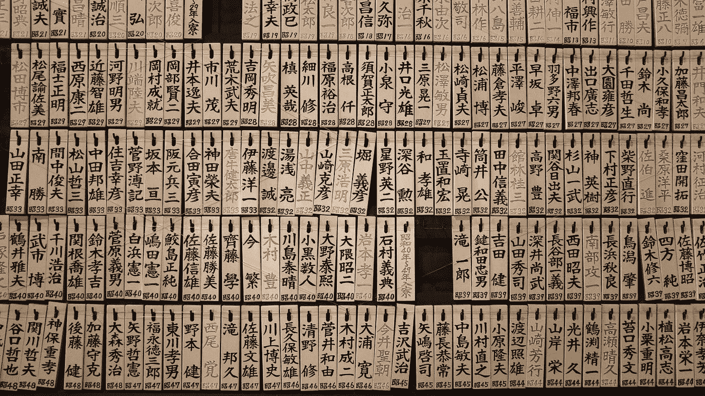

# PHP:序列化和非序列化的简单方法

> 原文：<https://itnext.io/php-serializing-an-unserializing-the-simple-way-da25c0d9340d?source=collection_archive---------0----------------------->

## PHP 开发人员讨厌这样！



照片由[吉斯‍ ‍](https://unsplash.com/@fatasuir9?utm_source=medium&utm_medium=referral) 在 [Unsplash](https://unsplash.com?utm_source=medium&utm_medium=referral) 上拍摄

保存一个类的实例的一个棘手之处是序列化。对于那些不知道这到底是什么的人来说，这个概念非常简单:你可以用字符串**表示一个类的实例，这样你就可以在任何地方存储，然后从同一个字符串中恢复这个实例。**

当您使用方法`serialize($instance)`和`unserialize($string)`时，这是在 PHP 中通过分别使用类实例和类字符串表示自动完成的:

```
$car = new Car(new OilEngine());FileHandler::set('class.txt', serialize($car));$sameCar = unserialize(FileHandler::get('class.txt'));
```

这对于存储实例以便以后检索非常有用，比如在文件、数据库、内存存储(比如 redis 或 memcached)中，或者任何接受文本的东西中。

例如，将一个用户类实例及其属性保存到一个会话中，这样在下一个请求中检索到它之后，我们就可以恢复同一个用户实例，而不必将其从数据库中取出。嘿，这只是一个例子。

# 处理序列化的旧方法

在 PHP 5.1 之前，处理类序列化的唯一方式是使用方法`__sleep()`和`__wakeup()`。

在将实例传递给 PHP 的默认序列化进程之前，第一个必须返回一个必须序列化的属性数组，以及其他深度“清理”。另一个将在类未序列化后被调用，这将允许您修改当前实例来恢复已经丢失的*。*

*简单？一点也不。此外，使用*默认*序列化时有一些注意事项:*

*   *这个字符串乍一看很难理解，因为 PHP 使用了一种奇怪的编码来保持类的形状。*
*   *您必须考虑到类实例的属性也是可序列化的或不可序列化的，并且有一个在非序列化时恢复它们的解决方法。*

*正如你所看到的，它们似乎适得其反，令人困惑，但是自从 PHP 5.1 以来，没有必要再考虑它们了，因为有更好的方法来处理序列化。*

# *欢迎序列化！*

*PHP 有一个方便的接口叫做 [Serializable](https://www.php.net/manual/en/class.serializable.php) 。这包含了两个你必须设置的方法，叫做`serialize()`和`unserialize()`，它们在不破坏向后兼容性的情况下替换了旧的调用。*

*它们几乎不言自明，但无论如何，要点如下:*

*   *`serialize()`在类被序列化时被调用。它的目的是将类的一个**字符串表示传递给 PHP。例如，我们可以返回一个 JSON 编码的属性列表。类名会自动附加上返回的字符串——如果没有后者，PHP 就不知道以后要去序列化哪个类。***
*   *当字符串被反序列化为相应的类时，调用`unserialize()`。PHP 将检查序列化字符串中的类名，将字符串传递给该方法，并设置类实例需要的任何内容。*

*乍看之下,`unserialize()`方法很难理解，但绝非易事。[正如文档中所说的](https://www.php.net/manual/en/serializable.unserialize.php)，这个方法的作用就像一个“构造函数”，这意味着这个类将被实例化，绕过`__construct()`方法。如果您需要在`_contruct()`中设置一些依赖项，unserialize 方法将不得不手动寻找它们，或者(最好)在序列化完成时设置它们:*

```
*$car = unserialize(FileHandler::get('class.txt'));$car->setWheels(new Wheels());
$car->setPaintJob(new PaintJob('red'));*
```

*对于设置依赖关系，一个好的方法是在`ReflectionClass`的`[getConstructor()](https://www.php.net/manual/en/reflectionclass.getconstructor.php)`和`ReflectionMethod`的`[getParameters()](https://www.php.net/manual/en/reflectionfunctionabstract.getparameters.php)`的帮助下，在未序列化的类实例上使用 setters，如果你需要更高级和模块化的东西。*

*但是我们正在进步。来连载点什么吧。*

# *序列化和取消序列化汽车*

*你不会下载一辆车？还没有，但是我们可以把它保存在一个文件里。简单浏览一下这个“Car”类，你会注意到它需要一个引擎，我们提供了一个 *PHP 7.4 风格的*属性来设置颜色，并且它已经设置了序列化方法。*

*当它序列化时，它将作为 JSON 来做。在该字符串中，我们将放入引擎类名(如果引擎已启动)和颜色。*

*当它*解序列化*时，我们将解码 JSON 字符串。我们将根据给定的类名创建一个新的引擎，放置颜色，如果引擎已经启动，就启动它。*

*让我们用实际行动来检验一下。*

*然后*瞧*。不需要在代码中做奇怪的 sh*t 来保存一个类实例。见鬼，你甚至可以把它们存到 u 盘里，然后在另一台电脑上反序列化。技术！*

> *建议:您不能序列化闭包，主要是因为这些闭包在类之外有上下文。这就像收到一张要支付的账单，却不知道该支付给谁。但是…如果你需要那个功能，[super close 包](https://github.com/jeremeamia/super_closure)可能适合你。*