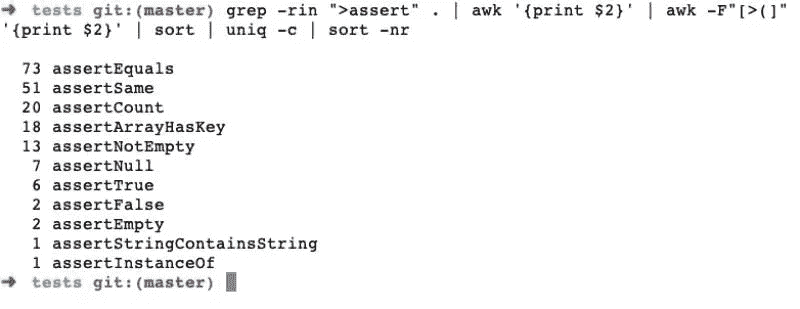
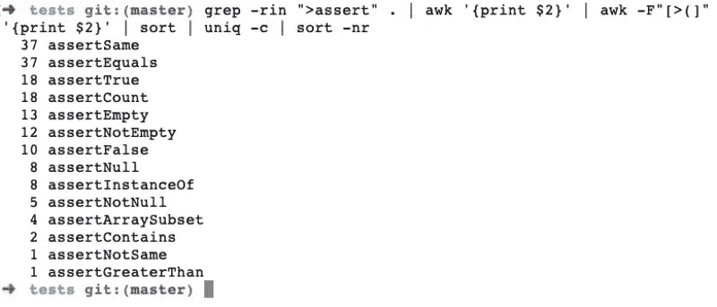
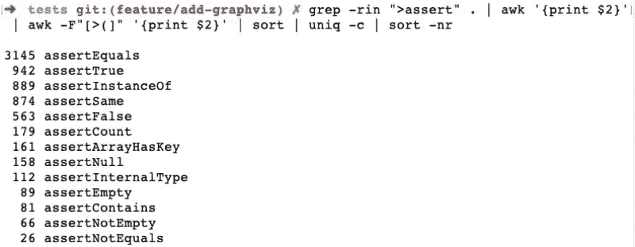

# 今天你应该开始使用的 5 个有用的 PHPUnit 断言

> 原文：<https://itnext.io/phpunit-assertions-fabd4b16df38?source=collection_archive---------4----------------------->

[本](https://unsplash.com/@benofthenorth?utm_source=unsplash&utm_medium=referral&utm_content=creditCopyText)在 [Unsplash](https://unsplash.com/photos/Bj6ENZDMSDY?utm_source=unsplash&utm_medium=referral&utm_content=creditCopyText) 上拍照

PHPUnit 击败竞争对手已经超过 5 年了。通过使用正确的 PHPUnit 断言，您可以从 PHPUnit 中获得最大的好处。在本帖中，我们将研究一些流行且非常有用的 PHPUnit 断言，您应该在日常的 PHPUnit 测试中使用它们。让我们开始吧！

# 需要了解的 PHPUnit 断言

目前，PHPUnit 处于版本 [9.5](https://github.com/sebastianbergmann/phpunit/releases/tag/9.5.0) 。根据最新的[文档](https://phpunit.readthedocs.io/en/9.5/assertions.html)，有 60 个 assert 方法可以在 PHPUnit 测试中使用。

> *这些 PHPUnit 断言的范围从检查* [*数组是否有键*](https://phpunit.readthedocs.io/en/9.5/assertions.html#assertarrayhaskey) *到一直流行的* [*断言等于*](https://phpunit.readthedocs.io/en/9.5/assertions.html#assertequals) *到不那么广泛使用的* [*XML 字符串比较*](https://phpunit.readthedocs.io/en/9.5/assertions.html#assertxmlstringequalsxmlstring) *PHPUnit 断言。*

# 分析 PHPUnit 断言在小型、中型和大型项目中的使用

为了了解在我过去几年参与的项目中哪些 PHPUnit 断言使用得最多，我运行了以下命令:

> *上面的命令应该运行在你的* `*tests*` *文件夹中。它主要在代码中寻找* `*>assert**` *并对它们进行排序，然后统计唯一出现的次数，并在出现次数最多的末尾再次排序。*

我将采取三个项目，一个小的，第二个中型的，第三个是大型的。规模不仅仅是代码，还包括项目中测试和断言的数量。

> *这些项目是用 Symfony 和另一个框架构建的。其中两个是 REST APIs，其中一个大的也有用户界面。*

# 带有 PHPUnit 断言的小项目

用 Symfony 作为 REST API 构建的小项目只有 104 个测试和 306 个 PHPUnit 断言。在该项目的 tests 文件夹上执行上述命令时，会产生以下输出:

> *我们可以看到，这个项目中使用最多的 PHPUnit 断言是* `*assertEquals*` *，它被使用了 73 次。*

之后，`assertSame`在这个相对较小的项目中使用了 51 次。这意味着这个项目几乎四分之一的 PHPUnit 断言是`assertEquals`。

# PHPUnit 断言理事会的中型项目

用 Symfony(一个 REST API)构建的中型项目有 221 个测试和 472 个 PHPUnit 断言。上面的命令在它的 tests 目录下运行时看起来如下:

> *我们可以清楚的看到* `*assertSame*` *和* `*assertEquals*` *在这个小项目中使用次数最多，各有 37 次。*

断言的数量加起来不到 221，因为在这些测试中使用了大量的 [PHPUnit 数据提供者](https://geshan.com.np/blog/2014/02/using-phpunit-data-provider-for-less/)。

尽管如此，`assertSame`和`assertEquals`仍然占据了这个项目中使用的断言的 16%。最近，我们将代码覆盖驱动从 Xdebug 改为 PCov。这使得测试覆盖更快。如果你感兴趣，我过去也在 Laravel 中写过关于[单元测试的博客。](https://geshan.com.np/blog/2015/07/getting-started-with-unit-testing-in-laravel/)

# 一个计算 PHPUnit 断言的大项目

接下来是大型项目，它既有 API 又有用户界面。它有单元测试和一些集成测试。这个项目有多达 5824 个测试和 13975 个 PHPUnit 断言。当我们在这个项目的 tests 文件夹上运行上面的 PHPUnit 断言计数器命令时，它会产生:

> *即使在这里，* `*assertEquals*` *仍然是使用最多的 PHPUnit 断言，出现了 3145 次。*

这占测试套件中所有断言的 22.5%。接下来是被使用了 942 次的`assertTrue`，这使得它获得了 6.74%的份额。让我们看看更多的 PHPUnit 断言，它们非常有帮助，但不是那么明显。

# PHPUnit 断言剖析

PHPUnit 中的断言遵循一种模式，例如，`assertEquals`接受 3 个参数。第一个是`expected`，第二个是`actual`，第三个可选但很重要的是`message`。

> *当测试失败时，打印该消息。*

例如下面的测试:

将导致:

注意`check if 1 is 1`，这些类型的消息将有助于您调试哪些测试没有通过以及如何修复它们。

# 一些你今天必须开始使用的 PHPUnit 断言

过去，我在 60 多种可用的 PHPUnit 断言中使用了许多。以下是其中一些特别有用的方法:

## assertjsonstring equalsjsonstring

这个 PHPUnit 断言在测试 API 的响应时非常方便。您可以使用这个`assertJsonStringEqualsJsonString`断言来检查接收到的 JSON 响应是否符合您的预期。要匹配 JSON 字符串，您可以这样做:

下一个是关于正则表达式匹配的。

## assertMatchesRegularExpression 或 assertRegExp

顾名思义，断言将匹配正则表达式。我发现测试以某事开始或具有已定义模式的错误消息很有帮助。它在 PHPUnit [8.5](https://phpunit.readthedocs.io/en/8.5/assertions.html#assertregexp) 中被称为`assertRegExp`。以下是检查字符串`Exception 40\d` so 40 和任何数字的示例，下面的测试将作为测试字符串`Exception 501`:

下一个是关于弦乐的。

## assertStringContainsString

这也是检查给定字符串是否有另一个字符串的一个非常方便的断言。如果你想忽略字母大小写，你可以使用`assertStringContainsStringIgnoringCase`。`assertStringStartsWith`和`assertStringEndsWith` PHPUnit 断言也非常有用。下面是字符串包含字符串的快速示例:

因此，我们有了非常流行的 assert Equals PHPUnit 断言。

## 资产质量与增量

另一个有用的 PHPUnit 断言是`assertEqualsWithDelta`。当你有一个预期会有一些变化的测试时，这个断言是非常有用的。下面是一个例子:

随后，我们有了一个与 PHP 数组相关的 PHPUnit 断言。

## 阿瑟塔拉·哈斯基

PHPUnit 中的`assertArrayHasKey`断言也很有帮助。如果您使用的数组是返回类型，那么您可以使用该断言在检查值之前检查返回的数组是否有某个键。下面是一个实际 PHPUnit 断言的例子:

你可以在这个[要点](https://gist.github.com/geshan/75153b39e6277dd8ece4048cf1d44ae5)中查看所有 5 个 PHPUnit 断言的例子。

# 结论

您也可以在这个[列表](https://gist.github.com/briankip/35e3506be8b1ecbcf3bb)中找到 PHPUnit 断言的列表。

> *在连接 2 或 3 个 PHPUnit 断言之前，请检查* [*文档*](https://phpunit.readthedocs.io/en/9.5/assertions.html) *中是否有适合您的用例的现有断言。*

根据需要，您还可以编写您的[自定义断言](https://matthiasnoback.nl/2012/02/phpunit-writing-a-custom-assertion/)。PHPUnit 测试快乐！

*原载于*[*https://geshan.com.np*](https://geshan.com.np/blog/2021/01/phpunit-assertions/)