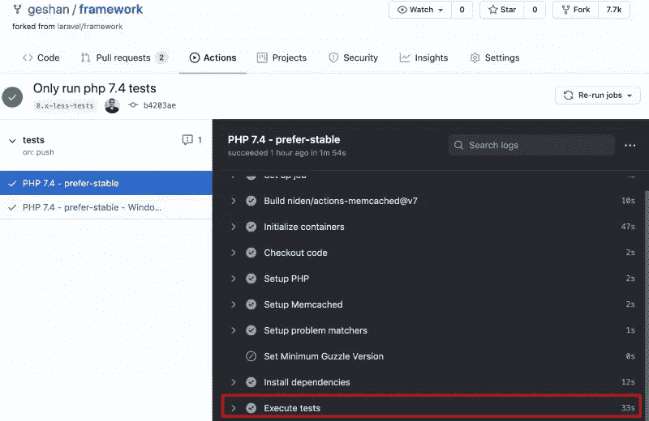
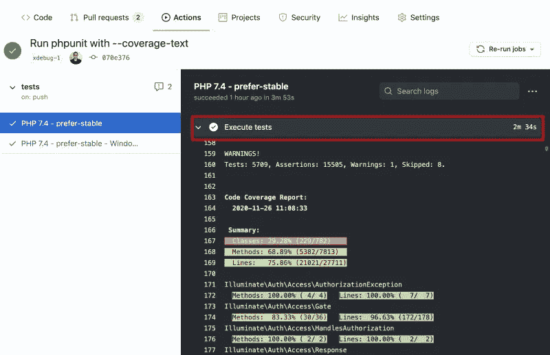
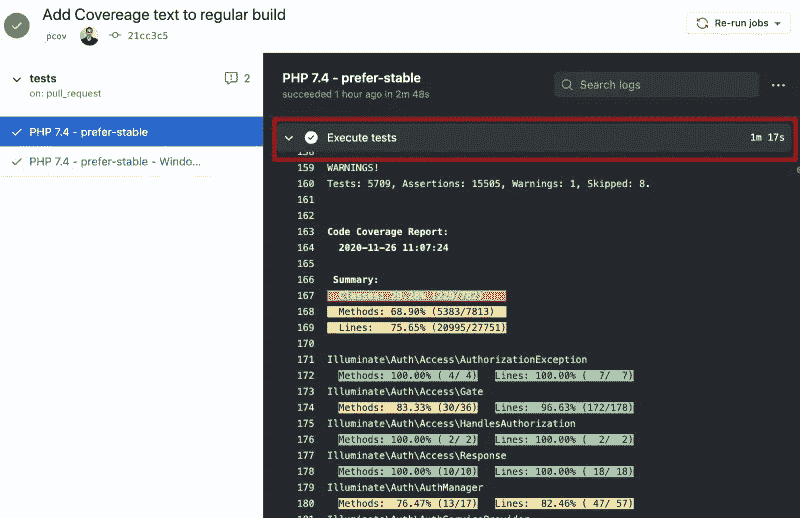
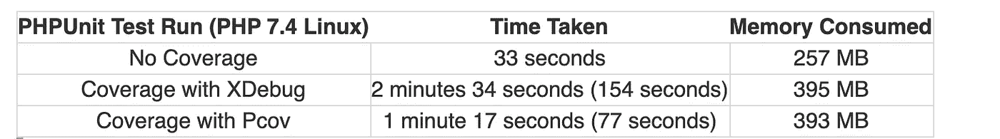

# 如何让 Pcov 的 PHPUnit 代码覆盖率比 Xdebug 快 2 倍以上

> 原文：<https://itnext.io/phpunit-code-coverage-pcov-c21e715f8bf3?source=collection_archive---------1----------------------->

快艇图片由[赫伯特·奥斯特](https://pixabay.com/users/herbert2512-2929941/?utm_source=link-attribution&utm_medium=referral&utm_campaign=image&utm_content=2784250)从[皮克斯拜](https://pixabay.com/?utm_source=link-attribution&utm_medium=referral&utm_campaign=image&utm_content=2784250)拍摄

PHPUnit 是 PHP 事实上的测试库。使用 PCov，您可以将 PHP 7.0+应用程序的 PHPUnit 代码覆盖率提高 2-5 倍。在这篇文章中，我们将比较我在 Laravel 框架测试上做的一个实验的结果。

测试在没有覆盖率的情况下运行，然后是 Xdebug 覆盖率，最后是 PCov all on Github actions。与 Xdebug 相比，PCov 花了一半的时间来运行 PHPUnit 测试，代码覆盖率，让我们来看看数字。

图片由 [Hebi B.](https://pixabay.com/users/422737-422737/?utm_source=link-attribution&utm_medium=referral&utm_campaign=image&utm_content=662191) 发自 [Pixabay](https://pixabay.com/?utm_source=link-attribution&utm_medium=referral&utm_campaign=image&utm_content=662191)

# 节省 CI 构建时间

从长远来看，每次构建节省 12 秒意味着什么？如果你能在每次构建中节省 12 秒，那就相当于在 5 次构建中节省 1 分钟。

> 在仅仅 100 次构建中，你节省了 20 分钟，而在 1000 次构建中，这个数字变成了 3 小时 20 分钟。

想想看，这也能为你的同事节省多少等待时间。

# 用 Pcov 而不是 Xdebug 覆盖 PHP 代码

XDebug 是一个也可以覆盖的调试器。PHPdbg 是 Xdebug 的另一个替代方案。 [PCov](https://github.com/krakjoe/pcov) 是为 PHPUnit 代码覆盖而构建的，不是别的。

[迈克尔·戴瑞达](https://dyrynda.com.au/blog/using-pcov-instead-of-xdebug-for-coverage)也谈到了这个问题，他提到:

> *您可以访问 PHPUnit 可用的相同输出格式(格式化输出、clover、JSON、HTML 等。)没有任何开销。*

他还指出了 Xdebug 的其他问题，比如点击`max_nesting_limit`也是，你也应该看看他的博客帖子。

# PCov 代码覆盖率的注意事项

*   [PCov](https://github.com/krakjoe/pcov) 是一个自包含的 PHP 代码覆盖驱动，适用于 PHP 7 及以上版本
*   PHPUnit 8 及以上版本支持 PCOV 开箱即用，PHPUnit 7 及以下版本需要 [pcov-clobber](https://github.com/krakjoe/pcov-clobber)
*   PCov 在持续集成(CI)环境中非常有意义，因为您不需要在 CI 上调试代码:)

> 为了展示一个真实的场景，我们将在我们的快速实验中看看 Laravel Framework 的 5700+测试和 15500+断言需要多长时间。

让我们开始吧！

# 加快 PHPUnit 代码覆盖率的过程

我选择 Laravel 框架不仅是因为它非常流行，还因为有很多测试，超过 5700 个。在此之上，对于 Laravel 8.x 分支，测试正在运行于 [Github Actions](https://github.com/laravel/framework/actions) 之上。

Laravel 8.x 的测试运行在 PHP 的多个版本上，如 7.3、7.4、8 等最低到稳定的版本。同样的测试也可以在 windows 上运行。

> *选择 Laravel 8.x 的另一个原因是它使用了*[*PHPUnit 9.3*](https://github.com/laravel/framework/blob/8.x/composer.json#L89)*不需要 pcov-clobber 来获得 PHPUnit 覆盖。*

我在过去的博客中写过如何开始在 Laravel 中进行[单元测试，这应该是一个不错的单元测试复习。PHPUnit 的数据提供者](https://geshan.com.np/blog/2015/07/getting-started-with-unit-testing-in-laravel/)也是一个很好的方法，可以编写更少的测试代码，但是可以实现更多的代码覆盖率。

下面是我采取的步骤，以了解 Pcov 在 PHPUnit 代码覆盖率方面比 Xdebug 快多少。

# Fork Laravel/framework repo 并只为 PHP 7.4 运行测试

为了简单起见，我分叉了 Laravel/framework Github[repo](https://github.com/geshan/framework)。之后，我改变了 Github 动作测试工作流程，只在 PHP 7.4 上运行测试，这是当前的稳定版本。您可以看到我在这个[拉动请求](https://github.com/geshan/framework/pull/1/files)中所做的更改。

> *打开 pull 请求运行了没有 PHPUnit 代码覆盖的测试，运行测试花费了* `*33 seconds*` *的内存* `*257MB*` *。*

您可以在这个 [Gitub Actions 页面](https://github.com/geshan/framework/runs/1458355879?check_suite_focus=true)上查看该测试运行的详细信息，下面是一个快速截图。

没有代码覆盖率的 PHPUnit 测试运行

# 用 XDebug 运行 PHPUnit 代码覆盖率

我合并了上面的 pull 请求，只为 PHP 7.4 运行测试。然后，我使用 Xdebug 作为驱动程序，通过代码覆盖运行 PHPUnit 测试。这个改变非常容易，因为 Gitub action 使用了`shivammathur/setup-php@v2` action。在谷歌搜索了一下之后，我发现那个动作有[代码覆盖支持](https://github.com/marketplace/actions/setup-php-action#signal_strength-coverage-support)，并且非常容易启用。

我必须将覆盖范围从`none`更改为`xdebug`，并将`--coverage-text`添加到 PHPUnit 命令中，使其:

我在`tests.yml`文件的两个地方做了这些更改，这导致了这个[拉取请求](https://github.com/geshan/framework/pull/2/files)。新的 pull 请求=在 Github Actions CI 中再次运行的测试。

对于 Xdebug 代码覆盖率，我又运行了几次，看看运行测试所用的时间是否相差很大。大体上是一样的。

> *在运行* [*代码时，用 Xdebug*](https://github.com/geshan/framework/runs/1458520731?check_suite_focus=true) *占用了* `*2 mins 34 seconds*` *并消耗了* `*395 MB*` *的内存。*

我只是在检查`Execute tests`任务的时间。您可以查看下面的截图:

PHPUnit 使用 Xdebug 代码覆盖率运行

代码覆盖率报告如下，使用 Xdebug 的 PHPUnit 代码覆盖率覆盖了 75.65%的行和 68.90%的方法。

# Pcov 的 PHPUnit 代码覆盖率快了 2 倍

现在有了 Xdebug 的`154 seconds`时间，我想看看新的覆盖驱动`Pcov`需要多长时间。为了找到答案，我再次采用了类似的方法，转到 Laravel 8.x 分支，开始编辑`.github/workflows/tests.yml`文件。我将覆盖范围从`none`改为`pcov`，谢天谢地 PHP 动作支持 [PCov](https://github.com/marketplace/actions/setup-php-action#pcov) 。

我所做的更改在这个[拉取请求](https://github.com/geshan/framework/pull/3/files)中。这触发了 Github 上的另一个构建动作。

> *这一次出人意料地只花了* `*1 minute 17 seconds*` *和消耗了* `*393 MB*` *的内存。*

同样，这是针对`Execute tests`任务的，如下所示:

使用 PCov 的 Laravel 框架的 PHPUnit 代码覆盖率

与 Xdebug 相同，PHPUnit 代码覆盖率报告为 PCov 覆盖的行的 75.65%和方法的 68.90%。您可以在我的 Laravel 框架分支的 [Actions 选项卡](https://github.com/geshan/framework/actions)中看到其他测试运行。

# 代码覆盖率的快速比较

让我们快速看一下在有和没有代码覆盖的情况下 PHPUnit 测试用了多长时间:

Xdebug 和 PCov 的快速对照表

> *很明显 Pcov 用了 Xdebug 一半的时间，甚至消耗了更少的内存。Pcov 的 PHPUnit 代码覆盖率用了 77 秒，Xdebug 用了两倍的时间，用了 154 秒。*

在我在 docker 容器中的本地运行中，结果非常不同。对于 Xdebug，这些 Laravel 框架测试耗时 15 分 15 秒(403 MB 内存)，而对于 Pcov 驱动程序，相同的测试耗时 3 分 25 秒(399 MB 内存)。

> *Pcov 在我本地机器的一个* [*docker 容器*](https://github.com/lorisleiva/laravel-docker/blob/master/7.4/Dockerfile) *里面快了 4.43 倍。*

不仅是我，而且 [Swashata Ghosh](https://dev.to/swashata/setup-php-pcov-for-5-times-faster-phpunit-code-coverage-3d9c) 也报告了用 Pcov 代替 Xdebug 的 5 倍代码覆盖率。说到纯数字，我运行了一个测试，Xdebug 用了`17 seconds`, PCov 只用了`1 second`。它快了 17 倍，但这不应该成为比较 Xdebug 和 Pcov 代码覆盖率的标准。

我没有尝试将 PHPDbg 作为一个选项，因为它在`PHP Github action`不可用。如果您想在 Xdebug 和 PCov 之间快速切换，请阅读本[指南](https://localheinz.com/blog/2020/05/16/quickly-switching-between-pcov-and-xdebug/)。

# 结论

PHPUnit 代码覆盖通常与 Xdebug 结合使用。XDebug 有一个问题，代码收敛报告很慢。PCov 是专门为 PHPUnit 代码覆盖率而不是调试而构建的，它使得收集代码覆盖率快得多。

> 如果您想加快代码覆盖率并节省 CI 构建的时间，请使用 Pcov 代替 Xdebug。你一定会喜欢这个过程完成后节省的时间。快乐更快的测试和覆盖报告！

*最初发表于*[*https://geshan.com.np*](https://geshan.com.np/blog/2020/11/phpunit-code-coverage-pcov/)