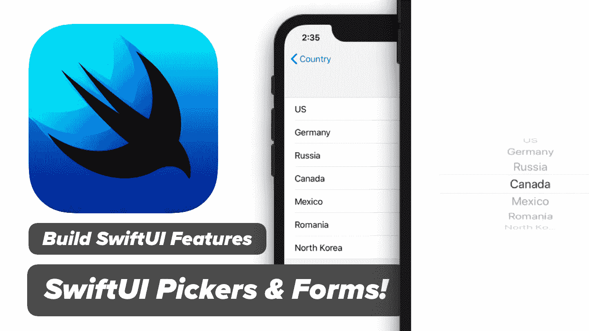
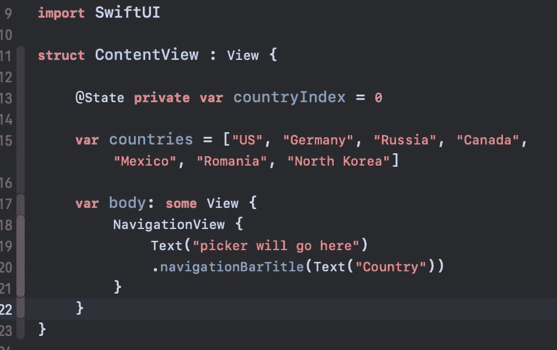
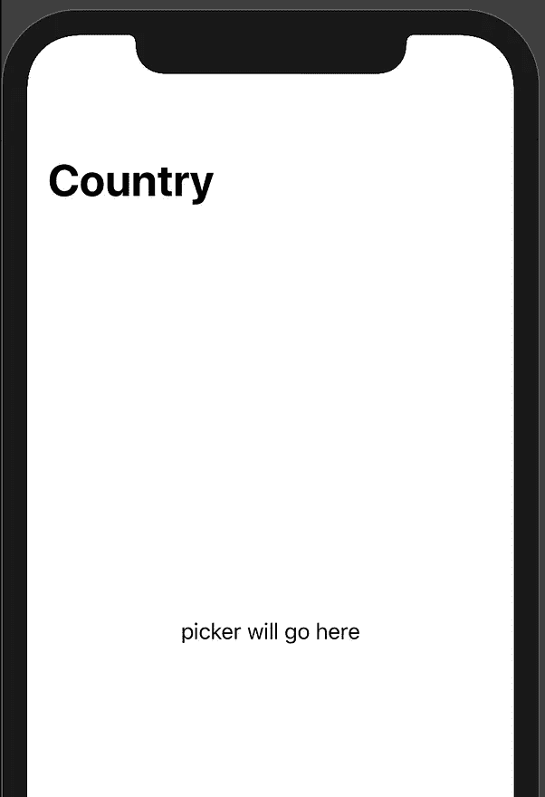
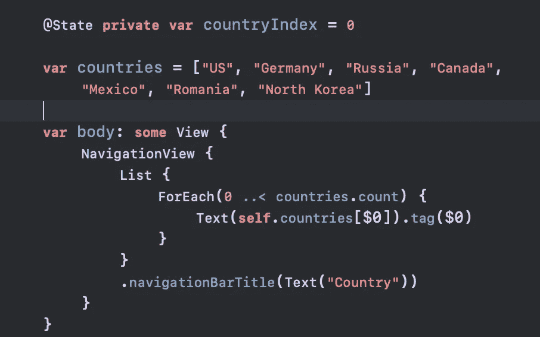
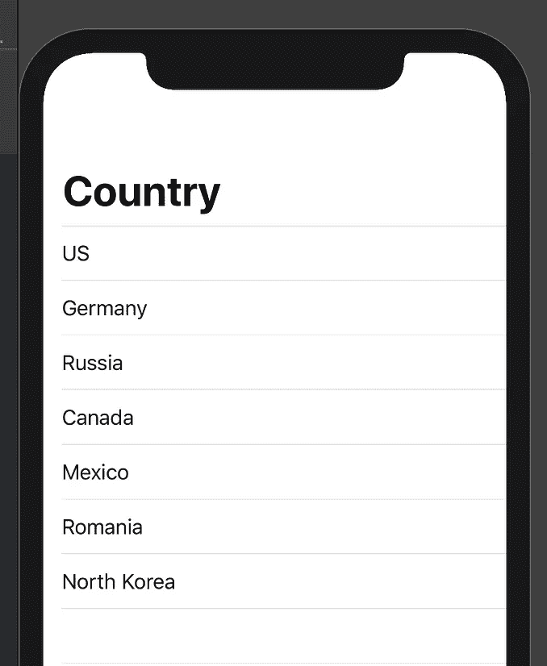
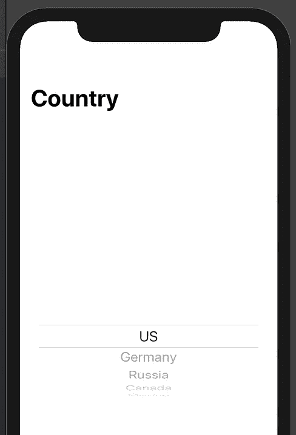
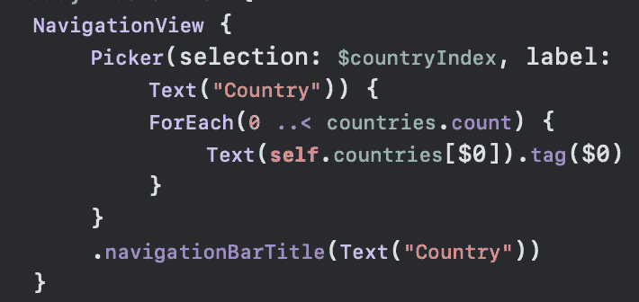
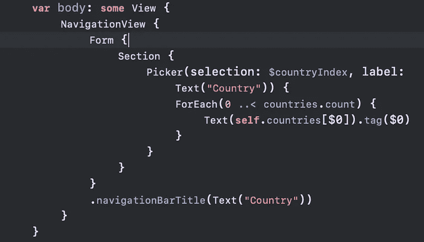
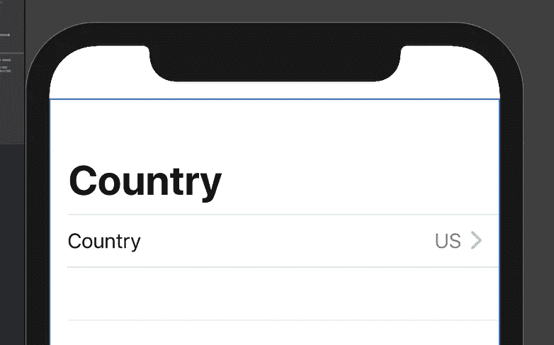
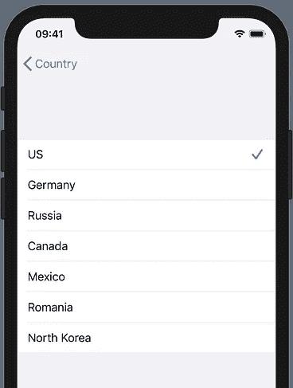

# SwiftUI 中带状态和表单的 Pickers 如何在 SwiftUI 中使用 PickerViews

> 原文：<https://itnext.io/pickers-in-swiftui-with-state-form-how-to-use-pickerviews-in-swiftui-12f235fc38b7?source=collection_archive---------1----------------------->

UIKit 有 UIPickerViews，SwiftUI 有 Pickers。今天我将向您展示如何在 SwiftUI 框架中使用 Swift 5 & Xcode 11 Beta 中的选择器。

我叫**麦克斯韦**，我跑[***maxcodes . io***](https://www.maxcodes.io/)**。很高兴终于见到你了。**

> [点击我观看本指南免费视频讲解。](https://youtu.be/OSxE86BUoOM)

# 步骤 1 —创建您的项目

*   下载最新版本的 Xcode 11 Beta(我运行的是 beta 3)
*   创建单视图应用程序
*   选择“使用 SwiftUI”

# 步骤 2 —创建带有标题的导航视图

替换文本(“hello world！”)以及此处显示的图像中的代码。

*   countryIndex 是我们用来跟踪所选国家的指标
*   Countries 是一个基本字符串数据列表，我们可以用它来填充 SwiftUI 选择器视图
*   一个导航视图来很好地设置我们

这会给你一个坚实的起点

**第 3 步—用列表和 ForEach 列出每个项目**

*   添加列表
*   添加 ForEach 循环以迭代国家
*   创建包含每个列出国家/地区的文本视图

现在我们可以很好地使用 Picker，或者您可能熟悉的 PickerView。

# 步骤 4 —使用选择器，而不是列表

*   删除列表
*   添加选取器-将选择绑定到 countryIndex，这将把所选国家索引与选取器绑定在一起，以便在将来的教程中使用。

恭喜你现在在 SwiftUI 中有了一个 Picker。但是在你为这个故事鼓掌 50 次之前，还有一个可选的步骤。

# 步骤 5 —如何在 SwiftUI 中使用表单

用一个部分和表单包装选取器。一旦你这样做了，你会看到我们现在在一个窗体中有一个国家选择器。非常好的东西！

# 第 6 步—这就是所有人！

如果您想了解更多有关 SwiftUI 的信息，并了解更多有关 SwiftUI 的信息，例如在 SwiftUI 中绘制路径和形状， [***请使用此折扣券查看完整的 SwiftUI 开发课程。***](https://www.udemy.com/swift-ui/?couponCode=MEDIUMDEVELOPERS)

[***发微博给我***](https://twitter.com/maxcodes1) 你的文章和视频请求，我都会满足！

# 谢谢范姆！

我真的很感谢那些观看我的视频，阅读我的文章，参加我的课程的人。

谢谢，

一如既往，我们将在下一段视频中再见。

***-最大***