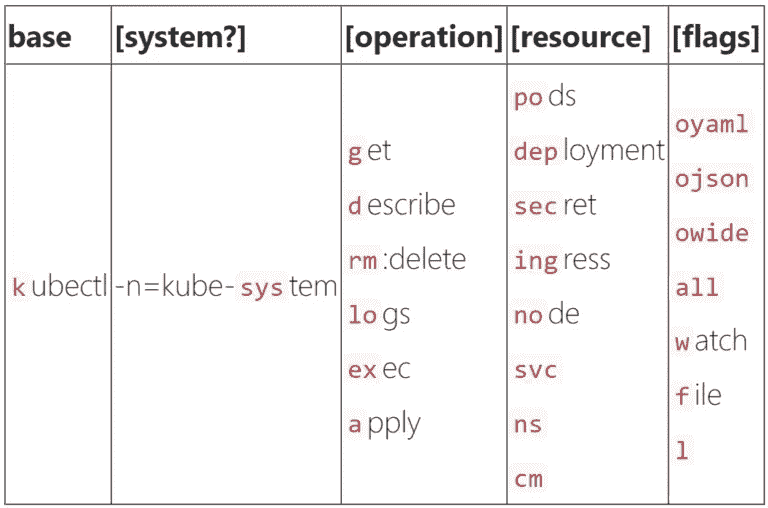
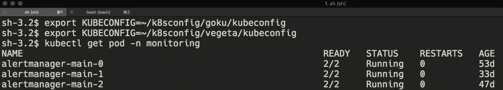
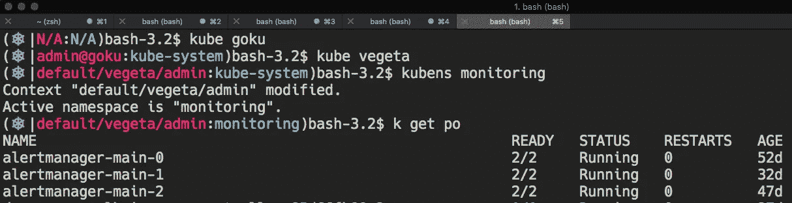
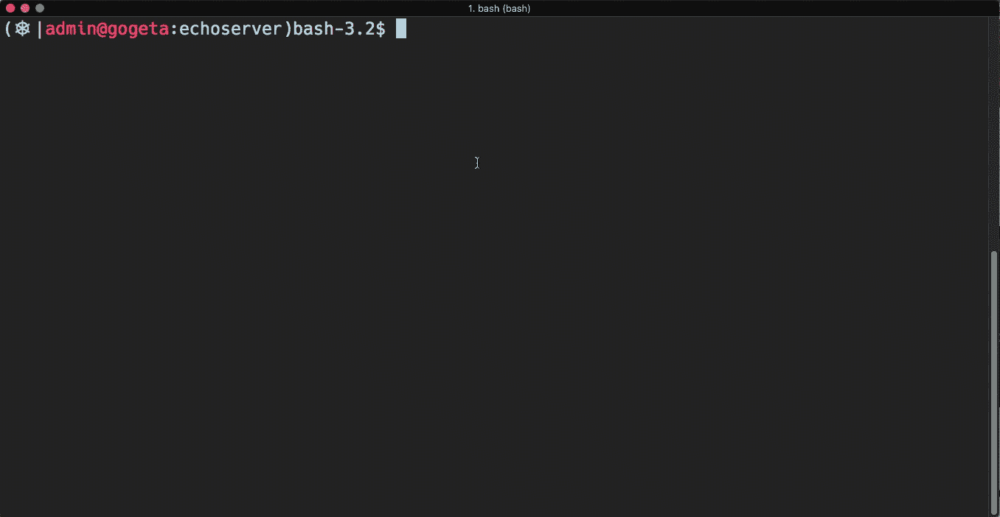
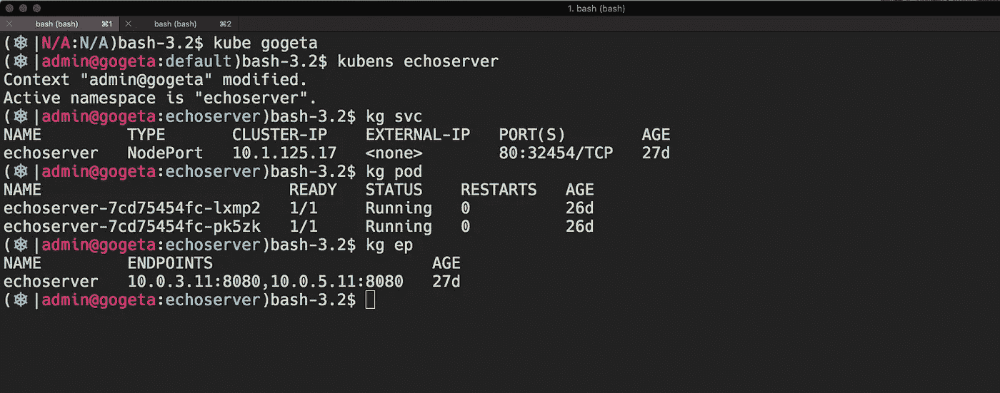

# 拉皮条我的 Kubernetes 外壳

> 原文：<https://itnext.io/pimp-my-kubernetes-shell-f144710232a0?source=collection_archive---------1----------------------->


让我们从几个问题开始:

*你是否曾经盯着终端窗口却不记得它是为哪个 Kubernetes 集群设置的？*

*多个 Kubernetes 集群的多个终端窗口怎么样？*

*你是否厌倦了一遍又一遍的输入* `*export KUBECONFIG*` *或者* `*kubectl get pod -n demo*` *命令？*

如果答案是肯定的，请继续阅读，因为我们可以解决这些问题，并使它变得更加有趣！

在我们的环境中，我们总是同时有几个不同的 Kuberenetes 集群，当然有不同的风格:

*   多个 Kubernetes 版本:1.11、1.12 和 1.13
*   不同的网络解决方案:法兰绒、印花布、AWS-VPC-CNI
*   带 iptables 模式的 KubeProxy 与 IPVS 模式
*   KubeProxy IPVS 模式与不同的负载平衡算法:循环，最少连接，最短的预期延迟，等等。
*   常见环境:生产、试运行、QA、开发和 POC

在这些集群之间切换并高效工作可能是一个真正的挑战。很容易忘记哪个终端是为哪个集群建立的。我不得不一直输入`**kubectl cluster-info**`来显示当前的集群名称。

过了一段时间，我真的厌倦了。此外，我懒得一遍又一遍地输入相同的命令。那是我开始推销我的 k8s 外壳的时候。

# 使用 kubectl 别名

```
# Step 1: kubectl has 7 characters, make it 1
alias k=kubectl# Step 2: follow your own preferred way
alias kg='kubectl get'
alias kl='kubectl logs '
alias kx='kubectl exec -i -t'
...
```

你可以开始发挥真正的创造力，让它完全按照你自己的风格定制。这是 Ahmet Alp Balkan 的文章中的一个很好的例子，他的别名命名约定如下。我以此为模板，并根据自己的系统和习惯进行了调整。



来自 Ahmet 的 kubectl-alias 约定

# 导出 KUBECONFIG 又慢又无聊

```
# Save this in bash.rc or zsh.rc, update the file path if needed. 
# **Usage: kube clusterA**kube() { export KUBECONFIG=~/k8sconfig/${1}/kubeconfig}
```

# 安装这款 K8S 荧光笔，看看不同之处

之前: ***我在哪里集群？***



之后: ***我在*** `***goku***` ***集群中以*** `***kube-system***` ***为*** `***admin***`



如上所示，集群名称和名称空间都显示并突出显示，非常直观。这个插件叫做 *kube-ps1* ，可以在[这里](https://github.com/jonmosco/kube-ps1)找到。

# 停止在每个命令中键入名称空间

通过让我们的终端*记住*当前的名称空间，我们可以节省更多的输入。这里有两个方便的辅助工具: *kubens* 和 *kubectl change-ns plugin* 。挑你最喜欢的。

kubens 可以和 kubectx 一起安装，这个[包](https://github.com/ahmetb/kubectx)捆绑了两个二进制文件。如果你想让它更有趣，更有互动性，可以试试安装 [fzf](https://github.com/junegunn/fzf) 。从下面的演示中，您可以看到它可以与 kubectx 和 kubens 无缝协作。



如果在同一个 k8s `kubeconfig`文件中有多个上下文，kubectx 会很方便。
在我的例子中，每个集群只有一个上下文，即`admin@${*cluster}.*`来不断地在不同的集群之间切换，`kube ${cluster}`非常有用。

还有另外一个叫做 *change-ns* 的 *kubectl 插件*也可以达到同样的目的。如果你已经在使用 [krew](https://github.com/GoogleContainerTools/krew) 来管理你的 kubectl 插件，它可以很容易地安装。

```
kubectl krew install change-ns
```

# 概述



我的常见用法

上面这张图片展示了我的一些常见用法:

*   首先，使用`kube`选择一个集群或切换到不同的集群
*   第二，使用`kubens`或`change-ns`来选择一个命名空间；如果愿意，使用交互模式。
*   使用 kubectl alias `kg` 来获取服务、pod 和端点

就这些，希望这有助于节省您的一些打字时间，并使它更愉快地在终端中与 Kubernetes 交互。

PS:以防你想知道，我使用的集群名称来自于[龙珠](https://en.wikipedia.org/wiki/List_of_Dragon_Ball_characters)字符。

# 参考

[https://github.com/ahmetb/kubectx](https://github.com/ahmetb/kubectx)
[https://github.com/jonmosco/kube-ps1](https://github.com/jonmosco/kube-ps1)
[https://github.com/GoogleContainerTools/krew](https://github.com/GoogleContainerTools/krew)
https://ahmet.im/blog/kubectl-aliases/