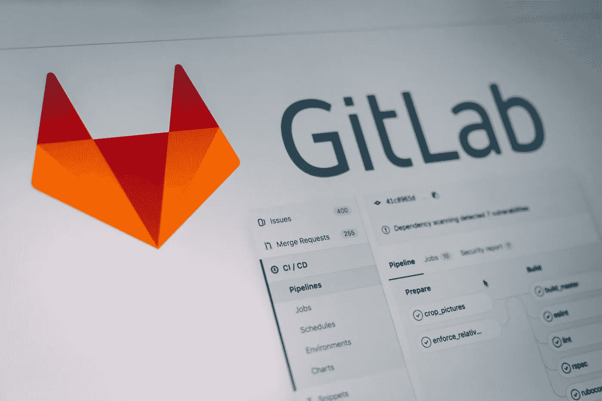
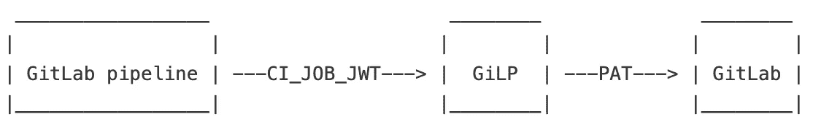

# 为您的 GitLab 管道权限拉皮条

> 原文：<https://itnext.io/pimp-your-gitlab-pipeline-permissions-ffdd27be5e1d?source=collection_archive---------2----------------------->

潘卡杰·帕特尔在 [Unsplash](https://unsplash.com/s/photos/gitlab?utm_source=unsplash&utm_medium=referral&utm_content=creditCopyText) 上的照片

让我们假设您有一个更改存储库的 GitLab CI/CD 管道。或者，您可能希望充分利用对 GitLab API 的访问权限。有哪些选择？

## 选项 1:使用个人访问令牌(PAT)

您可以创建一个[个人访问令牌](https://docs.gitlab.com/ee/user/profile/personal_access_tokens.html)，并将其定义为一个定制的环境变量。你可以把它放在*里。gitlab-ci.yml，*但是这将是错误的选择，因为您的令牌不受保护。另一个选项是[在 UI](https://docs.gitlab.com/ee/ci/variables/#create-a-custom-variable-in-the-ui) 中定义变量，可以限制使用受保护的分支并屏蔽作业日志中的输出。

这种方法有两个缺点。首先，个人访问令牌是个人的，所有审计跟踪都将绑定到这个特定的用户，隐藏了有效的用户。其次，您的令牌可能会泄露给其他用户。即使您屏蔽了变量，也很容易暴露令牌的内容。

作为子变体，您可以使用一个[项目访问令牌](https://docs.gitlab.com/ee/user/project/settings/project_access_tokens.html)。尽管没有绑定到个人用户，这些令牌仅限于自托管 GitLab 实例和付费 SaaS 计划。另外，令牌仍然可能会泄漏。

## 选项 2:使用 CI 作业令牌

GitLab 为每个 CI 作业生成一个令牌，并将其放入一个[预定义变量](https://docs.gitlab.com/ee/ci/variables/predefined_variables.html):

> *CI_JOB_TOKEN:* 与[某些 API 端点](https://docs.gitlab.com/ee/api/README.html#gitlab-cicd-job-token)进行认证的令牌。只要作业正在运行，令牌就有效。

出于安全原因，您只允许使用 GitLab API 的子集，例如从 GitLab 包或容器注册表中读取、获取作业工件、触发管道以及创建发布。但是，您不能访问存储库或使用 API 的其他部分。

请注意，CI 作业令牌与触发管道的用户具有相同的权限，并且令牌在作业结束后过期。

有一个[提议](https://gitlab.com/groups/gitlab-org/-/epics/3559)重新设计这个特性，留给我们最后一个选择。

## 选项 3:利用 CI 职位 JWT

GitLab 为每个作业生成另一个令牌，它也是一个预定义的变量:

> *CI_JOB_JWT:* 一个 RS256 JSON web token (JWT)，用于与支持 JWT 认证的第三方系统进行认证，例如 [HashiCorp 的 Vault](https://docs.gitlab.com/ee/ci/secrets/index.html) 。

不幸的是，GitLab 只创建 JWT，但是你不能用它进行 GitLab 的认证。为此，我编写了一个小型 GitLab 代理(称为 GiLP ),它接受对 Git 和 API 资源的 HTTP 请求，支持使用 *CI_JOB_JWT* 进行身份验证，并使用个人访问令牌代表管道与 GitLab 进行通信:

GitLab 代理的基本功能( [GiLP](https://gitlab.com/johanngyger/gilp) )

你可以在这里找到吉尔普的所有细节:[https://gitlab.com/johanngyger/gilp](https://gitlab.com/johanngyger/gilp/)。

GiLP 的主要优点是 PAT 不会泄漏。此外，您可以审计对 GiLP 的所有请求，如果您知道如何对 Go 进行编程，那么根据您组织的需求调整权限模型是非常容易的。

缺点是您必须部署和维护一个单独的组件。GiLP 在 Google Cloud Run 或 Azure Container Instances (ACI)上运行得非常好。参见我的另一篇博文[如何为自动 HTTPS](/automatic-https-with-azure-container-instances-aci-4c4c8b03e8c9) 提供 ACI。

## 结论

GitLab 管道权限有些痛苦，希望很快能有一个可持续的解决方案。吉尔普同时也是你的朋友！