# 在 Azure DevOps 中创建管道

> 原文：<https://itnext.io/pipeline-creation-in-azure-devops-6e9c7a843cfc?source=collection_archive---------6----------------------->

这篇文章将介绍如何在 Azure DevOps 中创建新的构建管道。这篇文章将坚持一个非常简单的例子，我们将在以后的文章中继续讨论。如果你不熟悉这个系列的文章，看看相关的文章。

【Azure DevOps 入门


这篇文章将全部来自 [Azure DevOps](https://dev.azure.com/) 网站，所以登录你的账户，选择你将参与的项目，然后继续。此示例使用的项目名为 Playground。

## 管道创建

从网站右边的项目菜单中点击**管道**选项。

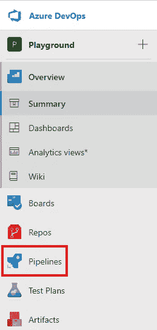

由于我们的示例项目没有任何管道设置，我们将看到一个登录页面，告诉我们创建一个新的管道。一旦你有了一些管道，这个页面就有用多了。点击**创建管道**按钮继续。

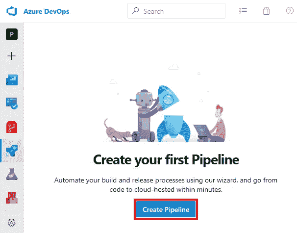

下一步是选择我们的代码存储在哪里。对于这个示例，代码在一个 **Azure Repo Git** 存储库中，但是正如你所看到的，Azure DevOps 对于你的代码存储在哪里是相当开放的。正如你从截图中看到的，有一堆基于 YAML 的选项和一个非常小的使用经典编辑器的选项。经典编辑器更容易上手，但是 YAML 选项得到了微软的最大关注，并且具有与您的源代码一起存储在 Git 中的优势，所以我建议使用 YAML 选项，尽管这需要更多的学习曲线。

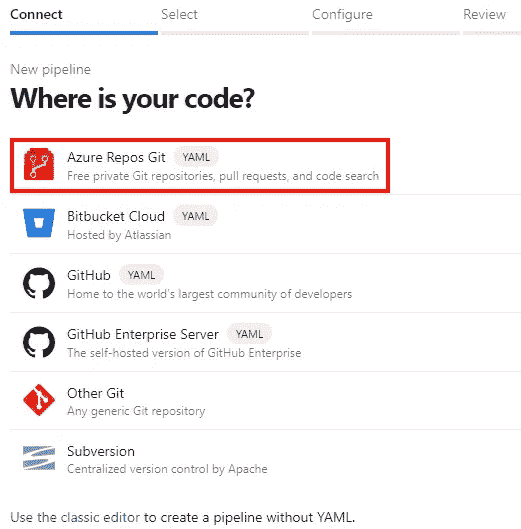

接下来，选择此管道用于的回购。

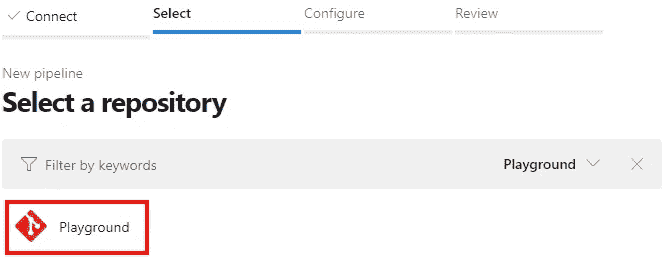

在下一个步骤 Configure 中，您会看到一个模板列表，当您刚接触 yaml 时，可以从中选择真正有用的模板。我们的示例应用程序是 ASP.NET 内核，因此单击**显示更多**按钮，然后单击**ASP.NET 内核**。正如你从截图中看到的，Azure DevOps 可以构建任何东西，并且不限于基于微软的技术。

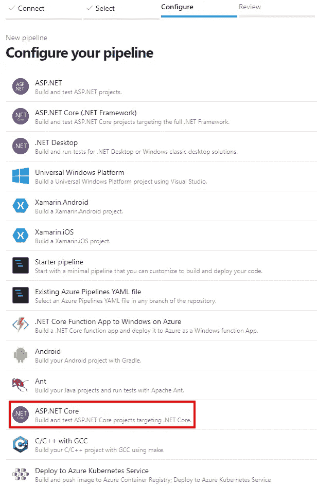

结果是下面的 YAML 文件。在这一点上，我们不会深入到 YAML 正在做的事情的细节中去，而是采用默认设置。继续点击**保存并运行**按钮。

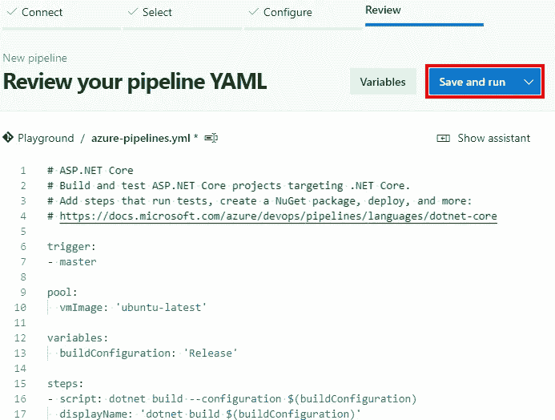

由于 YAML 存储在回购中，保存过程实际上是向分支提交。单击提交对话框上的**保存并运行**按钮，它会将 YAML 文件保存到您的分支并运行管道。

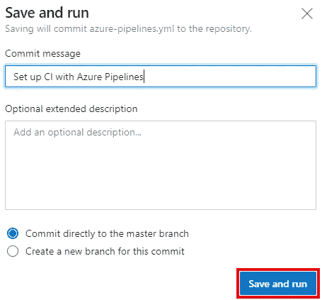

## 管道结果

以下是管道运行的结果，结果表明管道已经失败。如果您单击突出显示的错误，将会转到管道的详细日志，这些日志通常会很好地说明管道失败的原因。

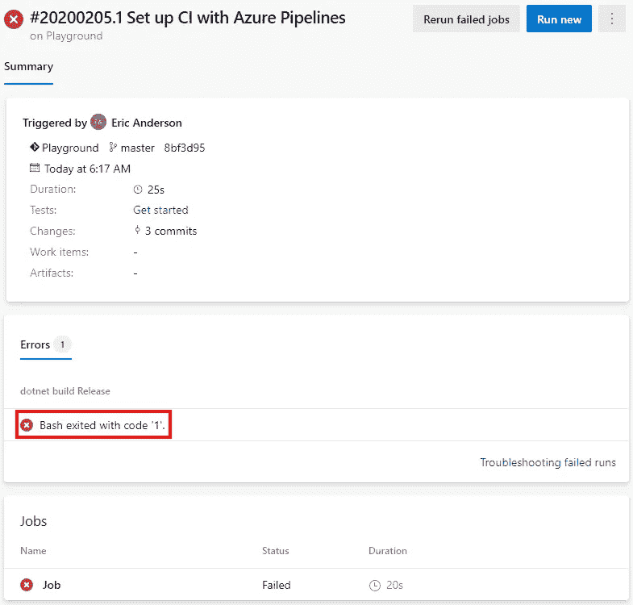

以下截图是点击错误的结果。如您所见，它提供了 build 命令的输出。

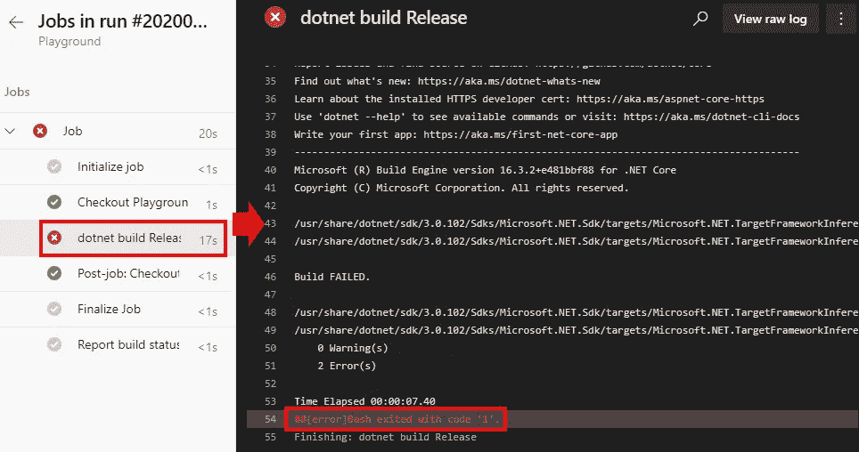

在这种情况下，第 43 行向我们提供了构建失败的原因。以下是截图截掉以来的全行。在这种情况下，问题是运行构建的代理没有。安装了 NET Core 3.1。

> usr/share/dot net/SDK/3 . 0 . 102/Sdks/Microsoft。NET.Sdk/targets/Microsoft.目标(127，5):错误 NETSDK1045:当前。NET SDK 不支持目标定位。网芯 3.1。任何一个目标。NET Core 3.0 或更低版本，或者使用。支持的. NET SDK。网芯 3.1。[/home/vsts/work/1/s/src/web app 1/web app 1 . csproj]

## 修理管道

单击浏览器中的后退按钮，返回到管道结果页面。点击结果页面右上角的三个点，并选择**编辑管道**。这将打开一个编辑，并为构建打开 YAML。

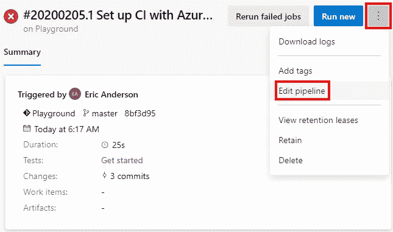

使用屏幕右侧的**任务**助手，我们将选择**用途。NET Core** 任务，它将允许我们安装。NET 核心我们需要建立我们的应用程序。

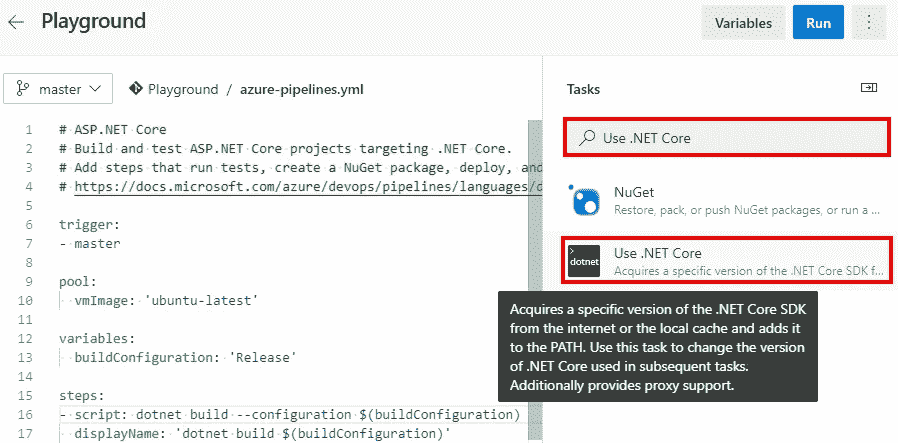

输入的版本。NET Core，在本例中是 3.1，然后点击 add。

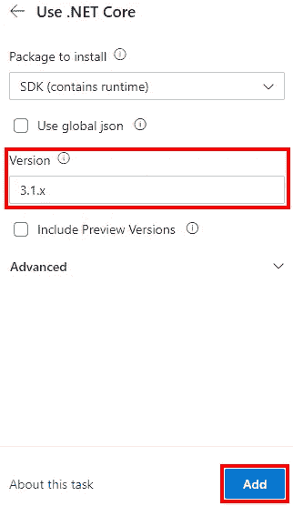

以下是由此产生的 YAML。请注意，上面的助手不是必需的，如果您愿意，您可以手动编辑 YAML。

```
trigger:
- master

pool:
  vmImage: 'ubuntu-latest'

variables:
  buildConfiguration: 'Release'

steps:
- task: UseDotNet@2
  inputs:
    packageType: 'sdk'
    version: '3.1.x'

- script: dotnet build --configuration $(buildConfiguration)
  displayName: 'dotnet build $(buildConfiguration)'
```

点击页面右上角的**保存**按钮，输入提交消息，然后点击页面右下角的**保存**按钮。这将使您返回到 YAML 的编辑屏幕。点击页面右上角的**运行**按钮，启动管道。

这一轮(对于示例应用程序)管道将会成功。

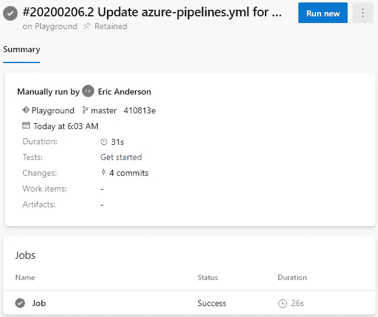

## 包扎

希望这能给你一个很好的起点来构建你的第一个 Azure DevOps 管道。我将在以后的文章中深入探讨其中的一些。

*最初发表于* [*埃里克·安德森*](https://elanderson.net/2020/03/pipeline-creation-in-azure-devops/) *。*