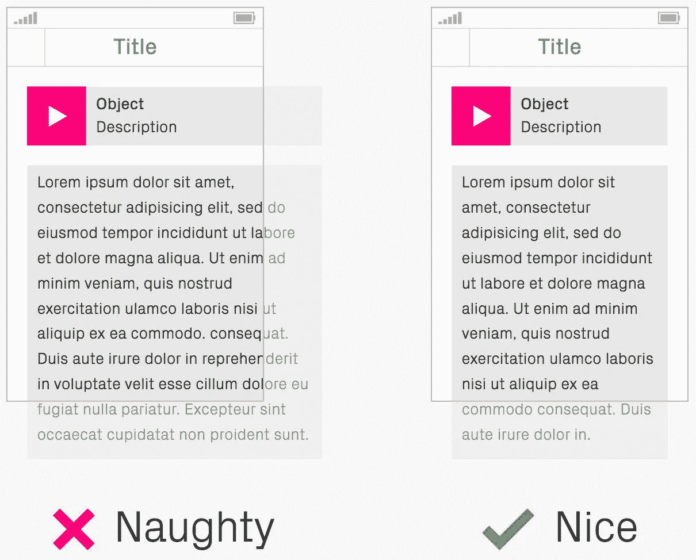
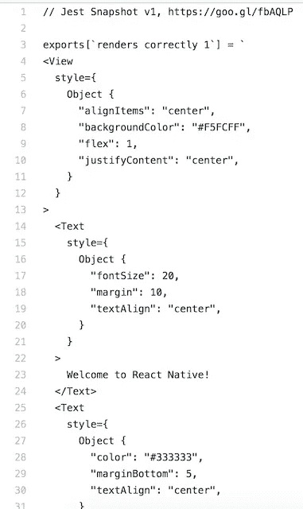
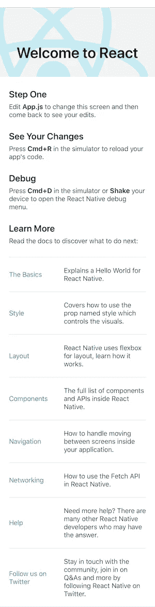
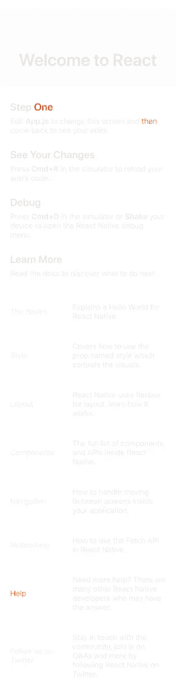

# React Native 中的像素问题或简单 UI 截图测试

> 原文：<https://itnext.io/pixels-matter-or-easy-ui-screenshot-testing-in-react-native-36c774cee3d1?source=collection_archive---------4----------------------->


开发任何应用程序都需要大量的知识、努力、时间，当然还有测试。但是一旦你的产品到达客户手中，你的代码组织得有多好，你有多少单元测试，或者你集成了哪些革命性的框架或库，都没有关系。客户首先看到的是你的应用程序的用户界面，这极大地影响了他们对你的应用程序的第一印象和总体看法。谁知道呢，他们可能会不喜欢你的应用程序，甚至离开你的应用程序，永远不再回来，或者你在应用程序商店获得的星星比预期的少。这就是为什么你的应用程序必须是像素完美的，应该总是看上去一模一样。你只有一次机会来打动你的顾客。

在这篇文章中，你会发现对 [pixels-catcher](https://www.npmjs.com/package/pixels-catcher) 项目的介绍，该项目可以应用于任何 React 本地应用程序，并使你能够对任何屏幕或组件进行 UI 快照测试。此外，如果它与 [CI](https://en.wikipedia.org/wiki/Continuous_integration) 集成，它将能够自动检查屏幕质量，并验证应用程序是否像素完美，是否符合预定义的用户界面预期。

# 截屏

毫无疑问，你已经知道“像素完美”是什么意思，但如果你需要刷新你的知识，你可以在这里找到一个很好的例子:[像素完美精度手册](http://cdn.ustwo.com/PPP/PP3.pdf)。你会注意到大部分内容只是简单地比较图像，就像这样:



这是一个很好的例子，说明了截图测试是什么以及它为什么有用。因此，在图片的右侧是参考图像或设计，而在左侧，您可以看到由您的应用程序呈现的实际实现的结果。在这种情况下，很容易发现差异，并很快理解特性还没有准备好，或者引入的更改破坏了预期的布局。也可能发生这样的情况，一个 UI 解决方案在一个平台上工作正常，但在另一个平台上表现不同。

作为截图的替代方法，您可能已经使用 [jest](https://jestjs.io/) 进行单元测试，这是测试您的应用程序代码的强大框架。它的一种可能性是捕获组件当前状态的快照，并使用引用快照创建一个 diff。但是看最初的[快照](https://github.com/facebook/jest/blob/master/examples/react-native/__tests__/__snapshots__/intro.test.js.snap):



你不知道这实际上是如何在你的应用程序中呈现的，在小屏幕或大屏幕上，在 Android 或 iOS 上，等等。因此，您需要深入研究快照和源代码，运行应用程序来检查和了解实际发生了什么变化，组件是如何使用的，应用了哪些属性，更重要的是，手动确认它在不同设备上的呈现方式。

# UI 测试的好处

乍一看，你可能会认为开发应用程序和集成[像素捕捉器](https://www.npmjs.com/package/pixels-catcher)项目需要更多时间，因此你不会得到任何好处。但是，让我们来看看在开发过程中您能获得什么:

## 初始实施

新功能或完整应用程序的开发通常包括以下几个阶段:

*   设计和开发
*   测试(单元测试、手册等。)
*   代码审查
*   批准
*   等等。

引入可视化 UI 测试意味着每次你交付一个特性，比如一个新的屏幕或者一个组件，你也需要编写测试来呈现不同状态、大小甚至不同平台上的屏幕/组件。这种测试的输出将是参考图像，这意味着:

*   UI 设计人员可以快速检查图像，并提供关于实现的反馈，验证它是否符合预期。
*   另一个开发人员/审核人员可以使用该图像作为第一步来验证拉/合并请求是否准备好接受审核，并直观地了解变更的结果。这意味着如果屏幕没有准备好，就不需要编译项目和运行应用程序。
*   即使对开发人员来说也有好处，因为在不同的设备上运行可视化 UI 测试后，很容易得到所有设备的结果，因此减少了人工工作量，而不会降低应用程序的质量。

## 重构

设想一个需要重构的现有应用程序或组件。这可能是更改模型、数据层、提高性能等的请求。并且可能在这个阶段项目已经包含了一些`e2e`、`unit`或者其他测试。根据不同的变化，有可能所有相关的测试和实现代码都需要一些重构。唯一不变的是 UI 表示。在这种情况下，给定通过参考图像引入的屏幕截图和定义的 UI 状态，所有这些参考图像应该保持不变。这意味着即使快照测试本身需要更改，生成的快照映像也应该保持不变。因此，这提供了很大的信心，用户界面中没有任何东西被破坏，客户不会注意到变化。

在另一种情况下，可能需要一个确实影响 UI 的更改。假设应用程序中有一些全局定义的字体大小，例如`h1`、`h2`等。并且要求改变`h2`字体的大小。这一变化预计将反映在所有应用程序组件/屏幕中，因为全局字体应在任何地方重复使用以保持一致性。在这种情况下，对所有屏幕和组件进行截图测试可以突出引入的差异。这基本上意味着，当一些测试在第一次运行后没有失败时，它们显然不使用这种字体大小。如果使用了一些自定义字体而不是预定义字体，或者 UI 在屏幕/组件之间不一致，就会出现这种情况。作为您的更改的最终结果，所有更新的参考图像应该出现在合并/拉取请求中，并且将可用于更好的代码审查。

## 发展

即使在应用程序、屏幕或组件的开发过程中，也有很多好处。一个例子是当你有一个组件需要用不同的内容进行测试时；它可以是一些长或短的文本，不同的空白/填充等。在这种情况下，进行屏幕截图测试的好处是，一旦你写好了，就有可能在不同的设备(包括大小和平台)上用不同的内容多次触发测试。

另一个很好的例子是本地化的实现。假设应用程序必须支持几种语言，比方说五种，这意味着开发人员必须改变语言并运行应用程序至少 5 次。但是考虑到支持 android 和 iOS 平台，并且至少需要测试一个小型和大型设备，因此将导致(5 种语言)* (2 个平台)* (2 个屏幕大小)= 20 次测试。如果您还需要在中等大小的设备上进行测试，情况会变得更糟；这导致(5 种语言)* (2 种平台)* (3 种屏幕尺寸)= 30 次测试或运行。这对开发人员来说太耗费时间和大量的工作。但是在 CI 和/或一些本地脚本的帮助下，所有这些作业都可以自动并行触发。这意味着测试结果将会更快地获得，而且几乎不需要开发人员付出任何努力。

快照测试还有很多有用的用例，但是现在，让我们看看如何使用和集成[像素捕捉器](https://www.npmjs.com/package/pixels-catcher)项目。

# 入门指南

每个项目都有预算和期限，这不是秘密。因此，使用简单而强大的工具会很有用。另一个要点是要有一个透明的工具，没有任何恶意软件，维护良好，对社区贡献开放。幸运的是，[像素捕捉器](https://www.npmjs.com/package/pixels-catcher)符合所有这些标准。

# 要求

[像素捕捉器](https://www.npmjs.com/package/pixels-catcher)项目没有任何特定的要求，可以很容易地集成到任何现有的项目中。此外，由于另一个开源项目 [react-native-save-view](https://www.npmjs.com/package/react-native-save-view) ，在 [pixels-catcher](https://www.npmjs.com/package/pixels-catcher) 项目中使用的解决方案允许“隐藏”所有原生 Android 和 iOS 实现。因此，唯一需要的知识就是 JavaScript。不需要 Java(android)或 swift(iOS)特定体验。这意味着任何 React 本地开发人员都可以使用它。

# 综合

[像素捕捉器](https://www.npmjs.com/package/pixels-catcher)可以通过以下几个步骤集成到项目中:

**将** it 作为 npm 的开发依赖项安装:

```
$ npm install pixels-catcher --save-dev
```

或纱线:

```
$ yarn add --dev pixels-catcher
```

**链接**[react-native-save-view](https://www.npmjs.com/package/react-native-save-view)依赖项(实现原生实现将任意 react 原生元素抓取到 base64 image 的依赖项):

```
$ react-native link react-native-save-view
```

从 [RN 0.60](https://github.com/facebook/react-native/releases/tag/v0.60.0) 开始，不再需要链接— [本机模块现在自动链接](https://facebook.github.io/react-native/blog/2019/07/03/version-60)。

**在`package.json`中配置** it，用以下属性定义一个新的`PixelsCatcher`属性:

```
"PixelsCatcher": {
  "activityName" : "ACTIVITY_NAME",
  "apkFile"      : "PATH_TO_APK_FILE",
  "emulatorName" : "EMULATOR_NAME",
  "packageName"  : "ANDROID_PACKAGE_NAME",
  "snapshotsPath": "PATH_TO_SNAPSHOTS_FILES"
}
```

或者，您可以创建一个`[pixels-catcher.json](https://github.com/rumax/react-native-PixelsCatcher/blob/master/demo/pixels-catcher.json)`文件并在那里配置您的选项。

## 添加测试

有一些可用的导入:

```
import {
  registerSnapshot,
  runSnapshots,
  Snapshot,
} from 'pixels-catcher';
```

其中`Snapshot`是快照的“抽象”类。它需要实现`renderContent`方法(*是呈现*的替代方法)，该方法应该呈现将被测试的所需组件或页面。和静态属性 snapshotName，它定义了`screenshot`的名称，并对应于参考图像的名称。

因此，在一个基本的 react 本地项目中，快照的实现应该如下所示:

```
class AppSnapshot extends Snapshot<*, *> {
  static snapshotName = 'AppSnapshot';renderContent() {
    return <App />;
  }
}
```

快照可以注册到:

```
registerSnapshot(AppSnapshot);
```

同样，可以测试任何 React 本地组件:

```
registerSnapshot(class AppSnapshot extends Snapshot<*, *> {
  static snapshotName = 'Page';renderContent() {
    return <Page />;
  }
});registerSnapshot(class AppSnapshot extends Snapshot<*, *> {
  static snapshotName = 'Footer';renderContent() {
    return <Footer />;
  }
});
```

注册所有必需的快照后，最后一步是运行所有快照:

```
runSnapshots(PUT_YOUR_APP_NAME_HERE);
```

这就是集成和编写屏幕截图测试所需的全部内容。

## 运行测试

要运行测试，可以修改`index.js`文件的内容，并且必须注册快照，而不是`App`组件:

```
import { AppRegistry } from 'react-native';
import App from './App';
const useSnapshotTest = true;
if (! useSnapshotTest) {
  AppRegistry.registerComponent('app', () => App);
} else {
  require('./indexSnapshot');
}
```

其中所有快照都在`indexSnapshot.js`文件中实现。

注册和运行快照的另一种方法是将`indexSnapshot.js`文件指定为入口文件。如果你需要更多这方面的信息，你可以查看[演示项目](https://github.com/rumax/react-native-PixelsCatcher/tree/master/demo)项目。

之后，启动服务器:

```
./node_modules/.bin/pixels-catcher dev
```

使用`react-native run-ios`或`react-native run-android`命令照常运行应用程序。

一旦应用程序启动，所有的快照将被一个接一个地渲染，结果将被报告给本地服务器，使用捕获图像的`base64`数据。最终报告将打印到控制台，所有结果将存储到`PixelsCatcher.snapshotsPath`中指定的文件夹，其中:

*   `uploads` -是实际结果
*   `refImages` -是你的参考图片
*   `diffs` -是差异，用红色像素突出显示

首次运行快照后，所有测试都将失败。这是因为还没有参考图像。要解决这个问题，请检查包含所有结果的`uploads`文件夹。所以在`App`组件的情况下，结果将是:



如果当前结果符合预期，将文件从`uploads`文件夹移动到`refImages`文件夹并重新开始测试。现在所有的考验都将过去。

如果某些测试失败，检查`diffs`文件夹会很有用，其中包含突出显示参考图像和实际结果不匹配的图像。例如，结果可能是:



其中不匹配用红色突出显示(在这种情况下是`One`、`then`和`Help`)。它可以是一种新的颜色，一个改变的尺寸或者它的位置被移动了一点，等等。这就是变化的确切位置，如果这是预期的结果，就必须彻底检查它。使用[像素匹配](https://www.npmjs.com/package/pixelmatch)计算差值。

# 结论


上述解决方案表明，将 [pixels-catcher](https://www.npmjs.com/package/pixels-catcher) 项目与任何现有的 react 原生应用程序集成和使用非常容易，因此可以更好地控制开发流程，在应用程序发布之前对变更更有信心，等等。在 CI 集成的情况下，可以获得额外的检查和快速反馈。但最重要的是，该应用程序将保持像素完美，并将继续吸引用户。

感谢阅读！如果您想尝试一下，您可以查看包含工作示例的[演示项目](https://github.com/rumax/react-native-PixelsCatcher/tree/master/demo)。

*原载于 2019 年 9 月 10 日*[*https://medium.com*](https://medium.com/ing-blog/pixels-matter-or-easy-ui-screenshot-testing-in-react-native-6e41ba91b225)*。*