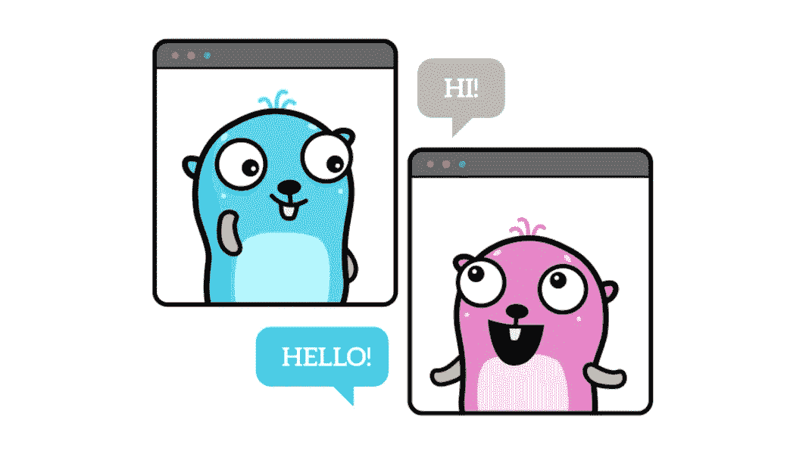
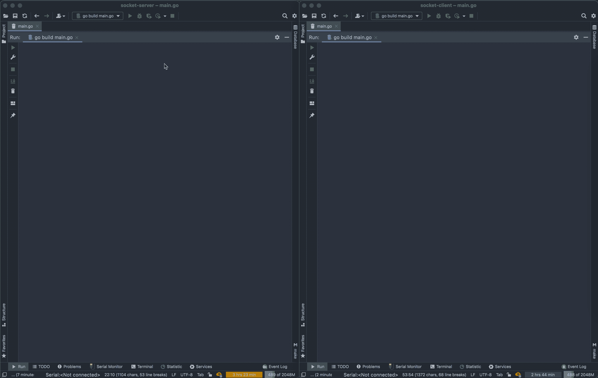

# 两个围棋程序之间的简单套接字通信

> 原文：<https://itnext.io/plain-socket-communication-between-two-go-programs-the-easy-way-bd5ac5819eb6?source=collection_archive---------1----------------------->

## 一个真实世界的例子

由 Renee French 创建的原始地鼠图像，使用由 Maria Letta 创建的地鼠图像

这篇文章可以看作是上一篇关于 web-socket 通信的文章的第二部分，作者是 [Petr Jahoda](https://medium.com/u/6f72c855da06?source=post_page-----bd5ac5819eb6--------------------------------) 。

 [## 两个 Go 程序之间的 WebSocket 通信，简单的方法

### 有一个提示，在 Docker 中运行围棋程序时

itnext.io](/websocket-communication-between-two-go-programs-the-easy-way-d8c9cf40043f) 

因为在 [reddit](https://www.reddit.com/r/golang/comments/p825kd/websocket_go_tutorial_communication_between_two/) 上有一个有趣的讨论，建议使用 SSE、GRPC、消息队列(还有很多其他的)，我想写一篇关于(比较)这些通信协议的文章。

但最后，我决定不这样做。

我认为所有这些协议会给你的项目增加更多的代码。我的意思是，你必须进口一些东西。你必须使用一个额外的库。

我想要一些在 T5 以下有更少 T4 代码的东西。简单点。但我也想写一个例子，这将很容易遵循和理解。没有难读的，也没有难用的。没有低级别的。

因为最初的教程使用 websockets，所以本教程只使用普通套接字。

这篇文章的结构和上一篇一样:我们将构建一个服务器和一个客户端，但是我们会让它更有趣。

您可以将服务器部分想象成在硬件设备上运行(就像 Arduino 从按钮收集温度和信号)，在连接时发送数据。

你可以把客户端想象成一个服务，运行在物理服务器上，接收这些数据并保存到数据库中。

真实代码的链接在文章的最后(数据库保存)。

# 套接字服务器(运行在硬件设备上)

这段代码主要做三件事。

1.  连接和断开
2.  从客户端接收数据
3.  向客户端发送数据

如果你运行这个程序，你会看到服务器已经启动。仅此而已。原因:服务器正在等待来自客户端的连接。

# 套接字客户端(运行在服务器上)

客户端代码同样只做三件事。

1.  连接和断开
2.  从服务器接收数据
3.  向服务器发送数据

您可以独立于服务器部分运行该程序(也可以独立于客户端运行服务器部分)。

客户端程序在循环中检查连接。如果连接，客户端打印接收到的数据，并发送另一个数据到服务器。

# 测试通信

把它们都放到一边，你就会看到结果。

下面你可以看到服务器程序的输出在左边，客户端程序的输出在右边。

正如您在下面的动画中看到的，客户端和服务器是独立运行的。服务器代码对客户端的连接和断开做出反应，反之亦然。

# 结果

当处理从服务器到客户端的编程时，有很多选择可供选择。

你做的每一个选择，都有优点和缺点。

请像对待*在你的编程腰带*下添加另一个工具一样对待这篇文章。

下面是真实世界代码的链接。一种服务(在服务器上运行的客户端代码)，它连接到许多设备(在一些硬件上运行的服务器代码)，从它们自己的 Go 例程中下载数据，并将它们保存到数据库。

 [## GitHub-petrjahoda/socket _ service

### Go 服务使用套接字通信从设备下载数据。使用此 docker 文件在 docker 运行时下安装…

github.com](https://github.com/petrjahoda/socket_service)