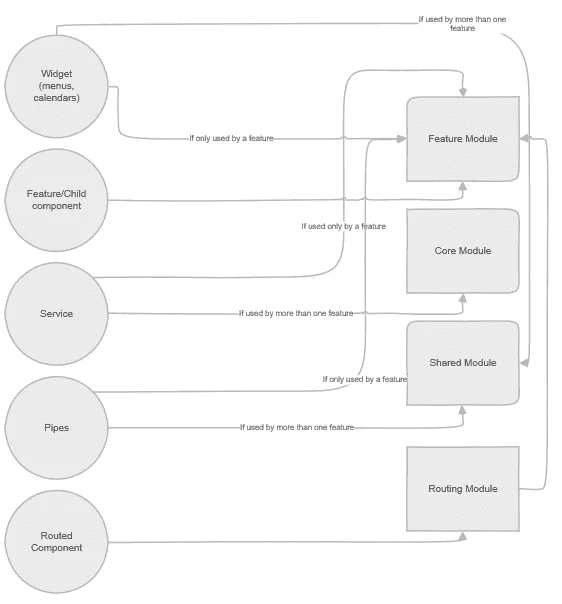

# 规划 Angular 应用的架构

> 原文：<https://itnext.io/planning-the-architecture-of-your-angular-app-a4840bfec13b?source=collection_archive---------0----------------------->

嘿伙计们。我今天在这里向你展示如何为你的 Angular 项目规划架构。请注意，这不是一篇实用的文章，同样，这篇文章的目的也不是教授 Angular、TypeScript 或 Angular CLI，而是为您提供一种方法来**思考**您的应用程序的架构。那么，我们开始吧。😊

# 目标

我写这篇文章的目的是为你提供不同的技术来把所有的东西放在一起，这里的东西，我指的是你在你的 Angular 项目中一直在工作的组件、服务和其他特性。因此，在本文结束时，您将能够构建一个非常一致且易于维护的应用程序。现在，建造这样的东西我们当然需要一个坚实的蓝图。想象一下，我们正在建造一栋房子，我们不会想要从零开始，在没有蓝图的情况下将所有的部件组装起来，对吗？那么，为什么我们不做同样的事情就开始我们的应用程序呢？我们将把重点放在规划我们的应用程序，我们如何构建一个项目，以及如何组织我们的文件夹。同时看看这篇[文章](https://levelup.gitconnected.com/best-practices-in-angular-a8926fa02ae2)是个不错的计划，因为它们相辅相成。请注意，这是我的个人观点，你可以有不同于我的观点，也完全有效。你可以在同一个房间里与一些开发商交谈，很可能你会得到不同的答案。没有一种正确的方法，我想首先强调的是，本文并不是关于构建 Angular 应用程序架构的完美或正确的方法。相反，我将向您展示我认为您应该考虑的不同技术，因为知识就是力量，在我看来，如果您知道不同的方法，您将能够在适合您的项目的地方应用它们。

# 体系结构

架构是任何应用程序最重要的方面之一。我确信，和我一样，你可能已经开发了一个应用程序，你或者开发团队，直接跳到代码中，开始编码。我所在的团队已经这样做了，有时应用程序最终运行良好，但在其他情况下(通常当应用程序较大时)，这种方法通常不会运行得很好，因为有许多事情你没有花时间去计划。**记住**:我们的目标是构建一个可维护的应用。

# 规划

我们想建一栋房子。现在，想想蓝图和它的价值，尤其是现在有很多摩天大楼在建，比如迪拜。想象一下，如果不规划地基的合适尺寸，仅仅一块地基就可能导致混乱。我知道构建一个 Angular 应用程序是不一样的，但我认为同样的原则适用，就像一个蓝图和一个建筑师将拥有所有的信息来构建一个成功的建筑，我们还需要一个具体的东西来规划我们的应用程序的构建。对我来说，所有的团队，或者每个开发人员，都应该花时间思考这个问题:

*   **App 概述= >** *应用是为了什么？目标是什么？客户将如何使用它？*
*   **App Features = >** *当然，这取决于你是使用瀑布式方法还是敏捷方法，但你应该知道一些特性。*
*   **域安全= >** *什么是域安全？你在服务器端使用规则了吗？这些将如何传达给你的 Angular 应用程序？你的应用程序将如何与你的 API 通信？*
*   **域规则= >** *你有什么规则？这些规则是在客户端运行还是在服务器上运行？还是两者都有？通常我们在两边都这样做，但是你应该计划这些事情。*
*   **Services/Communication =>***app 要怎么和服务器对话？大多数时候你会用到 HTTP 的概念。然而，在某些情况下，您可能需要使用 WebSockets。预先了解这一点很好，因为这将改变一些架构，不仅是后端和前端之间的数据交换，甚至是 Angular 应用程序中的服务和组件之间的数据交换。*
*   **数据模型= >** *来自 API 的数据是什么？我们传递给组件的是什么？我们从 API 中得到我们想要的了吗？有时候不会。因此，我们需要考虑如何最有效地在应用程序中传递数据。*
*   **特性组件= >** *我们的特性是怎样的，我们是怎样构造组件的？想象一下，如果应用程序中的两个功能可以同时存在，并且它们需要进行通信，那么它们将如何以松散耦合的方式进行通信呢？*
*   **共享功能= >** *我们有哪些共享功能？我们是否在使用第三方组件，如 Angular Material 或 Ng Bootstrap？共享的功能是只能在这一个应用程序中共享还是可以重复使用？*
*   **单元测试= >** *我们在使用内置的 CLI 工具吗？我们可以使用 Karma test runner 之类的东西。*
*   **端到端测试** **= >** *我们为此做什么？我们用的是量角器还是最新的柏树？我更喜欢柏树*😊。这实际上也可能影响你如何设计你的代码，因为你的端到端测试人员(如果你有团队的话)可能更喜欢在你的一些标签上有 id，使他们在测试中更容易被找到。

还有更多的点吗？当然，每个应用程序都不一样，每个公司都不一样。但这就是问题的关键，想出对你的团队、你的公司和你都有效的方法。

# 如何组织特征

影响立体角建筑的最大因素之一是我们如何组织我们的特征。我们不仅需要考虑如何构建特性，还需要考虑如何构建这些特性中的子组件、模块等等。请注意，我们可以在一个应用程序中拥有许多功能。

想象一下我们买了一个拼图。我们可以说每个部分都是一个特性，我们希望确保我们以一种更容易使用的方式来组织它们。因此，最后，正如我在关于[最佳实践](https://levelup.gitconnected.com/best-practices-in-angular-a8926fa02ae2)的文章中所说，遵循提升原则是很重要的。

*   **基于约定 vs 基于特性
    →** 当我还是后端开发人员的时候(。net C#)我曾经用 MVC 模式遵循约定的方式。现在，我是一个更有角度的开发人员，正在考虑我需要(和喜欢)组织我的代码和特性的方式，我不喜欢使用，这意味着我不想这样组织我的文件夹:
    一个名为 components 的文件夹，我只是将所有组件转储到那里，另一个名为 services 的文件夹用于我的所有服务文件。这当然可以，但是有了组件，现在我们的视图或模板将完全分离，我的 CSS 也将分离，这样，我将需要多挖掘一些。因此，我推荐的方法是基于功能的，这是 CLI 默认会做的事情，正如您在这篇文章[中看到的那样。特性都被组织到它们自己的文件夹中，它们都是自包含的，对于给定的特性，很容易找到所有的东西。](https://levelup.gitconnected.com/angular-cli-tutorial-3bc7ed11fc55)

# 功能模块

让我们假设我们有客户端模块，我们也有一个订单功能。我们如何正常开始？嗯，首先我们要做 **ng g c** (看看这篇[文章](https://levelup.gitconnected.com/angular-cli-useful-commands-1023e93b843b)来更好地了解一些 CLI 命令)，我们将它命名为 **clients** ，这将在顶层添加子文件夹 **clients** 。这一步是很多人停下来的地方，他们最终将这个特性添加到根模块中。这完全没问题，但是随着应用程序的增长，你会得到更多的功能，你将只有一个模块，所以你不能使用延迟加载，该功能不再是独立的。我的建议是每个特性使用一个模块，这样做的好处不仅仅是延迟加载。例如，对于自包含特性，我们可以让团队中的不同成员致力于一个给定的特性，并且拥有这个特性，如果你像我一样，喜欢遵守单一责任原则，这也是一件好事。

# 核心和共享模块

*   **核心模块**是 Angular Style Guide 推荐的。Core 实际上是为单例类型的服务而设计的，任何可以在整个应用程序中共享的东西，显然任何单例都是好的。
    →特定于功能的服务可以放在功能文件夹中。在这种情况下，我会创建一个名为 services 的子文件夹，将其放在 feature 文件夹中，然后该特定服务将被导入或直接提供到 feature 模块中。这只有在该服务不会在其他地方重用时才有意义。
*   **共享模块**是我们拥有可重用组件、管道、指令等等的地方。其中一个重要的区别因素是，组件、管道或指令是只在这个应用程序中使用，还是可以跨应用程序使用？它是如此的通用以至于你可以一遍又一遍的重复使用它吗？如果是这样的话，就不要放在 shared 里了。这就是我们想要讨论创建一个有角度的库的时候，我将在我的下一篇文章中尝试讨论这个问题😊。

因此，共享模块通常会被多次导入。另一方面，核心模块应该只被导入一次，并且应该只发生在根目录中。

# 模块在一起

看一下**小部件**，我可以告诉你，在很多情况下，如果你把它放在共享模块中就没问题，但是如果一个给定的**小部件**只被一个特性使用，那么它的良好实践会直接导入到那个特性中，并且所有的逻辑都是一样的，就像你在前面的图中看到的那样。请注意，路由模块经常会成为功能模块的一部分，并实际导入其中。在导出时:

*   **特征模块** *通常是独立的，它将被导入到根目录中。*
*   **路由模块** *通常我们会导入路由，然后导出。*
*   **核心模块** *只会被导入到我们的根模块中，所以这个模块通常没有任何出口。*
*   **共享模块** *是几乎总是会有一些导出的模块，因为否则它肯定是不可共享的。*

# 结论

希望这篇文章能对你有所帮助。我喜欢思考这些主题，因为我热爱建筑，为此我决定分享一些知识，但请记住，你有许多不同的方式来建立和组织你的 Angular 项目。我希望这篇文章能给你一个好主意，让你知道使用特性和模块甚至服务的过程，以及如何组织它们。

我本可以在这篇文章中更深入地探讨，但是我已经写了一篇关于最佳实践的文章，在那里我展示了关于如何构建代码等等的一切。如果你有时间，去那里([最佳实践角度](https://levelup.gitconnected.com/best-practices-in-angular-a8926fa02ae2))看看吧😊。