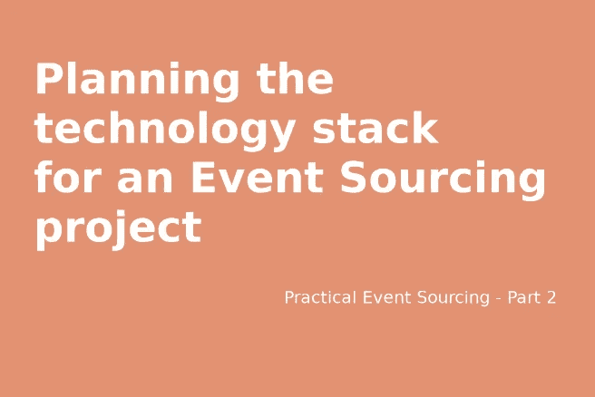

# 为事件采购项目规划技术堆栈

> 原文：<https://itnext.io/planning-the-technology-stack-for-an-event-sourcing-project-8e18cb38030f?source=collection_archive---------3----------------------->



我在培训或咨询开发人员、工程师和软件开发实验室关于新事件采购项目时遇到的最常见的问题是我们如何以及从哪里开始。这个问题太有道理了。我记得我在实践中试图理解面向对象编程(不是我在学校学到的废话)，更不用说理解领域驱动设计了！

大约十年前，我为我最大的客户之一建立了一个相对复杂的线上和线下销售和物流系统:一家工业制冷和空调系统的制造商、批发商和分销商。在这个项目的三个月里，我组建了一个由三名软件工程师、两名后端 web 开发人员和一名前端开发人员组成的团队。我们取得了巨大的进步。我们使用 DDD 模型和 Laravel 作为应用框架来构建这个系统。很好，我们很有成效。然后，客户聘请了内部 CTO。他要求见我，我答应了。他问我它是如何在 PHP 事件源中工作的。我的回答更多的是一连串的问题😳。

我已经知道了事件源，我读了书，但我从来没有，从来没有需要实现这样的事情。我不知道从哪里开始。我是说，我不知道。我知道这个概念和理论，但仅此而已。

在我之前的文章中，我解释了如何开始一个新的事件采购项目。在介绍了一些理论和事件风暴之后，是时候开始考虑其他同样重要的因素了，即事件采购项目的技术栈。

我选择 PHP 作为主要的后端编程语言。然而，我相信这些计划因素适用于您希望用于事件采购项目的任何编程语言。在本文中，我将概述规划基础设施和其间的应用程序粘合剂的注意事项。我还将描述并提供一个我的本地环境部署、代码结构的工作示例，以及我所认为的这样一个系统的起点，即测试框架。

# 如何规划活动采购项目的基础设施服务

可以说，我相信在大多数情况下，当与团队一起工作时，准备这些需求将取决于几个因素和其他项目涉众的需求。虽然我自己为这个项目做这些决定，但是这个过程对于你的客户委托的团队和项目是相似的。主要的区别是，我可以选择我最喜欢使用的后端服务，并且我没有超出我控制范围的外部依赖。例如将数据从 MSSQL 数据库迁移或集成到 MySQL 数据库中😡。

> 在我的职业生涯中，我有同样多的机会来开发新系统和将旧系统移植到事件采购解决方案中。在我看来，后者要复杂得多。如果您需要帮助重构遗留系统以使用事件源模式以及迁移现有数据，您可以 [*联系我*](https://keith-mifsud.me/contact) *。*

我有意保持这个示例域简单，以便不分散您对主要主题的注意力，即构建一个包含实际示例的事件采购项目。这个项目中的示例代码来自我管理的一个商业项目。请随时在下面的评论区问我关于这个或其他业务领域的问题。解决了这个问题之后，让我们开始为我们的示例项目规划技术堆栈，因为我们有很多内容要介绍。

# 事件存储数据库

事件源最关键的持久性存储是事件存储数据库。我相信您知道，有几种不同的数据库引擎可以用来运行我们的事件存储。我不会在这篇文章中比较这些引擎，因为我们需要知道的是我们需要一个追加优化的数据库。

考虑到事件源的不可变性质，我们当然不需要更新任何持久化的事件。我们也不需要运行任何复杂的读取查询。我将在以后的文章中提到，事件存储实现将查询由集合的 UUID(通用唯一标识符)标识的持久化事件。这是一个非常简单的查询。

我也不鼓励在 NoSQL 数据库上实现你的事件存储。我没有用墨水写下这条规则，您可以使用任何您希望的存储机制，但是因为我认为事件存储的模式应该被显式声明，所以我认为 NoSQL 不适合事件存储。尽管我将强调，您仍然可以在大多数数据库引擎上声明您的模式和主键。

> ***友情提示:*** *不要用* [*卡夫卡*](https://kafka.apache.org) *等消息掮客作为你坚持真理的来源。消息代理顾名思义就是代理，即使消息流被缓存或记录，消息*也应该保存在其他地方。

无论如何，我已经选择在一个 MySQL 数据库上实现我的事件存储。我发现 [PostgreSQL](https://www.postgresql.org) 也非常适合事件存储实现，我已经使用过几次了。

至此，我已经为这个清单应用程序的基础设施做出了第一个决定。我将使用 MySQL 来持久化事件。然而，我将通过使用 Repository 模式将所有模型的代码从这个决策中分离出来。因此，如果我将来改变主意，我只需要改变实现，并以某种方式迁移数据。

# 读取模型数据库

虽然我以前使用过 MySQL 来保存读取模型，但是我越频繁地为读取模型实现 NoSQL 数据库，我就越喜欢 NoSQL 为我的应用程序提供的灵活性。

我应该注意到，一些应用程序要求读模型有一个显式声明的模式。我们的上市申请不会。这么说的时候，我想指出的是，你可以有几个版本的读模型。这些类型的决策将在很大程度上取决于您的具体应用、反腐败层和安全性。清单应用程序的读取模型将是无模式的。缺少模式使我可以灵活地向读取模型添加字段，而不必对现有数据进行任何更改。然而，当采用这种方法时，您将需要确保您的读取查询能够处理丢失的字段，从而处理任意数据。

> 另外，请注意，成本是这些决策的一个重要因素。大多数云服务提供商将向你收取进出流量的费用，而不仅仅是存储和计算费用。因此，在不同的实例上托管多个数据库会影响您的流量费用。

再一次，有这么多不同的 NoSQL 数据库引擎可供使用，如果我们试图列出其中的一半，我们会晕头转向😵。我将使用 [MongoDB](https://www.mongodb.com) 作为这个系统的读取模型的数据库，没有特别的原因，只是我在日常工作中经常使用它，所以我对它非常满意。

# 应用框架

我需要一个应用程序框架吗？可以说，我不知道。我需要一个可以被客户端访问的应用层，比如用户界面。然而，我还需要我的应用层中的一些其他基本组件。没有特定的顺序，这些是:

*   解析我的依赖项的具体实现的能力。
*   能够轻松地用新的实现替换我所有的具体实现。
*   传入请求和模型之间的反腐败层。
*   客户端和用户的某种形式的身份和认证。
*   使用环境变量隔离可配置选项的能力。

可能还有一些其他的需求，比如启动整个系统😆。

当然，我们可以使用一组解耦的组件，它们一起将满足所有的需求。我以前做过，甚至成功过。但是为什么呢？为什么不用像 [Laravel](https://laravel.com) 这样的框架呢？当然也有缺点。但是对于这个应用程序来说，这些缺点都不够糟糕。Laravel 和所有框架都有一个引导时间开销，但我不认为这很重要。如果我使用解耦的组件，然后自己将它们引导到一起，我几乎可以肯定我的引导效率会更低，除非我开发一些类似于 Laravel 已经提供的自定义缓存和优化。

你可能会问为什么我不选择[流明](https://lumen.laravel.com)微框架。如果你是，我的回答有点哑。我没有在生产中使用过 Lumen，我没有使用它的经验。我所知道的是，我仍然需要在 Laravel 的认证系统中使用口才，我认为这是唯一可以减少引导时间的重要组件。如果我错了，请纠正我，因为我不太了解卢蒙。

## API 访问

我还打算使用 GraphQL 作为 API 的查询语言。我发现 [GraphQL](https://graphql.org) 和无模式读取模型是一个完美的匹配。然而，这很可能导致使用更少的 Laravel 的 HTTP 层，因为(举例来说)，GraphQL 类型系统可以作为应用层的反腐败层，而不是 Laravel 的请求对象。使用这个 API 也意味着我很可能需要自己开发 GraphQL 实现，因为(目前和 AFAIK)所有当前的 graph QL 和 Laravel 库都使用雄辩作为类型系统。我不会对读模型使用雄辩术，因为它破坏了我非常喜欢的无模式优势💕。

# 当地发展环境

我们已经准备好为我们的清单应用程序规划技术栈，所以现在是我们准备本地开发环境的时候了。去年我写了一篇文章，详细介绍了我开发 PHP 应用程序的工作流程，虽然我不断地重构我的过程，但最显著的变化是我现在几乎总是在我的开发环境中使用 Docker，而不是 vagger。

> 我不会将这一系列文章的重点放在部署策略甚至分布式系统上。我没有实现微服务方法，但是尽管系统看起来像是一个整体，但实际上，我们可以在单独的机器上部署每个后端服务。如果需要，您可以在 Kubernetes 集群上运行这个系统，只需遵循本文中的[](https://keith-mifsud.me/blog/how-to-deploy-laravel-to-kubernetes)**。**

*在这篇文章中，我不会详细讲述我是如何组织这个项目任务的。上面提到的文章中的细节仍然有效。作为总结，我遵循了以下步骤:*

```
*mkdir -p ~/code/keithmifsud/php-event-sourcing-demo cd ~/code/keithmifsud/php-event-sourcing-democomposer create-project --prefer-dist laravel/laravel code*
```

> *如果你从 Docker 内部安装 Laravel 可能是最好的，但是因为我使用的是 Ubuntu 主机，所以没关系。*

```
*cd code git init git remote add origin git@github.com:keithmifsud/php-event-sourcing-demo.git*
```

1.  *我更新了`composer.json`文件中的项目描述，删除了 Laravel 提供的`readme.md`文件，并创建了一个新的初始`README.md`文件来描述这个库的用途。您可能还希望添加许可证文件。*
2.  *一旦完成，我就提交我的更改并将它们推送到远程`origin`。*

```
*git add . git commit -m "#GH-1 Initial commit containing the Laravel framework." git push -u origin master*
```

*我还在 GitHub 上创建了一个项目、一些[问题](https://github.com/keithmifsud/php-event-sourcing-demo/issues)和一个[看板](https://github.com/keithmifsud/php-event-sourcing-demo/projects/1)。这些简单的管理技巧帮助我继续在一个项目上工作，即使我已经离开了一段时间，因为这是同一个项目的情况🐢。*

# *用于事件采购的 Docker 容器*

*好了，我已经分享了我的启动任务的摘要，让我们开始使用这个事件源应用程序所需的 Docker 容器。我们已经说过，我们需要一个 MySQL 数据库用于事件存储，一个 MongoDB 数据库用于读取模型。然而，我想为应用程序框架拥有一个单独的数据库，在本例中，是为 Laravel。应用层不需要单独的数据库。我选择这样做有几个原因，比如，我希望能够方便地独立备份事件存储，并且我不希望 Laravel 接近我的事件存储，`artisan migrate`命令很烦人😱。*

*我们还需要一个用于 PHP 运行时的 Docker 容器和一个用于 web 的 web 服务器。我使用`docker-compose`来组成我的容器，如下所示:*

```
*version: '3'
services:

  # PHP Runtime Service
  es_demo_php_runtime:
    build:
      context: .
      dockerfile: ./docker/PHP_Dockerfile
    image: [digitalocean.com/php](http://digitalocean.com/php)
    container_name: es_demo_php_runtime
    restart: unless-stopped
    tty: true
    environment:
      SERVICE_NAME: es_demo_php_runtime
      SERVICE_TAGS: dev
    working_dir: /var/www
    volumes:
      - ./:/var/www
      - ./docker/configuration/php/local.ini:/usr/local/etc/php/conf.d/local.ini
    networks:
      - es-demo-network

  # Nginx Service
  es_demo_nginx_webserver:
    image: nginx:alpine
    container_name: es_demo_nginx_webserver
    restart: unless-stopped
    tty: true
    ports:
      - "8080:80"
      - "4430:443"
    volumes:
      - ./:/var/www
      - ./docker/configuration/nginx/conf.d/:/etc/nginx/conf.d/
    networks:
      - es-demo-network

  # MySQL Service for application data
  es_demo_mysql_app_db:
    image: mysql:5.7.22
    container_name: es_demo_mysql_app_db
    restart: unless-stopped
    tty: true
    ports:
      - "3315:3306"
    environment:
      MYSQL_DATABASE: es_demo_application_db
      MYSQL_ROOT_PASSWORD: secret
      SERVICE_TAGS: dev
      SERVICE_NAME: es_demo_mysql_app_db
    volumes:
      - ./docker/storage/app-data:/var/lib/mysql/
      - ./docker/configuration/mysql/my.cnf:/etc/mysql/my.cnf
    networks:
      - es-demo-network

  # MySQL Service for event store data
  es_demo_mysql_event_store_db:
    image: mysql:5.7.22
    container_name: es_demo_mysql_event_store_db
    restart: unless-stopped
    tty: true
    ports:
      - "3316:3306"
    environment:
      MYSQL_DATABASE: es_demo_event_store_db
      MYSQL_ROOT_PASSWORD: secret
      SERVICE_TAGS: dev
      SERVICE_NAME: es_demo_mysql_event_store_db
    volumes:
      - ./docker/storage/event-store-data:/var/lib/mysql/
      - ./docker/configuration/mysql/my.cnf:/etc/mysql/my.cnf
    networks:
      - es-demo-network

  es_demo_mongo_read_model_db:
    image: mongo:3.4.22-xenial
    container_name: es_demo_mongo_read_model_db
    restart: unless-stopped
    tty: true
    ports:
      - "8081:8081"
    environment:
      MONGO_INITDB_DATABASE: es_demo_read_model_db
      MONGO_INITDB_ROOT_USERNAME: root
      MONGO_INITDB_ROOT_PASSWORD: secret
      SERVICE_NAME: es_demo_mongo_read_model_db
      SERVICE_TAGS: dev
    volumes:
      - ./docker/storage/read-model-data:/data/db
    networks:
      - es-demo-network

# Docker Networks
networks:
  es-demo-network:
    driver: bridge

# Volumes
volumes:
  app-data:
    driver: local
  event-store-data:
    driver: local
  read-model-data:
    driver: local*
```

*如您所见，我已经将 PHP 容器提取到 Docker 文件中，并且还在 docker-compose 文件之外添加了配置文件。你可以在这里找到这些文件。*

*如果你跟着我，你也需要为 Docker 卷创建目录。*

```
*mkdir -p ./docker/storage/app-data
mkdir ./docker/storage/event-store-data 
mkdir ./docker/storage/read-model-data*
```

# *运行应用程序*

*我们没什么可看的，但是我希望我们能确保我们已经准备好进入下一部分——建立测试框架，所以我们已经为下面的文章做好了准备。所以，让我们唤醒这些容器:*

```
*docker-compose up -d*
```

*然后，您可以通过访问 [http://localhost:8080](http://localhost:8080) 来检查应用程序是否正在运行，或者更好的方法是通过`PHPUnit`😃。*

```
*docker-compose exec es_demo_php_runtime php ./vendor/bin/phpunit*
```

*在这个阶段，您可能希望用数据库连接值配置您的`.env`文件。我不会这样做，因为我还不需要它🤷‍♂️.*

# *代码结构*

*当我被要求帮助一个使用 Laravel 的项目团队时，我最讨厌的事情之一就是，Laravel 是最重要的，也是最重要的。Laravel 是一个应用程序框架，和 Symfony 一样，和所有的应用程序框架一样。我说“请详细说明你的业务。`\App`名称空间对你正在解决的问题只字未提。您为客户提供的解决方案。”*

*我们没有解决任何复杂的业务问题。我们的领域是一个类似 GumTree 的上市网站演示。但是，让我们都改变不明确的`\App`名称空间，以反映我们的目标。*

```
*docker-compose exec es_demo_php_runtime php artisan app:name ESDemo\ \Application*
```

*好的，所以 Laravel 只是一个应用程序框架。不，不仅仅是这样。但是，它是**而不是**我们的整个系统。Laravel 将提供对应用程序的访问，我们可以使用其他助手，如身份验证和应用程序引导。我们还将使用 concertive 来保持身份验证需求，但是，我们不会将 concertive 用于事件存储或读取模型*

> **不管你是否在不同的架构中使用口才，比如领域驱动设计(DDD)，相信我，DBAL 模型不是你的业务模型。当您使用 DBAL(一个数据库抽象层)来执行业务规则时，您将最终为每个检查查询数据库，即使它应该已经存在于内存中。**

*大声抱怨😌。我们现在将为我们的系统结构创建第一步，不是应用程序而是系统(我以为你说咆哮已经结束了？！).就像我们构建一个 DDD 模型一样，我们系统的所有代码都将存在于一个`./src`目录中。这个源目录将被命名为`ESDemo`或您的系统名称。子目录将在 PSR-4 标准中自动加载*

# *我的 PHP 企业系统目录结构*

*在我们的列表系统中，让任何东西存在于`src`目录中还为时过早，但对我来说，解释我如何构建这样的目录永远不会太早。*

*我以下面的方式构造命令模型，比如我们的清单模型。*

```
*code
 |__ app(... application stuff (like Laravel's things)
 |__ src
 |
 |___Infrastructure (Concrete implementations of things) 
 |
 |___Models
 |
 |___Listing
 |
 |___Commands
 | 
 | |___Domain
 |
 |___Events
 |
 |___Exceptions
 |
 |___Handlers
 |
 |___Listeners
 |
 |___Repositories
 |
 |___Specifications
 |
 |___Listings (Read model, as detailed below)
 |
 |___ ...*
```

*上面的文件结构非常固执己见，但由于这是一个常见的问题，我想与你分享😬。*

*您会注意到，我没有一个目录来分离命令和查询模型。我故意这样做，因为我希望我的模型反映业务，并且只反映业务。批量查询列表本身就是一个领域。它与清单(单一)模型有着非常不同的业务需求，我认为这种多元化已经足够说明问题了。*

*深入到`Listing`域的目录结构，我有以下目录用于以下目的:*

1.  *命令-是外部层访问模型的唯一方式。*

*2.域—该目录包括业务模型对象。它持有聚合根，有时也持有其他实体和值对象。*

*3.事件——我认为事件目录是这个模型的输出信息。*

*4.异常——所有可能的异常都来自这个模型。一切不正常的，但可能是错误的。*

*5.命令处理程序—命令处理程序。*

*6.监听器——如果模型监听其他模型中发生的事件，我将监听器放在这里。*

*7.存储库—数据存储库。*

*8.规范——我喜欢使用规范模式，因为规范对象很好地描述了它们的意图。一些工程师同事会问为什么这个目录不在域目录中。我选择把它放在外面，因为其他层可以重用规范。如果域使用工厂，它们也会在相同的目录级别，因为我们可以从外部层访问它们。*

*我构建了读取模型，比如我们的`Listings`如下:*

```
*code 
|__ ... application stuff (like Laravel's things)
|__ src 
|
|___Infrastructure (Concrete implementations of things) 
|
|___Model
|
|___Listing (Write model, as detailed above)
|
|
|
|___Listings 
|
|___Exceptions
|
|___Projectors
|
|___ReadModels
|
|___Repositories*
```

*我的读取模型目录结构比命令模型稍微简单一些。虽然这不是一个通用模板，但它或多或少总是包含以下结构:*

1.  *例外——可能出错的事情，比如查询不存在的东西。*

*2.投影仪—包含侦听事件并将它们投影到读取模型的对象。*

*3.读取模型-所有读取模型。例如，活动列表、过期列表等。*

*4.存储库——隔离具体数据实现的接口。*

## *PSR-4 命名空间*

*虽然我们的`src`目录中还没有任何东西，但是我们仍然可以为它设置名称空间。在`composer.json`中，为`./src`目录添加一个条目。*

```
*"autoload": {
        "psr-4": {
            "ESDemo\\Application\\": "app/",
            "ESDemo\\": "src/"
        }
        ....
    },*
```

> **请注意，我没有为* `*composer*` *使用容器，因此，我不能在 Docker 中运行* `*composer dump-autoload*` *。我从我的主机上运行这个。但是，您可能希望为 Composer 添加一个容器，或者甚至让 Composer 安装在您的 PHP 运行时容器中。我不鼓励将 Composer 推送到生产服务器，而是在 CD 过程中构建 Docker 映像。**

*有了上面的名称空间配置，我们可以很容易地理解系统的代码结构及其意图。在这个清单应用程序的整个开发过程中，我们将所有的模型代码放在`src/Models`目录中，所有的基础设施代码放在`src/Infrastructure`目录中。*

*剩下的代码在应用层。这个层和名称空间包含所有的应用程序代码，在我们的例子中，这些代码或多或少都与 Laravel 耦合在一起。*

*在以后的文章中，我们还将看到基础设施层是如何构建的。我们将在这一层具体实现所有的存储库。因此，目录将被相应地构建，并且不会遵循业务模型结构，因为它的域是基础设施而不是业务。*

# *测试*

*和往常一样，我将使用 [TDD](https://keith-mifsud.me/blog/the-fearless-natural-approach-to-tdd) 来开发这个基于事件的应用程序。我首先为我的测试建立一个初始的目录结构，将三个不同的测试套件分开。*

*这些测试套件是单元测试、集成测试和功能测试。Laravel 附带了一个特性测试示例和另一个单元测试示例。因此，我只需要为集成测试套件创建一个目录，如下所示:*

```
*mkdir ./tests/Integration*
```

*然后，我在`./phpunit.xml`中为这个测试套件添加一个条目。*

```
*<testsuite name="Integration">
            <directory suffix="Test.php">./tests/Integration</directory>
        </testsuite>*
```

*我不介意保留 Laravel 提供的示例测试，因为单元测试有助于确保测试框架正常工作，而功能测试则确保主页可访问。然而，我想将 tests 名称空间从`Tests\Feature`改为`ESDemo\Tests\Feature`，单元测试和 Laravel 提供的测试用例也是如此。*

*因此，我将`Test`名称空间的每个实例更新为`ESDemo\Tests`。然后，我更新了`composer.json`文件来自动加载测试类。*

```
*"autoload-dev": {
   "psr-4": {
      "ESDemo\\Tests\\": "tests/"
   }
},*
```

*并刷新自动加载的类。*

```
*composer dump-autoload*
```

*很明显，我要确保测试通过。*

```
*docker-compose exec es_demo_php_runtime ./vendor/bin/phpunit*
```

*随着这些教程的进行，我将向您展示我如何利用测试场景类，以及如何开发适合每个套件的测试案例，因为作为一个例子，单元测试不需要应用程序的实例，而 Laravel 的测试案例不必要地为每个测试创建整个应用程序。*

# *直到下次*

*在这篇文章的最后，我想简单介绍一下在开发新的事件源解决方案时所涉及的工作量。正如我们从这篇文章中所看到的，仅仅是为我们的示例项目规划技术堆栈似乎就很广泛了。请不要为此烦恼，规划确实需要时间，但是它是否比实现企业应用程序架构的其他模式所涉及的规划需要更多的时间？我不这么认为。我花在计划和执行本文中的步骤上的时间并不比我花在任何其他集装箱系统上的时间多。*

*我在本文中介绍的整个过程花了我不到半个小时。我在包括；计划使用哪些数据库和框架，设置 GitHub，并设置我的本地环境。一旦你在几个项目上重复这个过程，你将花费同样多的时间。重构你的开发过程，使用哪些工具，以及你的总体策略，以便根据需要经常完成工作，这也是很好的。*

*在本系列的下一篇文章**实际事件采购**中，我们将研究通用模型。公共模型包含在其他模型之间共享的对象。更重要的是，公共模型将包括我们的事件源域所需的组件抽象。你可以[在这里](https://keith-mifsud.me/subscribe)订阅，如果你想让我在发布时给你发邮件，为什么不呢，[也在 Twitter 上关注我](https://twitter.com/keithmifsud)？😉*

**原载于 2019 年 9 月 12 日*[*https://Keith-MIF sud . me*](https://keith-mifsud.me/blog/planning-the-technology-stack-for-an-event-sourcing-project)*。**