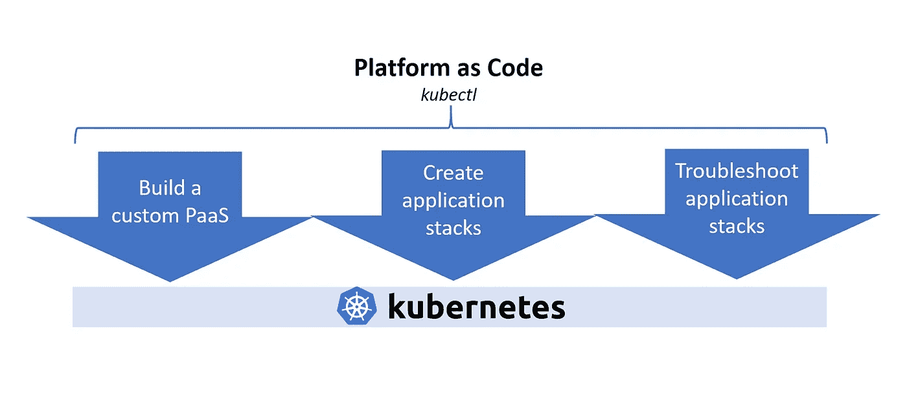
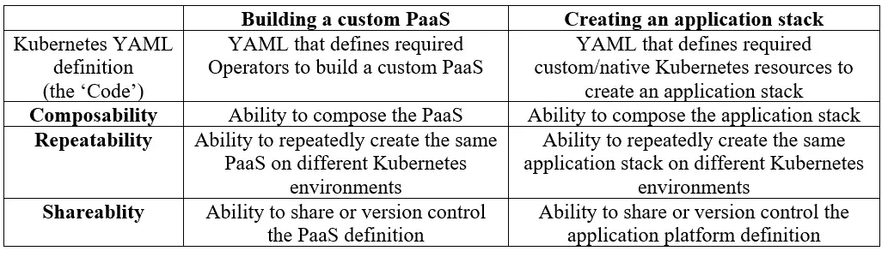

# 平台即代码—将 Kubernetes 提升到下一代平台即服务

> 原文：<https://itnext.io/platform-as-code-elevating-kubernetes-to-next-generation-paas-9b806b565ffc?source=collection_archive---------5----------------------->

什么是平台代码？
平台即代码(Platform-as-Code)是提升 Kubernetes 的过程，仅通过 Kubernetes 原生接口(kubectl 和 Kubernetes YAML)提供 PaaS 体验。Kubernetes 有一个有趣的可扩展性故事。可以用不同的 API 扩展/操作符来扩展核心 Kubernetes API，以管理平台元素，如数据库、队列、负载平衡器、SSL 证书等。Platform-as-Code 简化了使用所需的 API 扩展来扩展 Kubernetes 的过程，然后利用这些扩展来定义应用程序
平台堆栈，而无需引入任何新的 CLI。

**为什么是 Kubernetes 原生接口？**
使用 Kubernetes 本地接口提供 PaaS 体验的主要原因是，为基本 Kubernetes 开发的每个工具、每个控件都将在这样的 PaaS 中与各种平台扩展一起工作。本质上，您可以使用简化的 PaaS 抽象，而不会损害对底层 Kubernetes 层的最终控制。

**平台即代码特性:**
为了提升 Kubernetes 以提供 PaaS 体验，典型的平台即代码系统需要提供以下特性:

*   *构建定制的 PaaS:* 能够安装和管理一个或多个运营商，以组成一个“定制的 PaaS”。
*   *创建应用程序堆栈:*
    o 能够创建结合 Kubernetes 本地和定制资源的应用程序堆栈。o 发现由不同运营商引入的定制资源的能力。
    o 对于每个定制资源，能够了解规范属性和支持的操作(例如创建数据库、添加用户)
    o 对于每个定制资源，能够了解支持的可配置
    参数(例如:由相应的 MySQL 定制资源管理的 MySQL 实例的 open_files_limit 参数)。o 能够在不同的定制资源之间创建绑定，以在应用程序堆栈中实现依赖关系。
*   *应用程序堆栈故障排除:*
    o 自定义资源实例由一个或多个本机/自定义
    资源组成。用户应该能够了解这个定制资源实例的组合树。自定义资源实例在其生命周期中会经历各种转换，这取决于对其执行的声明性操作。出于可追溯性的目的，用户应该能够查询这些转换。

**KubePlus 平台套件:**
我们正在开发 [KubePlus 平台套件](https://github.com/cloud-ark/kubeplus)以提供上述平台即代码体验。它目前支持—操作员安装/管理、自定义资源列表、自定义资源操作发现和自定义资源实例组合视图。目前正在努力增加新的功能。点击查看当前 KubePlus 示例[。](https://github.com/cloud-ark/kubeplus/tree/master/examples)

**平台即代码特性:** 可组合性、可重复性和可共享性是平台即代码方法的三个关键特性。下表总结了在从运营商集合创建定制 PaaS 时，以及在使用
定制资源创建应用平台堆栈时，这些属性是如何体现的。

此外，如果您坚持使用平台元素的容器化版本，平台即代码方法也可以实现[多云可移植性](https://medium.com/@cloudark/kubernetes-and-the-underpinnings-of-multi-cloud-2-0-1c7aca50c46f)。

[www.cloudark.io](http://www.cloudark.io)