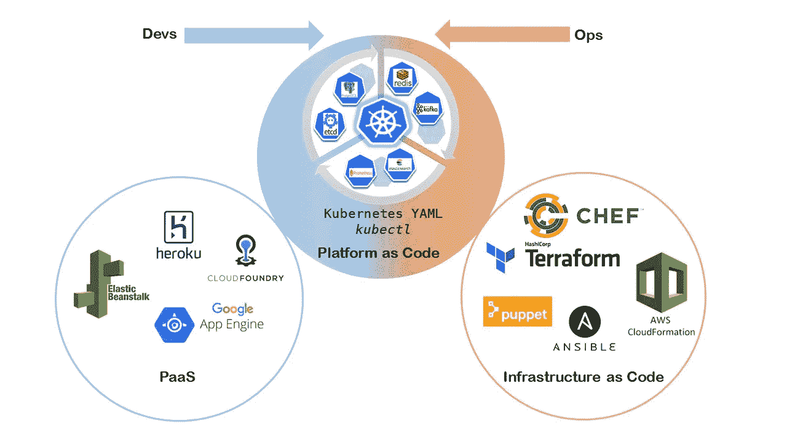

# 平台即代码:它与基础设施即代码的关系以及它能实现什么

> 原文：<https://itnext.io/platform-as-code-how-it-compares-with-infrastructure-as-code-and-what-it-enables-2684b348be2e?source=collection_archive---------2----------------------->

在之前的一篇文章中，我们在 Kubernetes 中概述了 PaaS 系统是如何向平台即代码发展的。在这篇文章中，我们来看看平台代码系统和基础设施代码系统的比较。

“原代码”系统是那些为供应和管理应用程序堆栈中元素提供声明性模型的系统。由 Terraform 和 AWS CloudFormation 等基础设施即代码系统开创的“即代码”方法在管理相应元素时提供了可重复性、可共享性和版本控制。

“平台”系统是那些专注于为应用程序部署提供平台级功能的系统。由 Heroku 首创的平台级功能通常被理解为包括以下内容:

(a)使用高级抽象表示应用程序及其所需的依赖关系(如数据库、负载平衡器),以及

(b)应用程序的部署(来自源代码或预建容器),具有与其依赖项的适当绑定

然后，*平台代码*系统可以被认为是以“代码”方式支持平台级功能的系统。这意味着，这样的系统能够使用高级声明性表示来定义应用程序及其平台依赖性；并使用该定义以可重复的方式支持应用程序堆栈的部署。

Kubernetes 及其 [API 扩展机制](/comparing-kubernetes-api-extension-mechanisms-of-custom-resource-definition-and-aggregated-api-64f4ca6d0966) ( [自定义资源](https://kubernetes.io/docs/concepts/extend-kubernetes/api-extension/custom-resources/)，自定义控制器和[操作符](https://coreos.com/operators/))使得构建真正的平台即代码系统成为可能，该系统以声明的方式提供创建应用程序平台，将“即代码”系统的优势带到平台功能中。

# **平台即代码和基础设施即代码的比较**

在这里，我们将平台即代码的概念与现代基础设施即代码系统(如地形或云形成)进行比较。虽然 IaC 和 PaC 模型将像 IaaS 和 PaaS 模型一样相互补充，但这种比较将有助于用户了解 PaC 系统可以带来的独特方面。

*   **平台即代码和基础设施即代码之间的相似性**

1)声明性表示:两种类型的实现都基于使用声明性定义。这使得这些系统能够在管理相应的(基础设施或平台)元素时提供可重复性、可共享性和版本控制。

2)基于差异的实现:这两种类型的系统都使用“基于差异的”实现，用所提供的输入将当前状态调和为新状态。

*   **平台即代码和基础设施即代码的区别**

PaC 和 IaC 之间的关键区别在于*每个模型如何实现其抽象。基础设施即代码是通过编写抽象作为底层基础设施层 API 的包装器来实现的。平台即代码是通过[编写抽象作为 Kubernetes API 扩展](/how-kubernetes-api-extensions-enable-platform-as-code-experience-cbb72b0970d9)来实现的，而不是在 Kubernetes API 上编写包装器。*

这使得 PaC 抽象成为底层 Kubernetes 层的一级实体。这反过来允许利用“kubectl”来处理抽象(自定义资源)，而不是使用全新的 CLI。相反，在基础设施即代码系统中，这是不可能的。IaC 抽象是作为底层 IaaS 层上的包装器编写的，因此，在使用 IaC 系统时，必须使用新的 CLI。

# **平台即代码体验的早期表现:**

1.  Kubernetes 运营商正在为平台元素构建数据库( [MySQL](https://github.com/oracle/mysql-operator) )、 [TLS 证书管理](https://github.com/jetstack/cert-manager)等。运营商为平台元素定义定制资源(例如:MySQLCluster、证书、发行商)。如果您在应用程序 YAMLs 中使用这样的定制资源以及本地 Kubernetes 资源，如部署、服务、配置映射，那么您实际上是在为您的应用程序创建一个定制平台作为代码(YAML 文件)。
2.  基于 Git 存储库中的工件协调集群状态的 [GitOps 模型](https://github.com/hasura/gitkube)通常使用一个操作符来实现，该操作符监视 Git 存储库的变化，然后协调集群。自定义资源用作触发协调的机制。GitOps 模型本质上是提供“git push to deploy”工作流，这是许多 PaaS 系统的典型特征，使用声明性定制资源。
3.  我们正在基于 Moodle 构建一个基于 Kubernetes 的电子学习解决方案。该系统需要管理 Moodle 实例的生命周期操作，如安装 Moodle、安装 Moodle 插件、升级 Moodle。我们正在为此创建一个 Moodle 操作器。这是一个用于 Moodle 应用程序的平台代码系统，其中 Moodle 自定义资源用于建模 Moodle 应用程序及其生命周期操作。Moodle 控制器基于 Moodle 自定义资源输入实现状态协调逻辑。

# **平台即代码的未来——挑战与机遇**

虽然 Kubernetes 操作符的概念允许我们用新的客户资源扩展 Kubernetes，但是复杂的应用程序平台将需要在一个 Kubernetes 集群中有多个这样的操作符。例如，我们将使用 MySQL、LetsEncrypt 和 Moodle 这三种操作系统为我们的一个客户提供一个 PaC 系统，构建一个电子学习解决方案。

在这样一个多运营商的世界中，出现了以下挑战。

1.*自定义资源的发现:*

当使用多个操作符时，应用程序开发人员发现集群中可用的各种定制资源的能力成为一个挑战——所有可用的定制资源是什么？它们的属性是什么？如何使用它们？应用程序开发人员可以查阅每个运营商的文档来查找这些信息，但这不是一种用户友好的方法。我们需要 Kubernetes 的本地方式来找到这些信息。对于标准的 Kubernetes 对象，有“kubectl explain”。我们需要[定制资源](https://medium.com/@cloudark/understanding-kubectl-explain-9d703396cc8)类似的东西。

2.*自定义资源可组合性:*

另一个挑战是不同的定制资源如何协同工作。例如，MySQL 自定义资源和备份自定义资源都可以使用卷。如何确保这两种定制资源在其操作中使用相同的卷？一种方法可能是使用资源名。他们总是去工作吗？如果没有，可以用标签吗？目前没有关于运营商需要支持什么功能的标准。我们正在制定在这方面有所帮助的指南。

3.*自定义资源的可追溯性:*

Kubernetes 自定义资源扩展了基本 API，以声明方式管理第三方平台元素。重要的是跟踪在定制资源上执行的各种声明性操作，以了解这些操作如何影响底层平台元素——例如，对于 Postgres 定制资源的实例，我们可能想知道:创建了多少个数据库用户，数据库用户的密码何时被更改，等等。为此，我们需要一种通用的方法来维护定制资源的出处信息。

# **平台即代码能够实现什么？**

平台即代码模型为弥合开发人员和运营人员之间的鸿沟提供了机会。

这些年来，已经发展出两种类型的工具。一组可以大致归类为 PaaS，专注于交付端到端的开发人员工作流，试图消除对 Ops 工程师的需求。另一组可以大致归类为“基础设施即代码”,侧重于简化自动化和资源调配方面的运营挑战。在实践中，当由开发人员和运营工程师组成的团队一起构建应用程序部署工作流时，他们会因为缺少公共工具而出现沟通障碍。这通常会迫使开发人员至少学习 Ops 系统和工具的基础知识，以便能够在 DevOps 工作流中做出有意义的贡献。例如，开发人员可能需要理解反向代理这样的概念，以及如何配置 Nginx/Apache 这样的系统来部署 web 应用程序。有了平台即代码(Kubernetes +所需平台元素的操作者)，Kubernetes YAML 有可能成为开发人员和运营人员之间的通用语言，从而弥合这一鸿沟。

我们预计，运营团队将参与为数据库、负载平衡器、记录器等平台元素选择 Kubernetes 运营商。这是应用程序所需要的。利用他们现有的运营知识，他们将帮助应用程序开发人员正确配置和使用与 Kubernetes 运营商管理的各种平台元素相对应的定制资源。应用程序开发人员将专注于消费这些定制资源来构建他们的应用程序平台，并且还可以根据需要在上面添加新的操作符(例如:Moodle)。这种合作将利用 Kubernetes YAML 作为共同语言。

[www.cloudark.io](http://www.cloudark.io)