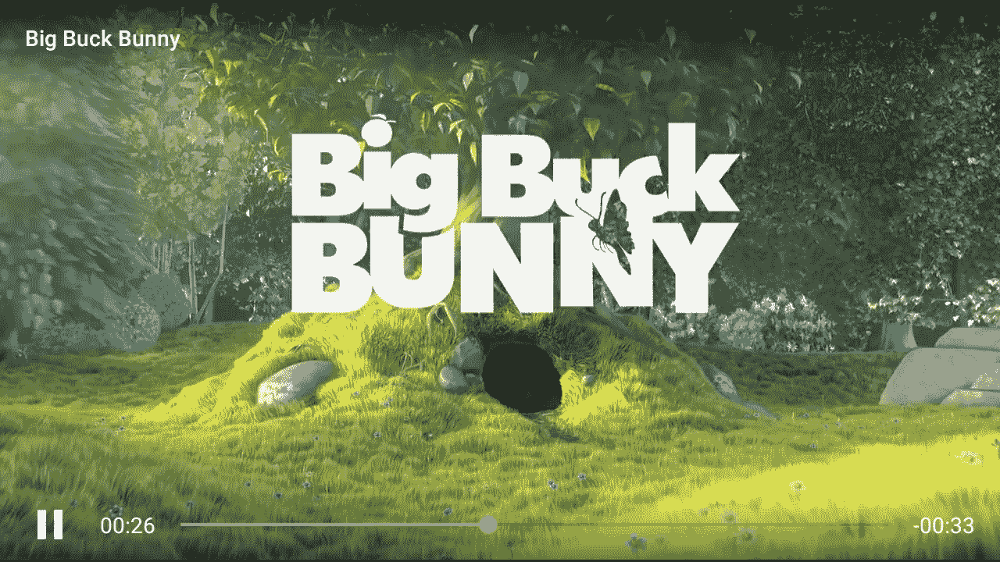

# 使用 Jetpack Compose 播放视频

> 原文：<https://itnext.io/playing-a-video-with-jetpack-compose-10a453ff956?source=collection_archive---------0----------------------->



BetterVideoPlayer 预览，我早期的项目之一

这个帖子是在测试版的 Jetpack Compose 发布后编辑的。

# 决定运动员

在我们开始讨论如何在可组合视图中播放视频之前，我们需要决定一个播放器类。从头开始培养一名球员是一项相当艰巨的任务。在这个项目中，我们只对 UI 方面的东西感兴趣。这将我们从传统媒体播放器的单个帧渲染、远程数据获取和状态管理中解放出来。

Android 自己的 MediaPlayer SDK 对于一个简单的视频播放器项目来说是可以的。我甚至在一个名为 [BetterVideoPlayer](https://github.com/halilozercan/BetterVideoPlayer) 的老开源项目中使用过它。然而，当涉及到支持各种编解码器，尤其是来自远程媒体源的编解码器时，它有相当多的问题。我没有处理基本的媒体播放器问题，而是决定选择加入 Youtube Android 应用程序使用的 [ExoPlayer2](http://exoplayer.dev) 。它有自己的用户界面模块，使事情变得更容易，但我们将限制我们的使用，只有一个表面(PlayerView)将呈现视频。

将此添加到对`app`模块的`build.gradle`依赖性。在本教程中，我将跳过其他合成依赖项。

```
implementation 'com.google.android.exoplayer:exoplayer:2.11.7'
```

因为我们不想在这个时候关心管理一个播放器，我们可以用一个基本的配置来勉强播放一个视频。

在我们继续之前，让我们给 AndroidManifest 添加 INTERNET 权限，因为我们将使用远程资源。

```
<uses-permission android:name="android.permission.INTERNET"/>
```

# 夸大传统观点

ExoPlayer 需要一个表面来呈现它保存的视频。但是，ExoPlayer 目前不支持可组合功能作为合法的 Android 视图。它可以与 TextureView、SurfaceView 和 ExoPlayer 自己的 PlayerView 配合使用。前两个选择需要关于位置、大小和纵横比的精细纹理细节。我们可以用 PlayerView 来代替处理这些问题，player view 在 ExoPlayer 上运行得很好。

那么大的问题来了。我们如何在一个可组合的视图中呈现一个传统的 Android 视图。答案是`[AndroidView](https://joebirch.co/android/exploring-jetpack-compose-android-view/)`。它有一个非常简单的界面，适用于包括我们在内的大多数用例。你可以在谷歌的这个[文档](https://developer.android.com/jetpack/compose/interop#views-in-compose)中了解更多关于传统 Android 和 Compose 之间的`AndroidView`和其他互操作。

我们可以添加`AndroidView`,使`PlayerView`膨胀到我们的组合中，以粘合一个视频播放器。

当您运行应用程序时，它应该可以正常播放视频。当然，我们还没有为回放添加任何控件，但我们会谈到这一点。


# 将参数作为状态传递

关于玩家的大部分东西都不见了，现在能找到的都是硬编码的。我们可以探索所有可以使用的功能。一种可能的情况是用户可能想要改变视频源。为了实现这一点，我们将假设源代码将通过`VideoPlayer` composable 的参数来提供。

MainActivity 内容应该将 source 声明为一种状态，并定义修改这种状态的方法。此外，当前状态应该传递给视频播放器。

VideoPlayer 将利用`LaunchedEffect`捕捉源代码的变化。

ExoPlayer 不再使用硬编码的源代码创建。相反，每当这个参数改变进入可组合函数时，它利用`LaunchedEffect`来重置源。如果你在这个时候运行应用程序，你会看到按下按钮立即改变了运行视频的来源，没有任何东西被搞乱。ExoPlayer 保留实例以及 PlayerView 本身。

# 可组合的功能不仅仅是简单的视图

自从开始以来，我们已经取得了相当大的进步。有了 Jetpack Compose，现在我们手中就有了一个功能正常的视频播放器。虽然是基础，但这是很多机会的开始。从现在开始，我们可以充分利用 Jetpack Compose 为我们提供的功能。然而，在继续之前，有一件事可以解决。

可组合的函数不仅仅是视图。他们完全`functional`。我怎么强调都不为过。它们可以有返回值。他们可以在一个`Column`定义中运行随机的 kotlin 代码。因此，可组合函数甚至可以有返回类型，就像`remember`也是可组合的。这表明`VideoPlayer`可以将某种控制器返回给调用者函数。假设这个控制器是用于媒体播放的。让我们定义一个简单的回放控制集:

从`VideoPlayer`返回该接口

最后，向主用户界面添加控件

当我们运行应用程序时，我们可以看到控件工作得很好，没有再次干扰整个组合的任何其他状态。

应用程序的最终预览

# 然后

*   向播放器添加控件和手势
*   撰写目前缺乏一个搜索栏(滑块)，实现并添加到播放器
*   一些动画技巧的收尾工作。