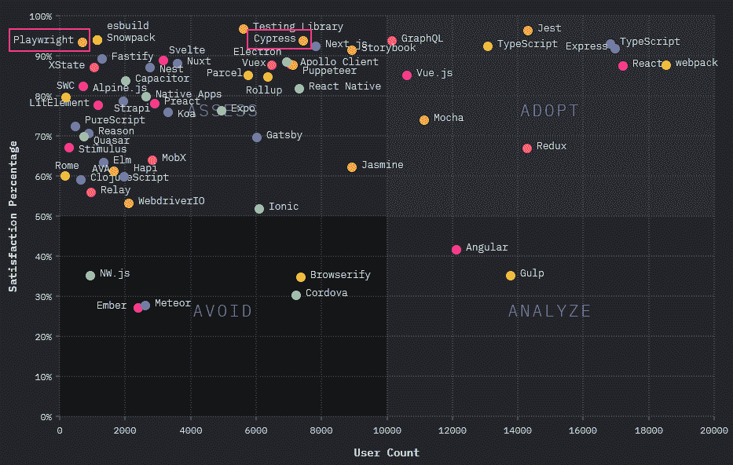
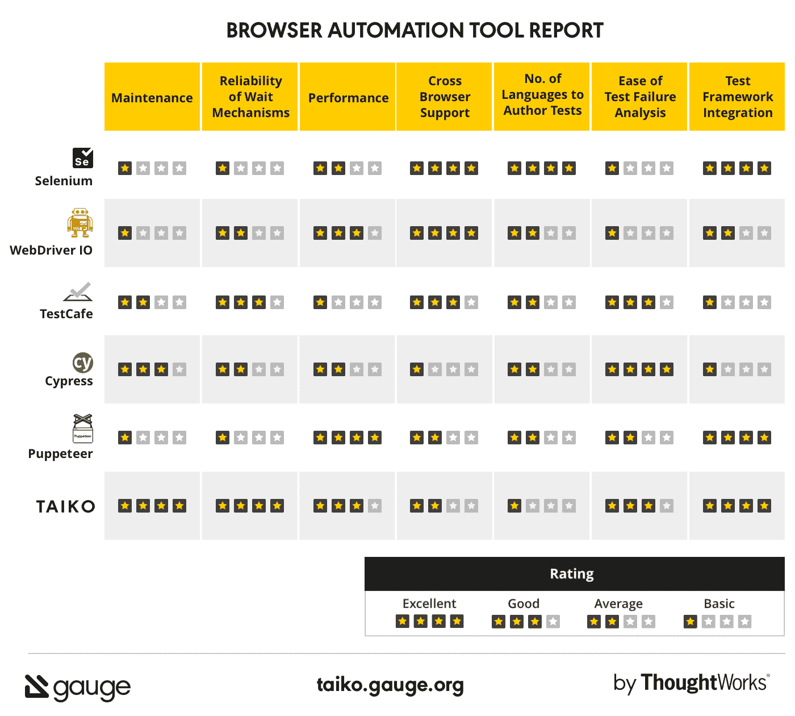
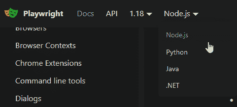

# 剧作家测试和浏览器自动化

> 原文：<https://itnext.io/playwright-test-and-browser-automation-9fa3121fd6ac?source=collection_archive---------1----------------------->

如果你已经关注我一段时间了，你会知道我对浏览器和测试自动化有兴趣。之前，我花了相当多的时间与 ThoughtWorks 的 [LeapWork](https://charliedigital.com/2020/02/15/automated-ui-testing-with-leapwork-intro-and-tutorial/) 和 [Taiko](https://charliedigital.com/2020/07/11/automated-ui-testing-with-taiko/) +Gauge 一起工作。

尽管我们在单元测试、测试驱动设计(TDD)、行为驱动设计(BDD)、设计决定质量等方面尽了最大努力。—我们仍然在手工测试上花费了过多的时间和精力*即使付出了这些努力* *和成本*，团队和产品最终还是会出现代价高昂的缺陷，这些缺陷有时只会影响可用性，有时会辜负用户的信任，在最坏的情况下会给用户带来一些损失。

部分原因是开发人员在预测终端用户如何与软件交互方面非常糟糕——我们倾向于成为更理性的人，认为只要终端用户像我们一样理性，就不会有任何错误！虽然像单元测试这样的实践原则上是合理的，但问题是开发人员根本不像最终用户那样思考和行为(开发人员往往高估了最终用户的理性)。开发人员太倾向于关注“快乐路径”测试。不要误解我，单元测试是有目的的，但是这个目的只是软件质量和测试的一小部分。我的团队遇到的缺陷很少出现在单元级别，几乎总是出现在过程/工作流级别。

部分原因是工具仍然有点粗糙，工作量和速度的门槛很高。最佳点是快速、易于采用和适应的工具。理想情况下，有了好的工具，QA 和测试人员可以专注于所谓的*探索性*测试，而不是*回归*测试。好的工具支持这种转变，允许从探索性测试中的发现到编码回归测试的低成本、低工作量的转换。如果一个团队不能有效地将手工测试中的发现转化为自动化回归测试，那么如果要保持质量，周期就会变得更长，因为手工回归测试只是简单地积累。

为了解决这个问题，我们需要满足几个标准的工具:

*   **快**。如果验证结果的时间太长，这意味着反馈回路会被延迟，而这种延迟会产生摩擦。
*   **可预测的**。如果过程是易变的，并且需要大量的人工分析，那么测试人员将回归到人工测试，因为结果是不可信的。
*   **易于使用和采用**。如果复杂度太高，开发者会避免去做或者不会做的很彻底。
*   **低付出，高回报**。如果工作量太大，项目所有者会更喜欢手工测试，因为对于某些功能来说，手工测试是不可避免的。换句话说，如果所涉及的工作影响了开发时间和可交付成果，项目所有者可能会选择将他们的预算花在 QA 测试人员身上，而不是开发时间上。

为此，团队不缺乏大规模应对这一挑战的方法。从 Selenium 到 WebDriver，再到 Cypress 和一系列其他工具、库和框架！

如何选择呢？

今天，我们正在看微软的开源库和工具集，叫做[剧作家](https://playwright.dev/)，在我看来，它在解决团队面临的现代 web 应用程序测试自动化挑战的许多关键方面都处于领先地位。

使用剧作家进行端到端 UI 测试自动化之旅

在 JavaScript 世界里，还是比较不为人知的。 [2020 年 JavaScript 状况调查](https://2020.stateofjs.com/en-US/technologies/)显示，它的采用仍处于萌芽状态(至少在 JavaScript 人群中), Cypress 无疑是更广泛采用的前端测试“默认”解决方案。

2020 年剧作家和赛普拉斯 JavaScript 调查结果

事实上，剧作家是木偶师的精神继承者，因为剧作家项目的两个主要贡献者是从建造木偶师的团队中聘请的。

那么应该从赛普拉斯转行吗？比太鼓好吗？让我们找出答案。

# 剧作家比较

ThoughtWorks 的 Gauge 团队实际上有一篇比较不同自动化工具的博客文章。这张方便的图表很好地总结了这一点:

ThoughtWorks 在 2020 年进行的比较

在某些方面，剧作家的前身 Puppeteer 在速度和框架集成方面确实很突出，但在其他几个方面得分很低。

好消息是，自从 ThoughtWorks 发表这篇博文以来，剧作家团队已经解决了许多这样的问题。

**跨浏览器支持？**轻松 4 ⭐⭐⭐⭐在剧作家因为它可以自动化 [**Chromium、*和* WebKit**](https://playwright.dev/docs/browsers) 以及对 [Android](https://playwright.dev/docs/api/class-android) 和[电子](https://playwright.dev/docs/api/class-electron)的实验支持。

**等待机制的可靠性？**安 ***斩钉截铁*** 4 ⭐⭐⭐⭐(观看视频)。事实上，剧作家和太鼓的美妙之处在于，你几乎从来不需要显式等待。更棒的是，当你想等待时，它提供了 [*等待特定网络响应*](https://playwright.dev/docs/api/class-page#page-wait-for-response) *的机制。这解决了使用这种端到端测试自动化框架的最大挑战之一，即处理不同环境和不同条件下响应时间的变化。使用`page.waitForResponse`，您的代码可以等待特定的 REST 或 GraphQL 响应，而不是盲目地等待 5000 毫秒。*

**测试失败分析的难易程度？** 4 ⭐⭐⭐⭐.drawing trace viewer 非常棒，它不仅记录了 UI，还记录了测试运行期间的网络和控制台。每个“框架”显示了每个步骤之前和之后的 UI 状态。它使得通过失败的测试运行变得非常容易。此外，还有各种测试调试选项。

**编写测试的语言数量？** 4 ⭐⭐⭐⭐.剧作家支持 [JS/TS](https://playwright.dev/docs/intro) 、 [Python](https://playwright.dev/python/docs/intro) 、 [Java](https://playwright.dev/java/docs/intro) 、[中的创作。网](https://playwright.dev/dotnet/docs/intro)！因为剧作家本身基本上是一个自动化库，它可以与任何测试运行器[一起使用，包括 Mocha、Jest、NUnit 等等](https://playwright.dev/docs/test-runners)！

剧作家提供对各种语言和运行时的支持。

Benjamin Gruenbaum 的写作和便利的比较工具是对工具的最新评估，他的比较中包括了剧作家。

# 其他关键特性

以上两篇博文都强调了任何前端自动化团队都应该认真考虑剧作家的一些原因，但还有很多很多原因，包括:

*   [**视觉比较**](https://playwright.dev/docs/test-snapshots) 比较用户界面的*视觉状态*。这对于处理渲染的图像、图表、图形或图表，或者当您需要测试非常具体的视觉布局时非常方便。
*   [**集成 API 测试**](https://playwright.dev/docs/test-api-testing) 允许您使用一个工具集进行端到端 UI 测试和 API 测试。
*   [**支持 Chrome 扩展**](https://playwright.dev/docs/chrome-extensions) ，可以加载到 Chrome 实例中。
*   [**多窗口、多标签支持**](https://playwright.dev/docs/browser-contexts) 允许测试复杂的交互和场景，包括实时、多用户用例(如聊天)。

因为 core 剧作家只是一个自动化库，所以当您需要文档/规范以及自动化时，它甚至可以与 Gauge 一起使用，以提供一种声明性 BDD 风格的方法来构建测试套件。

# 结束语

我认为剧作家有一点不足——至少与太鼓相比——是它在与选择器的合作中严重依赖于字符串。与大幸药品使用函数的方法相比，这种方法的缺点是在创作阶段更容易出错。我想念太鼓的另一个方面是 REPL 模式，在我看来，它真的很方便。但在所有其他方面，我是一个皈依者；剧作家的全面能力很容易战胜这些小差距。

如前所述，严格来说，剧作家本身并不是一个测试框架，它*包括了用于测试自动化的*工具。它的核心是一个多平台、跨浏览器的浏览器自动化工具。因此，有很多方法可以利用它来做一些有趣的事情，比如监控、屏幕捕捉、通用 UI 自动化等等。

如果作为软件工程师、产品负责人和 QA 团队，我们的目标是更快、更省力地生产出更好、更高质量的软件，那么我们也需要选择合适的工具来支持这个任务。剧作家就是这样一个工具，它做了很多正确的事情，团队继续听取社区的意见并改进工具集。

对于任何考虑端到端测试自动化的团队，不要错过评估剧作家。