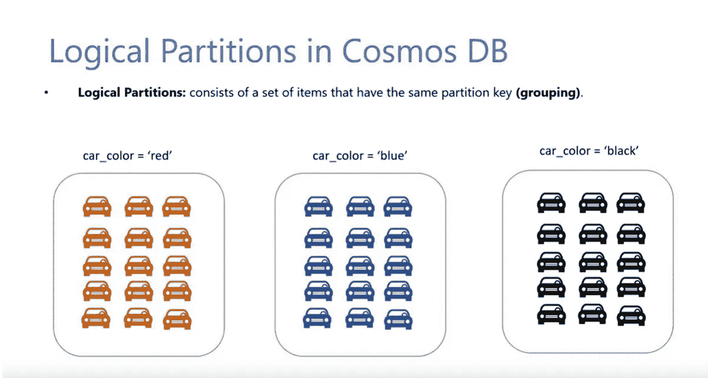

# 请不要使用带有实体框架的 Cosmos DB。

> 原文：<https://itnext.io/please-no-cosmos-db-with-entityframework-12184856a556?source=collection_archive---------0----------------------->

亚历克斯·普多夫在 [Unsplash](https://unsplash.com/s/photos/forbidden?utm_source=unsplash&utm_medium=referral&utm_content=creditCopyText) 上的照片

我见过一些项目使用[实体框架](https://learn.microsoft.com/en-us/ef/core/providers/cosmos/?tabs=dotnet-core-cli)来抽象 Cosmos DB，试图简化开发人员的生活。尽管如此，对成本、性能和错误概率的权衡强烈支持永远不要把两者混为一谈，就像可口可乐和曼妥思一样。让我们从指出它们各自的优点开始。

# 实体框架

## 实体框架擅长什么？

它提供了开发速度，您可以轻松地读取、删除、创建和更新实体，而无需编写一行 SQL。它还能让你做各种各样的有趣的自动生成的查询，包括连接、分页、排序等等。

它还具有模式管理和[迁移](https://learn.microsoft.com/en-us/ef/core/managing-schemas/migrations/?tabs=dotnet-core-cli)，因此您可以获得管理数据库表、过程、视图等的连续交付能力。

## 有什么不好的地方？

它是一个抽象层，由于不支持 SQL 支持的东西，或者仅仅是由于开发人员没有看到和想到正在执行什么查询，它也会带来痛苦。

在许多情况下，这会导致性能问题，因为查询不是手工完成的，查询太多的表，没有考虑索引等等。这更多的是你如何使用工具，而不是工具本身的问题。

## 我什么时候使用实体框架？

当你需要快速上市时，我喜欢实体框架，我们可以牺牲一点代码性能。对于团队来说，熟练使用该工具也很重要，这样他们就不会在 LINQ 查询中犯大错误，比如在内存中分页。

# 宇宙数据库

Cosmos DB 徽标

## Cosmos 擅长什么？

Cosmos 不是 SQL 等价物，所以我们不应该把所有东西都移植到它里面。Cosmos 解决了特定的问题，比如文档存储和全局水平可伸缩性。什么是文档存储？

当通过 id 存储一个 JSON 对象时，在 Cosmos 中通过这个 Id 获取和保存东西是超快速和廉价的。存储 JSON 为您提供了无模式的灵活性，拥有多个属性级别允许您在一个文档中存储多种对象类型。

与 SQL 相比，Cosmos 也是“无模式”的。您仍然有一个隐式模式，您的代码需要与之保持兼容，但这与在一个规范化的数据库上管理多个表相去甚远。

即使数据库在增长，水平可伸缩性也能保持我们的性能不变。为了支持这一点，如果数据库超过 20 GB，那么我们需要通过用一个**分区键**对数据进行分区来水平划分 Cosmos。

Cosmos DB 分区示例

## 宇宙不擅长什么？

它支持文档存储模型之外的查询，但是它很难做到。不知道分区键的查询称为跨分区查询，开销非常大。我指的不仅仅是糟糕的表现，而是要花很多钱。我曾经遇到过这样的客户，他们糟糕的分区键选择每年给公司造成 150 多万美元的损失。

随着数据被分区，理想情况下，您需要使用分区来访问数据，而不仅仅是为了查询。因此，知道如何使用这些数据会影响你使用 Cosmos 还是规范化数据库的决定。此外，事务只能保证进入一个分区。

# 为什么我们不能和宇宙混合？

如果使用不当，Cosmos 会导致很多痛苦，在其上添加一个不反映 Cosmos 概念的抽象层是增加这种情况发生的机会的一种方法。当没有询问您分区是什么时，进行跨分区查询要容易得多。

除了这一要点之外，还有其他实施问题。EF Core 向 Cosmos 文档添加了一个名为 Discriminator 的属性，这是被存储的实体的名称。如果重命名实体，现有记录将无法正确读取，这是不向后兼容的。

存储在 Cosmos 中的示例文档，带有额外的鉴别器属性

文档存储的主要好处之一是拥有多级属性，而不必担心模式。在 EF Core Cosmos 中，您将不得不管理该对象中的子集合和关系。

# 结论

Cosmos 是您解决业务问题(如文档存储和全球水平可伸缩性)的工具的一个很好的补充，但如果使用不当，将会付出很大的代价。像开发 SQL 数据库一样使用 Cosmos 的风险太高，所以我强烈建议不要使用实体框架提供者。

快乐工程。