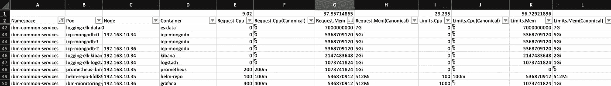
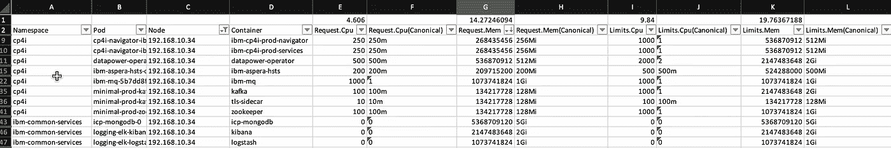

# Pod 资源电子表格计算器

> 原文：<https://itnext.io/pod-resource-spreadsheet-calculator-22fc5c6173b9?source=collection_archive---------3----------------------->


我需要计算 pod 资源需求，以适当调整群集规模。

使用 kubectl 的定制输出格式，我可以很容易地获得请求资源值，

```
kubectl get pods -A -o go-template --template='
{{ range $i, $pod := .items -}}
  {{range .spec.containers -}} 
    {{ $pod.metadata.namespace }} {{ $pod.metadata.name }} {{.resources.requests.cpu}} {{.resources.requests.memory}} 
  {{end -}}
{{end}}'
```

然后，通过一些 shell 脚本的巫术，我能够获得单独的 CPU/内存请求值。然而，为了合计价值，我需要处理不同的资源单元，例如，

```
256Mi
100M
1Gi
```

事情开始变得棘手...

我没有使用这种方法，而是用 go-client 创建了一个工具来查询资源(限制和请求)并保存为电子表格格式，以便我可以进一步过滤和计算它。

代码非常简单。

```
package mainimport (
 "context"
 "fmt"
 "log"
 "os"
 "pkg/k8sDiscovery" "github.com/360EntSecGroup-Skylar/excelize/v2"
 "github.com/sirupsen/logrus"
 "github.com/zhiminwen/quote"
 metav1 "k8s.io/apimachinery/pkg/apis/meta/v1"
)func main() {
 namespace := os.Getenv("K8S_NAMESPACE")
 clientSet, _, err := k8sDiscovery.K8s()
 if err != nil {
  logrus.Fatalf("Failed to connect to K8s:%v", err)
 } pods, err := clientSet.CoreV1().Pods(namespace).List(context.Background(), metav1.ListOptions{})
 if err != nil {
  logrus.Fatalf("Failed to connect to pods:%v", err)
 } f := excelize.NewFile()
 f.SetActiveSheet(f.NewSheet("Sheet1")) header := quote.Word(`Namespace Pod Node Container Request.Cpu Request.Cpu(Canonical) Request.Mem Request.Mem(Canonical) Limits.Cpu Limits.Cpu(Canonical) Limits.Mem Limits.Mem(Canonical) `)
 err = f.SetSheetRow("Sheet1", "A2", &header)
 if err != nil {
  logrus.Fatalf("Failed to save title row:%v", err)
 }
 err = f.AutoFilter("Sheet1", "A2", "L2", "")
 if err != nil {
  logrus.Fatalf("Failed to set auto filter on title row:%v", err)
 } row := 3
 for _, p := range pods.Items {
  for _, c := range p.Spec.Containers {
   reqCpu := c.Resources.Requests.Cpu()
   reqMem := c.Resources.Requests.Memory()
   limCpu := c.Resources.Limits.Cpu()
   limMem := c.Resources.Limits.Memory() cellName, err := excelize.CoordinatesToCellName(1, row)
   if err != nil {
    log.Fatalf("Could not get cell name from row: %v", err)
   }
   err = f.SetSheetRow("Sheet1", cellName,
    &[]interface{}{
     p.Namespace,
     p.Name,
     p.Status.HostIP,
     c.Name,
     reqCpu.MilliValue(), reqCpu,
     reqMem.Value(), reqMem,
     limCpu.MilliValue(), limCpu,
     limMem.Value(), limMem,
    })
   if err != nil {
    logrus.Fatalf("Failed to save for pod:%v", p.Name)
   }
   row = row + 1
  }
 } f.SetCellFormula("Sheet1", "E1", fmt.Sprintf(`subtotal(109, E3:E%d)/1000`, row))           //cpu
 f.SetCellFormula("Sheet1", "G1", fmt.Sprintf(`subtotal(109, G3:G%d)/1024/1024/1024`, row)) // mem
 f.SetCellFormula("Sheet1", "I1", fmt.Sprintf(`subtotal(109, I3:I%d)/1000`, row))
 f.SetCellFormula("Sheet1", "K1", fmt.Sprintf(`subtotal(109, K3:K%d)/1024/1024/1024`, row)) if err = f.SaveAs("resource.xlsx"); err != nil {
  logrus.Fatalf("Failed to save as xlsx:%v", err)
 }
}
```

我使用 clientSet 接口获取特定名称空间或所有名称空间的所有 pod，然后遍历这些 pod，为每个容器获取其请求资源，然后保存在电子表格中。我还添加了一些公式，根据过滤后的结果得到资源的总和。

按命名空间划分的所有请求的示例结果。



按名称空间过滤

节点请求的示例结果，以便我们可以理解为什么节点不能调度更多的 pod。



按节点过滤

该工具的源代码可在[git repo](https://github.com/zhiminwen/PodResourceCalculator)上获得。