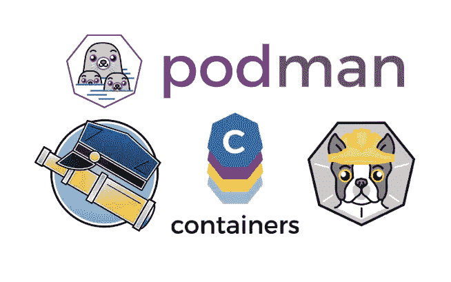

# macOS 上的波德曼和斯科佩奥

> 原文：<https://itnext.io/podman-and-skopeo-on-macos-1b3b9cf21e60?source=collection_archive---------3----------------------->

几年来，Docker 是围绕容器做一切事情的工具:构建、管理、运行和调试映像。随着容器和 [OCI](https://www.opencontainers.org/) 标准化倡议的日益流行，开源社区中出现了其他工具。主要动机是不再需要一个需要 root 访问的守护进程。

[Podman](https://podman.io/) 、 [Skopeo](https://github.com/containers/skopeo) 和 [Buildah](https://buildah.io/) 是一套工具，可以用来管理和运行容器映像。它们与 Docker 镜像兼容，并且大部分遵循相同的命令行语法来实现简单的切换。快速介绍见:[向 Buildah、Podman 和 Skopeo 问好](https://servicesblog.redhat.com/2019/10/09/say-hello-to-buildah-podman-and-skopeo/)和 [Podman 和 Buildah for Docker 用户](https://developers.redhat.com/blog/2019/02/21/podman-and-buildah-for-docker-users/)。



默认情况下，这些工具是为 Linux 创建的。虽然通常需要 Linux 主机来运行容器，但 Docker 桌面应用程序运行虚拟机来提供 macOS 和 Windows 上的无缝体验。围绕这些新工具的工作正在进行，以便在非 Linux 主机上提供类似的透明解决方案，但是在撰写本文时，他们需要一些手工准备。让我们看看这到底意味着什么。

# 波德曼远程客户端

Podman 是启动和管理容器的工具。在 macOS 上，我们必须使用瘦 [*远程客户端*](https://github.com/containers/libpod/blob/master/docs/tutorials/mac_client.md) 连接到运行在 Linux 主机上的真正的 Podman 进程——可以是一个 [Linux 虚拟机，如本文后面的](#a900)所述。以下是配置*远程客户端*与 Linux 主机协同工作的主要步骤:

*   从`https://github.com/boot2podman/libpod/releases/`下载*远程客户端*二进制
*   将基于[密钥的 ssh](https://www.ssh.com/ssh/authorized-key) 设置为 Linux 主机的 root 我们现在假设主机名*Linux host*——因此`ssh root@linuxhost`必须与我们的 Mac 上的普通用户一起工作:

```
$ ssh-keygen
$ cat ~/.ssh/id_rsa.pub
ssh-rsa AAAAB3...# Login to the Linux host somehow and append the content of your id_rsa.pub to /root/.ssh/authorized_keys.# Then ssh as root should work from Mac:
$ ssh root@linuxhost
[root@linuxhost ~]#
```

*   Linux 主机需要安装 Podman 并启动[*var link*](https://www.projectatomic.io/blog/2018/05/podman-varlink/)socket*io . Podman . socket*(见下面的[)。这被*远程客户端*用来执行调用 Podman 的 API 的命令。](#a900)
*   运行*远程客户端*指向 Linux 主机:
    
*   可以通过创建一个[*pod man-remote . conf*](https://www.mankier.com/5/podman-remote.conf)文件来跳过这些连接参数:

```
$ cat <<EOF >$HOME/.config/containers/podman-remote.conf
[connections]
    [connections.host1]
    destination = "linuxhost"
    username = "root"
    default = true
EOF# With the remoting file configured we can run podman simply as:$ podman images
REPOSITORY   TAG   IMAGE ID   CREATED   SIZE
```

# 让我们波德曼

简单的信息命令如预期的那样工作。当然，图像是存储的，容器运行在 Linux 主机上，而不是我们的 Mac 上。同样，我们运行的 *podman* 只是连接到运行在我们的 Linux 主机上的真正的 podman 进程的*远程客户端*。

```
$ podman version
Client:
Version:            1.6.1-dev
RemoteAPI Version:  1
Go Version:         go1.12.9
OS/Arch:            darwin/amd64Service:
Version:            1.6.2
RemoteAPI Version:  1
Go Version:         go1.13.1
OS/Arch:            linux/amd64$ podman images
REPOSITORY                TAG      IMAGE ID      CREATED      SIZE
docker.io/library/tomcat  latest   6408fdc94212  2 weeks ago  519 MB
docker.io/library/nginx   latest   231d40e811cd  2 weeks ago  130 MB$ podman ps
CONTAINER ID  IMAGE                            ... 
3a17822f599c  docker.io/library/tomcat:latest  ...$ podman inspect docker.io/library/tomcat
[ { "Id": "6408fdc9421224b1034..."
...
```

让我们尝试最常见的任务:运行容器。

```
$ podman run --name mytomcat -d docker.io/tomcat
3a17822f5...$ podman logs -f mytomcat
11-Dec-2019 03:30:03.348 INFO [main] org.apache.catalina.startup...$ podman stop mytomcat
3a17822f5...$ podman start mytomcat
3a17822f5...$ podman attach mytomcat
11-Dec-2019 03:30:03.348 INFO [main] org.apache.catalina.startup...
```

与在 Linux 上使用 Podman 相比，一个不同之处在于，在交互模式下，按 Ctrl+C 不是停止容器，而是断开连接，容器继续在后台运行，因此如果我们想要停止它，我们必须在之后运行`podman stop` 。

```
$ podman run -p 8080:80 -d nginx
31c5b702... $ curl [http://localhost:8080/](http://localhost:8080/)
curl: (7) Failed to connect to localhost port 8080$ curl [http://linuxhost:8080/](http://linuxhost:8080/)
<!DOCTYPE html>...
```

如果我们试图将一个目录作为一个卷挂载到容器中，我们会遇到类似的问题。该目录必须存在于 Linux 主机上，而不是我们的 Mac 上。

```
# Trying to use a local directory
$ mkdir -p /Users/bszeti/tmp/html
$ podman run -v /Users/bszeti/tmp/html:/usr/share/nginx/html nginx
Error: error checking path "/Users/bszeti/tmp/html": stat /Users/bszeti/tmp/html: no such file or directory# The directory is expected on the Linux host
$ ssh root@linuxhost 'mkdir -p /var/www'
$ podman run -v /var/www:/usr/share/nginx/html nginx
f89ade8d33...
```

## 证明

一些图像注册需要认证。传统上，您可以通过以下三种方式之一来执行此授权:

*   在连接到注册表之前做一个初始的`podman login`
*   手动创建一个`[authfile](https://www.projectatomic.io/blog/2016/03/docker-credentials-store/)`
*   在命令行中传递我们的凭据。

不幸的是，当使用*远程客户端*时，这些选项似乎都不起作用。

```
$ podman pull registry.redhat.io/ubi8/ubi
Error... unable to retrieve auth token: invalid username/password$ podman login registry.redhat.io
Error: unrecognized command `podman login`$ podman pull --creds 'bszeti@redhat.com:mysecret' registry.redhat.io/ubi8/ubi
Error... unable to retrieve auth token: invalid username/password$ podman pull --authfile auth.json registry.redhat.io/ubi8/ubi
Error: unknown flag: --authfile
```

根据波德曼项目，这是为*远程客户端*进行的[工作。当前的解决方法是在从经过认证的注册表中提取之前，使用`podman login`直接登录到 Linux 主机上。](https://github.com/containers/libpod/issues/4039)

```
$ ssh root@linuxhost[root@linuxhost ~]# podman login registry.redhat.io
Username: bszeti@redhat.com
Password:
Login Succeeded!# Check /run/containers/0/auth.json or /run/user/0/containers/auth.json
[root@localhost ~]# cat /run/user/0/containers/auth.json
{
 "auths": {
  "registry.redhat.io": {
    "auth": "...<username:password in base64>..."
  }
 }
}[root@localhost ~]# exit$ podman pull registry.redhat.io/ubi8/ubi
Getting image source signatures
Copying blob sha256:0e8ea26...
```

*对 Podman v1.8.0* 的更新:
似乎有一个新功能，当没有活动的 *ssh* 会话时，它会删除默认的`/run/user/0/containers/auth.json`文件。这增加了安全性，但是使得使用*远程客户端*更加困难，因为[不支持](https://github.com/containers/libpod/blob/v1.8.0/cmd/podman/pull.go#L60)参数`--authfile`。一个解决方法是在默认的 docker 配置路径中复制`podman login`后的`auth.json`，这个路径似乎也被 Podman 使用:

```
[root@localhost ~]# mkdir /root/.docker/
[root@localhost ~]# cp /run/user/0/containers/auth.json /root/.docker/config.json
```

> 要登录到 *registry.redhat.io* ，最好创建一个[注册表服务帐户令牌](https://access.redhat.com/terms-based-registry/)，而不是使用您自己的凭证，因为密码简单地存储在 base64 的 auth 文件中。

## 构建图像

与波德曼匹配的构建工具是 [Buildah](https://github.com/containers/buildah) 。它不能以任何形式直接在 macOS 上使用，但是它的功能可以通过幕后的`podman build`命令来利用。这样我们就可以用 Podman 从 Dockerfile 文件中构建图像。

> *podman-remote.conf* 文件似乎被`podman build` 命令忽略了，所以我们要给每个命令加上`--remote-host linuxhost --username root`。

让我们使用一个简单的 *Dockerfile* 来构建一个服务于静态文件的映像。

```
FROM registry.redhat.io/ubi8/ubiRUN yum update -y
RUN yum install -y httpdCOPY index.html /var/www/html/ENTRYPOINT [ "/usr/sbin/httpd" ]
CMD [ "-D", "FOREGROUND" ]
```

我们将 *Dockerfile* 和*index.html*放在 Mac 上的一个目录中，并从那里运行`podman build` 来构建映像。新的映像将被构建并存储在 Linux 主机上，可以像所有提取的映像一样运行。

```
$ podman --remote-host linuxhost --username root build --tag mytag .
... build log ...$ podman images
REPOSITORY       TAG      IMAGE ID       CREATED             SIZE
localhost/mytag  latest   56d835d0d82f   About a minute ago  557 MB$ podman run -d -p 8080:80 localhost/mytag
$ curl [http://linuxhost:8080/](http://fedora.vbox:8080/)
... index.html content ... 
```

*对 Podman v1.8.0 的更新:*
`build`命令似乎不起作用，找不到从 Mac 发送到 Linux 主机的编译源代码。

## 推送图像

*remote-client v.1.6.0* 曾经有一个关于`push`命令的 [bug](https://github.com/containers/libpod/issues/4706) ，所以我们不能将图像直接上传到远程图像注册中心。

```
$ podman push localhost/mytag:latest quay.io/bszeti/myimage:latest
panic: runtime error: invalid memory address or nil pointer dereference
```

*对 Podman v1.8.0 的更新:*
`push`命令效果更好，但有时会丢一条`Error: unexpected EOF`消息。添加`--log-level debug`似乎有助于这个问题。

作为解决方法，我们可以将图像保存为 tar 文件(在我们的 Mac 上)，并使用 Skopeo 上传到注册表中:

```
# Save image as a docker-archive (default format)
$ podman save localhost/mytag:latest -o /tmp/mytag.latest.tar# Upload image into registry
$ skopeo copy docker-archive:/tmp/mytag.latest.tar docker://quay.io/bszeti/mytag:latest
```

> 以`docker-dir`或`oci-dir`格式`podman save`保存时出现意外的权限错误。

## 设置定制的 Linux 虚拟机

下面简单介绍一下如何设置一个 Linux 虚拟机来尝试 Podman:

*   [虚拟盒子](https://www.virtualbox.org/wiki/Downloads) v6.0
*   [Fedora 31 工作站](https://getfedora.org/en/workstation/download/) —使用 [x86_64 DVD ISO](https://download.fedoraproject.org/pub/fedora/linux/releases/31/Workstation/x86_64/iso/Fedora-Workstation-Live-x86_64-31-1.9.iso) 安装在虚拟机中

两个网络适配器:

*   **NAT** :虚拟机可以通过这个接口访问互联网，但是没有人可以访问虚拟机。
*   **主机专用适配器**:从 macOS 主机访问 VM 需要这个接口。分配的 IP 在虚拟机的生命周期内不会改变。在 Mac 的 hosts 文件中添加一个条目是一个好主意，这样我们就可以用主机名访问 VM。
    `sudo sh -c 'echo 192.168.99.100 linuxhost >>/etc/hosts'`

通过以 root 用户身份在虚拟机上运行以下命令，准备 Linux 虚拟机运行 Podman:

```
# Install SSH server 
yum install openssh-server
systemctl start sshd.service
systemctl enable sshd.service# Optionally if podman was missing:
yum -y install podman
# Optionally get the latest test version
yum distro-sync --enablerepo=updates-testing podman# Enable Podman socket
systemctl start io.podman.socket
systemctl enable io.podman.socket
```

最后，我们需要为*远程客户端*设置基于密钥的 ssh 访问，如前面章节中的[所述。之后，只要 VM 启动并运行，我们就应该能够使用 Podman。](#546f)

## Podman-machine 作为 Linux 虚拟机

使用 [podman-machine](https://github.com/boot2podman/machine) 为 Podman 建立一个 Linux VM 有一个更简单的方法。参见相关的[博客](https://developers.redhat.com/blog/2020/02/12/podman-for-macos-sort-of)，它描述了如何安装一个拥有所需工具和配置设置的 Linux VM。它也可以与*远程客户端*一起使用。

安装 *podman-machine* 并创建一个虚拟机:

```
# Download podman machine
$ curl -L [https://github.com/boot2podman/machine/releases/download/v0.16/podman-machine.darwin-amd64](https://github.com/boot2podman/machine/releases/download/v0.16/podman-machine.darwin-amd64) --output /usr/local/bin/podman-machine
$ chmod +x /usr/local/bin/podman-machine# Use the Fedora31 VM image from the blog. Change the shared directory location to a valid path
$ podman-machine create --virtualbox-boot2podman-url [https://github.com/snowjet/boot2podman-fedora-iso/releases/download/d1bb19f/boot2podman-fedora.iso](https://github.com/snowjet/boot2podman-fedora-iso/releases/download/d1bb19f/boot2podman-fedora.iso) --virtualbox-memory="4096" --virtualbox-share-folder **~/code**:code fedbox# (Optional) Upgrade Podman in VM
$ podman-machine upgrade fedbox# Verify
$ podman-machine ssh fedbox
[tc@fedbox ~]$ podman version
```

配置*远程客户端*使用虚拟机:

```
# Check IP of the VM
$ podman-machine ip fedbox
192.168.99.103# Check SSH key location
$ podman-machine config fedbox
...
--identity-file=/Users/bszeti/.local/machine/machines/fedbox/id_rsa# Set podman-remote.conf as below - identity_file requires v1.6.2+
$ cat $HOME/.config/containers/podman-remote.conf
[connections]
    [connections.host1]
    destination = "192.168.99.103"
    username = "root"
    default = true
    identity_file = "/Users/bszeti/.local/machine/machines/fedbox/id_rsa"# Verify
$ podman version
```

> 注意:在这台机器上，`auth.json`文件的默认路径是`/run/containers/0/auth.json`

# 斯科佩奥

Skopeo 是一个简单的命令行工具，用于与注册中心交互和管理——检查、复制和删除——集装箱图像。虽然这些任务也可以用 Podman 来完成，但 Skopeo 是一种更轻量级的“做一件事并把它做好”的工具。

使用`brew install skopeo`可以很容易地将二进制文件安装在 macOS 上，我们根本不需要 Linux 主机——可以随意停止您的 Linux VM。

```
$ skopeo -v
skopeo version 0.1.40
```

在我们做任何有用的事情之前，我们需要创建一个 [containers-policy](https://www.mankier.com/5/containers-policy.json) 文件，该文件包含决定我们是否接受一个提取的图像的验证规则。默认位置是`/etc/containers/policy.json`，或者我们可以指向另一个添加了`--policy <policy file>`参数的文件。或者，我们可以使用`--insecure-policy`参数接受所有图像。注意，这些策略参数是“全局”参数，必须添加在动作命令之前(即`inspect`、`copy`、`delete`等)。最简单的方法是创建一个策略文件，允许所有注册表位于默认位置:

```
$ sudo sh -c 'cat >/etc/containers/policy.json' <<EOF 
{
    "default": [
        {
            "type": "insecureAcceptAnything"
        }
    ],
    "transports":
        {
            "docker-daemon":
                {
                    "": [{"type":"insecureAcceptAnything"}]
                }
        }
}
EOF
```

为了访问需要认证的注册中心，我们需要以某种方式传递凭证。我们有两个选择:

*   **用户名:密码**:根据命令使用`--creds`、`--src-creds`、`--dest-creds`参数
*   **authfile** : Docker auth 文件，同上，用于 Podman。可以通过`--authfile <auth file>`添加。如果没有设置，Skopeo 会查看默认位置:`$HOME/.docker/config.json`。以下是一个示例文件:

```
{
 "auths": {
  "registry.redhat.io": {
    "auth": "<username:password in base64>"
  },
  "quay.io": {
    "auth": "bXl1c2VyOm15c2VjcmV0"
  }
 }
}
```

信任或忽略 TLS 证书可以通过基于正在使用的 Skopeo 命令的各种参数来实现:`--cert-dir`、`--tls-verify`、`--src-cert-dir`、`--src-tl-verify`、`--dest-cert-dir`、`--dest-tls-verify`。

## 检查

Skopeo 可用于从注册表中读取有关图像的信息，而无需先下载图像:

```
$ skopeo inspect docker://quay.io/quay/busybox:latest
{
    "Digest": "sha256:91aa1e3e55765a568...",
    "RepoTags": ...
```

对于支持映像的多个操作系统版本的注册表，需要添加全局参数`--override-os linux`，否则默认为不存在的 MacOS `OS darwin`。

```
$ skopeo **--override-os linux** inspect docker://docker.io/nginx$ skopeo **--override-os linux** inspect --authfile myauth.json docker://registry.redhat.io/openshift3/jenkins-2-rhel7
```

有关详细信息(如层、入口点、cmd ),请查看注册表的原始响应:

```
$ skopeo --override-os linux inspect **--config --raw** docker://docker.io/nginx | jq .
```

Inspect 也可用于以某种格式保存在本地磁盘上的图像(例如，如果图像是使用`skopeo copy`下载的):

```
# Image saved as docker-archive
$ skopeo inspect docker-archive:/tmp/mytag.latest.tar# Inspecting oci-archive images tries to use /var/tmp/, needs sudo
$ sudo skopeo inspect oci-archive:/tmp/mytag.latest.oci# Image saved as directory or oci directory
$ skopeo inspect dir:/tmp/mytag-latest-dir/
$ skopeo inspect oci:/tmp/mytag-latest-oci/
```

## 复制

我们用 Skopeo 做的最常见的任务是将图像从一个注册表复制到另一个注册表。需要几个参数，但是在理解了我们在上面的`inspect`命令中使用的基本参数之后，它们就很明显了。在以下示例中，我们将从`registry.redhat.io`向`quay.io`复制一个 Jenkins 映像:

```
# Simple case - policy and auth file prepared$ skopeo --override-os linux copy docker://registry.redhat.io/openshift3/jenkins-2-rhel7:v3.11 docker://quay.io/bszeti/jenkins:v3.11
```

> 注意:`--override-os linux`可能需要，也可能不需要，这取决于注册表，就像`skopeo inspect`一样

我们现在可以将之前讨论过的身份验证和 TLS 参数分层，例如在专用存储库之间复制映像:

```
$ skopeo --insecure-policy copy 
--src-tls-verify=false --dest-tls-verify=false 
--src-creds 'devuser:secret' --dest-creds 'myuser:secret' docker://devregistry.host:5000/myteam/myapp:v1 docker://myregistry.host:8443/myteam/myapp:mytag
```

我们也可以使用`skopeo copy`来标记图像。Skopeo 检查这些层是否已经存在于目标注册表中，这样就不会复制不必要的数据。

```
$ skopeo copy 
docker://myregistry:8443/myteam/myapp:v1 docker://myregistry:8443/myteam/myapp:qa
```

也可以使用`copy`命令将图像以不同的格式保存在本地磁盘上。

```
$ skopeo copy docker://docker.io/nginx docker-archive:/tmp/nginx.tar
$ skopeo copy docker://docker.io/nginx oci-archive:/tmp/nginx.oci
$ skopeo copy docker://docker.io/nginx dir:/tmp/nginx-dir
$ skopeo copy docker://docker.io/nginx oci:/tmp/nginx-oci
```

> 注意:在某些情况下，Skopeo 在管理归档文件时会使用`/var/tmp`下的临时目录，所以我们可能会遇到权限问题，除非它以 root 用户身份运行。

# 摘要

当可以放心地在 Linux 机器上使用时，新的一套无后台、开源的容器管理工具已经达到了成熟的水平。不幸的是，它们还没有完全融入 macOS。然而，通过一些手工准备和一些小的注意事项，我们现在可以开始使用这些工具了。希望这个指南已经帮助你使这个旅程变得不那么复杂，同时正在进行的工作带给我们一个更加无缝的体验。