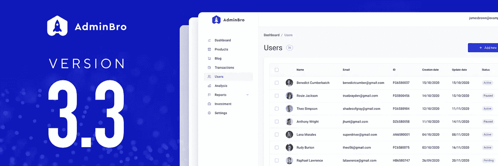
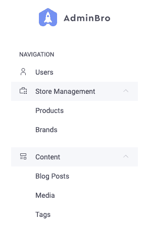
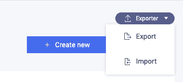
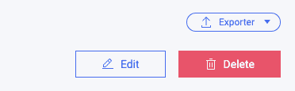
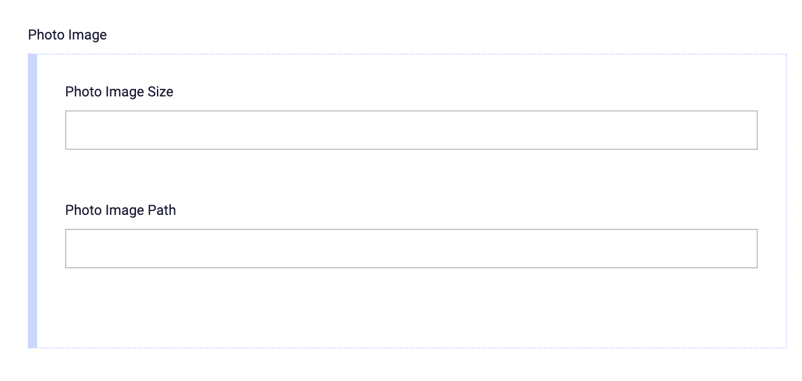
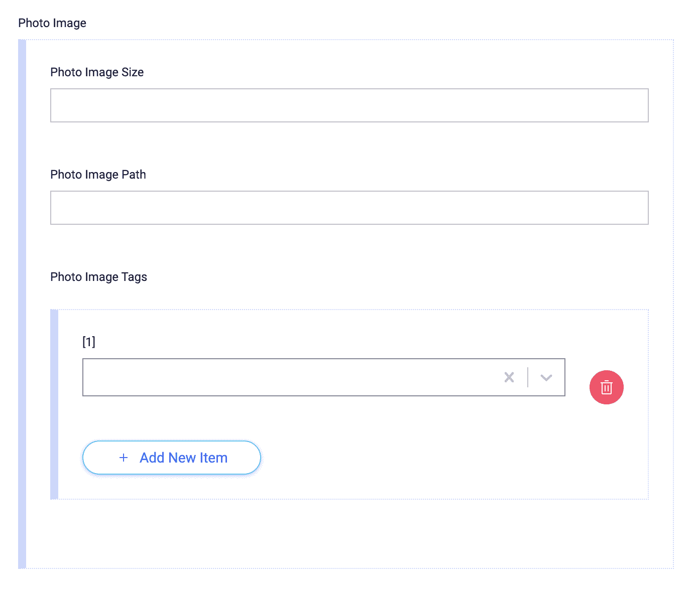
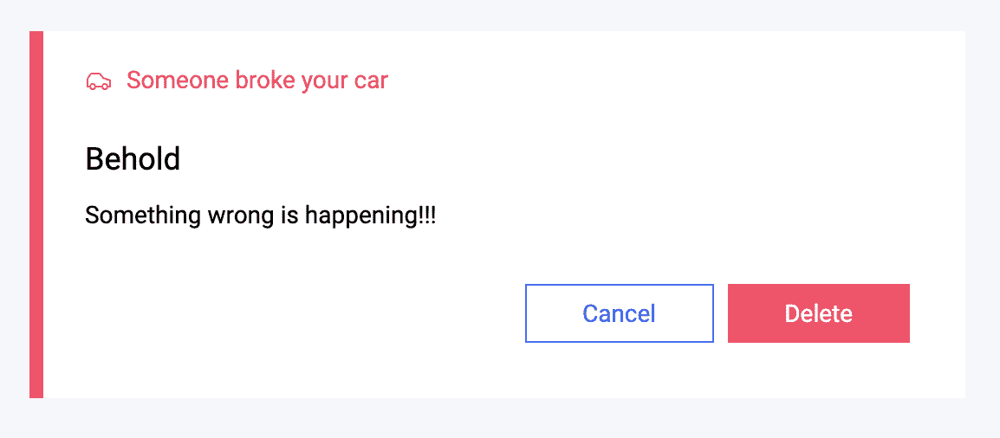

# 热门节点。JS + React 管理面板，AdminBro 刚刚发布了 3.3 版——今年最大的版本

> 原文：<https://itnext.io/popular-node-js-react-admin-panel-adminbro-just-got-version-3-3-the-biggest-release-this-year-ced0a90e3431?source=collection_archive---------3----------------------->

…目前为止:)



上个月，在 [SoftwareBrothers](https://softwarebrothers.co/) ，我们正在开发 [admin-bro](https://github.com/SoftwareBrothers/admin-bro) 的下一个版本——node . js 应用的自动化管理面板。它本来是一个常规的小版本，但是当我们在开发它的时候，新的想法开始出现，我们以一个巨大的更新结束。在这篇文章中，我将引导你了解在`yarn add admin-bro@latest`之后你可以马上使用的新东西。

首先，看一下我们更新的大区域:

*   新配置选项
*   处理嵌套模式，即使 ORM 不能很好地处理它们(又名 JSONB 支持)
*   用新组件更新设计系统
*   更易于定制和数据管理的新挂钩
*   使用扁平模块进行更好的数据操作
*   提高产品质量的架构变化(其中一些会破坏你现有的应用程序)

希望你和我们一样激动:)所以让我们进入细节。

# 新配置选项

在此版本中，我们向操作和属性添加了新的(应用户请求)选项:

1.  **【移出】导航中的元素:** [**导航**](https://adminbro.com/ResourceOptions.html#navigation)

这个选项可以让您轻松地将导航中的一个元素移到顶层，这在以前必须通过覆盖导航组件来完成，这并不容易做到。

在下面的截图中,`users`已经被移动到“根”级别:



**2。嵌套动作**

我们注意到，当你有许多自定义动作时——它们不容易适应 UI，唯一的解决方法是禁止自动渲染它们(将 [hideActionHeader](https://adminbro.com/Action.html#hideActionHeader) 选项设置为 false ),然后自己渲染它们。同样，这不是一件容易的事情。

在 3.3 版中，我们引入了嵌套操作的选项，就像将资源嵌套到父元素中一样。您可以使用新的[动作#父项](https://adminbro.com/Action.html#parent)选项来完成此操作。

嵌套操作如下所示:



您也可以嵌套*批量*、*记录*或*资源*动作。

**3。动作变量**

另一个 UI 问题是所有的动作看起来都一样。因为我们在设计系统中有一个颜色变体，我们现在可以让你[将它](https://adminbro.com/Action.html#variant)传递给你的动作，这样它就可以被强调。

这是按钮操作设置为“危险”变量时记录操作部分的外观:



**4。动作**中新增 `**custom**` **选项**

在 [PropertyOptions](https://adminbro.com/PropertyOptions.html) 中，总是有一个[自定义](https://adminbro.com/PropertyOptions.html#custom)选项被传递(在 [PropertyJSON](https://adminbro.com/PropertyJSON.html) 中)给你的组件，这样你就可以从后端配置它们，使它们更加可重用。

在 3.3 版中，我们还为 Action options 添加了一个类似的属性。您可以在此设置它[，它将在您的自定义操作中可用。](https://adminbro.com/Action.html#custom)

**5。属性选项**中新增 `**props**` **选项**

AdminBro 内核很好地呈现了标准属性，如*输入*、*密码*、*文本区域*等。但是可以添加无数选项来修改基本行为，如`placeholder`、`margins`、`size`等。这就是为什么我们添加了新的选项 [props](https://adminbro.com/PropertyOptions.html#props) ，它被嵌入到我们传递给为给定属性类型选择的实际输入组件的 props 中。

让我给你举个例子:

如果你把下面的道具传递给“字符串”类型的属性(渲染 [<输入>组件](https://adminbro.com/Input.html)):

```
{
  borderless: ‘true’,
  variant: ‘xxl’,
  placeholder: ‘fill me in’,
}
```

您将在表单中输入以下内容:


**6。隐藏标签的能力**

除了新的 props 选项之外，您现在可以隐藏输入上方的标签——这在上面的例子中对于大的无边框输入是有意义的。

这里可以做[。](https://adminbro.com/PropertyOptions.html#hideLabel)

**7。ResourceJSON.properties**

接下来的事情不是选择，而是回应。我们已经在 ResourceJSON 中添加了一个[属性的映射，因此您可以轻松地从中获取任何属性。不需要在类似(`edit` | `show` | `list` | `filter` ) `Properties`的数组中寻找属性。](https://adminbro.com/ResourceJSON.html#properties)

**8。PropertyOptions** 中的 `**isArray**` **和** `**reference**`

**此外，还有两个新选项影响属性处理嵌套数据的方式: [isArray](https://adminbro.com/PropertyOptions.html#isArray) 和 [reference](https://adminbro.com/PropertyOptions.html#reference) 。但这些是我们在架构上所做的最大改变之一的结果。我们添加了对混合属性模式定义的支持。**

# **混合属性和 JSON(B)**

**在 3.3 版之前，我们完全依赖适配器来处理资源(表/集合)和嵌套模式之间的关系。这有很多限制，因为:**

*   **并非所有 ORM 都处理 JSONB 字段中的嵌套模式**
*   **关系(一对多)只能在一个数据库下处理**
*   **最糟糕的是，我们必须在所有适配器中维护不同的实现。**

**所以在 3.3 版中，我们允许用户在 AdminBro 中定义数据结构。**

# **这是什么意思？**

**让我给你举个例子:**

**假设您在 sequelize 中定义了一个 JSONB 属性:**

```
postImage: {
  type: DataTypes.JSONB,
},
```

**现在，在您的 [ResourceOptions](https://adminbro.com/ResourceOptions.html) 中，您可以定义这个特定字段是混合的，并且具有大小和路径:**

```
photoImage: {
  type: 'mixed',
},
'photoImage.size': {
  type: 'number',
},
'photoImage.path': {
  type: 'string',
},
```

**admin 会将它渲染成这样:**

****

**现在你可以用一组引用来扩展它。！！)标签(其中标签可以与外部 API 相关)。**

```
'photoImage.tags': {
  reference: 'Tag',
  isArray: true,
},
```

**这是它现在的样子，在这个混合属性中有一个嵌套的标记数组:**

****

**是不是很牛逼？！**

**typeorm 适配器也是如此。**

# **设计系统**

**因为我们在 v3 中从核心中提取了设计系统，所以每个版本我们都会做一些更新。3.3 版也是如此，但改进比平时更大。**

1.  ****新组件****

**我们为该系列添加了新的“核心”组件，例如:**

*   **[工具提示](https://adminbro.com/Tooltip.html)**

****

*   **[模态](https://adminbro.com/Modal.html)**

****

****2。用户界面改进****

**我们改进了 UI 的整体外观和感觉，这与其他新组件有关:[导航](https://adminbro.com/Navigation.html)、[值组](https://adminbro.com/ValueGroup.html)和[按钮组](https://adminbro.com/ButtonGroup.html)。**

**这里我不会放任何截图——只需访问我们的[示例应用程序](https://admin-bro-example-app-staging.herokuapp.com/admin/login),看看它看起来如何。**

****3。RichText 组件****

**我们在 [Quill](https://quilljs.com/) 集成到 [RichText](https://adminbro.com/RichText.html) 组件上做了很多工作。现在它支持 DesignSystem 捆绑包，更易于定制。**

**但是……(另一个剧透警告)我们正在探索与 [slatejs](https://github.com/ianstormtaylor/slate) 整合的选项——将会看到未来会带来什么。**

****3。主题****

**当我们谈论设计系统更新时，我想提到的最后一件事是一个新的效用函数 [themeGet](https://adminbro.com/Theme.html#.themeGet) 。它允许根据不同的标度(如`space`、`fontWeights`等)从设计系统中轻松获取数值。**

**所以与其写得繁琐:**

```
margin: ${({ theme }) => theme.space.md} 0;
```

**你现在可以写:**

```
margin: ${themeGet(‘space’, ‘md’)} 0;
```

**稍微短一点，但是有了 IDE 的自动完成功能，可以节省时间。**

# **新挂钩**

**现在我们来谈谈钩子。当您想简单地对数据进行 CRUD 时，AdminBro 开箱即用。但是如果你想引入一个完全自定义的视图，它也给了你加速这个过程的工具。在这个 3.3 版本中，你可以用这些惊人的钩子加快速度。**

# **用户记录**

**使用记录挂钩在 AdminBro 中已经存在了一段时间，但现在可以定制，它返回更有用的东西。**

**什么是用户记录挂钩？**

**基本上，当您想直接从 react 组件创建新的或更新数据库中的现有记录时，可以使用它。**

**3.3 版的变化:**

*   **[**include params**option](https://adminbro.com/useRecord.html#UseRecordOptions):在 3.3 版之前，useRecord 总是发送状态中存储的所有参数，这使得很难在两个地方同时使用，因为 API 调用覆盖了它们自己。现在有一个“includeParams”选项，它确保钩子只处理这个数组中的属性。**
*   **[结果](https://adminbro.com/useRecord.html#UseRecordResult)中**与**同步。这允许您在钩子中的状态与数据库中的状态不同时执行自动更新。**
*   ****setRecord** 函数[在结果](https://adminbro.com/useRecord.html#UseRecordResult)中设置整个记录的状态。**

**有关更多信息，请查看[文档](https://adminbro.com/useRecord.html)**

# **用户资源**

**这是一个非常“微小”但重要的钩子。它允许您从 redux 状态获取任何 ResourceJSON。[文档可在此处找到](https://adminbro.com/useResource.html)。您可以结合[用户记录](https://adminbro.com/useRecord.html)使用**

# **useResources、useSelectedResources 和<recordstable>组件</recordstable>**

**这个 trio 允许您从后端获取数据，并呈现给定类型的记录表。通过使用它们，开箱即用，您可以获得如下功能:**

*   **数据提取**
*   **页码**
*   **列呈现**
*   **整理**
*   **选择记录**
*   **甚至在查询字符串中放入过滤数据时进行过滤**

# **使用操作**

**最后一件是[使用动作钩](https://adminbro.com/useAction.html)。基本上，当您在组件中使用自定义(或内置)动作时，您应该维护动作选项中定义的所有逻辑，如:**

*   **确保在操作有保护时打印警告**
*   **当组件设置为 false 时调用 API 调用**
*   **等等。**

**使用[use action](https://adminbro.com/useAction.html)——您已经计算了所有这些功能，您唯一要做的就是调用它返回的`handleClick`。**

**让我补充一下，这个钩子通常与[<action button/>](https://adminbro.com/ActionButton.html)一起使用，这是另一种方式——你可以在 JSX/TSX 代码中使用的组件**

# **扁平模块**

**AdminBro 中的所有记录数据都以扁平形式存储。因此，如果您从组件向 API 发送一个字符串数组，我们会发送如下内容:**

```
{
  array.0: 'element1',
  array.1: 'element2',
}
```

**这是由以下事实决定的:**

*   **我们在 React 应用程序和 API 之间使用来自数据的，这需要有`{[key: string]: string | File}`形式。**
*   **当我们将所有嵌套的属性分开时，更新数据库模型就更容易了(如果是一个完整的对象，您总是需要更新整个对象)**

**在 3.3 之前，你可能甚至没有注意到扁平的东西。但是在 3.3 版本中，我们改进了对混合属性的支持，我们相信这个特性会被更频繁地使用。**

**这就是为什么我们还导出了[助手模块:](https://adminbro.com/module-flat.html) `flat`与:**

*   **修改扁平化记录的功能，**
*   **允许您像处理常规对象一样处理它们的函数。**

**除了标准的 [get](https://adminbro.com/module-flat.html#.get) 和 [set](https://adminbro.com/module-flat.html#.set) 方法之外，你还可以 [filterOut](https://adminbro.com/module-flat.html#.filterOutParams) 或 [select](https://adminbro.com/module-flat.html#.selectParams) 一组给定的关键点，以及 [merge](https://adminbro.com/module-flat.html#.merge) ，将对象和常规对象拼合在一起。**

**当处理扁平化数据时，我们在每个地方都使用这个模块。为了保持一致性，你也应该这样做。**

**更详细描述的文件可在找到[。](https://adminbro.com/module-flat.html)**

# **架构变化—改进**

**3.3 不是一个主要的发布版本。但是，如果您的应用程序依赖于定制的复杂组件，那么在更新到 3.3 版后，事情可能会出错。以下是您必须检查的内容:**

1.  ****到处变平****

**随着平面模块的出现，我们修复了很多不正确的地方(作为更新动作后的响应，它既平面又“正常”)。这就是为什么当你依赖错误的反应时，你会有错误，因为现在它是平的。**

****2。PropertyJSON 中 name、path 和 propertyPath 之间的区别。****

**在 3.3 版之前，每个属性定义只有一个名称，当您在自定义组件中接收到展平对象时，该名称是该对象中的实际路径。这就是为什么为了改变记录参数，你可以使用**

```
onChange(property.name, 'your value').
```

**总之，如果没有复杂的嵌套模式，那么属性的路径可以是:`my.super.0.complicated.1.field.12.name`**

**这就是为什么在 3.3 版中，我们将名称分为 3 个独立的属性:**

*   ****name** 本身变成了实际的属性名——路径的最后一部分:上例中的`*name*`**
*   ****路径**变成了记录中存储的实际值的路径——上例中的`*my.super.0.complicated.1.field.12.name*`**
*   **最后: **propertyPath** ，它是在 [PropertyOptions](https://adminbro.com/PropertyOptions.html) 中定义属性的路径，并允许您从[resource option # properties](https://adminbro.com/ResourceOptions.html#properties)映射中获取属性:在上面的示例中，propertyPath 是`*my.super.complicatedfield.name*`**

**如果您使用组件来呈现自定义数组或嵌套字段，则需要将“property.name”更改为“property.path”。**

****3。设计系统组件取自@admin-bro/design-system****

**当我们在 3.0 版中提取设计系统时，我们指示用户从`@admin-bro/design-system`而不是`admin-bro`获取其组件。但私下里，我们保留了这两种选择。在 3.3 版中，`admin-bro`包不再导出设计系统组件(即使是秘密地),所以如果你还没有的话，你必须改变它。**

****4。当“intialaRecord”参数更改时，useRecord 不会重新加载自身。****

**在 3.3 版之前，当传递给钩子的`initialRecor`被更新时，useRecord 重新验证自己。提醒一下，这是用户记录的使用方法:**

```
const {
  submit: submitTag,
  record: tag, handleChange:
  handleTag Change,
} = useRecord(**initialRecord**, “Tag”)
```

**我们改变了这一点，因为它与 React 的`useState`不“兼容”，当它的初始状态参数改变时，它不会更新状态。**

**如果您依赖于此—现在您必须使用由 useRecord 返回的`useEffect`和新参数`setRecord`手动完成此操作。**

****5。捆绑依赖关系****

**在 3.3 版中，[汇总捆扎机](https://rollupjs.org/guide/en/)已更新至最新版本。这修复了自定义组件中导入的外部依赖关系的许多问题，但如果您使用一些技巧来修复以前的问题，它也可能会在您当前的设置中引起问题。意识到这一点。**

# **摘要**

**Uff…这些是我们在 3.3 中的主要变化。你可以看看 GitHub 中的 release 标签来了解细节，以及其他更小的，这里没有提到的更新。**

**至于下一件事——我们现在正在考虑 v4 版本。当事情开始实现时，我会给你一个提示，但我们至少计划 3 件事:**

*   **完整的设计系统更新(我们有一个新的，更光滑的设计几乎完成)**
*   **捆扎机的改进——捆扎机将会快得多、快得多**
*   **最后—过滤记录，从 AdminBro 中，您将能够对数据库执行更复杂的查询。**

**在上述情况发生之前，你需要做几件事:**

*   **请务必订阅我们的[开源软件兄弟新闻简报](http://opensource.softwarebrothers.co/)(更多类似的“突发”新闻)**
*   **加入我们的[社区休闲频道](https://join.slack.com/t/adminbro/shared_invite/zt-djsqxxpz-_YCS8UMtQ9Ade6DPuLR7Zw)。你可以就我们的开源库提出问题并获得帮助。或者甚至在 SoftwareBrothers 找份工作。**
*   **[启动 admin-bro repo :)](https://github.com/SoftwareBrothers/admin-bro)**

**来自整个 [SoftwareBrothers](https://softwarebrothers.co/) 团队的欢呼！**