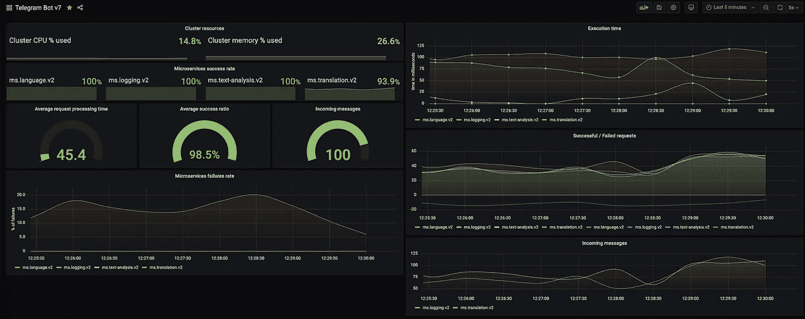

# 带有 Google 云和 Docker 的 Kubectl 和 gcloud 客户端

> 原文：<https://itnext.io/port-forwarding-and-other-things-with-google-cloud-and-docker-e8862bb61d8f?source=collection_archive---------4----------------------->

## 如何节省资金并避免为在群集之间转发少量端口而支付 VPN 连接费用。

[黑客正午](https://unsplash.com/@hackernoon) @ Unsplash

我的旗舰项目在 GKE 的[谷歌云中运行。即将推出的新版本运行在我的](https://medium.com/u/4f3f4ee0f977?source=post_page-----e8862bb61d8f--------------------------------)[个人树莓派集群](/i-broke-my-kubernetes-cluster-running-on-raspberry-pi-355234a24d)上，不过我想用实时流量测试一下。由于我所做的[架构决策](/building-best-telegram-bot-bbf905d09d74)，微服务之间的所有通信都通过 NATS.io 中的队列进行，这使得任何潜在的端口转发都变得更加容易——毕竟，我不需要处理几十个端口(如果我使用 RESTful 通信的话),并且将漏洞引入生产就像连接到队列一样简单。

谷歌云 GKE 认证机制比“常规的”Kubernetes 要复杂一些，昨晚我坐在屏幕前，想知道如何将我的本地集群与 GKE 连接起来，而不需要为 VPN 连接支付额外的费用，在某个时候，我意识到端口转发可能是一种方法...很好——向前。

# 寻找正确的解决方案

我已经将 kubefwd 作为最流行的解决方案之一进行了测试，但是在 docker 和 Kubernetes 中运行它比预期的要复杂得多。毕竟，我一直在寻找一种简单的方法来转发单个端口。有几个项目，其中一个是近三年前的，另一个是去年年底更新的，这可能会满足我的需求，尽管在运行它们时有一些安全问题以及更多的问题。

经过几个小时的尝试和破坏，我已经创建了 [docker-gcp-kubectl](https://github.com/lukaszraczylo/docker-gcp-kubectl) 映像，它允许您在几乎没有任何配置的情况下，使用 kubectl 运行相对稳定的端口转发服务到您的 GKE 集群，使身份验证变得简单而轻松，最重要的是，它在 Kubernetes 环境中运行良好。

这个项目的另一个优点是——您可以在 GKE 中运行任何 kubectl 命令，例如，从您的管道中运行，这使得它更加通用。

# 怎么用？

它在 docker 中的应用如下

Docker 和 GKE Kubernetes 集群之间的端口转发

Kubernetes 环境版本稍微复杂一点，涉及到(在我的例子中)装载共享存储，但是您可以很容易地用 secrets 替换它。

本地 Kubernetes 和 GKE Kubernetes 集群之间的端口转发

目前，我认为这个解决方案非常稳定——在过去 12 小时内没有出现任何故障和问题，并且确实帮助我节省了 GKE VPC 和我的本地集群之间不必要的 VPN 连接成本。

赞美诗在你问之前——**是的**，它对 AMD64 和 ARM64 都有效(Raspberry Pi！)

# 我拿它做什么？

*   我使用这个映像将 NATS(队列)端口从我的实时 GKE 集群转发到本地 Raspberry Pi 集群。
*   我正在使用 multiarch 构建管道来为 AMD64 和 ARM64 架构创建映像——正如[在我的另一篇文章](/unified-microservices-builds-using-github-actions-3442c4ee175e)中所描述的。
*   在两端部署微服务映像，无需额外成本即可创建混合集群。
*   为 Prometheus 创建了额外的监控端点，以支持 Grafana 和警报系统。

在我的本地 rPI 集群上运行的微服务的 Grafana 仪表板

我希望这篇简短但内容丰富的笔记文章将为偶然发现它的人提供一个思路，如何不仅削减云基础架构的成本，而且使其更加健壮和独立于供应商。