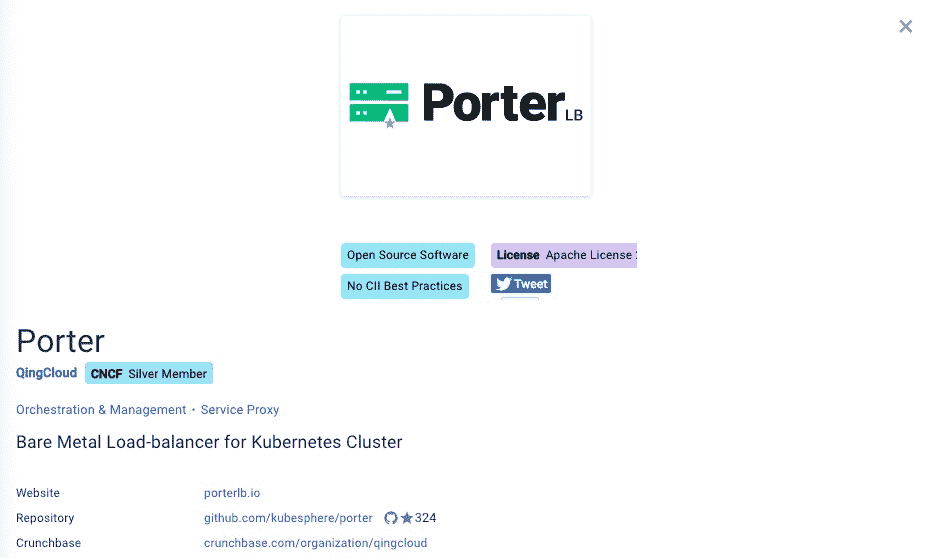
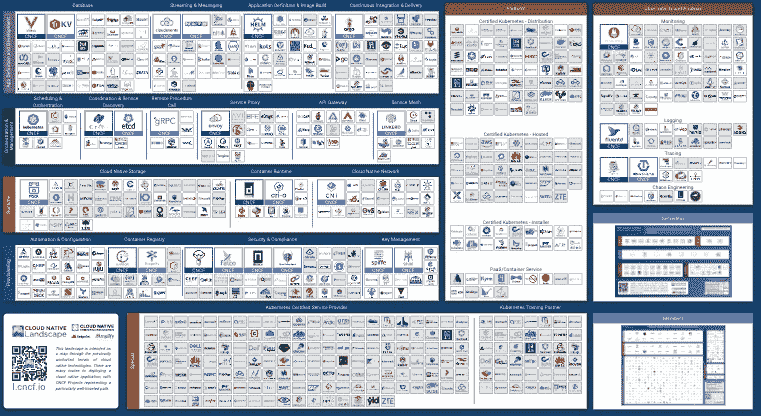
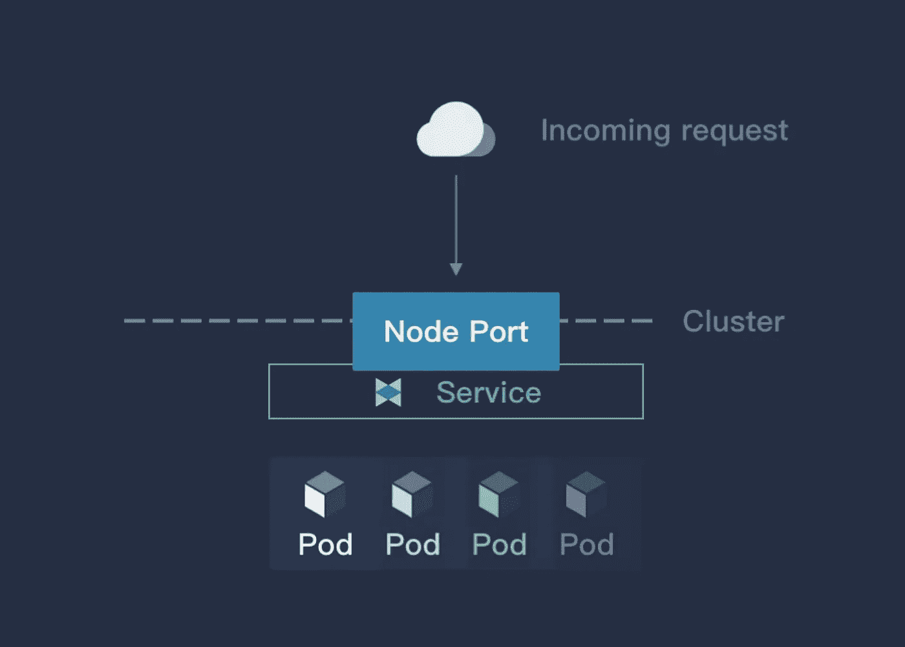
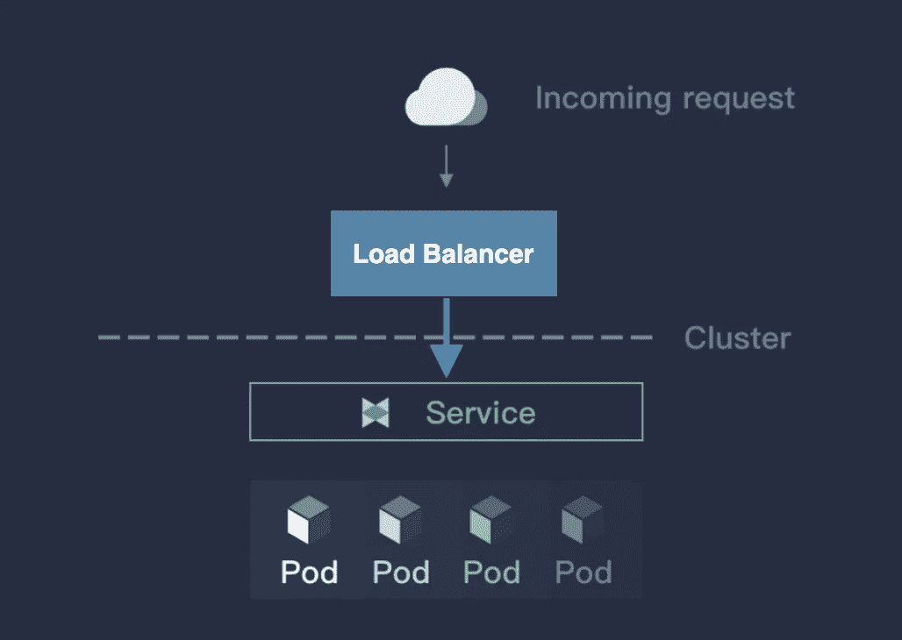
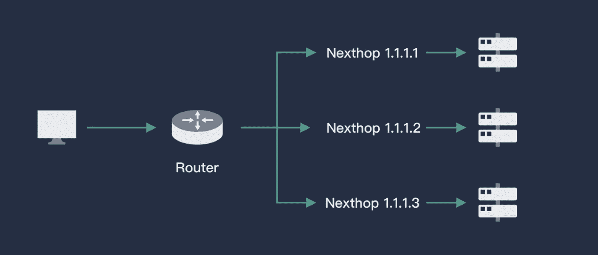
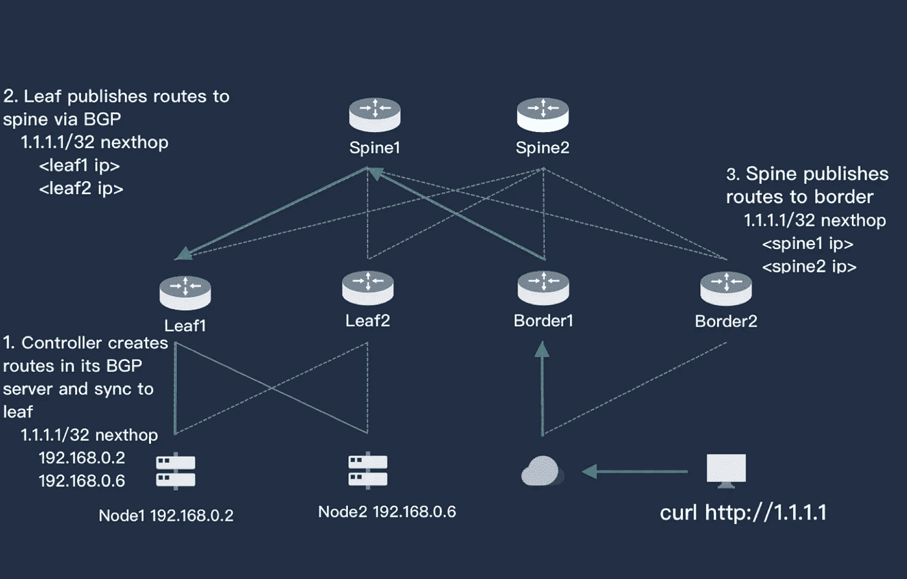
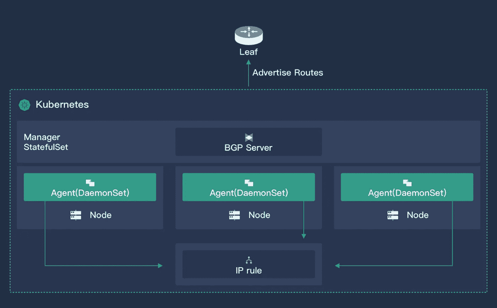
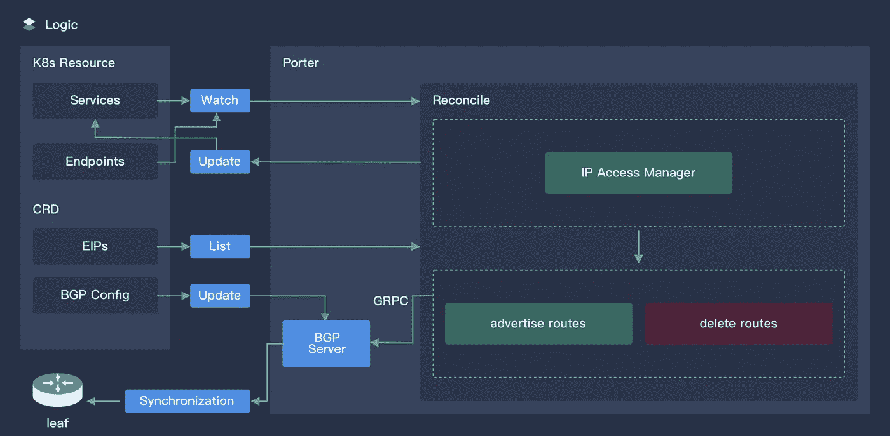
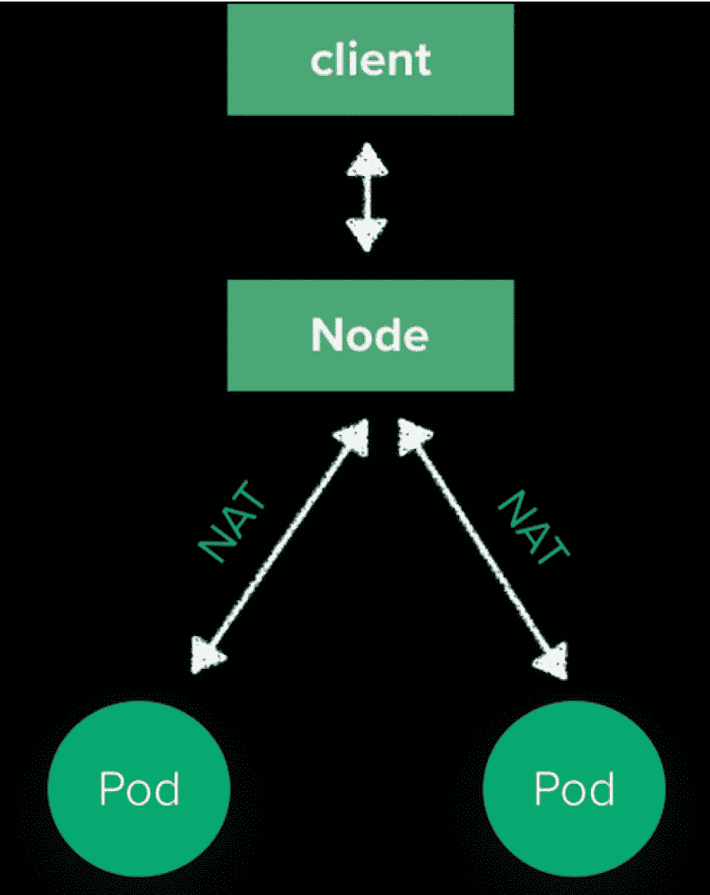
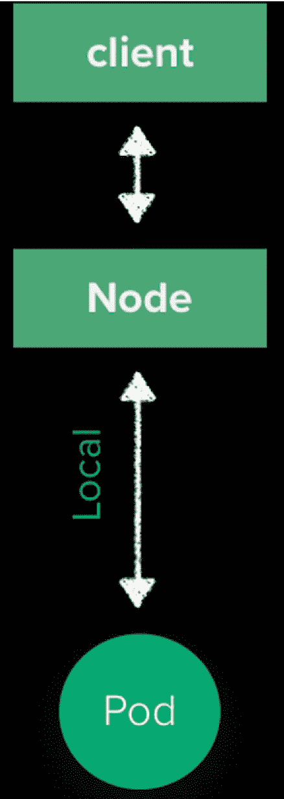

# porter:CNCF 景观中的开源云本地负载均衡器

> 原文：<https://itnext.io/porter-an-open-source-load-balancer-designed-for-bare-metal-kubernetes-clusters-870e1313b7f0?source=collection_archive---------1----------------------->

为裸机 Kubernetes 集群设计的负载均衡器 Porter ，上周正式纳入 CNCF 景观。这标志着其母项目 KubeSphere 的一个重要里程碑，因为波特现在被 CNCF 视为最佳云本地实践之一的重要成员。

CNCF 的搬运工

CNCF 景观

我们知道我们可以使用 Kubernetes 集群中的 LoadBalancer 服务向外部公开后端工作负载。云提供商通常提供云负载平衡器插件，这需要将集群部署在特定的 IaaS 平台上。然而，许多企业用户经常在裸机上部署 Kubernetes 集群，尤其是当它用于生产环境时。对于本地裸机集群，Kubernetes 不提供 LB 实现。Porter 是一个开源负载平衡器，专门为裸机 Kubernetes 集群设计，是解决这一问题的绝佳方案。

# 关于 Kubernetes 服务

在 Kubernetes 集群中，网络代表了一个非常基本和重要的部分。对于大规模的节点和容器，如果要确保网络中的连通性和效率，则需要非常复杂和精细的设计。此外，需要在网络中自动分配和管理 IP 地址和端口，采用用户友好的方法直接快速访问需要的应用程序。

Kubernetes 在这方面做了很大的努力。通过 CNI、服务、DNS 和 Ingress，它解决了服务发现和负载均衡的问题，提供了一种更简单的使用和配置方式。其中，服务是 Kubernetes 微服务的基础。通过 Kubernetes 中的 kube-proxy，服务成为可能。

该组件运行在每个节点上，监控 API 服务器中服务对象的变化，通过管理 iptables 实现网络转发。用户可以创建不同形式的服务，例如基于标签选择器、Headless 或 ExternalName 的服务。Kube-proxy 将为服务创建一个虚拟 IP(或集群 IP ),用于集群的内部访问。

# 公开服务的三种方法

如果需要在集群外部进行访问，或者向用户公开服务，Kubernetes 服务提供了两种方法:NodePort 和 LoadBalancer。此外，Ingress 也是公开服务的一个非常常见的选项。

## 节点端口

如果服务类型设置为 NodePort，kube-proxy 将为服务申请一个大于 3000 的端口(默认情况下)。将为集群中的所有主机配置 Iptables 规则。通过这种方式，用户可以使用分配的端口通过集群中的任何节点访问服务。请看下图:

节点端口

节点端口是公开服务最方便的方式，但它也有明显的缺点:

1.  通过基于 SNAT 的访问，在 Pod 中看不到真实的 IP。
2.  集群中的主机用作跳线服务器来访问后端服务，这意味着所有流量将首先流向服务器。这很容易导致性能瓶颈和单点故障，从而难以在生产环境中使用。
3.  通常，NodePort 使用很难记住的大端口号。

最初，节点端口不是为在生产环境中公开服务而设计的，这就是为什么默认情况下使用大端口号。

## 负载平衡器

负载平衡器是 Kubernetes 针对服务公开的首选解决方案。然而，如果没有云提供商提供的负载平衡器，这是无法实现的，这意味着 Kubernetes 集群必须部署在云中。负载平衡器的工作原理如下:

负载平衡器

负载平衡器服务是通过云提供商提供的 LB 插件实现的。包 Kubernetes.io/cloud-provider 将选择合适的后端服务，并将其暴露给 LB 插件，从而创建一个负载平衡器。这意味着网络流量将分布在云服务中，避免了节点端口中可能出现的单点故障和性能瓶颈。如上所述，负载平衡器是 Kubernetes 对服务公开的首选解决方案，但它仅限于云提供商提供的 Kubernetes 服务。对于部署在裸机环境或非云环境中的 Kubernetes 集群，这种方法可能不适用。

## 进入

Kubernetes 本身并不提供通过入口公开服务的方法。相反，Ingress 在应用程序的帮助下同时公开多个服务，就像路由器一样。这个插件通过域识别不同的服务，并使用注释来控制服务对外公开的方式。它是这样工作的:

进入

相比节点端口和负载平衡器，入口是业务环境中使用最多的方法。原因包括:

1.  与 kube-proxy 的负载均衡方式相比，Ingress 控制器的能力更强(例如流量控制和安全策略)。
2.  通过域识别服务更直接；节点端口中的大端口号也不需要用于入口。

然而，对于入口，需要解决以下问题:

1.  Ingress 更多地用于 L7，对 L4 的支持有限。
2.  所有流量都将流向入口控制器，这需要一个 LB 来暴露入口控制器。

对于第一个问题，入口可以用于 L4，但是入口的配置对于 L4 应用来说太复杂了。最佳做法是直接使用 LB 进行曝光。对于第二个问题，入口控制器可能暴露在具有节点端口(或主机网络)的测试环境中，而单点故障和性能瓶颈可能不可避免地发生，并且入口控制器的 HA 功能没有得到正确使用。

## 关于波特

[Porter](https://porterlb.io/) 是 KubeSphere 开发团队基于边界网关协议(BGP)设计的一款开源云原生负载均衡工具。它的主要特点是:

1.  ECMP 路由负载平衡
2.  BGP 动态路由配置
3.  第 2 层负载平衡
4.  VIP 管理
5.  Kubernetes 服务(v0.3.0)中的负载平衡分配
6.  带舵图的安装(v0.3.0)
7.  通过 CRD 的动态 BGP 服务器配置(v0.3.0)
8.  通过 CRD 的动态 BGP 对等配置(v0.3.0)

搬运工

所有波特代码都是开源的，文档可以在 [GitHub](https://github.com/kubesphere/porter) 中获得。欢迎明星使用。

# 搬运工装置

到目前为止，Porter 已经在两个环境中进行了部署和测试，如下所示。点击下面的链接，你可以在 GitHub 中看到更多关于部署、测试和流程的细节。建议试一试:

*   [在裸机 Kubernetes 集群上部署 Porter](https://github.com/kubesphere/porter/blob/master/doc/deploy_baremetal.md)
*   [使用舵图在 Kubernetes 上安装波特](https://github.com/kubesphere/porter/blob/master/doc/porter-chart.md)
*   [在 QingCloud 平台中使用模拟路由器进行测试](https://github.com/kubesphere/porter/blob/master/doc/simulate_with_bird.md)

# 原则

## ECMP

等价多路径(ECMP)是指数据包可以通过多条等价路径转发到同一个目的地。当设备支持 ECMP 时，发送到目标 IP 或网段的三层流量可以通过不同的路径进行分配，从而实现网络负载平衡。此外，一旦某条路径出现故障，其他路径可以替代完成转发过程，充当路由冗余备份。请参考下图:

路由器

在虚拟路由器的帮助下，ECMP 可以根据哈希算法从现有的路由路径中为某个 IP(服务的相应 VIP)选择下一跳(Pod)。这就是负载平衡的实现方式。由于虚拟路由器一般都支持 ECMP，所以 Porter 只需要检查 Kubernetes API 服务器，并将服务的后端 Pod 的相应信息传递给路由器。

## 边界网关协议(Border Gateway Protocol)

可以将一个 Pod 调度到 Kubernetes 中的其他节点。对于路由器来说，服务 VIP 的下一跳是不固定的，因为等价路由信息会经常更新。例如，Calico 使用 BGP(边界网关协议)来通告路由。BGP 是一种常用的基本分散协议，用于在互联网上的自治系统之间交换路由信息。与其他路由协议不同，BGP 使用 L4 来保证路由信息的更新安全。由于 BGP 是去中心化的，很容易建立一个高可用性的路由层来保证网络的连续性。

边界网关协议(Border Gateway Protocol)

上图简单演示了 BGP 如何在 Porter 中工作。左下角是一个双节点 Kubernetes 集群，其上有两个路由器(Leaf1 和 Leaf2)。这两个路由器连接到两个内核交换机(主干层)。用户在右侧，他们的路由器是 Border1 和 Border2(也连接到 Spine)。

三层用户和 Kubernetes 服务器都是可达的。服务是在 Kubernetes 集群中创建的，也使用了 Porter。Porter 分配一个 VIP(或其他手动分配的 IP)1.1.1.1，通过 BGP 将信息发送到 Leaf1 和 Leaf2。接入 1.1.1.1 的下一跳可以是节点 1 或节点 2。同时，叶层也向主干层发送消息，主干层也根据其 BGP 知道访问 1.1.1.1 的下一跳可以是叶 1 或叶 2。

按照同样的逻辑，路由信息也将在 Border 上更新，这意味着用户访问 1.1.1.1 的路径是完整的。同时，由于图像中的每个层都具有 HA，因此总共有 16 个(`2*2*2*2`)路径可用于外部访问。流量可以分布在整个网络中，任何层的路由器中发生的任何停机都不会影响用户的访问。

# 体系结构

体系结构

Porter 有两个组件:一个核心控制器和一个部署在每个节点上的代理。控制器的主要功能包括:

1.  监控群集服务和相应的端点；获取吊舱的调度信息
2.  VIP 存储和分配
3.  建立 BGP 并通告路由

逻辑

上图是波特核心控制器的工作原理。

代理是一个轻量级组件，用于监控 VIP 资源，并为 VIP 的外部访问添加 Iptables 规则。默认情况下，内核转发表将丢弃任何对 VIP 的外部访问。

# 云原生设计

波特里的所有资源都是 CRD 的，包括 VIP，BGPPeer 和 BGPConfig。习惯了 Kubectl 的用户会发现 Porter 非常好用。对于想要定制 Porter 的高级用户，可以直接调用 Kubernetes API 进行量身定制开发。Porter 的核心控制器将很快支持高可用性(HA)。

# 重要的

用户访问的 VIP 流量将到达 BGP 下的 Kubernetes 集群中的一个节点。这是因为 Porter 通告的路由也是节点，而不是外部不可访问的 Pod IP。从节点到 pod 的路径由 kube-proxy 维护，如下所示:

精灵

在 SNAT 过程之后，流量将被随机发送到一个 pod。由于端口将根据服务端点的动态变化来调整路由，以确保下一跳节点中有可用的 pod，因此我们可以更改默认设置的 kube-proxy。您可以在服务中设置**ExternalTrafficPolicy = local**，结果如下所示:

客户端节点单元

这种方法有两个优点:

1.  SourceIP 不会经历 NAT 的过程
2.  流量将在本地传输，减少了网络中的一跳

# 与 MetalLB 相比

## 赞成的意见

*   支持大多数 BGP 功能和多种网络架构。
*   一个基于 CRD 控制器的 Kubernetes 友好工具，可以完全由 kubectl 控制。
*   配置文件可以动态更新，无需重启。BGP 配置会根据网络环境自动更新。可以动态地采用各种 BGP 特性。
*   提供被动模式，支持 DNAT。
*   与印花布的冲突可以用更友好的方式处理。

## 骗局

*   仅支持 Linux。

## 类似

*   这两种工具都需要更多的测试。

# 未来计划

1.  支持其他简单路由协议
2.  更方便的 VIP 管理
3.  BGP 的政策支持
4.  通过提供的 UI 集成到 KubeSphere 中

# 相关资源

*   [kube con Shanghai:Porter——裸机 Kubernetes 的开源负载均衡器](https://www.youtube.com/watch?v=EjU1yAVxXYQ)
*   [波特网站](https://porterlb.io/)

# 关于 KubeSphere

KubeSphere 是一个基于 Kubernetes 的开源容器平台，其核心是应用程序。它提供全栈 It 自动化操作和简化的开发运维工作流。

KubeSphere 已被全球数千家企业采用，如 Aqara、新浪、奔来、Anchnet、华夏银行、极限视界、微众银行、Maxnerva、VNG 公司和 Radore。KubeSphere 提供向导界面和各种企业级的运维功能，包括 Kubernetes 资源管理、DevOps (CI/CD)、应用生命周期管理、服务网格、多租户管理、监控、日志记录、警报、通知、存储和网络管理以及 GPU 支持。有了 KubeSphere，企业能够快速建立一个强大且功能丰富的容器平台。

**KubeSphere 网站**:[https://kubesphere.io/](https://kubesphere.io/)

**KubeSphere GitHub**:【https://github.com/kubesphere/kubesphere】T2