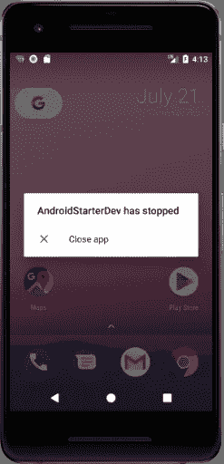

# 在不确定的 Android 世界中安全发布

> 原文：<https://itnext.io/post-safely-in-an-uncertain-android-world-8c0e77fa7812?source=collection_archive---------2----------------------->

这段代码看起来熟悉吗？

```
fun onStart() {
    **val** handler = Handler()
    handler.postDelayed(**object** : Runnable {
        **override fun** run() {
            Toast.makeText(
                **this**@MainActivity, **“Look at me!”**,          Toast.*LENGTH_SHORT*).show()
        }
    }, 1500)
}
```

作为一名 Android 开发人员，你经常会在 onCreate 或 onStart 中遇到 postDelayed。有很多 StackOverflow 的问题问“为什么我的动画不运行？”。答案通常建议使用 postDelayed。

但是为什么延迟工作呢？要理解这一点，我们需要了解 Android 的内部。Android 有一个主线程，用于更新用户界面。任何 Android 组件都在这个线程上运行——活动、广播接收器、片段、视图等。

Android 运行在 Java 上，默认情况下，Java 线程执行一次，而且只执行一次。在 Android 这样的平台上，UI 不断更新，为每个动作创建新线程很快就会变得非常昂贵。为了解决这个问题，Android 的主线程使用 HandlerThread，它是 Java 线程的一个子类。Android 通过使用一个调度消息(Runnables)执行的循环来保持这个主线程。

这些消息是按顺序运行的，这就是为什么在主线程上执行长时间运行的任务会阻塞后续等待执行的消息。主线程的顺序性也是为什么当在一个生命周期方法中完成太多工作时，UI 会滞后的原因，在这种情况下，消息队列的增长速度超过了它的执行速度。

现在我们来看后延。通过使用 post，我们将工作调度到主线程上，在某个未来的时间延迟点发生。现在，您可能已经看到了问题所在。我们在主线程上做了太多的工作，所以我们的动画不运行，为了解决这个问题，我们在将来执行动画，那时我们希望主线程是空闲的。我们正在解决问题的症状，但不是问题。

问题是我们在主线上做了太多的工作。这是 Android 中的一个常见问题，因为代码会卡在 onCreate 和 onStart 中。所以解决这个问题的简单方法就是在使用 postDelayed 的地方减少主线程的工作量。

但是重写一堆代码并不总是可行的。所以有时候速战速决是必要的。但是，延迟仍然带来了另一个问题。postDelayed 不关心生命周期方法。假设我们在 onStart 中用 postDelayed(1 秒)开始一个动画。半秒钟过去了，用户开始在后台运行应用程序。主线程仍然执行 Runnable，但是没有视图，用户看到:



不不不。

我们如何防止这种崩溃？我们可以保留对 Runnable 的引用，并在 onStop 中清除 Runnable，但这并不有趣。因此，让我们使用 RxJava 和 Kotlin 来确保 BaseActivity 的任何子类的发布安全:

```
**abstract class** BaseActivity : AppCompatActivity() { *// Stores RxJava calls* **private val compositeDisposable** = CompositeDisposable() **override fun** onStop() {
        **super**.onStop()
        *// Clear all RxJava calls that have not yet completed* **compositeDisposable**.clear()
    } */**
     * Creates an RxJava equivalent to post/postDelayed
     * The disposable is cleared on pause
     * So functions that act on the view can be safely 
     * invoked without causing a crash
     */* **protected fun** postSafely(
         callback: () -> Unit,
         delay: Long = 0,
         delayTimeUnit: TimeUnit = TimeUnit.**SECONDS** ) {
          // Be careful of the RxJava call ordering
          // Delay must be placed before observeOn
          Completable.complete()
              .subscribeOn(Schedulers.newThread())
              .delay(delay, delayTimeUnit)
              .observeOn(AndroidSchedulers.mainThread())
              .doOnComplete(callback)
              .subscribe()
              *.addToDisposables*()
     }

     **protected fun** Disposable.addToDisposables()
         **compositeDisposable**.add(**this**)
     }
}
```

现在，BaseActivity 的任何子类都可以在不确定的 Android 世界中安全发布。

```
postSafely(**this**::animate, 1, TimeUnit.**SECONDS**)
```

祝发帖愉快！

另外，如果你能用腐蚀液延迟完成任务，会得到额外的奖励。