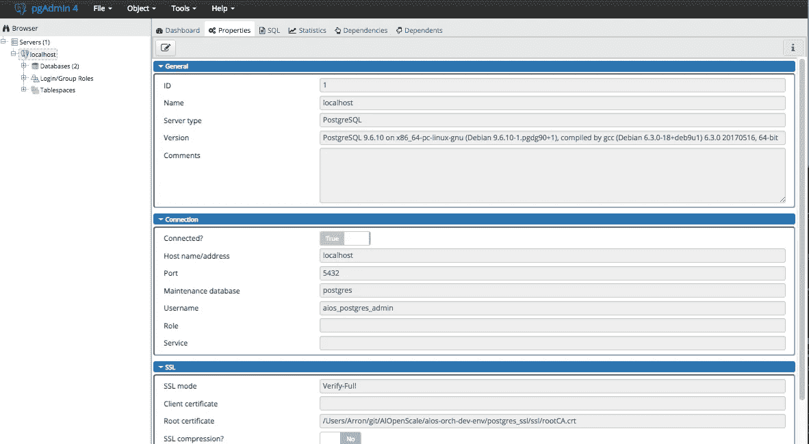

# PostgreSQL Docker 映像，带有由自定义证书颁发机构(CA)签名的 SSL 证书

> 原文：<https://itnext.io/postgresql-docker-image-with-ssl-certificate-signed-by-a-custom-certificate-authority-ca-3df41b5b53?source=collection_archive---------2----------------------->

我们最近需要使用 PostgreSQL 的一个实例作为我们开发环境的一部分，这引发了许多问题——我们在 IBM Cloud 中提供一个实例吗？还是我们使用自己的(虚拟化)硬件托管一个实例？或者我们采用预构建的 Docker 映像并在本地运行它？

由于我们已经使用 Docker 作为我们开发环境的一部分，所以选择并不困难(更不用说没有人愿意因为在 IBM Cloud 中提供一个实例而产生交叉收费)。那是码头工人的形象。到目前为止，一切顺利。我们从[https://hub.docker.com/_/postgres/](https://hub.docker.com/_/postgres/)获得官方的 9.6 图像，然后我们开始运行。

接下来，我们需要确保我们所有的 PostgreSQL 客户端代码都需要到 PostgreSQL 服务器的 SSL 连接——因此我们需要修改 Docker 映像以开始使用 SSL 连接。这说起来容易做起来难。

# 简单自签名证书

我们的第一个尝试是为 PostgreSQL 服务器生成一个自签名证书，并基于引用我们生成的证书的官方 PostgreSQL 映像创建我们自己的 Docker 映像。

在找出正确的 *openssl* 命令序列后，当从 Python 客户端(【https://pypi.org/project/psycopg2】)连接到 PostgreSQL 时，我们有了一些工作。Python 客户端允许我们指定 PostgreSQL 服务器的自签名证书，这意味着客户端将信任该证书，即使它不是由证书颁发机构(CA)签名的。

然而，这不足以允许来自 Node.js 客户端([https://node-postgres.com](https://node-postgres.com/))的 SSL 连接，因为 Node.js 客户端使用的底层 SSL 连接不允许信任自签名证书，除非它已经由另一个证书签名(其中*可以是*自签名)。如果不这样做，它会产生错误*DEPTH _ ZERO _ SELF _ SIGNED _ CERT*。有很多关于通过设置*NODE _ TLS _ REJECT _ UNAUTHORIZED*来解决这个问题的讨论，但这不是我们想要做的事情，因为它会关闭所有的 SSL 验证。

# 作为自定义证书颁发机构(CA)的签名证书

为了克服这个问题，我们意识到我们必须创建一个证书，并使用我们自己的自定义证书颁发机构(CA)进行签名。 *openssl* 命令的序列现在变得足够复杂，我们创建了一个脚本来生成所需的证书工件，如图所示。

这个脚本生成了几个文件，但是下面描述了感兴趣的主要文件。对于感兴趣的人，可以在这里看到脚本的完整输出。

*   *rootCA.crt* 我们自定义 CA 的公共证书。这是应该添加到客户端信任存储中的证书(通常通过对证书文件进行 base64 编码来完成)。
*   *rootCA.key* 自定义 CA 的私钥，需要使用自定义 CA 签署 PostgreSQL 服务器的证书。
*   PostgreSQL 服务器的公共证书，已经由我们的自定义 CA 签名，PostgreSQL Docker 映像需要该证书。
*   *server . key*PostgreSQL Docker 映像所需的 PostgreSQL 证书的私钥。

我们还有一个开发环境需求，允许使用 3 个不同的主机名来寻址 PostgreSQL 服务器实例: *localhost* 、 *aios-localhost* 和 *postgres_ssl* 。在 SSL 握手级别，这是通过在生成 PostgreSQL 服务器证书*和由我们的自定义 CA 签名时指定主题备用名称(SAN)扩展来实现的。*

# PostgreSQL Dockerfile 文件

现在，SSL 证书已经生成并签名，提取它的 Dockerfile 文件实际上非常简单，如下所示:

```
FROM postgres:9.6
LABEL "Product"="PostgreSQL (SSL enabled)"COPY ssl/server.key /var/lib/postgresql/server.key
COPY ssl/server.crt /var/lib/postgresql/server.crt
RUN chown postgres /var/lib/postgresql/server.key && \
    chmod 600 /var/lib/postgresql/server.key
```

使用 *pgAdmin* 验证连接显示该连接是基于 SSL 的，并且我可以使用 SSL 模式 *Verify-Full* 指定我的自定义 CA 公共证书的路径。

