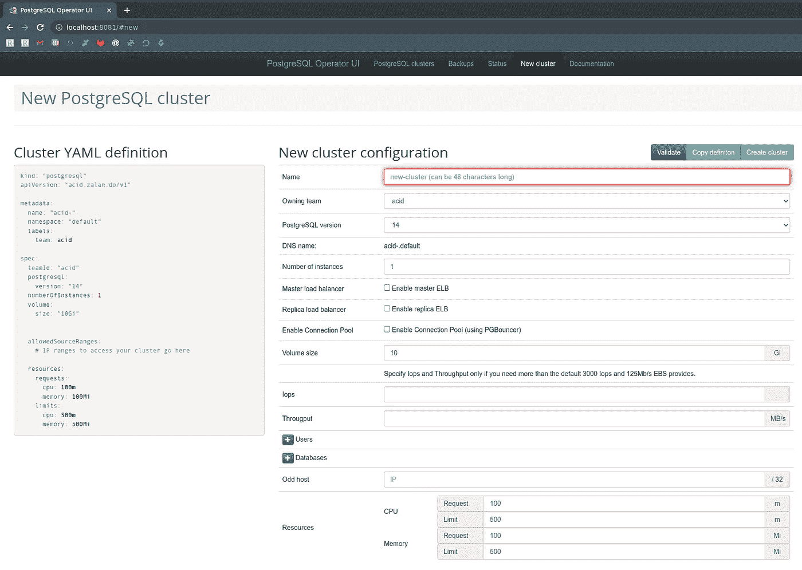
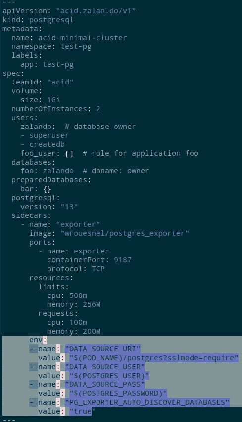
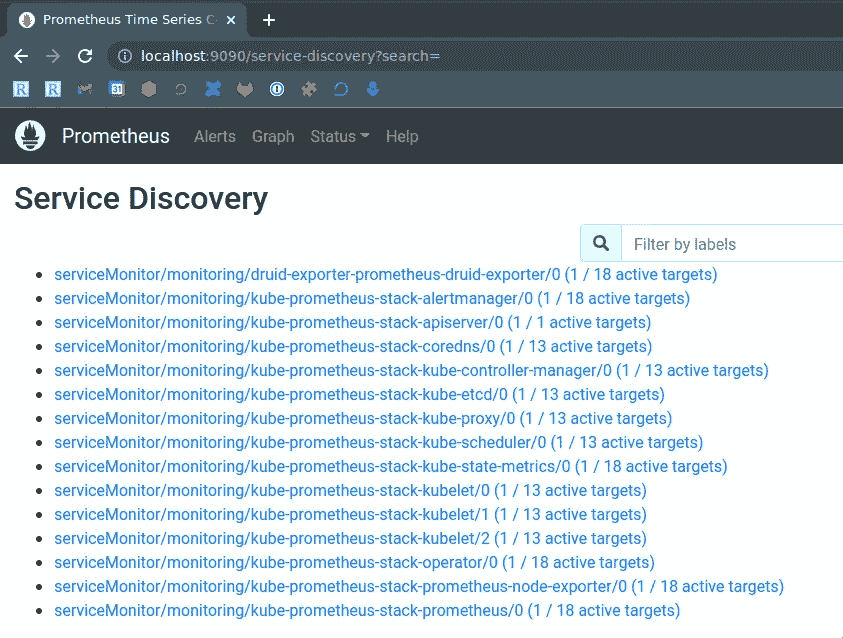
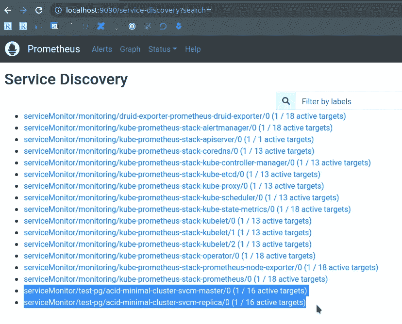
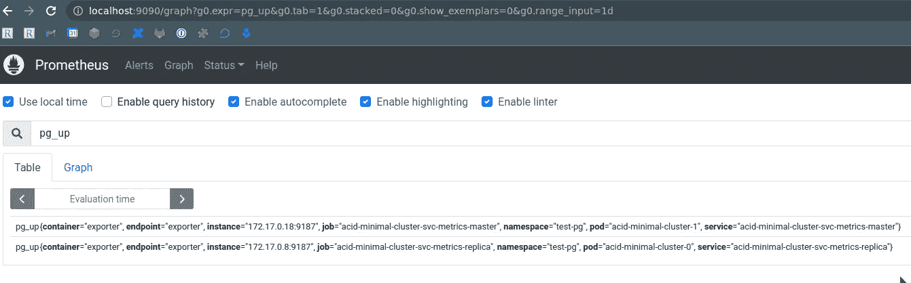

# PostgreSQL:Kubernetes 的 PostgreSQL 操作符，及其 Prometheus 监控

> 原文：<https://itnext.io/postgresql-postgresql-operator-for-kubernetes-and-its-prometheus-monitoring-6f73525a1b77?source=collection_archive---------1----------------------->


所以，我们已经启动了德鲁伊，见[阿帕奇德鲁伊:概述，在 Kubernetes 运行，用普罗米修斯](https://rtfm-co-ua.translate.goog/uk/apache-druid-oglyad-zapusk-v-kubernetes-ta-monitoring-z-prometheus/?_x_tr_sl=uk&_x_tr_tl=en&_x_tr_hl=en&_x_tr_pto=wapp)监控。到目前为止，本地 [Apache Derby](https://translate.google.com/website?sl=uk&tl=en&hl=en&client=webapp&u=https://db.apache.org/derby/) 数据库被用作元数据的默认[存储。](https://translate.google.com/website?sl=uk&tl=en&hl=en&client=webapp&u=https://druid.apache.org/docs/latest/design/architecture.html%23metadata-storage)

接下来，我们将把 Druid 切换到 PostgreSQL，稍后我们将从集群设置中删除 ZooKeeper。

首先，让我们在 Kubernetes 中启动一个 PostgreSQL 集群，为 Prometheus 添加 [PostgreSQL 导出器](https://translate.google.com/website?sl=uk&tl=en&hl=en&client=webapp&u=https://github.com/prometheus-community/postgres_exporter)，并配置指标收集。

我们将在 [Minikube](https://rtfm-co-ua.translate.goog/kubernetes-zapusk-minikube-na-arch-linux/?_x_tr_sl=uk&_x_tr_tl=en&_x_tr_hl=en&_x_tr_pto=wapp) 中再次启动，对于 PostgreSQL，我们将使用 [Zalando 操作符](https://translate.google.com/website?sl=uk&tl=en&hl=en&client=webapp&u=https://github.com/zalando/postgres-operator/)，并将添加 [PostgreSQL 导出器](https://github.com/prometheus-community/postgres_exporter)作为 [sidecar 容器](https://translate.google.com/website?sl=uk&tl=en&hl=en&client=webapp&u=https://www.containiq.com/post/kubernetes-sidecar-container)。

我们还不会深入研究这个操作符，尽管它非常有趣，所以我们会以某种方式玩它。现在，我们只需要监视它。

文档— [管理员指南](https://translate.google.com/website?sl=uk&tl=en&hl=en&client=webapp&u=https://github.com/zalando/postgres-operator/blob/master/docs/administrator.md)。

# 启动 PostgreSQL 运算符

创建名称空间:

```
$ kubectl create ns postgres-operator
namespace/postgres-operator created
```

添加舵库:

```
$ helm repo add postgres-operator-charts [https://opensource.zalando.com/postgres-operator/charts/postgres-operator](https://opensource.zalando.com/postgres-operator/charts/postgres-operator)
```

安装操作器本身:

```
$ helm -n postgres-operator install postgres-operator postgres-operator-charts/postgres-operator
```

如果需要，为操作员添加一个 WebUI:

```
$ helm repo add postgres-operator-ui-charts [https://opensource.zalando.com/postgres-operator/charts/postgres-operator-ui](https://opensource.zalando.com/postgres-operator/charts/postgres-operator-ui)$ helm -n postgres-operator install postgres-operator-ui postgres-operator-ui-charts/postgres-operator-ui
```

检查舱:

```
$ kubectl -n postgres-operator get pods
NAME READY STATUS RESTARTS AGE
postgres-operator-649799f4bd-dz5bl 1/1 Running 0 82s
postgres-operator-ui-5cfff55c65-v4bjj 1/1 Running 0 22s
```

为您自己提供对运营商网络接口服务的访问:

```
$ kubectl port-forward svc/postgres-operator-ui 8081:80
Forwarding from 127.0.0.1:8081 -> 8081
Forwarding from [::1]:8081 -> 8081
```

检查一下:



这里我们不做任何事情，我们将采用现成的集群配置示例。

# 启动 PostgreSQL 集群

克隆操作员的存储库:

```
$ git clone [https://github.com/zalando/postgres-operator.git](https://github.com/zalando/postgres-operator.git)
cd postgres-operator/
```

在`manifests`目录中有几个例子，让我们看一下`[manifests/minimal-master-replica-svcmonitor.yaml](https://github.com/zalando/postgres-operator/blob/master/manifests/minimal-master-replica-svcmonitor.yaml)`文件——它描述了一个名称空间、一个集群、用户、数据库、两个服务和两个带有 Prometheus Exporter 的 ServiceMonitors + Sidecars。

应用它:

```
$ kubectl apply -f manifests/minimal-master-replica-svcmonitor.yaml
namespace/test-pg created
postgresql.acid.zalan.do/acid-minimal-cluster created
service/acid-minimal-cluster-svc-metrics-master created
service/acid-minimal-cluster-svc-metrics-replica created
servicemonitor.monitoring.coreos.com/acid-minimal-cluster-svcm-master created
servicemonitor.monitoring.coreos.com/acid-minimal-cluster-svcm-replica created
```

检查集群:

```
$ kubectl -n test-pg get postgresql
NAME TEAM VERSION PODS VOLUME CPU-REQUEST MEMORY-REQUEST AGE STATUS
acid-minimal-cluster acid 13 2 1Gi 2m21s Running
```

它的豆荚:

```
$ kubectl -n test-pg get po
NAME READY STATUS RESTARTS AGE
acid-minimal-cluster-0 2/2 Running 0 37s
acid-minimal-cluster-1 1/2 Running 0 24s
```

每个人都有自己的角色，这些角色被设置在标签中— `spilo-role=master`或`spilo-role=replica`。

## PostgreSQL 用户

参见文档[这里> > >](https://translate.google.com/website?sl=uk&tl=en&hl=en&client=webapp&u=https://github.com/zalando/postgres-operator/blob/master/docs/user.md%23connect-to-postgresql) 和[这里> > >](https://translate.google.com/website?sl=uk&tl=en&hl=en&client=webapp&u=https://aws.amazon.com/blogs/database/managing-postgresql-users-and-roles/) 。

用户在—惊喜— `[users](https://translate.google.com/website?sl=uk&tl=en&hl=en&client=webapp&u=https://github.com/zalando/postgres-operator/blob/master/manifests/minimal-master-replica-svcmonitor.yaml%23L21)`块中描述:

```
$ kubectl -n test-pg get postgresql -o yaml
…
users:
foo_user: []
zalando:
- superuser
- createdb
…
```

运营商将为他们每个人创建一个专用的 Kubernetes 秘密:

```
$ kubectl -n test-pg get secret
NAME TYPE DATA AGE
foo-user.acid-minimal-cluster.credentials.postgresql.acid.zalan.do Opaque 2 38m
postgres.acid-minimal-cluster.credentials.postgresql.acid.zalan.do Opaque 2 38m
standby.acid-minimal-cluster.credentials.postgresql.acid.zalan.do Opaque 2 38m
zalando.acid-minimal-cluster.credentials.postgresql.acid.zalan.do Opaque 2 38m
```

然后通过变量映射到 pod:

```
$ kubectl -n test-pg get statefulsets acid-minimal-cluster -o yaml
…
- env:
- name: POD_NAME
valueFrom:
fieldRef:
apiVersion: v1
fieldPath: metadata.name
- name: POD_NAMESPACE
valueFrom:
fieldRef:
apiVersion: v1
fieldPath: metadata.namespace
- name: POSTGRES_USER
value: postgres
- name: POSTGRES_PASSWORD
valueFrom:
secretKeyRef:
key: password
name: postgres.acid-minimal-cluster.credentials.postgresql.acid.zalan.do
…
```

好吧，让我们检查一下。

让我们得到密码:

```
$ kubectl -n test-pg get secret postgres.acid-minimal-cluster.credentials.postgresql.acid.zalan.do -o ‘jsonpath={.data.password}’ | base64 -d
CcWdAaqvPA8acxwIpVyM8UHkds2QG3opC3KD7rO1TxITQ1q31cwYLTswzfBeTVsN
```

打开其端口以进行本地访问:

```
$ kubectl -n test-pg port-forward acid-minimal-cluster-0 6432:5432
```

登录并检查数据库:

```
$ psql -U postgres -h localhost -p 6432
Password for user postgres:
psql (14.5, server 13.7 (Ubuntu 13.7–1.pgdg18.04+1))
SSL connection (protocol: TLSv1.3, cipher: TLS_AES_256_GCM_SHA384, bits: 256, compression: off)
Type “help” for help.
postgres=# \l
List of databases
Name | Owner | Encoding | Collate | Ctype | Access privileges
 — — — — — -+ — — — — — -+ — — — — — + — — — — — — -+ — — — — — — -+ — — — — — — — — — — — -
bar | bar_owner | UTF8 | en_US.utf-8 | en_US.utf-8 |
foo | zalando | UTF8 | en_US.utf-8 | en_US.utf-8 |
postgres | postgres | UTF8 | en_US.utf-8 | en_US.utf-8 |
template0 | postgres | UTF8 | en_US.utf-8 | en_US.utf-8 | =c/postgres +
| | | | | postgres=CTc/postgres
template1 | postgres | UTF8 | en_US.utf-8 | en_US.utf-8 | =c/postgres +
| | | | | postgres=CTc/postgres
(5 rows)
postgres=#
```

# PostgreSQL Prometheus 导出程序

参见[边车定义](https://translate.google.com/website?sl=uk&tl=en&hl=en&client=webapp&u=https://github.com/zalando/postgres-operator/blob/master/docs/reference/cluster_manifest.md%23sidecar-definitions)。

我们已经有了一个 sidecar——它是从 manifest 中添加的，在每个 Pod 中，我们当前有两个容器——PostgreSQL 本身和它的导出器:

```
$ kubectl -n test-pg get po acid-minimal-cluster-0 -o jsonpath=’{.spec.containers[*].name}’
postgres exporter
```

让我们看看是否有指标—打开端口:

```
$ kubectl -n test-pg port-forward svc/acid-minimal-cluster-svc-metrics-master 9187:9187
Forwarding from 127.0.0.1:9187 -> 9187
Forwarding from [::1]:9187 -> 9187
```

我们看到，我们什么也没看到，星团有点“死了”——`pg_up == 0`:

```
$ curl -s localhost:9187/metrics | grep pg_ | grep -v ‘#’
pg_exporter_last_scrape_duration_seconds 1.00031302
pg_exporter_last_scrape_error 1
pg_exporter_scrapes_total 9
pg_up 0
```

为什么？因为出口商必须有访问数据，即登录密码。

在边车的配置中，添加新的变量，参见[环境变量](https://translate.google.com/website?sl=uk&tl=en&hl=en&client=webapp&u=https://github.com/prometheus-community/postgres_exporter%23environment-variables):

```
...
      env:
      - name: "DATA_SOURCE_URI"
        value: "$(POD_NAME)/postgres?sslmode=require"
      - name: "DATA_SOURCE_USER"
        value: "$(POSTGRES_USER)"
      - name: "DATA_SOURCE_PASS"
        value: "$(POSTGRES_PASSWORD)"
      - name: "PG_EXPORTER_AUTO_DISCOVER_DATABASES"
        value: "true"
...
```



也就是说，操作符创建了一个 StatefulSet，其中设置了变量`POSTGRES_USER`和`POSTGRES_PASSWORD`，我们用它来为 sidecar 设置自己的变量。

保存更新并应用它们:

```
$ kubectl apply -f manifests/minimal-master-replica-svcmonitor.yaml
```

检查 pod 本身的变量:

```
$ kubectl -n test-pg get po acid-minimal-cluster-0 -o yaml
…
- env:
- name: POD_NAME
valueFrom:
fieldRef:
apiVersion: v1
fieldPath: metadata.name
- name: POD_NAMESPACE
valueFrom:
fieldRef:
apiVersion: v1
fieldPath: metadata.namespace
- name: POSTGRES_USER
value: postgres
- name: POSTGRES_PASSWORD
valueFrom:
secretKeyRef:
key: password
name: postgres.acid-minimal-cluster.credentials.postgresql.acid.zalan.do
- name: DATA_SOURCE_URI
value: $(POD_NAME)/postgres?sslmode=require
- name: DATA_SOURCE_USER
value: $(POSTGRES_USER)
- name: DATA_SOURCE_PASS
value: $(POSTGRES_PASSWORD)
- name: PG_EXPORTER_AUTO_DISCOVER_DATABASES
value: “true”
…
```

并在导出器中再次检查指标:

```
$ curl -s localhost:9187/metrics | grep pg_ | grep -v ‘#’ | tail -5
pg_stat_replication_pg_current_wal_lsn_bytes{application_name=”acid-minimal-cluster-0",client_addr=”172.17.0.17",server=”acid-minimal-cluster-1:5432",slot_name=”182",state=”streaming”} 1.52655344e+08
pg_stat_replication_pg_wal_lsn_diff{application_name=”acid-minimal-cluster-0",client_addr=”172.17.0.17",server=”acid-minimal-cluster-1:5432",slot_name=”182",state=”streaming”} 0
pg_stat_replication_reply_time{application_name=”acid-minimal-cluster-0",client_addr=”172.17.0.17",server=”acid-minimal-cluster-1:5432",slot_name=”182",state=”streaming”} 1.663625745e+09
pg_static{server=”acid-minimal-cluster-1:5432",short_version=”13.7.0",version=”PostgreSQL 13.7 (Ubuntu 13.7–1.pgdg18.04+1) on x86_64-pc-linux-gnu, compiled by gcc (Ubuntu 7.5.0–3ubuntu1~18.04) 7.5.0, 64-bit”} 1
pg_up 1
```

`pg_up == 1` -耶！有用！

## Prometehus 服务监视器

打开端口访问普罗米修斯本身:

```
$ kubectl -n monitoring port-forward svc/kube-prometheus-stack-prometheus 9090:9090
Forwarding from 127.0.0.1:9090 -> 9090
Forwarding from [::1]:9090 -> 9090
```

检查状态>服务发现—我们在这里没有看到 PostgreSQL:



已经根据清单创建了 ServiceMonitors:

```
$ kubectl -n test-pg get servicemonitor
NAME AGE
acid-minimal-cluster-svcm-master 65m
acid-minimal-cluster-svcm-replica 65m
```

让我们像[对德鲁伊](https://rtfm-co-ua.translate.goog/uk/apache-druid-oglyad-zapusk-v-kubernetes-ta-monitoring-z-prometheus/?_x_tr_sl=uk&_x_tr_tl=en&_x_tr_hl=en&_x_tr_pto=wapp#Prometheus_ServiceMonitor)做的那样重复“肮脏的攻击”——给他们添加一个标签`"release": "kube-prometheus-stack"`，等一两分钟，然后再次检查:



我们在普罗米修斯图中得到了 PostgreSQL 的集群指标:



完成了。

*最初发布于* [*RTFM: Linux、DevOps、系统管理*](https://rtfm.co.ua/en/postgresql-postgresql-operator-for-kubernetes-and-its-prometheus-monitoring/) *。*