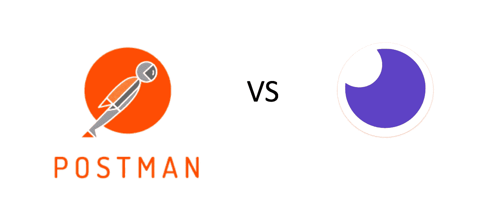
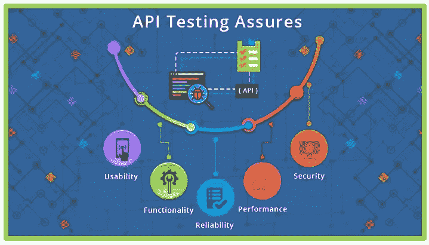
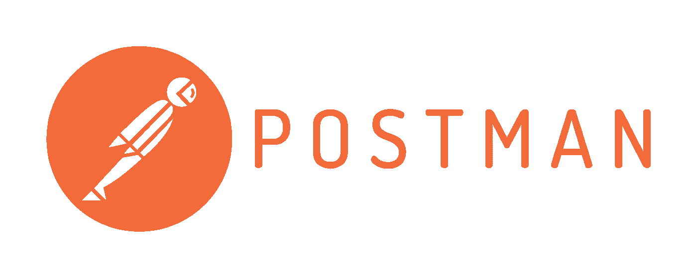

# 邮递员 vs .失眠:比较 API 测试工具

> 原文：<https://itnext.io/postman-vs-insomnia-comparing-the-api-testing-tools-4f12099275c1?source=collection_archive---------0----------------------->

你熟悉 API 端点测试吗？如果你不是，在我们进一步讨论之前，让我给你一个快速的定义。

> **API 测试**是[软件测试](https://en.wikipedia.org/wiki/Software_testing)的一种，它涉及直接测试[应用编程接口](https://en.wikipedia.org/wiki/Application_programming_interface)(API)，并作为[集成测试](https://en.wikipedia.org/wiki/Integration_testing)的一部分，以确定它们是否满足功能、可靠性、性能和安全性的预期。—维基百科，API 测试

API 端点测试是我们作为 web 开发人员所做的最重要的事情之一。如果到达我们的数据的路径不正确，所需的参数不包括在内，授权丢失，或者许多其他东西没有正确连接，你的应用程序就不能工作。如果你的应用不工作，你的客户就不能使用它。如果你的客户不能使用它，对你、你的团队、你的老板等等来说，这将是非常糟糕的一天。

这就是为什么我们有 API 测试工具之类的东西。作为 web 开发人员，这些工具允许我们测试当我们向应用程序传递(或不传递)一组特定的数据时，它将返回我们期望的响应。这是一个非常简单的想法，但是它让我们的生活(和开发周期)变得更加容易。

**注意:**这不会是一篇关于如何使用 Postman 或失眠症的博文(已经有很多了，包括他们自己网站上的文档)。这将是两者提供的特性的比较，以帮助您更好地决定使用哪一个来满足您的开发团队的需求。

## API 测试工具的优势

正如上面简要提到的，这里是使用 API 测试工具的一些最大的好处。

*   更快地设置和测试端点(您不必遍历整个用户流来设置数据，然后执行命令来更改数据)，
*   更少的命令行交互，
*   根据您使用的类型，有多种方式来设置授权，
*   发送和接收代码的格式更好，
*   更简单的性能和可靠性测试。

## 竞争者:邮递员和失眠

今天我将讨论两种流行的 API 测试工具。 [Postman](https://www.getpostman.com/) ，一套工具，它将其生态系统定义为:

> “唯一完整的 API 开发环境”——Postman

还有[失眠](https://insomnia.rest/)，一个声称你可以的 REST 客户端

> “像人而不是机器人一样调试 APIs 失眠

所以，事不宜迟，让我们先来看看它们共有哪些功能。

## 它们都提供了什么

失眠和邮差都分享了很多对前端团队、后端团队、全栈团队的开发者都有极大帮助的好处。

在我肯定忽略的其他事情中，两者都夸耀道:

*   他们软件的免费版本(可以随时升级到功能更丰富的付费版本)，
*   作为开源项目，
*   允许多个工作空间(例如开发、验收、生产等。),
*   设置环境和静态局部变量的能力，这些变量随着对端点的每次调用而更新(有时称为请求链接)，
*   允许测试数据的导入和导出，以便于团队成员之间的共享，
*   保存呼叫并将其组织到文件夹或集合中的能力，
*   GraphQL 集成和测试选项，
*   多种方式配置授权(OAuth、承载令牌、基本、HAWK 等)。)并生成/管理 cookies，
*   而且都有明暗配色，(我知道这没什么大不了的，但是值得注意。我真的更喜欢在一个黑暗的 IDE 中开发，而不是在一个完全白色的 IDE 中。

这是一个很好的东西(我要告诉你，我已经在企业级应用程序开发中使用了免费版本的 Postman 和失眠症，我和我的团队并不认为有必要升级到付费版本)。

好了，现在来看看这两种工具的一些独特之处。

## 邮递员有什么独特之处

当你真正开始钻研它的[文档](https://www.getpostman.com/docs/v6/)时，Postman 似乎有一套更成熟的产品和功能。

以下是 Postman 区别于其他 API 测试工具的一些特点。

*   API 文档(Postman 将实时生成和托管基于浏览器的 API 文档)，
*   收集运行(在相应的环境中运行一组请求——这对自动化测试非常有帮助，我喜欢他们收集运行程序的名字:Newman——明白了吗？纽曼是《宋飞正传》里的邮递员…我喜欢那里的幽默感)，
*   监视 Postman 将定期运行收集以检查其性能和响应的位置，
*   用普通 JavaScript 编写的测试将验证响应对象、时间等。从终点开始，
*   和模拟服务器，以便团队模拟每个端点及其在 Postman 集合中的相应响应。开发人员可以查看潜在的响应，而无需构建后端，并且团队成员可以在 API 开发的最早阶段根据期望进行调整。

印象深刻，对吧？

## 失眠有什么独特之处

[失眠](https://support.insomnia.rest/category/19-using-insomnia)为自己辩护说，它提供了一些邮递员没有的酷东西。

*   模板标签(类似于环境变量，但是它们对字符串、时间戳等执行操作。),
*   为失眠及其用户社区创建新插件的能力，
*   工作区的客户端证书分配和 SSL 验证(或禁用它)，
*   12 种不同语言的代码片段生成(如果您想从命令行中提取命令或将其放入实际的代码库，这很方便)，
*   一个非常全面的文档区域，在这里可以将指令、代码片段甚至测试数据添加到特定的调用或集合中，
*   查看 JSON 和 XML 之外的响应(对于失眠症，您可以看到 HTML 页面、图像、SVG、音频文件甚至 PDF 文档)。

此外，在开发 API 时可以接触到有用、方便的东西。

## 结论

总的来说，在我看来，Postman 是目前 API 测试工具的领导者。它比失眠症更成熟、功能更全，为开发者提供了很多真正优秀的好处，即使是在它的免费层。

对于我的团队来说，他们实践完全自动化的 CI/CD 测试和部署，拥有一个像 Postman 提供的测试集合运行器是一个很大的卖点，如果你完全致力于支持一个 API，拥有生成的实时文档也是一个很好的选择。

也就是说，如果随着 Postman 的继续发展和改进，失眠症包含了 Postman 的一些好处，那么它没有理由不能继续成为 API 测试领域中一个非常强有力的竞争者。

感谢您的阅读，我希望这证明是有帮助的，并让您更好地理解测试的几个主要选项。非常感谢鼓掌和分享！

如果你喜欢读这篇文章，你可能也会喜欢我的其他一些博客:

*   [使用 Docker & Docker Compose 改进您的全栈应用开发](https://medium.com/@paigen11/using-docker-docker-compose-to-improve-your-full-stack-application-development-1e41280748f4)
*   [序列:带有节点的 SQL 数据库的 ORM](https://medium.com/@paigen11/sequelize-the-orm-for-sql-databases-with-nodejs-daa7c6d5aca3)
*   [Docker 102: Docker-Compose](https://medium.com/@paigen11/docker-102-docker-compose-6bec46f18a0e)

**参考资料和更多资源:**

*   API 测试，维基百科:[https://en.wikipedia.org/wiki/API_testing](https://en.wikipedia.org/wiki/API_testing)
*   邮递员:[https://www.getpostman.com/](https://www.getpostman.com/)
*   失眠:[https://insomnia.rest/](https://insomnia.rest/)