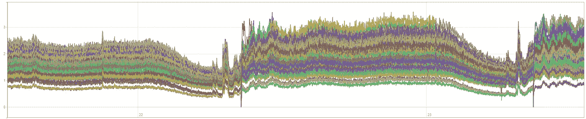
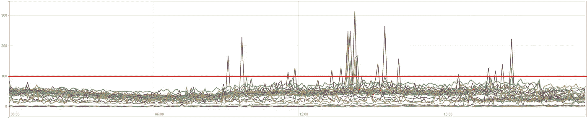
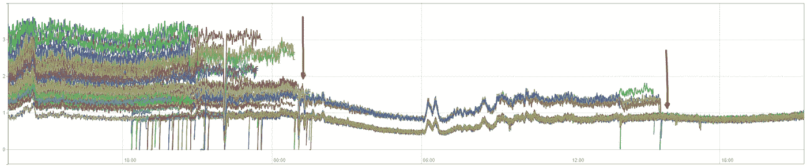
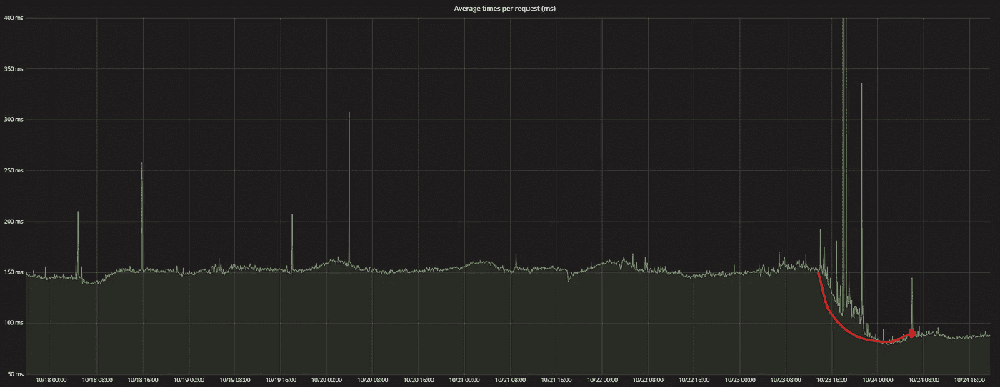
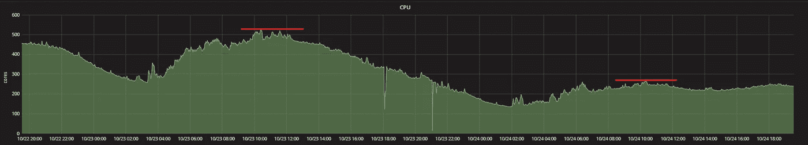
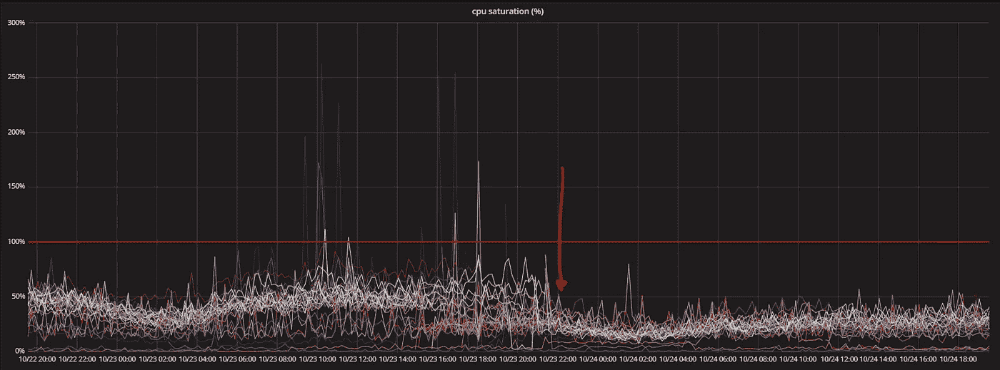

# 针对性能不足的能效

> 原文：<https://itnext.io/power-efficiency-for-performance-deficiency-a1ef79d1379b?source=collection_archive---------4----------------------->

**TL；博士** : CPU 节能模式是邪恶的，你应该立即禁用它们(如果你关心性能和延迟的话)。

在过去的几个月中，我们的团队一直在调查我们的 Kubernetes 群集的性能问题，该群集运行在大约 26 台非常强大的工作服务器上(Dell PowerEdge C6420 具有 48 个内核和 192GB RAM)。

与具有许多组件(即微服务)的大型分布式平台中的任何性能问题一样，精确描述它是一个相当大的挑战，并且症状不断变化，有时会将我们引向一个方向，然后引向一个完全不同的方向。

我们已经将症状缩小到以下几种:

*   不同节点上的应用程序请求处理时间不一致(抱歉，这里没有图表…你只能相信我的话)。
*   运行在不同节点上的相同应用程序实例的不稳定的 CPU 使用数字，并为相同数量的请求提供服务(一些使用 1 个内核，其他使用 3 个内核)。



为相同数量的请求提供服务的相同应用程序实例的 cpu 使用量(以核心为单位)

*   通过观察平均负载(即 load _ average > count 核心数)与大约 50%的 CPU 使用率来衡量 CPU 饱和度。



load_avg1 占可用内核的百分比(红线= 100%)

在高峰时段，我们的应用消耗我们集群中大约 500 个内核，从高水平 CPU 使用率百分比来看，这就是<50% (not so scary), however the Load averages on these nodes would be close to saturation levels with spikes reaching 300%.

We already disabled Hyper-Threading (and perhaps that should be a separate blog post) but we were still quite puzzled by the situation and it was just getting worse.

**能效**:现代服务器配备了先进的能效功能，旨在降低服务器的功耗和散热。

这些机制的主要目的是动态控制提供给服务器各种耗电组件的电量，其中最大的用户当然是 CPU。

所有这些模型的基础都是“按需功率扩展”的概念，即随着对 CPU 周期需求的减少，提供给 CPU 的功率将减少，反之亦然。

在讨论电源效率和性能时，我将重点关注两个重要因素——由处理器 **C 状态**控制的 CPU 空闲延迟，以及由处理器 **P 状态**控制的 CPU 时钟频率。

**C 状态** —这些是 CPU 运行状态(表示为 C0、C1、C1E、C2 等……)您可以将 C0 视为一个繁忙的 CPU 全速工作的状态&，而 C1 则处于待机/空闲模式，CPU 不执行任何活动，但准备切换到 C0，几乎没有损失/延迟。

额外的级别(> C1)是进一步的状态(通常称为“睡眠状态”)，其中 CPU 将实际关闭其电路的某些部分以减少功率使用，但是当它需要醒来并切换到 C0 状态时，代价是更高的等待时间。

**结论:**处于 C-状态的处理器内核> C1 将有更长的时间在需要时唤醒，这**将**影响您的应用响应时间，如果您对延迟和延迟波动敏感，您应该将最大 C-状态限制为 C1(稍后将详细介绍)。

**P 状态** —这些是额外的 CPU 控制状态，允许 CPU 降低其时钟频率，在我们的例子中，我们有一个 2.1GHz(标称/基本频率)的 48 核 CPU，它可以降低到每核 1GHz 和 2.8GHz(采用睿频加速)。

**结论:**允许动态调整 CPU 时钟频率将根据 CPU 内核的整体负载相关指标不断调整有效的 CPU 时钟，调整是**而不是**实时完成的，因此当需求增加时，在 CPU 能够全速处理之前会有延迟，对于只使用一小部分 CPU 内核的应用线程而言？嗯……它可能被认为不够“重要”,不足以保证 CPU 核心频率的增加。

记住上面描述的这些机制，考虑在 48 核服务器上运行的应用实例，该应用实例仅需要整体 CPU 能力的一小部分，并且其处理线程可能分布在多个 CPU 核上，从整体利用率的角度来看，这些核实际上可能未被充分利用，因此它们可能切换到更高的 C 状态和更低的 P 状态频率，然而我们可怜的“微服务”现在正在挣扎，它更慢并且工作更努力。 它的队列在增加，来自额外请求的反压力在堆积，这实际上导致它消耗更多的 CPU。

在检查了这些节能特性后，我们清楚地看到它们并不是性能友好的，因此我主要将应用延迟作为主要的 KPI。

**禁用 C 状态**

根据您选择的服务器硬件，您很可能会有一个 BIOS 选项来禁用 C 状态，但是在大多数情况下，这不会对您有任何好处，因为大多数现代 Linux 内核使用 *intel_idle* 驱动程序来管理 C 状态转换，并且该驱动程序会忽略您在 BIOS 中设置的任何内容。

我如何知道我的 Linux 是否使用了 *intel_idle* ？只需检查 dmesg:

```
$ dmesg | grep intel_idle
[ 1.368796] intel_idle: MWAIT substates: 0x2020
[ 1.368798] intel_idle: v0.4.1 model 0x55
[ 1.372936] intel_idle: lapic_timer_reliable_states 0xffffffff
```

此外，我如何将 *intel_idle* 带到 C1？这部分实际上取决于您选择的 Linux 发行版，但是通常您需要在您的引导加载程序中添加两个内核参数:***processor . max _ cstate = 1 Intel _ idle . max _ cstate = 1***

如果你使用 CoreOS(像我们一样)，在 */usr/share/oem/grub.cfg* 中添加下面一行，然后重启:

```
set linux_append="processor.max_cstate=1 intel_idle.max_cstate=1"
```

在 Debian 上，将参数添加到 */etc/default/grub* 中的 *GRUB_CMDLINE_LINUX* 变量，运行 *update-grub* ，重启:

```
GRUB_CMDLINE_LINUX="processor.max_cstate=1 intel_idle.max_cstate=1"
```

重启后，您应该在 *dmesg* 中看到以下内容:

```
[    3.240473] intel_idle: MWAIT substates: 0x2020
[    3.240474] intel_idle: v0.4.1 model 0x55
**[    3.240484] intel_idle: max_cstate 1 reached**
[    3.246909] intel_idle: lapic_timer_reliable_states 0xffffffff
```

或者，读取 *max_cstate* 的值:

```
$ cat /sys/module/intel_idle/parameters/max_cstate
**1**
```

**禁用 P 状态**

实现这一点有不同的方法，在我们的例子中，我们简单地将服务器 BIOS 配置中的 ***系统配置文件*** 切换为 ***性能*** 。

也有一些软件工具可以让你从操作系统内部进行管理，最常用的一个是 *cpufreq* (在 Debian 上，cpufrequtils 的一部分)，它摒弃了传统的 *cpupower* 实用程序。

**结果…**

我会让图表自己说话:)



为相同数量的请求提供服务的相同应用程序实例的 cpu 使用量(以核心为单位)

左边的第一个箭头表示所有服务器的 C 状态都达到 C1 状态，3 台服务器仍然允许 P 状态转换，正如您所看到的，它们都做得更好，但是启用了 P 状态的服务器仍然显示出比其他服务器更高的 CPU 使用率。

第二个箭头是当剩余的 3 个服务器禁用了 P-States 时，此时所有应用程序实例都显示出一致和统一的 CPU 使用情况，同时为相同数量的请求提供服务。

您会注意到，这个应用程序(它是我们最大的 CPU 消耗者)的整体 CPU 使用率现在显著降低了，我向您保证这是在相同的工作负载条件下。



应用程序平均请求处理时间

应用延迟处理时间减少了约 50%，从平均**191 毫秒**下降到**85 毫秒**，此外，当查看百分点时，我们看到. 9 和. 99 百分点有显著改善，离群值可以忽略不计。



集群范围的 cpu 使用率(核心数)



跨所有工作节点的 load_avg1(箭头指示 C/P 状态何时被禁用)

我们集群范围内的 CPU 使用率和负载指标降低了约 50%，这实际上降低了 CPU 温度，并且似乎略微降低了\_(ツ)_/的功耗

CPU 使用情况的最大影响是*系统*的利用率(减少了 50–70%)，这似乎与处理传入请求的应用程序的总体压力释放相对应，并且它一直传播到同样“阻塞”的内核堆栈。

**总结:**能效/省电模式是一项有趣的技术，但在大多数情况下，它们会对应用性能产生严重的负面影响，尤其是在 Kubernetes 等分布式调度平台上部署微服务时。

我提到 Kubernetes(尽管我认为这同样适用于其他分布式平台)是因为工作负载的结构/打包和分布方式——我们应用程序的小部分跨多个计算元素进行部署和重新部署，每个部分(即 Kubernetes 行话中的 Pod)不断移动(在内核之间， 节点之间),并且每个数据块仅限于计算节点整体可用容量的相对较小的一部分，如果它碰巧落在当前处于“睡眠”模式或刚刚降低其时钟频率的 CPU 核心上，它将受到影响。

这些技术考虑了一个非常宏观的指标，即 CPU 内核的总体负载量，当考虑到这些 CPU 内核上调度的不同工作负载类型和大小时，这并不是一个足够好的指标。

根据我们的经验，如上所述，在类似的工作负载条件下使用节能模式实际上会产生相反的效果:不节能(实际上还略高)和性能差。

**谢谢收听！:)**

另外，我还应该注意，现代服务器中还有其他形式的节能，如内存频率扩展、CPU 非核心扩展(即降低 CPU 非核心功能的功耗)、电源和风扇动态控制等，您还应该检查这些对您的应用程序有何影响。