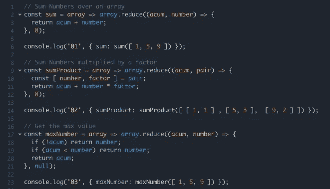
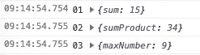
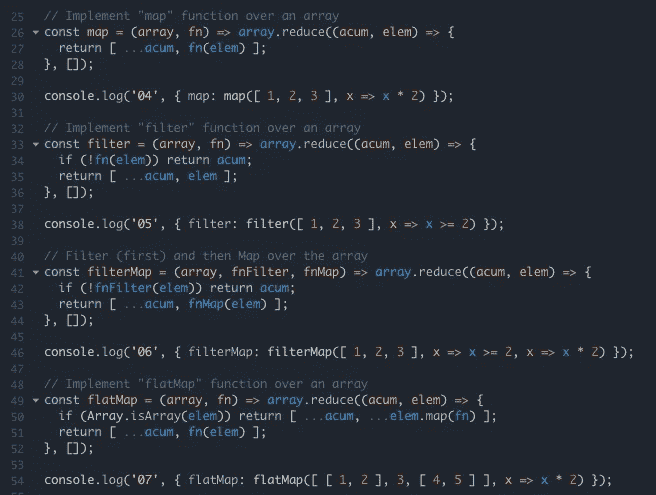
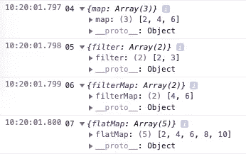
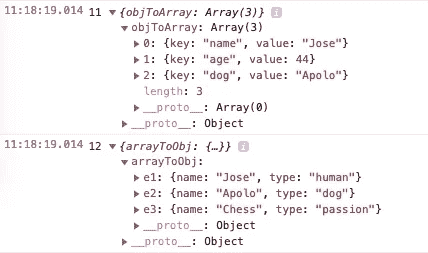
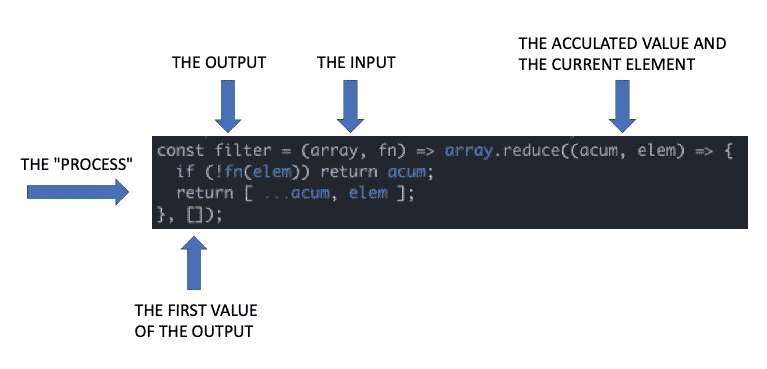
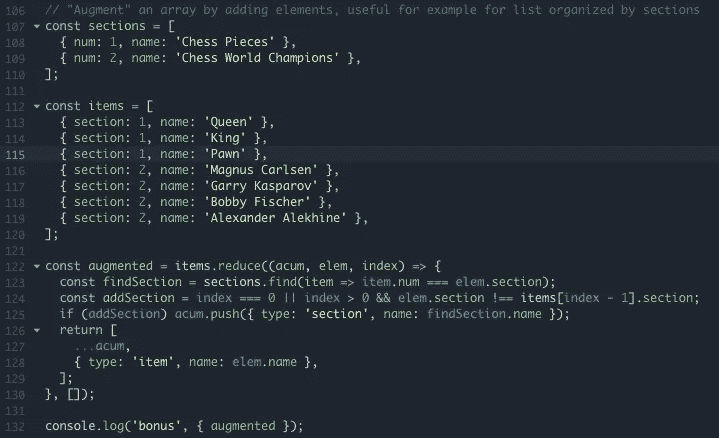
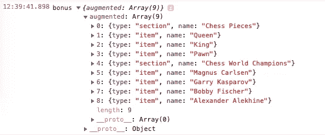
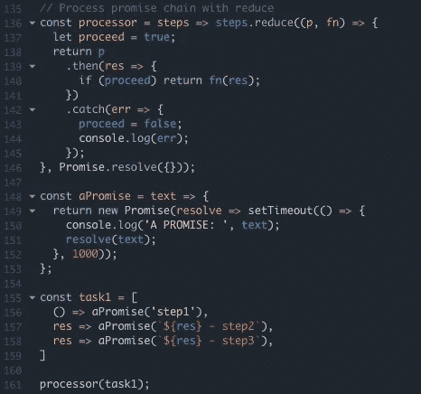
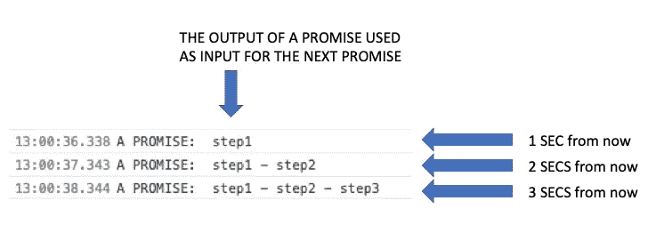

# 强大的 JS Reduce 功能

> 原文：<https://itnext.io/powerful-js-reduce-function-58cf47edcb8?source=collection_archive---------0----------------------->

## 你可以用它来解决任何与数据相关的问题

有了 ES6 Javascript 和更高版本，现在你可以在一个数组上*映射*、*过滤*、*减少*、*排序*、*展平*等等。这真的很简单明了，简洁而优雅。

但有时候，这个榜单的大未知数就是*减*。

> 你可能还不知道这种方法的威力，让我们来看看。

也许你认为“缩小”一个数组的唯一方法是把它变成“更小”的东西，比如一个数字，或者一个字符串。例如:

*   如果我有数组 *[ 1，2，3 ]* ，我可以通过对其各项求和来减少它，因此 **1 + 2 + 3 = 6** ，或者通过将它们相乘，因此 **1 * 2 * 3 = 6** ，或者通过简单地将数字连接成字符，因此字符串 **"123"** 。

但是，实际上 reduce 非常强大，可以完成任何数据转换。你可以从*数组*到*数组*，*数组*到*编号*，*数组*到*对象*，*对象*到*数组*，或者真的是你能想象到的任何东西。

> 所以，我要说“ **reduce** ”这个名字并没有让它变得公正。名字应该是" **transform** "然后，在你的脑海中，你总是确定这个函数可以用在很多更多的上下文中。

因此，我们现在将查看一些代码示例，让我们深入了解它们！

## 示例集 1:总和、和积和最大值

这个例子代表了思考 reduce 的“传统方式”。在以下每个示例中，您实际上是在将一个数组简化为一个数字:

用 REDUCE 实现的 Sum、SumProduct 和 Max 数

控制台显示:

所以，只是简单解释一下每个例子:

*   **求和**:从 0 开始，取每个元素，求和得到累加值。
*   **SumProduct** :从 0 开始，取每一对(数和因子)，将数*因子求和到累加值中。
*   **MaxNumber** :从零开始，如果没有累加，则返回第一个元素，如果大于累加，则返回数字，否则返回累加值。

## 示例集 2:映射、过滤器、过滤器和映射以及平面映射

现在，我们更进一步，实际实现经典的映射、过滤、过滤然后映射(其他顺序也是可能的)和平面映射函数。所有这些实际上都是 reduce(“aka transform”)的子集。

使用 REDUCE 实现的映射、过滤、过滤和映射以及平面映射

控制台显示:

每个示例的简要说明:

*   **Map** :从一个空数组开始，取一个数组和一个函数，返回累加的值加上应用了函数的当前元素。
*   **Filter** :从一个空数组开始，对当前元素进行函数求值，如果**为假**，就返回累加值(所以跳过这个元素)，否则返回累加值加上当前元素。
*   **FilterMap** :取一个数组，一个用作过滤器的函数，一个要映射的函数，将前两个过程结合起来。
*   **FlatMap** :从一个空数组开始，取一个数组和一个函数，如果元素本身是一个数组，则将结果分布到累计值上，否则，只返回累计值加上应用了函数的当前元素。

## 示例集 3:唯一、排序和反转

这也是可以用 reduce 实现的非常有用的函数。与本机函数相比，由*数组提供的最大优势。原型*，如果你愿意，你可以在一个步骤中组合多个转换…但实际上，这个例子的目的只是向你展示 reduce 函数的更多功能:

使用 REDUCE 实现唯一、排序和反向

控制台显示:

每个示例的简要说明:

*   **Unique** :从一个空数组开始，取一个元素，检查它是否已经在累加值中。如果存在，只返回累计值(所以跳过它)，否则返回累计值加上元素。
*   **排序**:从一个空数组开始，将累加值分成 2 个集合:元素“小于等于当前值”的集合和元素“大于当前值”的集合。因此，在这之后，只需返回当前元素“在中间”的两个集合。
*   **倒车**:有了 ES6，一切都很简单。只需返回值并追加累加值，这样每次迭代的最后一个元素将总是在数组的第一个位置。

## 示例集 4:对象到数组和数组到对象

如果减少的同义词“转化”还不清楚的话，从这一点来看确实是显而易见的。有时你需要将一个数组转换成一个对象，反之亦然。可以用什么功能？是啊！减少！

用 REDUCE 实现的对象到数组和数组到对象

控制台显示:

每个示例的简要说明:

*   **Object To Array** :从一个空数组开始，遍历对象键(也是一个数组)。对于每个键，也取值( *object[key]* )并返回累加值加上 *object { key: value }* 。也许这个例子看起来不是很有用，但是如果您想象您正在使用 React 呈现一个列表，并且将对象信息作为一个数组是很方便的，那么这个例子就很有用。
*   **数组到对象**:从一个空对象开始，遍历数组返回一个对象，其中 *id* 字段作为对象的第一级字段，其余字段作为其内容。当您需要将包含实体信息(由 id 表示)的多个数组分组，并在单个对象中返回所有内容以供进一步处理时，这有时很有用。

因此，reduce 函数可以以一种更传统的方式看起来更像一个流程:INPUT => PROCESS => OUTPUT

还原功能为“传统流程”

## 好处 1:减少实际上是增加！

假设您不需要有单个数字作为结果，或者相同的原语，或者甚至相同数量的输入元素，您可以使用 ***reduce*** 向您的输入数据实际添加新元素。

这是一个真实世界的例子(简化的),你有一个以某种方式分类的元素列表，你想要显示它们，但是插入一些标题来指示类别。

例如:

用部分(作为分隔符/副标题)扩充的元素列表

控制台显示:

因此，您通过组合不同的数据原语来“生成”一个新的列表。当然，没有限制。它可以是任意数量的实体，这些实体可以组合成一个列表，准备传递给 DOM 进行呈现。

## 好处 2:使用 reduce 处理承诺链(按顺序)

我发现 reduce 的另一个非常有用的用法是确保顺序性。当您处理一个承诺链时，通常您需要前一个承诺的结果作为下一个承诺的输入，以此类推。

化险为夷！

承诺链(按顺序),其中每个步骤的结果用作下一步的输入

控制台显示:

我们可以就此打住。

所有的例子都在这个 [JS 提琴](https://jsfiddle.net/jmaguirrei/yhmvap5o/82/)

我希望现在你有更多的想法来使用 ***reduce*** 在你的项目中产生可读和优雅的代码！

来自智利 [🇨🇱](https://emojipedia.org/flag-for-chile/) 的欢呼！！