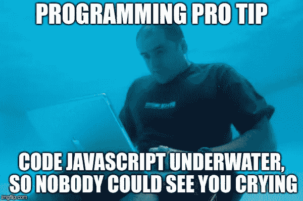
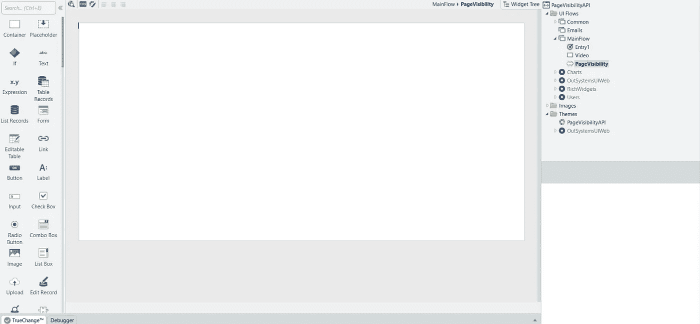
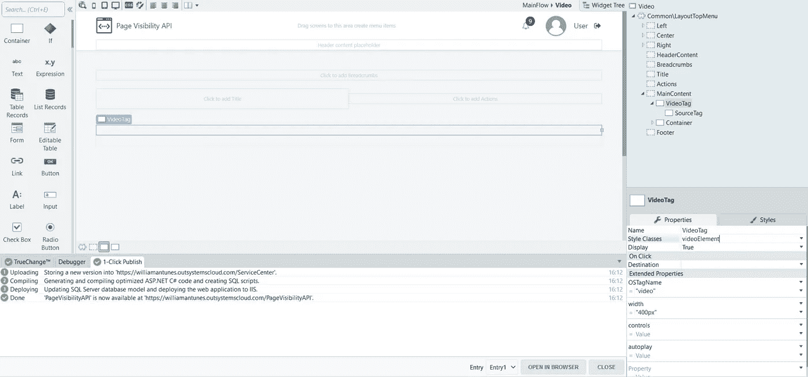
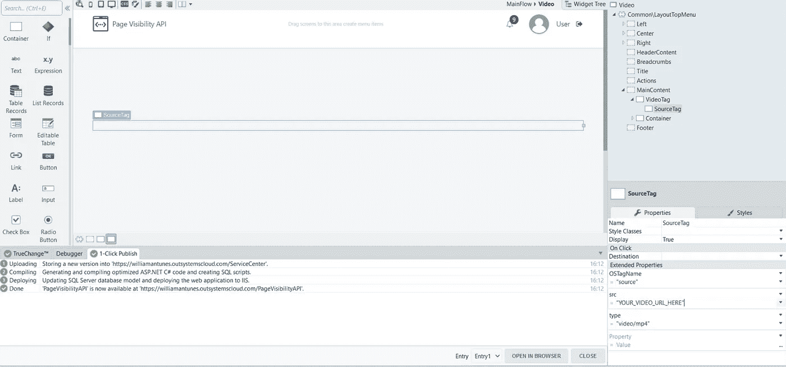
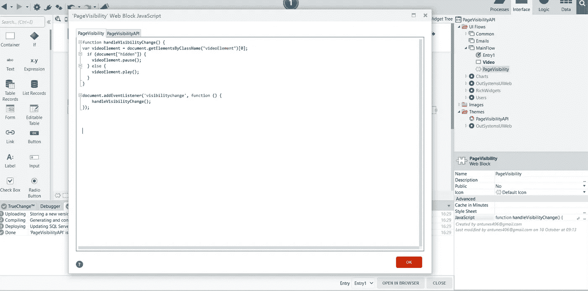

# 启动您的外部系统应用程序—第 1 部分—将 Web APIs 集成到外部系统

> 原文：<https://itnext.io/powering-up-your-outsystems-applications-part-1-integrating-web-apis-to-outsystems-c4c41125e7a?source=collection_archive---------5----------------------->



没必要那么难，让它变得愉快。

在这里，我再次鼓励你们所有人尝试一下 Javascript，改进你们的外部系统应用程序。所以，我们从简单的开始吧。

你听说过 Web APIs 吗？你可能没有听说过，但是你可能已经使用过了。

什么是 Web APIs？

Web APIs 是 Javascript 中现成的功能。这意味着当你开发一个 Javascript 代码时，你可以使用许多可重用的库来加速你的开发。

你可以在 [Mozilla 的文档](https://developer.mozilla.org/en-US/docs/Web/API)中找到可用的内置 Web APIs 列表。

# 如何在您的外部系统应用程序中使用 Web APIs？

在本文中，作为在应用程序中使用 Web APIs 的一个例子，我将向您展示如何实现页面可见性 API。

> 页面可见性 API 提供了一些事件，您可以通过观察这些事件来了解文档何时变得可见或隐藏，还提供了查看页面当前可见性状态的功能。

页面可见性 API 有哪些用例？

例如，很多开发者抱怨谷歌 Chrome 消耗大量内存。让我告诉你，谷歌浏览器不是唯一的责任。

许多应用程序消耗大量内存，显示动画，运行 ajax 调用以保持数据最新，沉重的全局对象等等。如果你用这种应用程序保存 5 到 10 个标签，你会有内存问题。

这是页面可见性 API 帮助开发人员并改善用户体验的一个用例。通过使用页面可见性 API，你可以在用户切换到另一个标签页并最小化窗口时触发，并停止那些繁重的任务。

**如何在 OutSystems 中实现页面可见性 API？**

在这个例子中，我创建了一个新的传统 web 应用程序模块，并添加了一个名为“PageVisibility”的块。



之后，我在 WebBlock 的 Javascript 属性中添加了以下代码:

```
document.addEventListener('visibilitychange', function () {
    if (document.hidden) {
        // the page has lost focus
    } else {
        // the page got focused
    }
});
```

这段代码向 DOM 添加了一个新的监听器，这个监听器叫做“visibilitychange”。定义触发器后，您可以指定侦听器在被触发时应该执行什么操作。

在这个例子中，我检查页面是否隐藏。在页面可见性 API 中，您可以访问两个属性:

*   Document.hidden(布尔值)
*   Document.visibilityState(四个可能的值:可见、隐藏、预呈现或卸载)

对于这个演示，我还创建了一个 Web 屏幕，其中包含两个容器，分别表示以下内容。

```
<video id=”videoElement” style=”width:400px;”>
<source id=”SourceTag” src=”https://cdn.plyr.io/static/demo/View_From_A_Blue_Moon_Trailer-576p.mp4" type=”video/mp4">
</video>
```

这就是你如何把它翻译成外部系统:

*   视频标签



*   视频标签内的源标签:



由于 OSTagName 扩展属性，这是可能的。您可以在[文档](https://success.outsystems.com/Documentation/Development_FAQs/How_to_generate_HTML_tags)中找到关于该属性的更多信息。它看起来比包含 HTML 代码的表达式要好。

现在您需要定义当它被触发时您的侦听器应该做什么。让它根据当前窗口的可见性播放或暂停视频的代码应该是这样的:

```
function handleVisibilityChange() {
var videoElement = document.getElementsByClassName("videoElement")[0];
  if (document["hidden"]) {
    videoElement.pause();
    document.title = "Paused";
  } else {
    videoElement.play();
    document.title = "Playing";}
}document.addEventListener('visibilitychange', function () {
    handleVisibilityChange();    
});
```

因此，首先，这段代码根据我们给它的类名获取 DOM 中的 video 元素。然后检查它的隐藏属性。

如果页面是隐藏的，它调用视频元素的函数 pause 否则，页面是活动的，它将播放视频。

它还会更改标签的标题，以便在视频暂停或播放时更容易看到。

在 WebBlock 中插入此代码后，它看起来是这样的:



现在我们有了一个工作的 Javascript 代码，我们可以将 Web 块拖到屏幕上，就在我们已经插入的标签之后，然后发布您的模块。
最后，你可以测试应用程序，当你播放视频并切换到另一个标签时，视频会暂停。

这是一个简单的例子，说明如何通过添加一些很酷且容易实现的东西来改进您的外部系统应用程序。