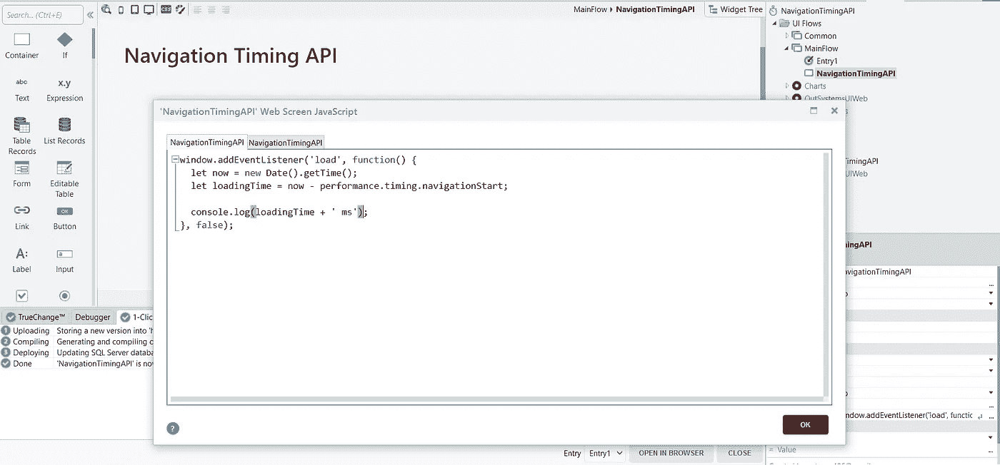
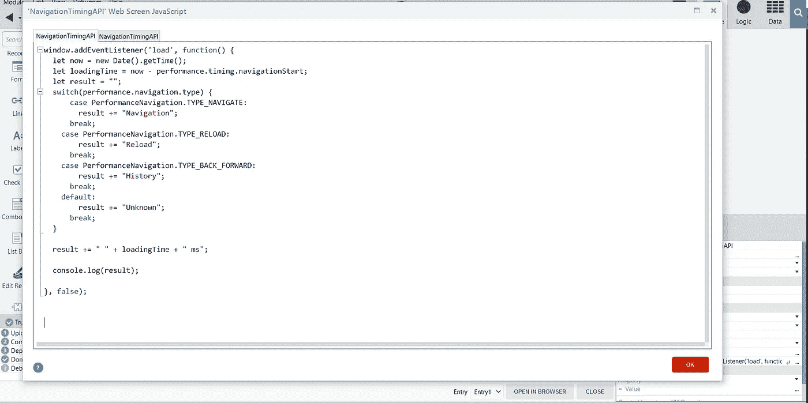
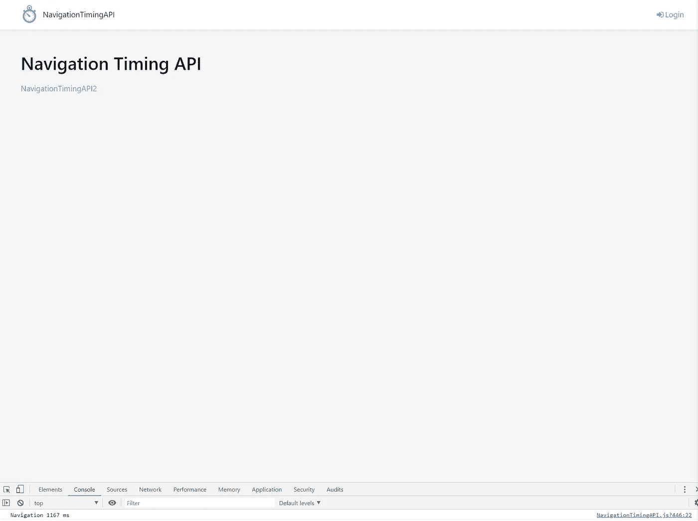
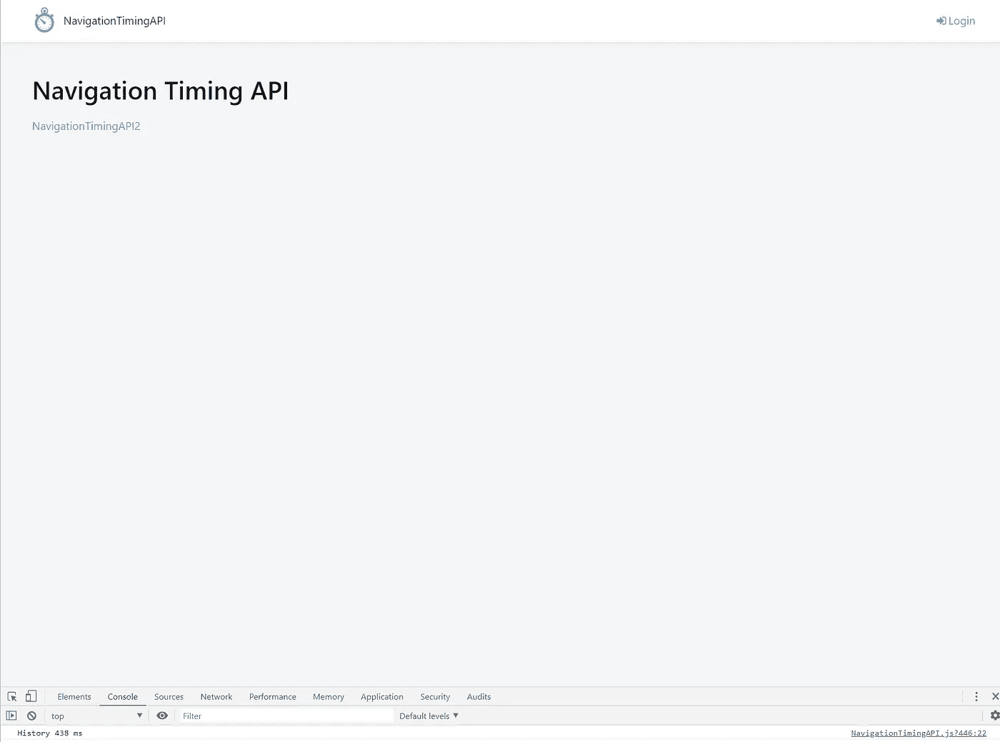

# 启动您的外部系统应用程序—第 2 部分—用 Javascript 进行性能跟踪

> 原文：<https://itnext.io/powering-up-your-outsystems-applications-part-2-performance-tracking-with-javascript-92fd5814aa42?source=collection_archive---------6----------------------->


性能不仅仅是指速度快，还包括使用对你有利的能力。

前一段时间，我在考虑如何在客户端测量页面负载的真实性能。

我可以通过创建自己的逻辑来轻松地测量它，从而根据我想要测量的操作的开始和结束来获得指标。但是这种方法仍然依赖于浏览器、服务器和外部系统平台之间运行的一切。这样，我就没有在我的外部系统应用程序的服务器端测量它的延迟。

经过一番调查，我从 Web API(我在[上一篇文章](/powering-up-your-outsystems-applications-part-1-integrating-web-apis-to-outsystems-c4c41125e7a?source=friends_link&sk=82733b2c30922282a9cdddca1cf76f89)中已经解释过什么是 Web API)中了解到了导航定时 API。

这个 API 为我们提供了一种检测浏览器交互的本地 javascript 方式，以及测量这些交互的能力。

因此，使用该 API，我们可以检测三种类型的交互:

*   航行
*   再装
*   后退 _ 前进

你可以在 [Mozilla 文档](https://developer.mozilla.org/en-US/docs/Web/API/PerformanceNavigationTiming/type)中找到更多相关信息。

让我们从一个简单的例子开始，我们将测量一个简单的屏幕加载所需的时间。

我在 OutSystems 平台中创建了一个简单的测试应用程序，还创建了一个空白屏幕，在该屏幕中，我添加了以下 Javascript 代码:



```
window.addEventListener('load',function(){
 let now = new Date().getTime();
 let loadingTime = now — performance.timing.navigationStart;console.log(loadingTime + ' ms');
},false);
```

发布模块并运行应用程序后，我们会看到:


这意味着我们的简单屏幕花了 1537 毫秒加载。现在，我们将使我们的 Javascript 代码变得更好、更复杂，让我们跟踪导航计时 API 提供给我们的所有事件:



```
window.addEventListener('load', function() {
  let now = new Date().getTime();
  let loadingTime = now - performance.timing.navigationStart; 
  let result = "";
  switch(performance.navigation.type) {
      case PerformanceNavigation.TYPE_NAVIGATE:
        result += "Navigation";
      break;
    case PerformanceNavigation.TYPE_RELOAD:
        result += "Reload";
      break;
    case PerformanceNavigation.TYPE_BACK_FORWARD:
        result += "History";
      break;
    default:
        result += "Unknown";
      break;
  }

  result += " " + loadingTime + " ms";

  console.log(result);

}, false);
```

现在我们的代码已经准备好跟踪 3 种不同类型的事件，结果将显示在控制台中。

我还复制了屏幕，并在第一个屏幕上放了一个链接到第二个。这样，我们将能够测试 BACK_FORWARD 事件。

让我们开始测试应用程序，看看它是什么样子的。

第一个测试是打开应用程序:



加载时间为 1167 毫秒

对于第二个测试，我们将通过我们创建的链接导航到第二页，然后单击浏览器的后退按钮:



花了 438 毫秒回去

我们可以测试的第三个事件是通过单击浏览器的“reload”按钮来重新加载页面:


我们可以看到，事件的持续时间彼此之间有很大的不同。

这是因为浏览器呈现页面的方式。在第一次导航到页面时，浏览器加载所有内容，而在重新加载期间，由于缓存机制，它将花费更少的时间。返回浏览器的 back 按钮将加载离开页面时保存的 ViewState 内容。这就是为什么 BACK_FORWARD 事件比其他事件花费的时间少。

所以，最后，我们的代码看起来像这样:

```
window.addEventListener('load', function() {
  let now = new Date().getTime();
  let loadingTime = now - performance.timing.navigationStart; 
  let result = "";
  switch(performance.navigation.type) {
      case PerformanceNavigation.TYPE_NAVIGATE:
        result += "Navigation";
      break;
    case PerformanceNavigation.TYPE_RELOAD:
        result += "Reload";
      break;
    case PerformanceNavigation.TYPE_BACK_FORWARD:
        result += "History";
      break;
    default:
        result += "Unknown";
      break;
  }

  result += " " + loadingTime + " ms";

  console.log(result);

}, false);
```

从现在起，您可以将这些指标发送到服务器，并对它做任何您想做的事情；存储在您数据库中，发送到您的 BI 应用程序，创建报告或使用这些指标执行任何其他程序。

这是一个容易、简单且非常有用的 Web API，任何人都可以使用。因此，请利用它，并改善故障诊断和记录您的应用程序。