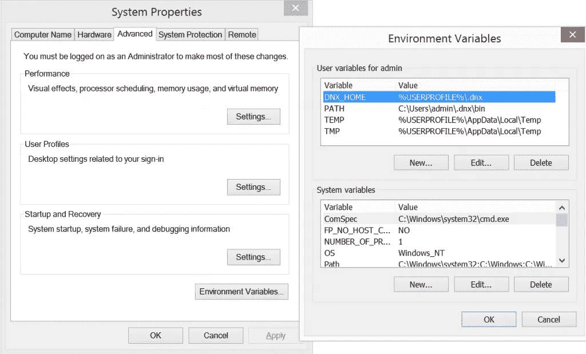
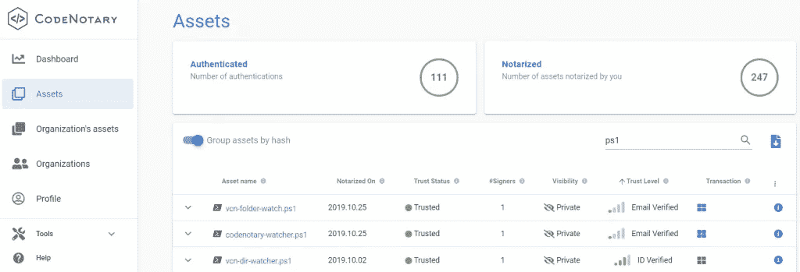
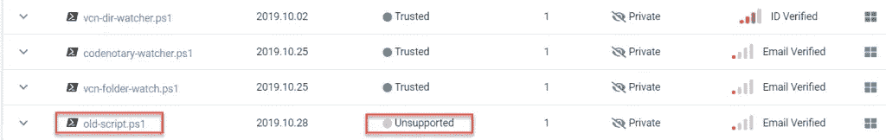

# 没有数字证书的 PowerShell 文件信任

> 原文：<https://itnext.io/powershell-file-trust-without-digital-certificates-7f435a558824?source=collection_archive---------5----------------------->

code 公证人允许信任，不信任或不支持任何文件，脚本或文件在您的系统上。数字证书只对脚本有帮助，需要和文件一起传输。在真实的场景中，您的工作流不仅仅由脚本组成，您通常还需要配置文件或其他文档来使用。

这篇博客文章介绍了 code 公证人 PowerShell 存储库，它是一些体面且易于使用的 PowerShell 集成的家园:

*   根据您存储文件的目录，用您的身份和特定信任级别公证文件
*   在运行或使用文件或脚本之前，请对它们进行鉴定

# PowerShell 文件信任看门狗

让我们从 code 公证人 PowerShell 看门狗开始，它监听给定目录中的文件创建事件，并使用您的身份公证这些文件。code 公证人可以用来代替数字证书。要获得您的身份，只需在此处获得您的免费帐户:

使用案例:

*   不变地公证给定目录中的所有文件，即生产、配置文件或文档的 PowerShell 脚本
*   通过更改脚本以监视每个文件夹并在公证时添加自定义属性，创建测试、登台和生产文件夹工作流
*   创建信任、不信任、不支持工作流，方法是更改脚本以监视每个文件夹，并在文件移动到定义的文件夹时公证、不信任或不支持文件

# 准备

请确保安装 code 公证人 vcn 命令，该命令可在以下位置找到:

[https://github.com/vchain-us/vcn/releases/latest](https://github.com/vchain-us/vcn/releases/latest)

您可以简单地使用适用于 Microsoft Windows 的 vcn 安装程序，或者下载 vcn 可执行文件并将其存储在本地。需要在脚本中配置 vcn.exe 的位置。

如果您想完全自动化看门狗，您需要设置一些环境变量。为此，只需使用 Win+R 快捷方式运行 sysdm.cpl:



*   VCN _ 用户
*   VCN _ 密码
*   VCN _ 公证 _ 密码

关于支持的环境变量的更多信息可以在这里找到:【https://docs.codenotary.io/vcn/user-guide/environments.html 

# 观察单个目录

监视单个目录非常简单，只需更改$vcnpath，$watcher.path，如果您还想检查子目录的话。

```
### Set vcn binary path - please download vcn here: https://github.com/vchain-us/vcn/releases/latest
   $vcnpath = """$env:programfiles\codenotary\vcn.exe"""

### Set target directory and file types to watch for changes and if you want to include subdirectories
   $watcher = New-Object System.IO.FileSystemWatcher
	 $watcher.Path = "C:\Users\user\Documents\Notarize"
   $watcher.IncludeSubdirectories = $true
   $watcher.EnableRaisingEvents = $true  

### Define notarization when files are detected
   $action = { $path = $Event.SourceEventArgs.FullPath
             $changeType = $Event.SourceEventArgs.ChangeType
	 $param = " n " + """$Path""" + " --attr PSEvent=True"
	 $command = $vcnpath + "$param"
			iex "& $command"
           $logline = "Notarized $(Get-Date), $changeType, $path"
           write-host $logline
		  Add-content ($watcher.Path + "\codenotary.log") -value $logline
              }    
### DECIDE WHICH EVENTS SHOULD BE WATCHED 
   Register-ObjectEvent $watcher "Created" -Action $action

   while ($true) {sleep 5}
```

每次将文件存储在该目录中时，都会处理该文件的公证，您可以查看 more 公证人仪表板以了解更多详细信息:



# 基于文件夹结构的工作流环境

让我们简单地创建以下文件夹结构:

*   生产(可信)
*   旧(不支持)
*   不受欢迎(不受信任)

根据下面的脚本，在相应文件夹中创建或移动的文件将通过选定的信任级别进行公证。



这样，您只需根据文件的生命周期移动文件，就可以创建包含不可变信任级别的完整工作流。

```
# Set vcn binary path - please download vcn here: https://github.com/vchain-us/vcn/releases/latest
   $vcnpath = """$env:programfiles\codenotary\vcn.exe"""
   $logpath = "C:\CodeNotary\codenotary.log"
## Define all environments

### Set Production environment
   $watchertrusted = New-Object System.IO.FileSystemWatcher
   $watchertrusted.Path = "C:\CodeNotary\Production"
   $watchertrusted.IncludeSubdirectories = $true
   $watchertrusted.EnableRaisingEvents = $true  

### Set Old environment
   $watcherunsupported = New-Object System.IO.FileSystemWatcher
   $watcherunsupported.Path = "C:\CodeNotary\Old"
   $watcherunsupported.IncludeSubdirectories = $true
   $watcherunsupported.EnableRaisingEvents = $true  

### Set Unwanted environment
   $watcheruntrusted = New-Object System.IO.FileSystemWatcher
   $watcheruntrusted.Path = "C:\CodeNotary\Unwanted"
   $watcheruntrusted.IncludeSubdirectories = $true
   $watcheruntrusted.EnableRaisingEvents = $true  

## Define notarization when files are detected
   $actiontrusted = { $path = $Event.SourceEventArgs.FullPath
             $changeType = $Event.SourceEventArgs.ChangeType
			 $param = " notarize " + """$Path""" + " --attr PSEvent=True"
			 $command = $vcnpath + "$param"
			 iex "& $command"
             $logline = "Trust $(Get-Date), $changeType, $path"
             write-host $logline
		     Add-content ($logpath) -value $logline
             }    

   $actionunsupported = { $path = $Event.SourceEventArgs.FullPath
             $changeType = $Event.SourceEventArgs.ChangeType
			 $param = " unsupport " + """$Path""" + " --attr PSEvent=True"
			 $command = $vcnpath + "$param"
			 iex "& $command"
             $logline = "Unsupport $(Get-Date), $changeType, $path"
             write-host $logline
		     Add-content ($logpath) -value $logline
             }    

   $actionuntrusted = { $path = $Event.SourceEventArgs.FullPath
             $changeType = $Event.SourceEventArgs.ChangeType
			 $param = " untrust " + """$Path""" + " --attr PSEvent=True"
			 $command = $vcnpath + "$param"
			 iex "& $command"
             $logline = "Untrust $(Get-Date), $changeType, $path"
             write-host $logline
		     Add-content ($logpath) -value $logline
             }    

# Register all Watcher
   Register-ObjectEvent $watchertrusted "Created" -Action $actiontrusted
   Register-ObjectEvent $watcherunsupported "Created" -Action $actionunsupported
   Register-ObjectEvent $watcheruntrusted "Created" -Action $actionuntrusted

   while ($true) {sleep 5}
```

*原载于 2019 年 10 月 28 日*[*https://www . code 公证人. io*](https://www.codenotary.io/powershell-file-trust/) *。*