# 实用串联继承

> 原文：<https://itnext.io/practical-concatenative-inheritance-59965b075c41?source=collection_archive---------3----------------------->

在本文中，我将解释什么是串联继承，以及我们如何利用它，就像我在工作中和在我的 node.js 开源 web 服务器框架 [Bliz](https://github.com/yuraxdrumz/Bliz) 中使用它一样，来构建稳定、快速、可读和可测试的应用程序。

# 什么是串联继承？

正如 Javascript 大师所解释的， [Eric Elliott](https://medium.com/u/c359511de780?source=post_page-----59965b075c41--------------------------------) [这里](https://medium.com/javascript-scene/the-heart-soul-of-prototypal-oo-concatenative-inheritance-a3b64cb27819) —串联继承是将一个或多个源对象的属性组合成一个新的目标对象的过程。

# 我们为什么需要它？

如果你曾经用 Javascript 编写过一个大型的应用程序，你就会知道它是一种动态的、[弱类型的](https://en.wikipedia.org/wiki/Weak_typing)、[基于原型的](https://en.wikipedia.org/wiki/Prototype-based_programming)和[多范例的](https://en.wikipedia.org/wiki/Multi-paradigm_programming_language)语言，这一方面让你能够随心所欲地编写应用程序，但另一方面，也可能会造成混乱。

比如你用 es5 的函数构造函数或者 es6 的类声明来写(都是幕后的老一套函数构造函数，唯一的区别就是没有得到[提升](https://scotch.io/tutorials/understanding-hoisting-in-javascript)，你要处理`this`和`new`关键词，这本身就是一种痛苦。如果你的老板向你提出要求一个新的特性，这个特性由方法组成，每个方法都写在不同的类中，那该怎么办呢？你不会为了弄几个方法就开始继承 20 个类吧？解决方案是从[可组合对象](https://medium.com/humans-create-software/composition-over-inheritance-cb6f88070205)构建我们的应用程序，并利用 Javascript [闭包](https://medium.com/dailyjs/i-never-understood-javascript-closures-9663703368e8)和[函数作为一等公民](https://en.wikipedia.org/wiki/First-class_citizen)为我们所用。

# 怎么

让我们看看如何利用串联继承的本质。

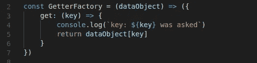

吸气工厂功能

让我们分解我们的 GetterFactory:

1.  这是一个函数
2.  它是一个工厂函数，因为它返回一个新的对象
3.  工厂函数需要某种数据对象
4.  返回的对象附有一个方法
5.  该方法需要某种密钥
6.  该方法本身在我们的初始 dataObject 上寻找那个键，由于闭包，这个键是可用的。

很好，现在我们明白了发生了什么，让我们思考一下。我们有一个函数，当被调用时，返回一个带有方法的对象。也许，如果我们把这些功能结合起来，我们可以创造一些有用的东西。

让我们看看另一个工厂函数:

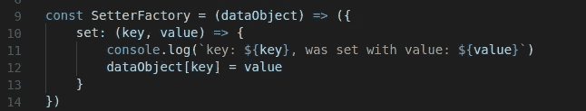

setter 工厂函数

这个看起来和前一个一样。我们有一个函数，它返回一个带有方法的新对象，并利用它的闭包来修改对象。太棒了。

让我们将后面的工厂合并成一个对象。

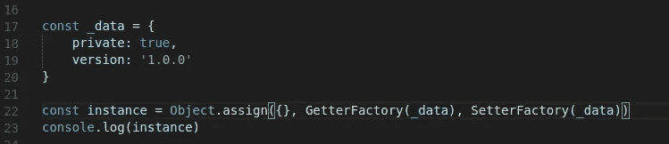

对象合成的例子

让我们假设我们的数据是私有的。我们声明一个名为`instance`的新变量，并给它分配一个新对象。我们给它添加了`GetterFactory`函数，并传递我们的数据对象，我们对`SetterFactory`做了同样的事情。还记得这些函数都返回一个带有方法的对象吗？太好了！让我们用`console.log`这个实例来看看是怎么回事。

console.log 的输出(实例)

我们得到一个带有 get 和 set 函数的简单对象，这是调用工厂并将它们组合在一起的结果。现在，让我们试着得到一个变量，并设置一个变量。

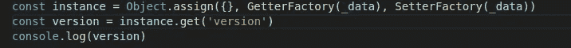

获取变量

我们的输出如下所示:

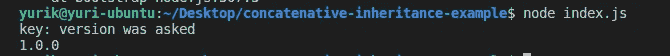

获取密钥的输出

我们的 get 函数获取了我们的密钥并打印出来，就像我们一开始告诉它的那样，太棒了！

让我们设置一个密钥，以确保它正常工作

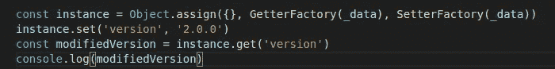

我们将密钥版本设置为 2.0.0，并立即要求它。

让我们看看输出

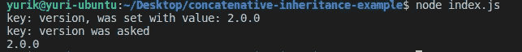

检查设定值

现在你的想法是，这看起来很棒，尤里，但是这些数据并不是真正的隐私。

我将向您展示我们如何实现一个`InstanceFactory`函数，它将我们所有的工厂和私有数据组合成一个对象。

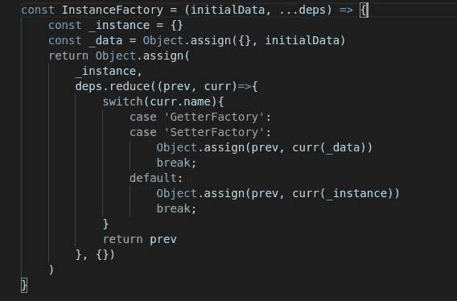

实例工厂

让我们分解这个函数，以便更好地理解它:

1.  我们有一个函数需要一个 initialData 参数，我们对所有其他参数使用 [rest 操作符](https://developer.mozilla.org/en-US/docs/Web/JavaScript/Reference/Functions/rest_parameters)，并把它放在`deps`变量中。
2.  我们在函数内部创建一个实例对象。
3.  我们将 initialData 对象中传递的内容赋给 our _data 变量，注意，object.assign 做了一个[浅层复制](https://we-are.bookmyshow.com/understanding-deep-and-shallow-copy-in-javascript-13438bad941c)，所以如果你需要一个全新的对象，请使用深层复制。
4.  我们将 deps 变量简化为一个对象，我们可以用它来赋值给 _instance 变量并返回它。
5.  reduce 函数在所有工厂上运行，用一个变量调用它们，并将它们添加到 reduce 对象中。请注意，我们做了一个切换案例，这是因为如果我们的工厂名称是 getter 或 setter，我们为它提供 _data 变量，该变量现在是私有的，我们这样做是为了使所有其他工厂函数都必须使用我们的 get 和 set 方法来访问数据。我们将实例本身传递给所有其他不是 getter 和 setter 的工厂函数，以允许从方法本身调用方法。

让我们看看如何利用`InstanceFactory`

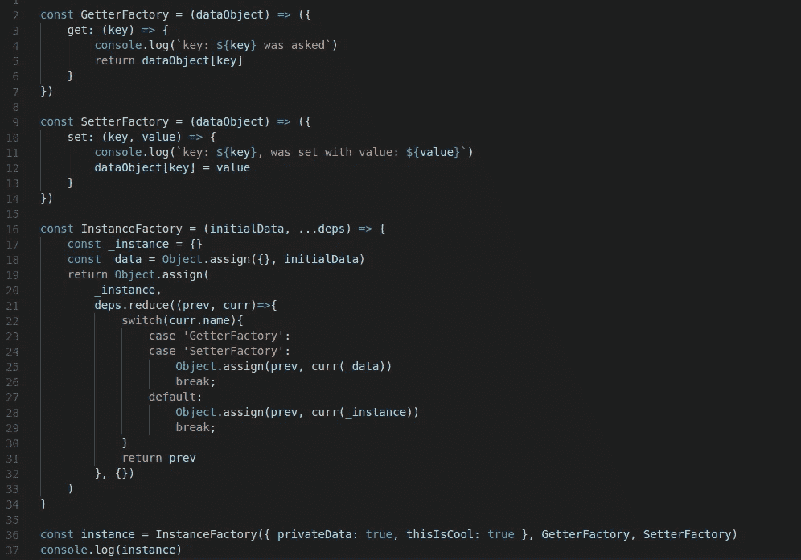

请注意，它看起来与分配给 getter 和 setter 函数的第一个对象相同，只是这次我们的第一个变量是我们的数据，它将被浅拷贝并且是私有的。

让我们看看控制台日志的输出:

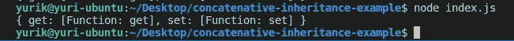

我们拥有的是一个带有私有数据的简单对象，它只能通过 get 和 set 函数来访问。

现在，让我们回到当我们的老板要求我们添加一个新的功能到我们的应用程序，他想要一个杀手机器狗有 3 种方法:杀死，吠叫和清洁。此外，每当我们那只长相奇怪的杀人机器狗做了什么事情，他就想增加一个计数器。

让我们实现我们老板的奇怪功能。

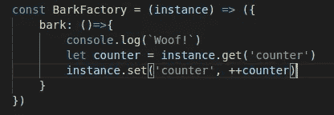

树皮工厂

这里有我们的 bark 工厂，它返回一个带有 bark 方法的对象。你们中的一些人可能会问，我们怎么会有实例本身呢？

让我们再次回到我们的实例工厂:

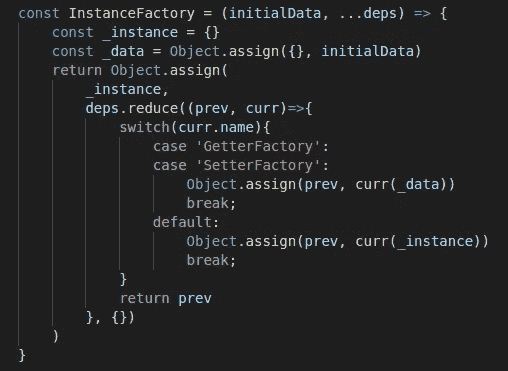

看到默认案例的位置了吗？每当我们的工厂不是一个 getter 和 setter 时，它将接收我们的实例，当你调用某个方法时，它已经有了所有其他的方法。

这就是为什么我们可以在 bark 中使用 get 和 set 方法。现在，让我们将它添加到实例中。

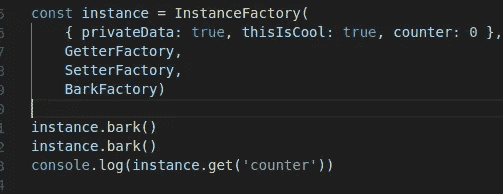

我们在数据对象中添加了计数器，并添加了 bark factory 作为参数。

现在，让我们试着叫，看看我们的计数器上升。

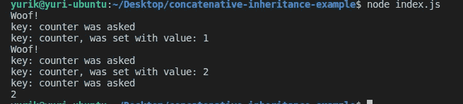

太好了，我们叫了一声，计数器就上升了。

遵循这个概念现在很简单，对于其他 2 个方法，我们只需创建它们的工厂，并将它们作为参数添加到我们的主 InstanceFactory 中。

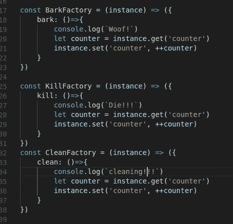

我们的三个工厂

现在，你明白是怎么回事了。现在，连接一切:

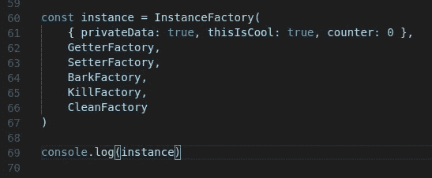

我们的主要实例

我们的产出:

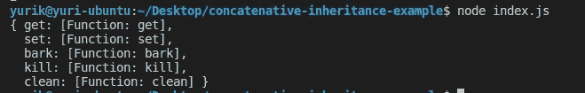

我们实例的方法

太好了，我们所有的方法都到位了。我们现在可以为每个工厂编写单元测试，为工厂的组合编写集成测试，我们可以快速添加功能，并且不再需要担心范围问题。这种类型的写作鼓励我们构建模块化的、稳定的、人类可读的应用程序。

# 概述

我们看到了串联继承意味着什么，我们实现了我们的第一个工厂，并看到了如何将它们分配给一个简单的对象。后来，我们引入了可怕的 InstanceFactory，它很快变得不那么可怕了，而且非常有用。最后，我们很快实现了老板奇怪的功能要求。

# 最终注释

我们写的所有东西都可以在这里找到。非常感谢您的阅读，请继续关注我对编程、架构、设计模式、语言等方面的更多想法。另外，如果你需要一个声明性的 graphql/realtime/http web 服务器，看看这里的。我将很高兴代码贡献。

下次见！