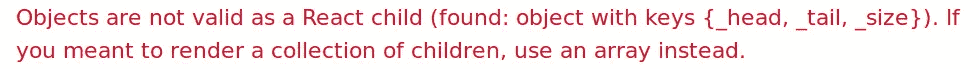
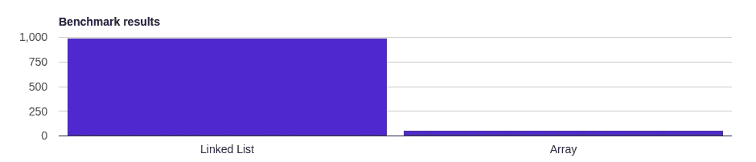
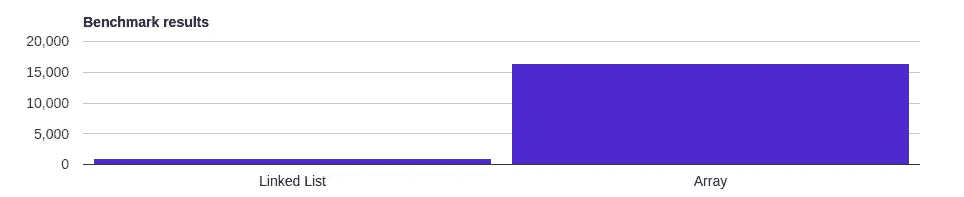
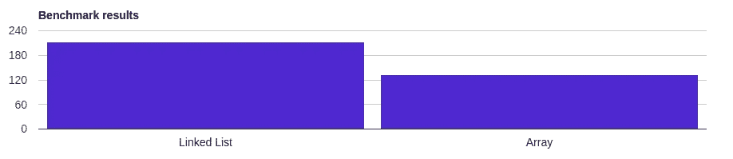

# 前端应用的实用数据结构:何时使用链表

> 原文：<https://itnext.io/practical-data-structures-for-frontend-applications-when-to-use-linked-lists-8ef9826a745?source=collection_archive---------2----------------------->


在网上搜索什么时候使用链表，你可能会找到这样的答案:

*   使用链接来解决哈希冲突的哈希表。
*   简单的内存分配器。
*   FAT 文件系统中大型文件的元数据。

如果你是一名开发应用程序的前端开发人员，你实现内存分配器或哈希表的可能性有多大？可能性极小。

在这篇文章中，我们将看看前端应用程序中链表的*实际用途*。本文不会讨论如何实现一个链表。网上已经有很多关于这个的文章了。

## 剧透警报

现代前端应用程序中的链表存在一些问题:

*   主流框架中的大部分模板都不容易使用链表。React 和 Vue 就是两个例子。在 React 中，您只能使用数组进行集合。其他任何事情都会产生错误:



这里没有链表爱…

Vue 模板中的 go-to 集合数据结构也是一个数组。尽管 Vue 官方支持对象上的迭代，但这种迭代是在自己的属性上(使用数组):

链表是通过引用连接的对象。要迭代一个链表，你需要能够一步一步地跟踪它的引用。

虽然从技术上讲，你可以在 Vue 和 React 中使用链表，但这需要做大量的工作。它是非标准的。不干净。而且，它很可能性能不佳。

*   即使你没有使用框架，你也不会经常使用链表。当修改一个有很多变化的大集合时，链表在性能增益方面显示了它们的价值。集合通常不够大，或者在前端的更新量不够大，无法从链表提供的性能改进中受益。
*   最后，即使性能优化证明了使用链表的合理性，使用链表的场景也是有限的。

现在，如果您仍然有兴趣了解前端应用程序中的链表，请继续阅读！

## 将数组与链表进行对比

注意:*各种 JavaScript 引擎都会实现 JavaScript 规范。不一样。因此，不同环境的性能结果可能会有所不同。此外，下面描述的内部原理可能适用于也可能不适用于特定的 JavaScript 实现。最后，下面所有关于数组和链表的讨论都适用于 JavaScript。*

当您修改数组实现时，许多数组实现会进行大量的重新洗牌——这取决于您调用的方法。JavaScript 中的经典例子是`shift`和`unshift`。`unshift`在一个 JavaScript 数组上非常慢。相比之下，在链表上，它是常数时间 O(1)。



做 10000 次 ***unshift*** 操作时数组和链表的性能差异。使用 Chrome 65.x 计算

在上面提到的[测试中](https://measurethat.net/Benchmarks/Show/2716/2/array-vs-linked-list)，链表每秒能够执行 993 次`unshift`操作，相比之下，数组每秒只能执行 60 次操作。这是一个巨大的，1555%的性能差异。

然而，数组上的其他方法，比如`push`，运行起来要比链表快得多。



做 10000 次 **push** 操作时数组和链表的性能差异。使用 Chrome 65.x 计算

这里，链表能够执行 958 次操作，而数组只能执行 16，447 次。另一个巨大的性能差异:1616%。

## 何时使用链表(在前端应用程序中)

*   您需要对列表进行大量修改——尤其是在列表末尾之外的地方添加或删除项目时。实时更新并在列表顶部添加新项目的股票行情自动收录器就是一个很好的例子。
*   您不需要经常访问列表中的单个项目，例如只读日志。
*   当您需要轻松地在列表中双向导航时，双向链表会很有价值。双向链表可以反向导航，不需要递归。

## 用链表替换 and 数组

用链表替换数组的复杂度取决于链表的实现。我们将用于链表的代码有一个与 JavaScript 的数组非常相似的 API([见这里的代码](https://github.com/joe-crick/practical-data-structures/blob/master/linked-list.js))。要用这个链表替换一个数组，需要做两处修改:

*   用链表初始化替换数组初始化:

```
const requestList = [];// becomes...const requestList = new LinkedList();
```

*   用对`get`的调用替换对数组边界的调用:

```
const selectedItem = requestList[itemIndex];// becomes...const selectedItem = requestList.get(itemIndex);
```

## 天真的例子

现在，让我们看一个在一个非常简单的前端应用程序场景中使用链表的例子:向一个`ui`添加`li`元素。

如上所述，对于链表和数组来说，API 在很大程度上是相同的。我们要做的是对比链表和数组在结合 DOM 更新的`unshift`操作上的性能。

给定这个 DOM:

```
<ul id="request-list"></ul>
```

更新 DOM 的代码:

这种更新方法:

哪个更快？



获胜的链接列表。

如你所见，即使我们涉及到 DOM 更新，链表仍然比使用数组快 50%。

# 摘要

在某些情况下，链表比数组快得多。然而，考虑到面向用户的应用程序的本质，它们在前端应用程序中并没有太多的实际用途。对于大型数据集，链表带来的大多数性能提升都是显而易见的。我们通常不会在前端处理这种规模的数据集。此外，现代框架中的大多数模板都不支持链表。因此，如果你使用 React 或 Vue，它们不是一个好的选择。请改用数组。