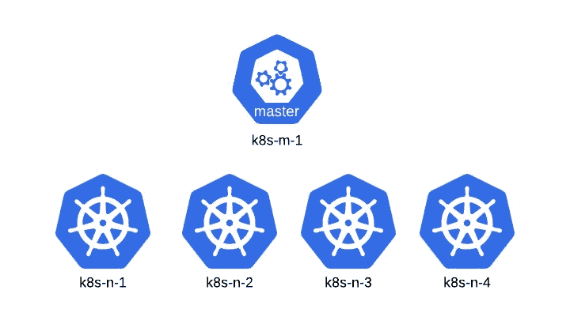
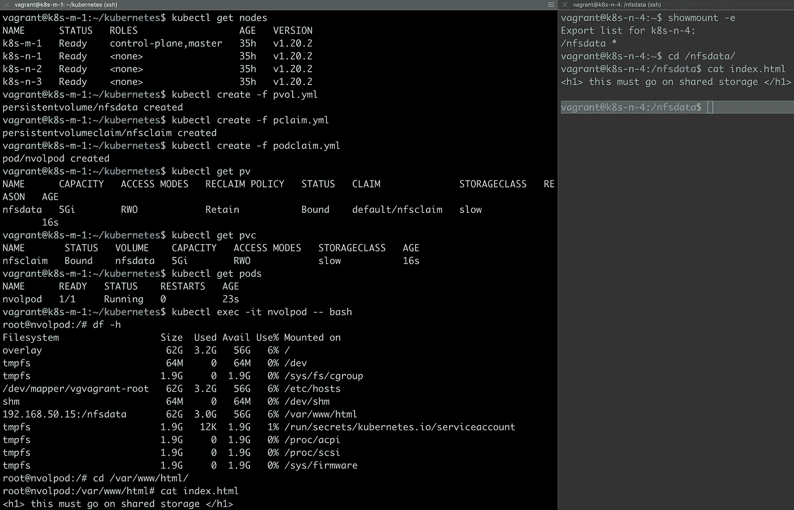

# 使用 K8s PV、PVC 和 pod 的实例

> 原文：<https://itnext.io/practical-example-of-using-k8s-pv-pvc-with-pods-5471b91d2477?source=collection_archive---------0----------------------->


[来源](https://www.freepik.com/vectors/technology)

在关于[K8s:Volumes&Claims—part 2](https://medium.com/swlh/k8s-volumes-claims-part2-70b6cefd9d5a)的上一篇博客中，我们研究了关于 [PersistentVolume](https://kubernetes.io/docs/concepts/storage/persistent-volumes/#persistent-volumes) 、 [PersistentVolumeClaim](https://kubernetes.io/docs/concepts/storage/persistent-volumes/#persistentvolumeclaims) 概念的细节。在[上一篇博客](https://medium.com/swlh/k8s-volumes-claims-part2-70b6cefd9d5a)中，我们还学习了 PODs 如何使用 PersistentVolumeClaim。在这篇博客中，我们将学习一个实际的例子，用下面的结构将所有这些概念结合在一起:

```
- Bring up a K8s cluster on local machine from scratch- Remove one node from the cluster and configure it as an NFS-Server- Use the NFS-Server to create a PersistentVolume- Create a PersistentVolumeClaim from the PersistentVolume- Have the POD use this PersistentVolumeClaim
```

强烈建议亲自尝试这里的概念，以便更好地理解它们。让我们试着把问题分成小块，这样我们就可以逐步建立概念。

> **步骤 1** 调出 K8s 集群



我们计划提出的集群

有多种方法可以启动集群。在这篇博客中，我们将使用 [IaC](https://en.wikipedia.org/wiki/Infrastructure_as_code) 哲学以及 [ansible](https://www.ansible.com/) 和[vagger](https://www.vagrantup.com/)在您的本地机器上创建一个 K8s 集群。你可以使用 AWS、GCP、Azure、Minikube 等任何软件。并达到同样的目的。

对于我们的示例，我将使用 4 个工作节点和一个控制器节点来构建集群。我将使用[这个博客](https://www.itwonderlab.com/en/ansible-kubernetes-vagrant-tutorial/)调出集群。 *要改变职工节点的数量，编辑* [*无业档案*](https://github.com/itwonderlab/ansible-vbox-vagrant-kubernetes/blob/master/Vagrantfile) *并更新数量。*

使用以下步骤:

1.  在这里从[克隆 github repo](https://github.com/itwonderlab/ansible-vbox-vagrant-kubernetes)
2.  然后运行`vagrant up`

您现在应该看到一个包含 4 个节点和一个控制器的集群。

> **第二步**现在让我们配置我们的 NFS 服务器

这个 nfs 卷将作为我们计划创建的永久卷的 NFS 数据源。对于我们的简单设置，使用以下步骤从集群中删除一个节点，即 **k8s-n-4** ，并将其配置到 NFS 服务器中:

```
**vagrant ssh k8s-m-1****kubectl drain k8s-n-4****kubectl delete node k8s-n-4**
```

在运行上述每个命令之后，我们现在在 K8s 集群中有了以下节点。请注意 **k8s-n-4** 现在不是集群的一部分:

```
vagrant@k8s-m-1:~$ **kubectl get nodes**
NAME      STATUS   ROLES                  AGE   VERSION
k8s-m-1   Ready    control-plane,master   36h   v1.20.2
k8s-n-1   Ready    <none>                 36h   v1.20.2
k8s-n-2   Ready    <none>                 36h   v1.20.2
k8s-n-3   Ready    <none>                 36h   v1.20.2
```

现在让我们登录到 **k8s-n-4** 并把它变成一个 nfs 服务器:

```
**vagrant ssh k8s-n-4**
```

使用此处的说明[安装 nfs 服务器。](https://www.tecmint.com/install-nfs-server-on-ubuntu/)

现在，让我们在 nfs 服务器主机上创建一个目录，并将其公开为客户端可以使用的 nfs 装载。确保在“/etc/exports”中添加以下行:

```
vagrant@k8s-n-4:/nfsdata$ **sudo mkdir -p --mode=777 /nfsdata**vagrant@k8s-n-4:/nfsdata$ cat /etc/exports | tail -1
/nfsdata *(rw,sync)
```

现在验证挂载点，即 nfs 服务器公开的 nfsdata:

```
vagrant@k8s-n-4:$ **showmount -e**
Export list for k8s-n-4:
/nfsdata *
```

> **步骤 3** 创建一个[持久卷](https://kubernetes.io/docs/concepts/storage/persistent-volumes/#persistent-volumes)

这里快速回顾一下我们在[持续卷](https://medium.com/swlh/k8s-volumes-claims-part2-70b6cefd9d5a)中学到的概念，并将其与我们正在构建的示例联系起来:

**pod**use =>**persistent volume claim**其中 use =>**persistent volume**

**持久卷** = >在 **k8s-n-4** 上创建的 **nfs-server** 的折衷

```
vagrant@k8s-m-1:~/kubernetes$ cat **persistent-vol.yml**
apiVersion: v1
kind: PersistentVolume
metadata:
  name: nfsdata
spec:
  capacity:
    storage: 5Gi            # **Size of the nfs-server volume**
  volumeMode: Filesystem
  accessModes:
    - ReadWriteOnce
  storageClassName: slow
  nfs:
    path: /nfsdata          # **path on which k8-n-4 exposes the nfs** mount
    server: 1xx.xxx.xx.xx   # **nfs-server ip address**
```

现在让我们使用上面的 yaml 文件创建 PersistentVolume 并进行验证。确保用您的 **k8-n-4** 节点的 **ip 地址**替换**最后一行**

```
vagrant@k8s-m-1:~/kubernetes$ **kubectl create -f persistent-vol.yml**
persistentvolume/nfsdata createdvagrant@k8s-m-1:~/kubernetes$ **kubectl get pv**
NAME      CAPACITY   ACCESS MODES   RECLAIM POLICY   STATUS      CLAIM   STORAGECLASS   REASON   AGE
nfsdata   5Gi        RWO            Retain           Available           slow                    4s
```

所以我们现在已经准备好了我们的持久卷，耶！！！🙌🏽

> **步骤 4** 创建一个 PersistentVolumeClaim

使用下面的 yaml 文件创建 [PersistentVolumeClaim](https://kubernetes.io/docs/concepts/storage/persistent-volumes/#persistentvolumeclaims) 。
*关于这个*[*PersistentVolumeClaim*](https://kubernetes.io/docs/concepts/storage/persistent-volumes/#persistentvolumeclaims)*是如何与我们之前创建的*[*persistent volume*](https://kubernetes.io/docs/concepts/storage/persistent-volumes/#persistent-volumes)*产生关联的有什么猜测吗？(线索:-什么是慢？)*

```
vagrant@k8s-m-1:~/kubernetes$ cat **persistentclaim.yml**
apiVersion : v1
kind: PersistentVolumeClaim
metadata:
  name: nfsclaim  **# Claim name which will be used by the pod**
spec:
  accessModes:
    - ReadWriteOnce
  volumeMode: Filesystem
  resources:
    requests:
      storage: 1Gi  #**request size from claim to the PersistentVolume**
  storageClassName: slow
```

现在让我们创建 PersistentVolumeClaim

```
vagrant@k8s-m-1:~/kubernetes$ **kubectl create -f  persistentclaim.yml**
persistentvolumeclaim/nfsclaim createdvagrant@k8s-m-1:~/kubernetes$ **kubectl get pvc**
NAME       STATUS   VOLUME    CAPACITY   ACCESS MODES   STORAGECLASS   AGE
nfsclaim   Bound    nfsdata   5Gi        RWO            slow           4s
```

所以我们现在已经准备好了我们的持续量声明，耶！！！🙌🏽

> **步骤 5** 创建一个将使用 PersistentVolumeClaim 的 pod

现在让我们创建一个 pod，它将使用创建的 PersistentVolumeClaim。

请查看下面的评论，了解 pod 中的路径“/var/www/html”将如何使用我们创建的 PersistentVolumeClaim。

```
vagrant@k8s-m-1:~/kubernetes$ cat podclaim.yml
apiVersion: v1
kind: Pod
metadata:
  name: nvolpod
spec:
  containers:
    - name: test
      image: nginx
      volumeMounts:
      - mountPath: "/var/www/html" # **Folder in pod mounting nfsclaim** 
        name: mypd
  volumes:
    - name: mypd             # **volume name the container can mount**
      persistentVolumeClaim: # **Source of storage**
        claimName: nfsclaim  # **name of pvc created**
```

让我们验证它是否如预期的那样工作。我们在下面看到，pod 已创建并使用 persistentVolumeClaim:

```
vagrant@k8s-m-1:~/kubernetes$ **kubectl create -f podclaim.yml**
pod/nvolpod createdvagrant@k8s-m-1:~/kubernetes$ **kubectl get pods**
NAME      READY   STATUS    RESTARTS   AGE
nvolpod   1/1     Running   0          56svagrant@k8s-m-1:~/kubernetes$ **kubectl describe pod nvolpod | grep  Volumes -A4**
Volumes:
  mypd:
    Type:       PersistentVolumeClaim (a reference to a PersistentVolumeClaim in the same namespace)
    ClaimName:  nfsclaim
    ReadOnly:   false
```

这一切都很好，让我们退一步，看看我们打算做什么。我们试图将 nfs 服务器挂载到 POD 上，具体在哪里？让我们检查一下:

```
vagrant@k8s-m-1:~/kubernetes$ **kubectl exec -it nvolpod -- bash**root@nvolpod:/# **cd /var/www/html/**root@nvolpod:/var/www/html# **cat index.html**
<h1> this must go on shared storage </h1>
```

此时，由 POD 编写的文件 index.html 应该显示在我们配置的 nfs 服务器挂载上。要验证这一点，请运行以下命令:

```
vagrant@k8s-n-4:/nfsdata$ **cat index.html**
<h1> this must go on shared storage </h1>
```

看起来是的，哇哦！！！💥

总结一下我们上面所做的——我们配置了一个共享的持久存储，它可以被任何 pod 使用。这意味着，即使 pod 由于其短暂的性质而关闭，存储的数据仍然存在于永久存储器中。

附注:我们在这里只是用了一个 NFS 存储的例子。你可以使用任何种类的存储器(使用这些 i [指令](https://medium.com/swlh/k8s-volumes-claims-part2-70b6cefd9d5a))。

下面是在一个地方的命令，以便更好地参考。下次见，再见！！！

附言:我一直在有意识地选择用“控制者”来代替我的词汇中的“主人”



**创建 pv、pvc 和使用 pvc 的 pod，右边的面板是 nfs 服务器**